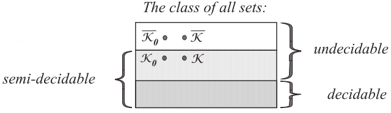
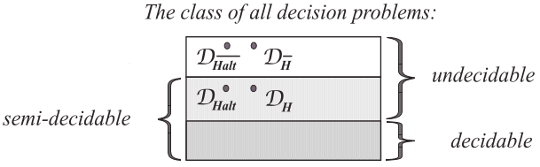
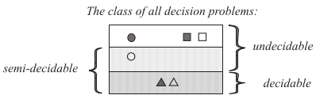
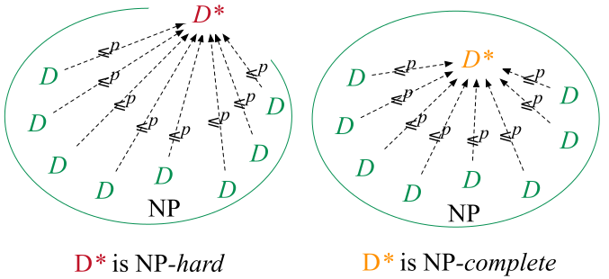
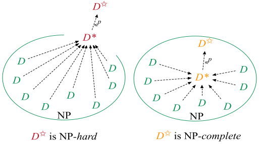
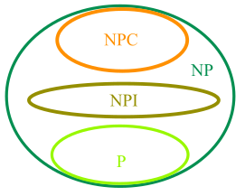
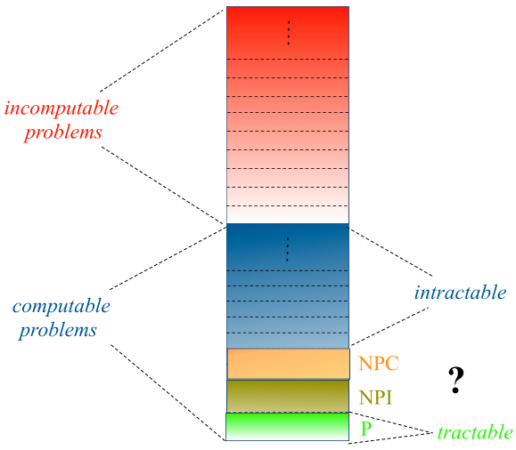

# 1. KONČNI AVTOMATI IN REGULARNI IZRAZI

## 1.1. SISTEM S KONČNO MNOGO STANJI

Je entiteta, ki je vedno v kakem od **končno mnogih stanj**, korakoma bere *diskretne* podatke iz svoje okolice in po vsakem branju spremeni svoje stanje v novo stanje. Vsako (trenutno) stanje predstavlja dotlej prebrane podatke, na podlagi stanja pa bo sistem odločil svoj odziv na naslednji podatek iz okolice. **Končni avtomat** je matematični model sistemov z končno mnogo stanji.

## 1.2. DETERMINISTIČNI KONČNI AVTOMAT

Intuitivna definicija: deterministični končni avtomat sestavljajo **končna množica stanj** in **končna množica prehodov** med stanji, ki se zgodijo po branju **simbolov** iz vhodne abecede. Pri tem velja, da za vsak vhodni simbol in vsako stanje obstaja natanko en prehod; eno stanje je **začetno stanje**, v tem stanju začne DKA delovati; le nekatera stanja so končna.

DKA sprejme besedo x, če obstaja zaporedje prehodov, ki ustreza zaporednim simbolom besede x, in vodi DKA iz začetnega v neko končno stanje. DKA lahko predstavimo tudi s diagramom prehodov: točke predstavljajo stanja, usmerjene povezave predstavljajo prehode (povezava $q_{ia} \rightarrow q_j$ obstaja, če lahko DKA preide med temi stanji pri prebranem simbolu).

### 1.2.1. Definicija končnega avtomata

**DEFINICIJA: Deterministični končni avtomat (DKA)** je peterka $(Q, \Sigma, \delta, q_0, F)$, kjer so:

- $Q$ končna množica stanj
- $\Sigma$ vhodna abeceda
- $(q_0 \in Q)$ začetno stanje
- $F \subseteq Q$ množica končnih stanj
- $\delta$ funkcija prehodov: $\delta : Q \times \Sigma \rightarrow Q$. Torej je $\delta(q, a)$ stanje, v katerega DKA preide iz stanja $q$, če je prebral simbol $a$; $\delta$ je program

### 1.2.2. Še drugi način predstavitve

Nadzorna enota bere vhodno besedo $(\in \Sigma^*)$ s traku in pri tem prehaja med stanji. Če DKA v stanju $q$ prebere vhodni simbol $a$, potem v eni potezi preide v naslednje stanje $\delta(q, a)$ in pomakne okno v desno na naslednji simbol vhodne besede.

Če je $\delta(q, a)$, pravimo, da je DKA sprejel predpono vhodne besede vključno do prebranega $a$. DKA lahko sprejme več predpon vhodne besede, običajno zahtevamo, da prebere celo vhodno besedo.

Razširjeno funckijo prehodov $\hat{\delta}$ definiramo:

- $\hat{\delta}(q, \varepsilon) = q$
- $\hat{\delta}(q, wa) = \delta(\hat{\delta}(q, w), a)$, za vsak niz $w$ in bhodni simbol $a$

### 1.2.3. Definicije

- DKA $M = (Q, \Sigma, \delta, q_0, F)$ **sprejme** besedo (niz) $x$, če je $\delta(q_0, x) = p$ za nek $p \in F$.
- **Jezik, sprejet z DKA M** je množica $L(M)$ vseh besed, ki jih sprejme $M$: $L(M) = \{x \in \Sigma^* | \delta(q_0, x) \in F\}$.
- Jezik $L'$ je **regularen** (oz. je **regularna množica**), če $L'$ sprejme *kak* DKA (tj. če $\exists$ DKA $M$ : $L' = L(M)$)

## 1.3. NEDETERMINISTIČNI KONČNI AVTOMAT

**Nedeterministčni končni avtomat** (NKA) dobimo iz DKA, če dopustimo *nič*, enega ali celo *več* prehodov iz kakega stanja pri istem vhodnem simbolu. NKA **sprejme** vhodno abecedo $x = a_1a_2\cdot\cdot\cdot a_n$, če **obstaja** (vsaj eno) zaporedje prehodov, označeno z $a_1a_2\cdot\cdot\cdot a_n$, ki vodi iz začetnega stanja v (katerokoli) končno stanje.

### 1.3.1. Definicija

**Nedeterministični končni avtomat (NKA)** je peterka $(Q, \Sigma, \delta, q_0, F)$, kjer so:

- $Q$ končna množica stanj
- $\Sigma$ (končna) vhodna abeceda,
- $q_0 \in Q$ začetno stanje,
- $F \subseteq Q$ končna množica stanj, in
- $\delta$ funkcija prehodov tj. $\delta : Q \times \Sigma \rightarrow 2^Q$

### 1.3.2. Še drugačna predstavitev

NKA si lahko predstavljamo podobno kot DKA. Tudi NKA bere s traku. Magično uganjevanje nadzorne enote pa nadomestimo z vzporednim delovanjem. Ker mora NKA izbrati naslednje stanje, si mislimo, da se za vsako možno naslednje stanje ustvari kopija NKA z nadzorno enoto v tem možnem stanju in oknom na naslednji celici. Na podoben način vsaka kopija nadaljuje izvajanje neodvisno od ostalih kopij. **Drevo izvajanja** deluje po takem principu.

Razširjeno funkcijo prehodov $\hat{\delta}$ definiramo rekurzivno:

- $\hat{\delta}(q, \varepsilon) = \{q\}$
- $\hat{\delta}(q, wa) = \{p \in Q | \exists r \in \hat{\delta}(q, w) : p \in \delta(r, a)\}$

### 1.3.3. Definicije

- NKA $M = (Q, \Sigma, \delta, q_0, F)$ **sprejme** besedo (niz) $x$, če $\delta(q_0, x)$ vsebuje kako končno stanje $p \in F$ (tj. $\delta(q_0, x) \cap F \neq \emptyset$).
- **Jezik, sprejet z NKA $M$** je množica L($M$) vseh besed, ki jih sprejme $M$: $L(M) = \{x \in \Sigma^* | \delta(q_0, x) \in F\}$

## 1.4. Ekvivalentnost DKA in NKA

**Vsak DKA je tudi NKA**

- Na DKA lahko gledamo kot na posebni NKA, pri katerem je funkcija prehodov $\delta$ taka, da velja $\delta(q, a) = \{r\}$, za vsak par $q \in Q, a \in \Sigma$ in neki $r \in Q$. Pri takem NKA vedno obstaja natanko eno možno naslednje stanje.

Zato razred jezikov, sprejetih z NKA, vsebuje vse jezike, sprejete z DKA (tj. regularne jezike).

Ne obstaja nereguarni jezik, ki ga sprejme NKA, saj je razred jezikov, sprejetih z NKA, enak razredu jezikov, sprejetih z DKA. Lahko dokažemo, da ima vsak NKA ekvivalentni DKA.

### 1.4.1. Dokaz o ekvivalentnosti NKA in DKA

**IZREK**: Naj bo $L$ jezik, ki ga sprejme dani NKA $M$. Potem obstaja DKA $M'$, ki sprejme $L$.

**DOKAZ**

- Naj bo $M = (Q, \Sigma, \delta, q_0, F)$ NKA, ki sprejme jezik $L$. Torej velja $L = L(M)$
- Definiramo DKA $M' = (Q', \Sigma', \delta', q_0', F')$ takole:
  - $Q' = 2^Q$. Stanje DKA $M'$ naj predstavlja množico vseh stanj, v katerih bi bil lahko NKA $M$ v tistem trenutku.
    - notacija: stanje DKA $M'$ označimo s $[q_{i_1}, ..., q_{i_k}]$ (kjer $q_{i_1} \in Q$ so stanja NKA $M$).
  - $\Sigma' = \Sigma$ (DKA $M'$ naj ima enako abecedo kot NKA $M$)
  - $q_0' = [q_0]$ (Začetno stanje DKA $M'$ mora biti $[q_0]$, ker je takrat NKA $M$ v stanju $q_0$)
  - $\delta' ([q_{i_1}, ..., q_{i_k}], a) = [p_{j_1}, ..., p_{j_l}] \text{ iff } \delta (\{q_{i_1}, ..., q_{i_k}\}, a) = \{p_{j_1}, ..., p_{j_l}\}$. Stanje, kamor pride $M'$ iz stanja $[q_{i_1}, ..., q_{i_k}]$ pri simbolu $a$, dobimo tako:
    1. uporabimo $\delta$ nad vsakim stanjem v $\{q_{i_1}, ..., q_{i_k}\}$ in
    2. izračunamo unijo dobljenih množic. Če je unija $\{p_{j_1}, ..., p_{j_l}\}$, je $[p_{j_1}, ..., p_{j_l}]$ stanje, kamor preide $M'$
  - $F'$ naj bo množica stanj DKA $M'$, ki imajo v svojem zapisu vsaj eno končno stanje NKA $M$
- nato moramo dokazati, da isto velja $\delta'(q_0', x) = [q_{i_1}, ..., q_{i_k}] \text{ iff } \delta(q_0, x) = \{q_{i_1}, ..., g_{i_k}\} \text{, for arbitrary } x \in \Sigma^*$. To storimo z matematično indukcijo po dolžini $|x|$ vhodne besede $x$
- obrazložimo, da velja tudi $\delta'(q_0', x) \in F'$, če in samo če $\delta(q_0, x) \in F$
- potem lahko zaključimo z ugotovitvijo, da je $L(M) = L(M')$

Dokazali smo, da DKA $M'$ sprejme isti jezik kot NKA $M$. V tem smislu sta $M'$ in $M$ ekvivalentna (enako "močna"). Seveda pa se razlikujeta po številu svojih stanj, po ukazih v svojih programih.

## 1.5. Končni avtomati s tihimi prehodi

Definicijo NKA lako še razširimo tako, da ji dodamo sposobnost spontanega prehajanja med stanji, tj. prehajanja v nova stanja, ne da bi NKA pri tem prebral simbol v oknu. To je **tihi prehod ($\varepsilon$-prehod)**. Diagram takega NKA ima lahko na povezavah oznake $\varepsilon$.

### 1.5.1. Definicija

NKA s tihimi prehodi ($\text{NKA}_{\varepsilon}$) je peterka $(Q, \Sigma, \delta, q_0, F)$, kjer so:

- $Q$ končna množica stanj
- $\Sigma$ vhodna abeceda
- $q_0 \in Q$ začetno stanje
- $F \subseteq Q$ množica končnih stanj
- $\delta$ funkcija prehodov, tj. $\delta : Q \times (\Sigma \cup \{\varepsilon\}) \rightarrow 2^Q$
  - v množici $\delta(q, a)$ so natanko tista stanja, kamor NKA lahko preide iz stanja $q$ po povezavah, ki so označene z $a$ ali $\varepsilon$
  - opomba: $\delta(q, a)$ je program $\text{NKA}_{\varepsilon}$

### 1.5.2. Razširitve

Definirati želimo funckijo $\hat\delta : Q \times \Sigma^* \rightarrow 2^Q$ tako, da bo $\hat\delta(q, x)$ množica stanj p, do katerih iz $q$ vodijo poti označene z $x$, na katerih so lahko poveave označene tudi z $\varepsilon$.

Definicija funkcije $\hat\delta$ bo jasnejša, če prej definiramo še množico vseh stanj, dosegljivih iz stanj $q$ samo s tihimi prehodi: **$\varepsilon$-Closure($q$)**. To razširimo še na množice: $\varepsilon$-Closure($S$) = $\bigcup \limits_{q \in S} \varepsilon-\text{Closure}(q)$

Razširjena funkcija prehodov $\hat\delta$ definiramo rekurzivno:

- $\hat\delta(q, \varepsilon) = \varepsilon-\text{Closure}(q)$
- pri $w \in \Sigma^*$ in $a \in \Sigma$ imamo $\hat\delta(q, wa) = \varepsilon-\text{Closure}(P)$, kjer $P = \{p | \exists r \in \hat\delta(q, w) : p \in \delta(r, a)\}$
- zdaj je v splošnem $\hat\delta(q, a) \neq \delta(q, a)$
- $\delta$ in $\hat\delta$ razširimo še na *množice stanj:* če je $R$ množica stanj, potem sta $$\delta(R, a) = \bigcup\limits_{q \in R} \delta(q, a)$$ $$\hat\delta(R, x) = \bigcup\limits_{q \in R} \hat\delta(q, x)$$

## 1.5.3. Definicije

- $\text{NKA}_{\varepsilon}$ $M = (Q, \Sigma, \delta, q_0, F)$ **sprejme** besedo (niz) $x$, če $\hat\delta(q_0, x)$ vsebuje kako končno stanje $p \in F$.
- **Jezik, sprejet z** $\text{NKA}_{\varepsilon}$ $M = (Q, \Sigma, \delta, q_0, F)$ je množica $L(M)$ vseh besed, ki jih sprejme $M$, torej $$L(M) = \{x \in \Sigma^* | \hat\delta(q_0, x) \in F\}$$

## 1.6. Ekvivalentnost NKA in $\text{NKA}_{\varepsilon}$

Intuicija nam pravi, da je $\text{NKA}_{\varepsilon}$ močnejši od NKA, vendar temu ni tako, saj bi potem moral model $\text{NKA}_{\varepsilon}$ sposoben sprejemati tudi jezike, ki niso regularni. Vendar vemo, da je razred jezikov, sprejetih z $\text{NKA}_{\varepsilon}$, enak razredu jezikov, sprejetih z NKA. Dokažemo lahko, da ima vsak $\text{NKA}_{\varepsilon}$ ekvivalentni NKA.

**IZREK**

Naj bo $L$ jezik, ki ga sprejme dani $\text{NKA}_{\varepsilon}$ $M$. Potem obstaja NKA $M'$, ki sprejme $L$.

**DOKAZ**

- Naj bo $M = (Q, \Sigma, \delta, q_0, F)$ $\text{NKA}_{\varepsilon}$, ki sprejme jezik $L$.
- Definirajmo NKA $M' = (Q, \Sigma, \delta', q_0, F')$ takole:
  - $\delta' = \hat\delta$, torej naj bo $\delta'(q, a) = \hat\delta(q, a)$ za vsak par $q \in Q$ in $a \in \Sigma$.
  - $F' = \begin{cases}
    F \cup \{q_0\}    & \quad \text{if }\varepsilon \text{-Closure}(q_0) \text{ contains a state in } F \\
    F   & \quad \text{otherwise}
  \end{cases}$
  
  ($M'$ nima $\varepsilon$-prehodov; torej je NKA, zato smo njegovo funkcijo prehodov označili z $\delta'$, ne pa z $\hat\delta'$. Razlikovati pa moramo $\delta$ in $\hat\delta$)
- *Lema*: $\delta'(q_0, x) = \hat\delta(q_0, x) \text{ za } |x| \geq 1$.
- Nato dokažemo še naslednje: $\delta'(q_0, x)$ vsebuje stanje iz $F'$ natanko tedaj, ko $\delta'(q_0, x)$ vsebuje stanje iz $F$.

## 1.7. Regularni izrazi

Jezike, ki jih sprejemajo končni avtomati (tj. regularne jezike), lahko predstavimo z enostavnimi izrazi, t.i. **regularni izrazi**.

**DEFINICIJA**

Naj bo $\Sigma$ abeceda ter $L_1$ in $L_2$ množici besed iz $\Sigma^*$. **Stik** $L_1L_2$ jezikov $L_1$ in $L_2$ je jezik, definiran z
$$L_1L_2 = \{xy | x \in L_1 \land y \in L_2\}$$.
(Besede jezika $L_1L_2$ dobimo tako, da besedi $x$ iz $L_1$ pripnemo besedo $y$ iz $L_2$, po vseh možnih $x, y$).

**DEFINICIJA**

Naj bo $L \subseteq \Sigma^*$. Definirajmo $L^0 = \{\varepsilon\}$ in $L^i = LL^{i - 1}$ za $i \geq 1$.

- **Kleeneovo zaprtje** (množica besed, nastalih s stikom končno mnogo - tudi nič - besed iz $L$) $L^*$ jezika $L$ je jezik $L^* = \bigcup \limits^{\infty}_{i = 0} L^i$.
- **Tranzitivno zaprtje** (množica besed, nastalih s stikom končno mnogo - toda ne nič - besed iz $L$) $L^+$ jezika $L$ pa jezik $L^+ = \bigcup \limits_{i = 1}^{\infty} L^i$.

**TRDITEV**

$L^+$ vsebuje $\varepsilon$ *če in samo če* $L$ vsebuje $\varepsilon$.

### 1.7.1. Definicija regularnih izrazov

Naj bo $\Sigma$ abeceda. **Regularni izraz** nad $\Sigma$ in jezik, ki ga r.i. predstavlja, sta definirana induktivno:

1. $\emptyset$ je r.i.; predstavlja jezik $\emptyset$
2. $\varepsilon$ je r.i.; predstavlja jezik $\{\varepsilon\}$
3. za vsak $a \in \Sigma$, je $a$ r.i.; predstavlja jezik $\{a\}$
4. če sta $r$ in $s$ r.i. in predstavljata jezika $R$ in $S$, potem:
   1. $(r + s)$ je r.i.; predstavlja jezik $R \cup S$ (unija jezikov $R$ in $S$)
   2. $(rs)$ je r.i.; predstavlja jezik $RS$ (stik jezikov $R$ in $S$)
   3. $(r^*)$ je r.i.; predstavlja jezik $R^*$

Dogovori: $rr^* = r^+$, $rrr...r = r^k$

## 1.8. Ekvivalentnost končnih avtomatov in regularnih izrazov

**Dokazati želimo:** *razred jezikov, sprejetih s končnimi avtomati, je identičen razredu jezikov, predstavljivih z regularnimi izrazi.* Dokaz v dveh korakih. Vsi štirje načini (DKA, NKA, $\text{NKA}_{\varepsilon}$, r.i.) definirajo isti razred formalnih jezikov, t.i. razred regularnih jezikov.

**IZREK**

Naj bo $r$ poljuben regularni izraz. Potem obstaja $\text{NKA}_{\varepsilon} M$, ki sprejme jezik $L(r)$.

**Dokaz**

- Naj bo $P(n) \equiv$ 'Če je $r$ r.i. z $n$ operatorji, potem obstaja $\text{NKA}_{\varepsilon}$, da je $L(M) = L(r)$.'
- Trditev $P(n)$ dokažemo z indukcijo po $n$.
- *Osnova* [preverimo $P(0)$]. Pri $n = 0$ je $r$ bodisi $\emptyset$, $\varepsilon$ ali $a$ $(a \in \Sigma)$.
- *Induktivna hipoteza* [predpostavimo, da $P(n)$ velja za vse $n \leq k - 1$ (torej je $k \geq 1$)].
- *Induktivni korak* [dokažemo, da potem velja $P(n)$ za vse $n \leq k$]. Naj ima $r$ $k$ operatorjev. Glede na obliko $r$ obstajajo naslednje tri možnosti:
  - $r = r_1 + r_2$. Vsak od $r_1, r_2$ ima $\leq k - 1$ operatorjev. Po ind. hipotezi obstaja $\text{NKA}_{\varepsilon}$ $M_1$, $M_2$, da je $L(M_1) = L(r_1)$ in $L(M_2) = L(r_2)$.
  - $r = r_1 r_2$. Vsak od $r_1, r_2$ ima $\leq k - 1$ operatorjev. Po ind. hipotezi obstaja $\text{NKA}_{\varepsilon}$ $M_1$, $M_2$, da je $L(M_1) = L(r_1)$ in $L(M_2) = L(r_2)$.
  - $r = r_{1}^{*}$. Zdaj $r_1$ vsebuje $\leq k - 1$ operatorjev. Po ind. hipotezi obstaja $\text{NKA}_{\varepsilon}$ $M_1$, da je $L(M_1) = L(r_1)$.

**IZREK**

Naj bo $M$ poljuben DKA. Tedaj obstaja regularni izraz $r$, ki predstavlja jezik $L(M)$.

**Dokaz**

- Naj bo dan DKA $M = (\{q_1, ..., q_n\}, \Sigma, \delta, q_1, F)$.
- Po definiciji je $L(M) =$ 'množica besed, ki privedejo $M$ iz $q_1$ v *v katerokoli končno stanje*'.
- Pišimo $R^n_{1j} \equiv$ "množica besed, ki privedejo $M$ iz $q_1$ v $q_j$". Potem je $L(M) = \bigcup\limits_{q_j \in F} R^n_{1j}$
- Če bi poznali r.i. $r^n_{1j}$, ki predstavlja $R^n_{1j}$, bi $L(M)$ predstavili z r.i. $\sum\limits_{j = 1}^n r^n_{1j}$.
- Bodi $R^k_{ij} \equiv$ "množica besed, ki privedejo $M$ iz $q_i$ v $q_j$, ne da bi $M$ šel čez stanje $> k$"
- Note: $R^k_{ij}$ lahko sestavimo induktivno: $R^k_{ij} = R^{k - 1}_{ik}(R^{k - 1}_{kk})^*R^{k - 1}_{kj} \cup R^{k - 1}_{ij}$ (*).
$$R^0_{i, j} = \begin{cases}
  \{a | \delta(q_i, a) = q_j\}    & \quad \text{if } i \neq j \\
  \{a | \delta(q_i, a) = q_j\} \cup \{\varepsilon\}    & \quad \text{if } i = j
\end{cases}$$ (**)
- **Trditev**: $P(k) \equiv$ "Za poljubne $i, j, k$ obstaja r.i. $r^k_{ij}$, ki predstavlja $R^k_{ij}$."
  - **Dokaz** (indukcija po $k$)
  - *Osnova* [preverimo $P(0)$]. (**) pove, da je $R^0_{ij}$ predstavljen z $r^0_{ij} = a_1 + ... + a_p$ ali $r^0_{ij} = a_1 + .... + a_p + \varepsilon$.
  - *Ind.hip.* [denimo, da $P(k - 1)$ velja]. Torej za poljubne $i, j, k$ obstaja r.i. $r^{k - 1}_{ij}$, ki predstavlja $R^{k - 1}_{ij}$.
  - *Ind.korak* [Ali potem velja $P(k - 1) \Rightarrow P(k)$?] (*) in ind.hip. nam povesta, da je $R^k_{ij}$ predstavljen z r.i. $r^k_{ij} = r^{k - 1}_{ik}(r^{k - 1}_{kk})^{*}r^{k - 1}_{kj} + r^{k - 1}_{ij}$

## 1.9. Uporaba končnih avtomatov

**Leksikalni analizator**: izvede leksikalno analizo vhodnega besedila. Je proces, kjer se besedilo, ki je zaporedje simbolov dane abecede, preslika v zaporedje jezikovnih simbolov. Jezikovni simbol ima definiran pomen; ta pove, ali je beseda, ki ji jezikovni simbol priprada, ključna beseda, identifikator, num. konstanta, operator, ... Obliko besed, ki jih jezikovni simbol označuje, opisuje neki *regularni izraz*.

**Urejevalnik**: nekateri urejevalniki omogočajo, da uporabnik vpiše poljuben regularni izraz $r$, urejevalnik pa potem v uporabnikovem besedilu poišče vse besede, ki sodijo v jezik $L(r)$.

# 2. LASTNOSTI REGULARNIH IZRAZOV

## 2.1. Lema o napihovanju za regularne jezike

Je močno orodje za dokazovanje, da nekateri jeziki niso regularni, da nekateri regularni jeziki so/niso končni.

**LEMA O NAPIHOVANJU (za regularne jezike)**

Naj bo $L$ regularni jezik. Potem obstaja konstanta $n$ (odvisna samo od $L$), da velja: **če** je $z$ poljubna beseda z lastnostjo
$$z \in L \land |z| \geq n$$,
**potem** obstajajo besede $u, v, w$, da velja
$$z = uvw \land |uv| \leq n \land |v| \geq 1 \land \forall i \geq 0: uv^iw \in L$$.

**Intuitivno**: če je dana poljubna *zadosti dolga beseda $z$*, ki jo sprejme neki končni avtomat, je v $z$ blizu njenega začetka neka neprazna in ne zelo dolga podbeseda $v$, ki jo znotraj $z$ lahko *ponovimo* poljubno (končno) mnogokrat, a bo končni avtomat napihnjeno besedo $z' = uvvv...vw$ tudi *sprejel.*

**Formalno**: Lema o napihovanju (za regularne jezike) pravi naslednje:
$$L \text{ je regularen izraz } \Longrightarrow (\exists n)(\forall z) [z \in L \land |z| \geq n \Rightarrow (\exists u, v, w) [z = uvw \land |uv| \leq n \land |v| \geq 1 \land (\forall i \geq 0) uv^iw \in L]]$$

**DOKAZ**

- Naj bo $L$ regularen jezik. Torej obstaja DKA $M = (Q, \Sigma, \delta, q_0, F)$, ki sprejme $L$. Naj bo $n := |Q|$.
- Naj bo $z = a_1...a_m$ $(m \geq n)$ poljubna beseda iz $L$, ki je dolga vsaj $n$.
- *Zaženimo $M$ nad vhodno besedo $z$. Med branjem besede $z$ avtomat $M$ prihaja v razna stanja.* Označimo s $q_{\ell_i}$ stanje, v katerem je $M$, ko je prebral predpono $a_1...a_i$ besede $z$. Ko prebere celo $z = a_1...a_m$, je $M$ do takrat vstopil v $m + 1$ stanj $q_0, q_{\ell_1},...,q_{\ell_m}$.
- *Toda: vsaj dve od njih*, npr. $q_{\ell_j}$ in $q_{\ell_k}$, *$(0 \leq j < k \leq n)$, morata biti enaki, saj je $|Q| < m + 1$*. Torej ima pot $q_0 \rightarrow q_{\ell_1} \rightarrow ... \rightarrow q_{\ell_k}$, označen z $a_{j + 1}...a_k$.
- Zdaj pa postavimo $u := a_1...a_j;$ $v := a_{j + 1}...a_k;$ in $w := a_{k + 1}...a_m$. Potem lahko dokažemo, da za $u, v, w$ velja:
  - $z = uvw$
  - $|uv| \leq n$
  - $1 \leq |v|$
  - za vse $i \geq 0$, $uv^iw \in L$

### 2.1.1. Uporaba leme o napihovanju

Lema je uporabna, če hočemo dokazati, da neki jezik *ni regularen*. Metodo, ki nas pri tem vodi, razvijemo iz formalnega zapisa leme.
$$L \text{ je regularen } \Longrightarrow (\forall z)(\exists u, v, w)(\forall i \geq 0)uv^iw \in L \text{ (za ustrezne ('dobre') } n, z, u, v, w\text{)}$$

$$(\exists z)(\forall u, v, w)(\exists i \geq 0)uv^iw \notin L \Longrightarrow L \text{ ni regularen (za ustrezne ('dobre') } n, z, u, v, w\text{)}$$

Če za dani $L$ dokažemo, da leva stran '$\Longrightarrow$' velja, potem $L$ ni regularen jezik.

### 2.1.2. Metoda

Pri dokazovanju se držimo postopka:

1. predpostavi, da je $n$ konstanta (odvisna od $L$) iz leme.
2. Izberi 'dobro' besedo $z$ (tj. besedo $z$, za katero velja $z \in L, |z| \geq n$).
3. Poišči vse možne razdelitve $z$ v 'dobre' podbesede $u, v, w$ (tj. take, da je $z = uvw, |uv| \leq n, |v| \geq 1$).
4. Poskušaj dokazati naslednjo trditev: za vsako 'dobro' razdelitev $u, v, w$ obstaja $i \geq 0$ za katerega je $uv^iw \notin L$.
5. Če je korak 4. uspel, potem $L$ ni regularen jezik. Če korak 4. ni uspel, je razlog za neuspeh bodisi ta, da je $L$ v resnici regularen, ali pa ta, da se njegove neregularnosti ne da dokazati s to metodo.

## 2.2. Lastnosti zaprtosti za regularne jezike

Razred regularnih jezikov je **zaprt za dano operacijo**, če je rezultat te operacije pri argumentih, ki so regularni jezki, spet regularni jezik.

Lastnost zaprtosti za dano operacijo je **efektivna**, če obstaja algoritem, ki na podlagi končnih opisov regularnih jezikov (ki so argumenti operacije) vrne končni opis regularnega jezika (DKA, NKA, ...), ki je rezultat operacije.

### 2.2.1. Zaprtost za operacije *unija, stik, Kleeneovo zaprtje*

**IZREK**

Razred regularnih jezikov je zaprt za operacije unija, stik in Kleeneovo zaprtje.

**INTUITIVNO**

Unija $L_1 \cup L_2$ in stik $L_1L_2$ poljubni regularnih jezikov $L_1, L_2$ sta tudi regularna jezika, in Kleeneovo zaprtje $L^*$ poljubnega regularnega jezika $L$ je tudi regularni jezik.

**DOKAZ**

- Naj bosta $L_1, L_2$ poljubna regularna jezika. Ker sta $L_1, L_2$ regularna, obstajata regularna izraza $r_1, r_2$, za katera je $L_1 = L(r_1)$ in $L_2 = L(r_2)$. Iz $r_1, r_2$ sestavimo r.i. $r_1 + r_2$. Po definiciji ta jezik predstavlja jezik $L_1 \cup L_2$. Zato je $L_1 \cup L_2$ regularen.
- Podobno dokažemo zaprtost za operaciji stik in Kleeneovo zaprtje.

### 2.2.2. Zaprtost za operaciji *komplement* in *presek*

**IZREK**

Razred regularnih jezikov je zaprt za operaciji komplement in presek.

**INTUITIVNO**

Komplement $\Sigma^* - L$ poljubnega regularnega jezika $L$ je tudi regularen jezik. Presek $L_1 \cap L_2$ poljubnih regularnih jezikov $L_1, L_2$ je tudi regularen jezik.

**DOKAZ (komplement)**

Naj bo $L$ poljuben regularen jezik. Obstaja DKA $M = (Q, \Sigma, \delta, q_0, F)$, da je $L = L(M)$. Iz $M$ lahko sestavimo DKA $M'$, ki sprejme $\Sigma^*- L$. *$M'$ ima komplementirano množico končnih stanj;* natančneje, $M' = (Q', \Sigma, \delta', q_0', F')$, kjer so $Q' := Q$, $\Sigma' := \Sigma$, $\delta' := \delta$, $q_0' := q_0$, in $F' := Q - F$. To pomeni, da *$M'$ sprejme $x$ natanko tedaj, ko $M$ zavrne $x$*. To pa pomeni, da $M'$ sprejme jezik $\Sigma^* - L(M) = \Sigma^*- L$. Zato je $\Sigma^* - L$ regularen jezik.

**DOKAZ (presek)**

Naj bosta $L_1, L_2$ poljubna regularna jezika. Vemo, da velja
$$L_1 \cap L_2 = \overline{\overline{L_1} \cup \overline{L_2}},$$
kjer prečne črte pomenijo operacijo komplement (glede na abecedo, ki vsebuje abecedi jezikov $L_1, L_2$). Vemo že, da je razred regularnih jezikov zaprt za operaciji komplement in unija. Iz tega in iz zgornje enačbe sledi, da je zaprt tudi za operacijo presek.

## 2.3. Odločitveni problemi in algoritmi za regularne jezike

Računski problemi, ki sprašujejo po odgovoru DA/NE, so **odločitveni problemi**, algoritmi, ki rešujejo odločitvene probleme, pa **odločitveni algoritmi**. Vhodni podatki odločitvenih algoritmov bodo končni opisi regularnih jezikov, tj. DKA, NKA, $\text{NKA}_\varepsilon$ ali r.i.

### 2.3.1. Praznost in končnost regularnih jezikov

**IZREK**

Jezik $L(M)$, ki ga sprejme končni avtomat $M$ z $n$ stanji, je:

1. *neprazen*; $\text{ iff } M$ sprejme neko besedo dolžine $\ell$, kjer je $\ell < n$
2. *neskončen*; $\text{ iff } M$ sprejme neko besedo dolžine $\ell$, kjer je $n \leq \ell < 2n$

**ODLOČITVENA ALGORITMA**

Odločitvena algoritma za zgornji problem sta enostavna:

- *"Ali je $L(M)$ neprazen?" : "Preveri, ali v $L(M)$ obstaja beseda dolžine $\ell < n$."*
- *"Ali je $L(M)$ neskončen" : Preveri, ali v $L(M)$ obstaja beseda dolžine $n \leq \ell< 2n$."*

Algoritem sistematično generira besede dolžin $\ell$ v intervalu $[0, n - 1]$ oz. $[n, 2n - 1]$; po vsaki generirani besedi preveri, a bi jo $M$ sprejel. Če bi jo sprejel, algoritem vrne odgovor DA in se ustavi, sicer pa generira naslednjo besedo. Če ne more več generirati besed, algoritem vrne odgovor NE in se ustavi. Za poljuben vhd $M$ se algoritma ustavita in vrneta dgovor DA ali NE.

### 2.3.2. Ekvivalentnost končnih avtomatov

**DEFINICIJA**

Končna avtomata $M_1$ in $M_2$ ta **ekvivalentna**, če sprejmeta isti jezik, torej če $L(M_1) = L(M_2)$.

**IZREK**

Obstaja algoritem, ki odloči, ali sta avtomata $M_1$ in $M_2$ ekvivalentna.

**DOKAZ**

Naj bosta $M_1$ in $M_2$ končna avtomata in $L_1 = L(M1)$ ter $L_2 = L(M_2)$. Definiramo jezik $L_3$ tako:
$$L_3 = (L_1 \cap \overline{L_2}) \cup (\overline{L_1} \cap L_2).$$
$L_3$ je regularen jezik (zaradi lastnosti zaprtosti), zato ga sprejme neki končni avtomat $M_3$. $M_3$ lahko sestavimo iz končnih avtomatov $M_1$ in $M_2$ na podlagi zgornjega izraza. Za $M_3$ pa lahko dokažemo: $M_3$ sprejme besedo $\text{iff } L_1 \neq L_2$. Torej moramo samo še preveriti, ali je $L_3$ neprazen regularen jezik.

## 2.4. Myhill-Nerodejev izrek in najmanjši ekvivalentni končni avtomati

Naj bo $L$ regularni jezik in $M$ DKA, ki sprejme $L$. Obstaja (števno) neskončno mnogih avtomatov, ki so ekvivalentni $M$. Ti končni avtomati se razlikujejo v komponentah $Q, \delta$ in $F$.

### 2.4.1. Nekaj definicij

- Bodi $L \subseteq \Sigma^*$ poljuben jezik. Definiramo relacijo $R_L$ nad $\Sigma^*$: $$xR_Ly \text{ iff } \forall z \in \Sigma^* : xz \in L \Leftrightarrow yz \in L.$$
  - Besedi $x, y \in \Sigma^*$ sta v relaciji $R_L$ natanko tedaj, ko sta njuni poljubni razširitvi $xz, yz$ bodisi obe v $L$ bodisi izven $L$
  - Trditev: $R_L$ je ekvivalenčna relacija.
  - Torej $R_L$ razdeli $L$ v ekvivalenčne razrede. Njihovemu številu pravimo indeks relacije $R_L$. Ta je lahko končen ali neskončen.
- Bodi $M = (Q, \Sigma, \delta, q_0, F)$ DKA. Definiramo relacijo $R_M$ na $\Sigma^*$: $$xR_My \text{ iff } \delta(q_0, x) = \delta(q_0, y).$$
  - Besedi $x, y \in \Sigma^*$ sta v relaciji $R_M$ natanko tedaj, ko privedeta $M$ iz začetnega stanja $q_0$ v isto stanje $q$.
  - Trditev: $R_M$ je ekvivalenčna relacija.
  - $R_M$ razdeli $\Sigma^*$ v ekvivalenčne razrede, po en razred za vsako stanje $q$, ki je dosegljivo iz $q_0$. Indeks relacije $R_M$ je končen. Jezik $L(M)$ je unija ekvivalenčnih razredov relacije $R_M$, ki ustrezajo končnim stanjem $q \in F$.
  - Trditev: $R_M$ je desno invariantna, ker zanjo velja: $$xR_My \Rightarrow \forall z \in \Sigma^* : xzR_Myz$$

### 2.4.2. Myhill-Nerodejev izrek

Myhil-Nerodejev izrek pravi: Če je $L$ regularen jezik, so definirani pojmi tesno povezani.

**IZREK (Myhill-Nerode)**

Naslednje trditvne so ekvivalentne:

1. $L \subseteq \Sigma^*$ je regularen jezik
2. $R_L$ ima končen indeks
3. $L$ je unija (nekaterih) ekvivalenčnih razredov (neke) desno invariantne ekvivalenčne relacije s končnim indeksom.

**UPORABA**

Izrek je koristen, ko za dani $L$ uspemo dokazati eno (vseeno katero) od zgornjih izjav. Potem takoj držita tudi ostali dve izjavi, ki razkrijeta nove, dotlej nepoznane lastnosti jezika $L$.

Posledica Myhill-Nerodejevega izreka je, da ima vsak regularni jezik najmanjši deterministični končni avtomat, ki sprejema ta jezik.

**IZREK (najmanjši DKA)**

Najmanjši DKA, ki sprejme dani regularni jezik $L$, je enolično določen do izomorfnosti (tj. do preimenovanja stanj) natančno.

**Ideja dokaza**

- Bodi $L$ regularen jezik. Po Myhill-Nerodejevem izreku ima $R_L$ končno mnogo ekvivalenčnih razredov. Označimo z $[x]$ ekv. razred, kjer je $x \in \Sigma^*$. Množica vseh ekv. razredov rel. $R_L$ je tedaj $\{[x] | x \in \Sigma^*\}$.
- Konstruiramo DKA $M = (Q, \Sigma, \delta, q_0, F)$:
  - $Q := \{[x] | x \in \Sigma^*\}$;
  - $\delta([x], a) := [xa], \text{ for } a \in \Sigma$;
  - $q_0 := [\varepsilon]$;
  - $F := \{[x] | x \in L\}$

# 3. KONTEKSNO-NEODVISNE GRAMATIKE IN JEZIKI

KNG in KNJ so zelo pomembni v praksi. Pojavljajo se pri definiranju programskih jezikov, pri formalizaciji in implementacii sintaksnih analizatorjev v prevajalnikih, omogočajo časovno učinkovito prevajanje programov, ...

**INTUITIVNO**

KNG je sestavljena iz končne množice vmesnih simbolov, med katerimi je eden začetni simbol, končne množice končnih simbolov in končne množice produkcij oblike $... \rightarrow ...$. Končni simbol je nespremenljiv, vmesni simbol pa predstavlja jezik, ki ga KNG razvije (generira) iz tega simbola s produkcijami (pravili razvijanja). Z večkratno uporabo produkcij izpeljemo poljubno zapletene aritmetične izraze. S simbolom $\Rightarrow$ bomo označili neposredno izpeljavo, tj. zamenjavo enega vmesnega simbola z desno stranjo kake od produkcij, ki lahko razvijejo (tj. imajo na levi strani) ta simbol.

## 3.1. Konteksno-neodvisne gramatike in jeziki

**DEFINICIJA**

Konteksno-neodvisna gramatika (KNG) je četverka $G = (V, T, P, S)$, kjer so:

- $V$ končna množica vmesnih simbolov $(A, B, C, D, E, ..., S)$;
- $T$ končna množica končnih simbolov $(a, b, c, d, ..., 0, 1, 2, 3, 4, 5, 6, 7, 8, 9$, **poudarjene besede**$)$;
- $P$ končna množica produkcij oblike $... \rightarrow ...$, kjer je ''$...$'' na levi strani znaka ''$\rightarrow$'' poljuben vmesni simbol iz $V$ in ''$...$'' na desni strani znaka ''$\rightarrow$'' poljubna beseda iz jezika $(V \cup T)^*$;
- $S$ je poseben vmesni simbol, imenovan začetni simbol
  - $X, Y, Z$ ... za nekaj, kar je vmesni ali končni simbol
  - $u, v, w, x, y, z$ ... za nize končnih simbolov
  - $\alpha, \beta, \gamma$ ... za nize, sestavljene iz končnih in vmesnih simbolov
  - skupino produkcij $A \rightarrow \alpha_1, A\rightarrow \alpha_2, ..., A \rightarrow \alpha_k$, ki lahko razvijejo vmesni simbol $A$, lahko okrajšamo z $A \rightarrow |\alpha_q|\alpha_2|...|\alpha_k$

### 3.1.1. Definicije

Naj bo $A \rightarrow \beta$ produkcija in $\alpha, \gamma \in (V \cup T)^*$ poljubni besedi.

- Produkcijo $A \rightarrow \beta$ uporabimo na besedi $\alpha A \gamma$ tako, da v tej besedi zamenjamo $A$ z $\beta$. Takrat rečemo, da smo iz $\alpha A \gamma$  neposredno izpeljali $\alpha \beta \gamma$ z uporabo produkcije $A \rightarrow \beta$ (oziroma, da smo $\alpha \beta \gamma$ razvili neposredno iz $\alpha A \gamma$ z uporabo produkcije $A \rightarrow \beta$).
- Besedi $\alpha_i$ in $\alpha_j$ sta v relaciji $\alpha_i \Rightarrow_G \alpha_j$, če je $\alpha_j$ neposredno izpeljiv iz $\alpha_j$ z uporabo neke produkcje gramatike $G$.
- Naj bodo $\alpha_1, \alpha_2, ..., \alpha_m \in (V \cup T)^*, m \geq 1$, nizi. Če velja $\alpha_1 \Rightarrow_G \alpha_2 \land \alpha_2 \Rightarrow_G \alpha_3 \land ... \land \alpha_{m - 1} \Rightarrow_G \alpha_m$, potem to zapišemo z $\alpha_1 \Rightarrow_G^* \alpha_m$ in rečemo, da iz $\alpha_1$ izpeljemo $\alpha_m$ po gramatiki $G$ (oz. da je $\alpha_m$ izpeljiv iz $\alpha_1$ po gramatiki $G$).

**DEFINICIJA**

Jezik konteksno-neidvisne gramatike $G = (V, T, P, S)$ je
$$L(G) = \{w | w \in T^*\land S \Rightarrow_G^* w\}$$
$L(G)$ je množica vseh končnih nizov, ki so izpeljivi iz začetnega simbola $S$ po gramatiki $G$.

### 3.1.2. Še več definicij

- Jezik $L$ je **konteksno-neodvisen (KNJ)**, če je $L = L(G)$ za neko KNG $G$.
- Niz $\alpha \in (V \cup T)^*$ imenujemo **stavčna oblika**, če velja $S \Rightarrow_G \alpha$.
- Gramatiki $G_1$ in $G_2$ sta **ekvivalentni**, če velja $L(G_1) = L(G_2)$.

## 3.3. Drevesa izpeljav

**INTUITIVNO**

- Točke drevesa so označene z vmesnimi ali končnimi simboli (lahko tudi z $\varepsilon$).
- Če je notranja točka označena z vmesnim simbolom, npr. $A$, potem so njeni sinovi (od leve na desno) označeni z $X_1, X_2, ..., X_k$ če in samo če $A \rightarrow X_1X_2...X_k$ je produkcija.

**DEFINICIJA**

Naj bo $G = (V, T, P, S)$ poljubna KNG. Drevo $D_G$ je drevo izpeljav po gramatiki $G$, če velja naslednje:

1. Vsaka točka $v \in D_G$ je označena z vmesnim ali končnim simbolom.
2. Koren drevesa $D_G$ je označen z začetnim simbolom $S$.
3. Če je $v \in D_G$ notranja točka, je označena z vmesnim simbolom.
4. Če je $v \in D_G$ označena z vmesnim simbolom, npr. $A$, in so vsi njeni sinovi od leve v desno označeni z $X_1, X_2, ..., X_k$, potem je $A \rightarrow X_1X_2...X_k$ produkcija.
5. Če je $v \in D_G$ značena z $\varepsilon$, potem je $v$ list v $D_G$ in je edini sin svojega očeta.

Drevesa izpeljav implicitno opisujejo vse izpeljave stavčnih oblik po gramatiki $G$.

**DEFINICIJA**

Oznake listov, izpisane med premim obhodom drevesa izpeljav $D_G$, tvorijo rob drevesa $D_G$.

**DEFINICIJA**

**Poddrevo** drevesa izpeljav $D_G$ v točki $v$ je drevo s korenom v točki $v$ ter vsemi točkami in povezavami, ki v $D_G$ sledijo točki $v$: Če je $v$ označena z $A \in V$, rečemo, da je poddrevo v tej točki **A-drevo**.

### 3.3.1. Zveza med izpeljivostjo (po $G$) in robovi (v $D_G$)

**IZREK**

Naj bo $G = (V, T, P, S)$ poljubna KNG. Tedaj velja: $S \Rightarrow_G^* \alpha$ če in samo če obstaja drevo izpeljav $D_G$ z robom $\alpha$ (krajše: $\alpha$ ima drevo izpeljav $D_G$).

**Ideja dokaza**

Indukcija po številu notranjih točk drevesa $D_G$.

### 3.3.2. Skrajno leva (desna) izpeljava (po $G$)

**DEFINICIJA**

Izepljava stavčne oblike po gramatiki $G$ je **skrajno leva**, če na vsakem koraku uporabimo produkcijo, ki razvije skrajno levi vmesni simbol trenutne stavčne oblike. Podobno je izpeljava stavčne oblike **skrajno desna**, če na vsakem koraku uporabimo produkcijo, ki razvije skrajno desni vmesni simbol trenutne stavčne oblike.

### 3.3.3. Dvoumnost

Bodi $G$ KNG. Če je $w \in L(G)$, ima $w$ drevo izpeljav $D_G$. Temu drevesu izepljav besede $w$ pripadata natančno določena skrajno leva izpeljava besede $w$ in natančno določena skrajno desna izpeljava besede $w$

**DEFINICIJA**

KNG $G$ je **dvoumna**, če obstaja $w \in L(G)$, ki ima več kot eno drevo izpeljav.

**DEFINICIJA**

KNJ $L$ je **bistveno dvoumen**, če je vsaka KNG za jezik $L$ dvoumna. (Taki jeziki ne obstajajo.)

## 3.4. Normalne oblike konteksno-neodvisnih gramatik

Obstajajo načinim s katerimi lahko omejimo **obliko produkcij** KNG, ne da bi pri tem zmanjšali "moč" KNJ. Natančneje: če je $L$ neprazen KNJ, potem je $L$ jezik (neke) gramatike $G$, ki ima naslednje lastnosti:

- Vsak vmesni in končni simbol gramatike $G$ nastopa v izpeljavi vsaj ene besede $w \in L$.
- V gramatiki $G$ ni produkcij oblike $A \rightarrow B$.
- Če $\varepsilon \notin L$, potem v $G$ ni produkcij oblike $A \rightarrow \varepsilon$.
- Če $\varepsilon \notin L$, potem je v $G$
  - vsaka produkcija oblike $A \rightarrow BC$ ali oblike $A \rightarrow b$ (normalna oblika Chomskega)
  - vsaka produkcija oblike $A \rightarrow b \gamma$ (normalna oblika Greibachove)

### 3.4.1. Odtsranitev odvečnih simbolov

Simbol gramatike $G$ je potreben, če nastopa v izpeljavi kake besede $w \in L(G)$.

**DEFINICIJA**

Naj bo $G = (V, T, P, S)$ KNG. Simbol $X$ je **potreben**, če obstaja izepljava $S \Rightarrow_G^*\alpha X \beta \Rightarrow_G^* w$, kjer sta $\alpha, \beta \in (V \cup T)^*$ in $w \in T^*$. Če $X$ ni potreben, je odvečen.

- **Lema 1:** Poljubni KNG $G = (V, T, P, S)$, kjer $L(G) \neq \emptyset$ lahko efektivno priredimo ekvivalentno KNG $G' = (V', T, P', S)$, kjer za vsak vmesni simbol $A \in V'$ obstaja $w \in T^*$, da velja $A \Rightarrow_{G'}^* w$.
- **Lema 2:** Poljubni KNG $G' = (V', T, P', S)$ lahko efektivno priredimo ekvivalentno KNG $G'' = (V'', T, P'', S)$, kjer za vsak simbol $X \in V'' \cup T$ obstajata $\alpha, \beta \in (V'' \cup T)^*$, da velja $S \Rightarrow_{G''}^* \alpha X \beta$.
- Uporaba Leme 1 in nato Leme 2 priredi KNG $G$ ekvivalentno $G''$ brez odvečnih simbolov.

**IZREK**

Vsak neprazen KNJ generira neka KNG, ki je brez odvečnih simbolov.

### 3.4.2. Odtsranitev $\varepsilon$-produkcij

**DEFINICIJA**

$\varepsilon$-produkcija je produkcija oblike $A \rightarrow \varepsilon$.

**IZREK**

Če je $L = L(G)$ za neko KNG $G = (V, T, P, S)$, potem jezik $L - \{\varepsilon\}$ generira neka KNG $G'$, ki je brez $\varepsilon$-produkcij.

**Ideja dokaza**

- Za vsak vmesni symbol $A \in V$ ugotovi, ali $A \Rightarrow_G^* \varepsilon$. Če velja, rečemo, da je simbol $A$ uničljiv. Naj bo $U$ množica vseh uničljivih vmesnih simbolov gramatike $G$.
- Vsako produkcijo $B \rightarrow X_1X_2...X_n$ nadomesti z novimi produkcijami, ki nastanejo, ko iz $X_1X_2...X_n$ izločamo simbole iz podmnožic množice $U$; med nove produkcije pa ne štej $B \rightarrow \varepsilon$ (tudi če so vsi $X_1X_2...X_n$ uničljivi).

### 3.4.3. Odstranitev enotskih produkcij

**DEFINICIJA**

Enotska produkcija je produkcija oblike $A \rightarrow B$.

Tu so $A,B \in V$ poljubni vmesni simboli gramatike.

**IZREK**

Vsak KNJ brez $\varepsilon$ lahko generira KNG, ki je brez enotskih produkcij.

## 3.5. Normalna oblika Chomskega

Izreki o normalnih oblikah kontekstno-neodvisnih gramatik pravijo,
da so te gramatike ekvivalentne kontekstno-neodvisnim gramatikam,
katerih produkcije imajo posebno obliko.

**IZREK (Normalna oblika Chomskega)**

Vsak KNJ, ki ne vsebuje $\varepsilon$, se da generirati s KNG, katere produkcije so oblike $A \rightarrow BC$ ali $A \rightarrow a$.

Tu so $A,B,C \in V$ poljubni vmesni simboli in $a \in T$ poljuben končni simbol gramatike.

Izrek pravi, da imajo vse take produkcije na desni strani bodisi dva vmesna simbola bodisi en končni simbol.

**Ideja dokaza**

- Naj bo $L(G)$ KNJ brez $\varepsilon$.
- Sestavimo eqvivalentno KNG $G_1=(V,T,P,S)$, ki je brez odvečnih simbolov, enotskih produkcij in $\varepsilon$-produkcij.
- Če ima produkcija iz $P$ na desni strani en sam simbol, je to končni simbol, zato je produkcija že v želeni obliki.
- Če produkcija na desni strani nima enega samega simbola, mora biti oblike $A \rightarrow X_1X_2...X_m (m \geq 2)$.
- Če je $X_i$ končni simbol, npr. $a$, potem
  - uvedemo nov vmesni simbol $C_a$
  - uvedemo novo produkcijo $X_i \rightarrow a$
  - nadomestimo $X_i$ s $C_a$.
- Ko to storimo z vsemi $X_i$, ki so končni simboli, dobimo novo množico $V'$ vmesnih simbolov in novo množico $P'$ produkcij. Naj bo $G_2 = (V',T,P',S)$. Dokažemo lahko, da velja $L(G_1) = L(G_2)$.
- Torej $L(G)$ generira KNG $G_2$, katere produkcije so bodisi oblike $A \rightarrow a$ bodisi oblike $A \rightarrow B_1B_2...B_m (m \geq 2)$.
- Če je produkcija oblike $A \rightarrow B_1B_2...B_m$ in $m \geq 3$, potem
  - uvedemo nove vmesne simbole $D_1, D_2, ..., D_{m - 2}$
  - nadomestimo produkcijo s produkcijami $A \rightarrow B_1D_1 \Longrightarrow D_1 \rightarrow B_2D_2 \Longrightarrow ... \Longrightarrow D_{m - 3} \rightarrow B_{m - 2}D_{m - 2} \Longrightarrow D_{m - 2} \rightarrow B_{m - 1}B_m$
- Ko to storimo z vsemi produkcijami $A \rightarrow B_1B_2...B_m$, ki imajo $m \geq 3$, dobimo novo množico $V''$ vmesnih spremenljivk in novo množico $P''$ produkcij, ki imajo obliko $A \rightarrow a$ ali $A \rightarrow BC$. Naj bo $G_3 = (V'',T,P'',S)$. Dokažemo lahko, da velja $L(G_2) = L(G_3)$. Potem sledi še $L(G) = L(G_3)$.

## 3.6. Normalna oblika Greibachove

**IZREK**

Vsak KNJ, ki ne vsebuje $\varepsilon$, se da generirati s KNG, katere produkcije so oblike $A \rightarrow b\gamma$.

Tu je $A \in V$ poljuben vmesni simbol, $b \in T$ poljuben končni simbol in $\gamma \in V^*$ poljuben niz vmesnih simbolov.

**Ideja dokaza**

- Naj bo $L(G)$ KNJ brez $\varepsilon$, kjer je gramatika $G = (V, T, P, S)$ v normalni obliki Chomskega in $V = \{A_1, A_2, ..., A_m\}$.
- Sestavimo ekvivalentno KNG $G_1 = (V, T, P, S)$, ki je brez odvečnih simbolov, enotskih produkcij in $\varepsilon$-produkcij.
- Popravimo produkcije tako, da bo veljalo naslednje: če je $A_i \rightarrow A_j \gamma$ produkcija, potem $j > i$.
- Uvedemo nove vmesne simbole $B_1, B_2, ..., B_m$. Produkcije so zdaj oblik $A_i \rightarrow A_j \gamma$, kjer $j > i$; $A_i \rightarrow a \gamma$, kjer $a \in T$; $A_i \rightarrow a \gamma$, kjer $\gamma \in (V \cup \{B_1, B_2, ..., B_{i - 1}\})^*$.
- Spremeni vse $A_m$-produkcije, potem vse $A_{m - 1}$-produkcije, potem vse $A_{m - 2}$-produkcije, potem vse $A_1$-produkcije.
- Spreminjanje $A_k$-produkcij $(m \geq k \geq 1)$ poteka na naslednji način: za vsako $A_k$-produkcijo:
  - poišči v njenem desnem delu skrajno levi vmesni simbol, npr. $X$;
  - zamenjaj ta simbol $X$ s stikom desnih strani vseh $X$-produkcij.
- Zdaj imajo vse $A$-produkcije desne strani, ki se začnejo s končnim simbolom.
- Toda desne strani $B$-produkcij se še vedno lahko začnejo s kakim vmesnim simbolom $A_i$.
- V vsaki $B_k$-produkciji $(k = 1, 2, ..., m)$, katere desna stran se začne z nekim vmesnim simbolom, npr. $A_i$:
  - zamenjaj $A_i$ s stikom desnih strani vseh $A_i$-produkcij.

## 3.7. Bistveno dvoumni kontekstno-neodvisni jeziki

Dvoumne KNG ni težko najti: KNG s produkcijami $S \rightarrow A | B, A \rightarrow a, B \rightarrow a$ je dvoumna.

**DEFINICIJA**

KNJ $L$ je bistveno dvoumen, če: $L = L(G) \land G \text{ je KNG } \Rightarrow G$ je dvoumna.

**IZREK**

KNJ $L = \{a^n b^n c^m d^m | n, m \geq 1\} \cup \{a^n b^m c^m d^n | n, m \geq 1\}$ je bistveno dvoumen.

# 4. SKLADOVNI AVTOMATI

SA je v bistvu KA, ki poleg traka uporablja še sklad.

**INTUITIVNO**

- SA ima vhodni trak, nadzorno enoto in sklad.
  - Sklad je niz simbolov iz neke abecede.
  - Skrajno levi simbol tega niza je na vrhu sklada.
- SA je po definiciji nedeterminističen (v dani situaciji ima končnoštevilo (0, 1, 2, ...) alternativ za naslednjo potezo.

Poteze so dveh vrst: navadne in tihe ($\varepsilon$)

- Pri navadni potezi se vhodni simbol konzumira v odvisnosti od:
  - stanja $q$ nadzorne enote
  - vhodnega simbola $a$ v oknu
  - simbola $Z$ na vrhu sklada,
- obstaja končno mnogo alternativ $(p_1,\gamma_1), (p_2,\gamma_2), ..., (p_m, \gamma_m)$, kjer $i$-ta alternativa $(p_i, \gamma_i)$ vsebuje:
  - naslednje stanje $p_i$ nadzorne enote
  - niz $\gamma_i$ (lahko tudi prazen) skladovnih simbolov, ki bodo nadomestili $Z$.
- SA *nedeterministično* izbere in izvede eno od alternativ in *pusti okno na isti celici* (ne konzumira vh. simbola).

Jezik, ki ga sprejme SA, lahko definiramo na dva načina:

- Ko SA prebere $w$, se znajde v končnem stanju. Pravimo, da je ta množica jezik, ki ga SA **sprejme s končnim stanjem**.
- Ko SA prebere $w$, izprazni svoj sklad. Pravimo, da je ta množica jezik, ki ga SA **sprejme s praznim skladom**.
- Prva definicija je bolj običajna, z drugo pa je lažje dokazati osnovni izrek o skladovnih avtomatih, ki pravi tole: **$L$ sprejme SA natanko tedaj, ko $L$ je KNJ**.

## 4.1. Definicija

Skladovni avtomat (SA) je sedmerka $M = (Q, \Sigma, \Gamma, \delta, q_0, Z_0, F)$, kjer so:

- $Q$ končna množica stanj
- $\Sigma$ vhodna abeceda
- $\Gamma$ skladovna abeceda
- $q_0 \in Q$ začetno stanje
- $Z_0 \in \Gamma$ začetni skladovni simbol
- $F \subseteq Q$ množica končnih stanj
- $\delta$ funkcija prehodov, definirana kot $\delta : Q \times (\Sigma \cup \{\varepsilon\}) \times \Gamma \rightarrow 2 ^{Q \times \Gamma^*}$

### 4.1.2. Poteze skladovnega avtomata

**Navadna poteza**: $\delta (q, a, Z) = {(p_1, \gamma_1), (p_2, \gamma_2), ..., (p_m,\gamma_m)}$ pomeni, da SA v stanju $q$ z vhodnim simbolom $a$ v oknu in skladovnim simbolom $Z$ na vrhu sklada, nedeterministično izbere $i (1 \leq i \leq m)$, preide v stanje $p_i$, zamenja $Z$ z nizom $\gamma_i$ in premakne okno na naslednjo celico v traku.

**Tiha poteza**: $\delta(q, \varepsilon, Z) = {(p_1, \gamma_1), (p_2, \gamma_2), ..., (p_m, \gamma_m)}$ pomeni, da SA v stanju $q$, s skladovnim simbolom $Z$ na vrhu sklada in neodvisno od vhodnega simbola v oknu, nedeterministično izbere $i (1 \leq i \leq m)$, preide v stanje $p_i$ in zamenja $Z$ z nizom $\gamma_i$ (okno pusti pri miru).

### 4.1.3. Trenutni opisi

**DEFINICIJA**

**Trenutni opis** (TO) je trojka $(q, w, \gamma)$, kjer je $q$ stanje, $w$ niz vhodnih simbolov in $\gamma$ niz skladovnih simbolov.

- Če je $M = (Q, \Sigma, \Gamma, \delta, q_0, Z_0, F)$ SA, rečemo, da TO $(q, ax, Z \beta)$ neposredno preide v TO $(p_i, x, \gamma_i \beta)$ --- kar zapišemo $(q, ax, Z \beta) \vdash_M (p_i, x, \gamma_i \beta)$ --- če $\delta(q, a, Z)$ vsebuje $(p_i, \gamma_i)$. Tu je namesto vhodnega simbola $a$ lahko tudi $\varepsilon$.
- Refleksivno tranzitivno zaprtje relacije $\vdash_M$ je relacija $\vdash_M^*$. Če velja $I \vdash_M^* J$, rečemo, da TO $I$ preide v TO $J$. Če $I$ preide v $J$ v $k$ neposrednih prehodih, to pišemo kot $I \vdash_M^k J$.

### 4.1.4. Jeziki, ki jih sprejemajo SA

**DEFINICIJA**

Vsak SA $M = (Q, \Sigma, \Gamma, \delta, q_0, Z_0, F)$ sprejme dva jezika:

- **$L(M)$, jezik sprejet s končnim stanjem**, ki je definiran kot
  $$L(M) = \{w \in \Sigma^*| (q_0, w, Z_0) \vdash^* (p, \varepsilon, \gamma), \text{ kjer je } p \in F \text{ in } \gamma \in \Gamma^*\}$$
- **$N(M)$, jezik sprejet s praznim skladom**, ki je definiran kot
  $$N(M) = \{w \in \Sigma^*| (q_0, w, Z_0) \vdash^* (p, \varepsilon, \varepsilon), \text{ kjer je } p \in Q\}$$

$L(M)$ vsebuje besedo w, če se $M$ po branju $w$ lahko (nedeterminizem!) znajde v kakem končnem stanju. $N(M)$ vsebuje besedo $w$, če ima $M$ po branju $w$ lahko (nedeterminizem!) prazen sklad.

**DEFINICIJA**

SA $M = (Q, \Sigma, \Gamma, \delta, q_0, Z_0, F)$ je determinističen (DSA), če za $\delta$ velja: za vsak par $q \in Q$ in $Z \in \Gamma$:

1. $\delta(q, \varepsilon, Z) \neq \emptyset \Longrightarrow \forall a \in \Sigma : \delta(q, a, Z) = \emptyset$
2. $\forall a \in \Sigma \cup \{\varepsilon\} : |\delta(q, a, Z)| \leq 1$

## 4.2. Skladovni avtomati in konteksno-neodvisni jeziki

### Ekvivalenca sprejemanja s končnim stanjem in praznim skladom

Razred jezikov $L(M)$ je *enak* razredu jezikov $N(M)$; $L$ sprejme neki SA s končnim stanjem natanko tedaj, ko $L$ sprejme neki SA s praznim skladom. To dokažeta naslednja dva izreka:

**IZREK**

Če je $L = L(M_2)$ za nek SA $M_2$, potem je $L = N(M_1)$ za nek drugi SA $M_1$.

**Ideja dokaza**

Naj bo $L = L(M_2)$ poljuben jezik. Konstruiramo SA $M_1$, ki simulira $M_2$, pri tem pa še izbriše svoj sklad vsakokrat,ko bi $M_2$ vstopil v kako končno stanje. Zato je $L = N(M_1)$.

**IZREK**

Če je $L = N(M_1)$ za nek SA $M_1$, potem je $L=L(M_2)$ za nek drugi SA $M_2$.

**Ideja dokaza**

Naj bo $L = N(M_1)$ poljuben jezik. Konstruiramo SA $M_2$, ki simulira $M_1$, pri tem pa še vstopi v končno stanje vsakokrat, ko bi $M_1$ izpraznil svoj sklad. Zato je $L = L(M_2)$.

**POSLEDICA**: Razred jezikov, ki jih sprejmejo SA s končnim stanjem, je enak razredu jezikov, ki jih sprejmejo SA spraznim skladom.

### Zveza med skladovnimi avtomati in konteksno-neodvisnimi jeziki

**IZREK**
Če je $L$ KNJ, potem obstaja SA $M$, da je $L = N(M)$.

**Ideja dokaza**

Naj bo $L$ poljuben KNJ. $L$ lahko generira KNG $G$ v Greibachovi normalni obliki. Konstruiramo SA $M$, ki simulira skrajno leve izpeljave po $G$. ($M$ naj sprejema s praznim skladom) Sledi, da je $L = N(M)$.

**IZREK**

Če je $L = N(M)$ za neki SA $M$, potem je $L$ KNJ.

**Ideja dokaza**

Naj bo $M$ poljuben SA. Konstruiramo KNG $G$ tako, da skrajno leva izpeljava po v besede $x$ simulira (opisuje) delovanje SA $M$ na vhodni besedi$x$. Sledi, da je $L = L(G)$, torej KNJ.

**POSLEDICA**: Razred vseh jezikov, sprejetih s SA, je enak razredu vseh KNJ.

### Deterministični in nedeterministični SA

Obstaja jezik, ki je KNJ, a ga ne sprejme noben DSA.

**IZREK**

Jezik ${ww^R | w \in (0 + 1)^*}$ sprejme neki SA in noben DSA.

**SKLEP**

DSA je po sposobnosti sprejemanja šikejši od SA.

# 5. LASTNOSTI KONTEKSNO-NEODVISNIH JEZIKOV

## 5.1. Lema o napihovanju za KNJ

**Lema o napihovanju za KNJ** pravi, da vsaka zadosti dolga beseda iz KNJ jezika $L$ vsebuje dve kratki polbesedi, ki sta si blizu in ki ju lahko končno mnogokrat ponovimo (obe enako mnogokrat), a bo nova beseda še vedno v jeziku $L$.

**LEMA O NAPIHOVANJU**

Naj bo $L$ KNJ. Potem obstaja konstanta $n$ (odvisna samo od $L$), da velja naslednje:

če je $z$ poljubna beseda z lastnostjo $z \in L \land |z| \geq n$,

potem obstajajo besede $u, v, w, x, y$, da velja

$$z = uvwxy \land |vwx| \leq n \land |vx| \geq 1 \land \forall i \geq 0: uv^iwx^iy \in L$$.

**Intuitivno**: Če je $L$ KNJ in $z \in L$ zadosti dolga beseda $(|z| \geq n)$, ima z dve podbesedi $v$ in $x$, ki sta si blizu $(|vwx| \leq n)$ in ne obe prazni $(|vx| \geq 1)$, ki ju lahko (obe enakokrat) končno mnogokrat ponovimo, a bo dobljena napihnjena beseda še vedno v jeziku $L$.

**Ideja dokaza**:  Naj bo $G$ KNG v normalni obliki Chomskega. Z indukcijo po $i$ dokažemo: če drevo izpeljav besede $z \in L(G)$ nima poti, ki bi bila daljša od $i$, potem je $|z| \leq 2^{i - 1}$. Naj bo $z \in L(G)$ in $|z| \geq n = 2^k$, kjer je $k$ število vmesnih simbolov v $G$. Ker je $|z| > 2^{k - 1}$, ima vsako drevo izpeljav besede z neko pot dolžine $\geq k + 1$. Na tej poti se mora nek vmesni simbol ponoviti.

Lemo o napihovanju za KNJ zapišemo s formulo v predikatnem računu in iz nje izpeljemo **Metodo za ugotavljanje, ali $L$ ni v KNJ**. S tem dokažemo, da obstaja formalni jezik, ki ni KNJ, kar pomeni, da tega jezika ne sprejme noben skladovni avtomat.

## 5.2. Lastnosti zaprtosti za konteksno-neodvinse jezike

**Definicija**: razred konteksno-neodvisnih jezikov je **zaprt za dano operacijo**, če je rezultat te operacije pri argumentih, ki so KNJ, spet KNJ.

**Definicija**: lastnost zaprtosti za dano operacijo je **efektivna**, če obstaja algoritem, ki na podlagi končnih opisov KNJ (ki so argumenti operacije) vrne končni opis KNJ, ki je rezultat operacije.

**IZREK**

Razred konteksno-neodvisnih jezikov je **zaprt** za operacije:

- unija
- stik
- Kleeneovo zaprtje
- substitucija (in homomorfizem)
- inverzni homomorfizem

**IZREK**

Razred konteksno-neodvisnih jeziko **ni zaprt** za operaciji:

- presek
- komplement

**Toda**: razred konteksno-neodvisnih jezikov je zaprt za presek z regularnim jezikom

**IZREK**

Če je $L$ KNJ in $R$ regularen jezik, potem je $L \cap R$ KNJ.

## 5.3. Odločitveni problemi in algoritmi za KNJ

### Praznost in končnost KNJ

**IZREK**

Obstajata odločitvena algoritma za ugotavljanje, ali je KNJ

- prazen
- končen

**Ideja dokaza**

Naj bo $G = (V, T, P, S)$ KNG.

- Za ugotavljanje jezika $L(G)$ moramo ugotoviti, ali $S$ generira vsaj en niz končnih simbolov.
- Za ugotavljanje končnosti jezika $L(G)$ konstruiramo KNG $G' = (V', T, P', S)$ v normalni obliki Chomskega brez odvečnih simbolov, ki generira jezik $L(G) - \{\varepsilon\}$. (Seveda: $L(G')$ je končen natanko tedaj, ko je $L(G)$ končen.) Nato narišemo usmerjen graf, kjer točke predstavljajo vmesne simbole iz $V'$, iz točke $A$ v točko $B$ pa obstaja usmerjena povezava, če v $P'$ obstaja produkcija oblike $A \rightarrow BC$ ali $A \rightarrow CB$ (za poljuben vmesni simbol $C$). Potem velja: $L(G')$ je končen natanko tedaj, ko je graf acikličen. Nato preverimo, ali je graf acikličen (za kar obstajajo znani algoritmi).

### Pripadnost KNJ

**DEFINICIJA**

Problem pripadnosti (za KNG) je vprašanje "Ali je $x \in L(G)$, kjer je $G = (V, T, P, S)$ dana KNG in $x \in T^*$ dana beseda?"

Obstaja odločitveni algoritem, ki za poljubno dano KNG $G$ in poljubno dano besedo $x \in T^*$ odgovori na vprašanje "Ali je $x \in L(G)$?":

1. pretvori $G$ v normalno obliko Greibachove, $G'$
2. če je $x = \varepsilon$, potem preveri ali $S \Rightarrow^*_G \varepsilon$; sicer sistematično pregleduj eno za drugo skrajno leve izpeljave besed dolžine $|x|$, dokler bodisi ne najdeš izpeljave besede $x$ ali pa si neuspešno pregledal vse možne izpeljave.

Opisani algoritem odgovori z DA/NE za poljubne vhodne podatke $G, x$.

- s stališča izračunljivosti je problem pripadnosti za KNJ *rešen*
- s stališča praktične uporabnosti pa je opisan algoritem *časovno neučinkovit*, ker lahko zahteva eksponentno mnogo časa glede na dani $x$

Obstaja učinkovitejši algoritem, t.i. **algoritem CYK**, ki

- je razvit z metodo dinamičnega programiranja
- zahteva $O(|x|^3)$ časa za odgovor na vprašanje $x \in?$ $L(G)$

# 6. TURINGOV STROJ

## 6.1. Uvod

**DEFINICIJA (algoritem intuitivno)**: Algoritem za reševanje problema je končna množica ukazov, ki vodijo izvajalca, da v končnem številu korakov dobi iz vhodnih podatkov rešitev problema.

**DEFINICIJA (model računanja)**: Model računanja formalno karakterizira osnovne pojme algoritmičnega računanja, tj. algoritem, njegovo okolje in njegovo izvajanje v tem okolju.

**TEZA O IZRAČUNLJIVOSTI (tudi Church-Turingova teza)**

Intuitivni osnovni pojmi algoritmičnega računanja so ustrezno formalizirani takole:

- intuitivni pojem *algoritma* formalizira *Turingov program*
- intuitivni pojem *računanja* formalizira *izvajanje Turingovega programa*
- intuitivni pojem *izračunljive funkcije* formalizira *funkcija, izračunljiva s Turingovim programom*

Teza o izračunljivosti je vspostavila most (zvezo) med intuitivnim razumevanjem osnovnih pojmov "algoritem", "računanje" in "izračunljivost" in matematičnim, formalno definiranim razumevanjem teh pojmov s pomočjo modelov računanja. Teza je odprla vrata matematični obravnavi intuitivnih osnovnih pojmov računanja.

## 6.2. Turingov stroj

### 6.2.1. Definicija

Turingov stroj (osnovna različica) ima naslednje enote: *nadzorno enoto*, v kateri je Turingov program; *trak*, ki ga sestavljajo *celice*; premično *okno* na traku, ki je povezano z nadzorno enoto.

- **Trak** služi *pisanju* in *branju* vhodnih podatkov ter vmesnih in končnih rezultatov. Razdeljen je na enake **celice** in je *potencialno neskončen* v eno (desno) smer; tj. vsakokrat, ko je to potrebno, se (samodejno) *podaljša s končno mnogo* celicami.
\
Vsaka celica vsebuje nek  **tračni simbol** iz **tračne abecede** $\Gamma = \{z_1, ..., z_t\}$, $t \geq 3$. Simbol $z_t$ je poseben: označuje, da je celica *prazna*. Običajno ga pišemo kot $\bigsqcup$ in imenujemo simbol za **prazen prostor**. Poleg $\bigsqcup$ sta v tračni abecedi še vsaj dva simbola: 0 in 1. (Ne da bi se s tem omejili, se dogovorimo, da je $z_1 = 0$ in $z_2 = 1$.)  
*Vhodni podatki* so zapisani v **vhodni besedi**; ta je sestavljena iz simbolov **vhodne abecede** $\Sigma$, za katero velja $\{0, 1\} \subseteq \Sigma \subseteq \Sigma - \{\bigsqcup \}$. Torej $Sigma$ zagotovo vsebuje vsaj 0 in 1, in zagotovo ne vsebuje simbola $\bigsqcup$. Sprva je vhodna beseda vpisana v skrajno levih celicah (tj. na začetku traku), vse ostale celice traku pa so prazne (v vsaki je $\bigsqcup$).
- **Nadzorna enota** je vedno v kakem **stanju** iz *končne množice stanj* $Q = {q_1, ..., q_s}$, $s \geq 1$. $q_1$ je **začetno stanje**. Nekatera stanja so **končna**; zbrana so v množici $F \subseteq Q$; ostala stanja so *nekončna*. Kadar indeks stanja ni pomemben, včasih uporabimo tudi oznaki $q_{da}$ oz. $q_{ne}$ za označevanje končnega oz. nekončnega stanja.  
V nadzorni enoti je Turingov program (TP), ki usmerja delovanje enot TS. Turingov program P je *značilen* za izbrani TS, tj. različni TS imajo različne TP. TP je *parcialna* funkcija $\delta : Q \times \Gamma \rightarrow Q \times \Gamma \times \{ L, R, S \}$, imenovana **funkcija prehodov**.
- **Okno** se lahko premakne (korakoma, preko vmesnih celic) na *poljubno* celico. Nadzorna enota lahko iz celice pod oknom *prebere* simbol, v celico pod oknom pa lahko tudi *vpiše* simbol (tj. *zamenja* prejšnjega z novim). V *enem* koraku se okno lahko premakne le na *sosednjo* celico.
- **Pred zagonom TS** velja naslednje:

  1. vhodna beseda je zapisana na začetku traku (tj. v skrajno levih celicah);
  2. okno je premaknjeno na začetek traku (tj. nad skrajno levo celico);
  3. nadzorna enota se nahaja v začetnem stanju.

- Odslej naprej TS deluje samostojno, mehanično in korakoma kot mu narekuje TP. Če je TS v stanju $q_i \in Q$ in vidi v celici pod oknom simbol $z_r \in \Gamma$, potem:
**if** $q_i$ je končno stanje, **then** TS se ustavi;
**else, if** $\delta(q_i, z_r) \uparrow$ (tj. TP nima ukaza za par $q_i$, $z_r$) **then** TS se ustavi;
**else, if** $\delta(q_i, z_r) \downarrow = (q_j, z_w, D)$ **then** TS stori naslednje:

  1. preide v stanje $q_j$;
  2. vpiše $z_w$ skozi okno (v celici po oknom zamenja simbol $z_r$ s simbolom $z_w$);
  3. premakne okno na sosednjo celico v smer $D$ (levo (če $D=L$); desno (če $D=R$)) ali pa pusti okno, tam kjer je (stoj (če $D=S$)).

V splošnem je TS sedmerka $T = (Q, \Sigma, \Gamma, \delta, q_1, \bigsqcup, F)$. Konkretni TS ima podane konkretne $Q, \Sigma, \Gamma, \delta, F$.

### 6.2.2. Še nekaj definicij

Turingov stroj $T$ v danem trenutku: beseda $I = \alpha_1q\alpha_2$ se imenuje **trenutni opis** (**TO**) Turingovega stroja $T$.  
TO $I$ **neposredno preide** v TO $J$ (kar zapišemo $I \vdash J$), če v TP stroja $T$ obstaja ukaz, katerega izvedba spremeni $I$ v $J$. *Refleksivno tranzitivno zaprtje* relacije $\vdash$ je relacija $\vdash^*$; če velja $I \vdash^* J$, rečemo, da TO $I$ **preide** v TO $J$.

## 6.3. Raba Turingovega stroja

Turingovi stroji izvajajo tri **osnovne računske naloge**:

- računanje vrednosti funkcij
- razpoznavanje množic
- generiranje množic

### 6.3.1. Računanje vrednosti funkcij s TS

Vsak TS $T$ inducira (za vsak $k \geq 1$) funkcijo ${\varphi_{T}}^{(k)}$.

**DEFINICIJA**

Bodi $T = (Q, \Sigma, \Gamma, \delta, q_1, \bigsqcup, F)$ TS in $k \geq 1$. $k$-mestna lastna funkcija stroja $T$ je parcialna funkcija ${\varphi_T}^{(k)}: (\Sigma^*)^k \rightarrow \Sigma^*$, definirana kot sledi:
\
Če vhodne podatke stroja $T$ sestavlja k besed $u_1, ..., u_k \in \Sigma^*$, potem je vrednost funkcije ${\varphi_T}^{(k)}$ pri argumetnih $u_1,... ,u_k$ podana s
$$ {\varphi_{T}}^{(k)} (u_1, ..., u_k) =\begin{cases}
  v    & \quad \text{če se } T \text{ ustavi } \land \text{ vrne na traku besedo } v \land v \in \Sigma^*\\
  \uparrow    & \quad \text{če se } T \text{ ne ustavi } \lor \text{ na traku ne vrne besede iz } \Sigma^*
\end{cases}$$

**DEFINICIJA**

Naj bo $\varphi: {(\Sigma^*)}^k \rightarrow \Sigma^*$ funkcija. Tedaj:

- $\varphi$ je **izračunljiva**, če $\exists$ TS, ki izračuna $\varphi$ povsod na $dom(\varphi) \land dom(\varphi) = {(\Sigma^*)}^k$ (ki zmore izračunti vrednost $\varphi$ pri poljubnih argumentih)
- $\varphi$ je **parcialna izračunljiva** (p.i.), če $.\exists$ TS, ki izračuna $\varphi$ povsod na $dom(\varphi)$ (ki zmore izračunati vrednost $\varphi$ povsod, kjer je $\varphi$ definirana)
- $\varphi$ je **neizračunljiva**, če $\neg \exists$ TS, ki izračuna $\varphi$ povsod na $dom(\varphi)$ (ki bi bil zmožen izračunati vrednost $\varphi$ povsod, kjer je $\varphi$ definirna)

### 6.3.2. Razpoznavanje množic s TS

Vsak TS $T$ *sprejme* nek jezik.

**DEFINICIJA**

Bodi $T = (Q, \Sigma, \Gamma, \delta, q_1 , \bigsqcup, F)$ TS in $w \in \Sigma^*$ beseda. T **sprejme** $w$, če $q_1w \vdash^* \alpha_1p\alpha_2$ za neko stanje $p \in F$ in $\alpha_1 \alpha_2 \in \Gamma^*$. **Jezik, ki ga sprejme** TS $T$, je množica $L(T) = \{w | w \in \Sigma^* \land T \text{ sprejme } w\}$.

**DEFINICIJA**

Naj bo $S \subseteq \Sigma^*$ jezik. Potem:

- $S$ je **odločljiv**, če $\exists$ TS, ki odgovori DA/NE na vpr. "Ali je $x \in S$?" za poljuben $x \in \Sigma^*$
- $S$ je **polodločljiv**, če $\exists$ TS, odgovori DA na vpr. "Ali je $x \in S$?" za poljuben $x \in S$
- $S$ je **neodločljiv**, če $\neg \exists$ TS, ki bi odgovoril DA/NE na vpr. "Ali je $x \in S$?" za poljuben $x \in \Sigma^*$

Naj bo $S = L(T)$ *polodločljiv* in $x \in \Sigma^*$ poljubna vhodna beseda. Potem:

- če $x$ **je v** $S$, potem se bo $T$ **gotovo ustavil** (in odgovoril **DA**)
- če $x$ **ni v** $S$, potem se **lahko zgodi**, da se $T$ **ne bo ustavil** (in zato **nikoli** odgovoril **NE**)

### 6.3.3. Generiranje množic s TS

Nekateri TS $T$ *generirajo* jezike.

**DEFINICIJA**

Naj bo $T = (Q, \Sigma, \Gamma, \delta, q_1 , \bigsqcup, F)$ TS. Pravimo, da je $T$ **generator**, če na trak izpiše zaporedje besed iz $\Sigma^*$, razmejenih s simbolom $\# \in \Gamma - \Sigma$. **Jezik, ki ga generira** $T$, je množica $G(T) = \{w|w \in \Sigma^* \land T \text{ izpiše }w\}$.

**Ugotovitev**: Nekatere množice se dajo generirati, druge pa ne.

### 6.3.4. Izračunljivo preštevni (i.p.) jeziki (množici)

**DEFINICIJA**

Množica $S$ je **izračunljivo preštevna** (i.p.), če obstaja TS $T$, da je $S = G(T)$.

**IZREK**

$S$ **je izračunljivo preštevna** natanko tedaj, ko $S$ **je polodločljiva**.

## 6.4. Različice Turingovega stroja

Med razlogi za sprejetje Turingovega stroja kot *splošnega modela računanja* je tudi ta, da je *osnovni* model TS **ekvivalenten** vsem različicam TS.

### 6.4.1. TS s končnim pomnilnikom

Ta različica $V$ ima v nadzorni enoti končno velik pomnilnik, ki lahko hrani $k \geq 1$ tračnih simbolov in uporablja med računanjem. Turingov program (TP) je zato funkcija $\delta_V: Q \times \Gamma \times \Gamma^k \rightarrow Q \times \Gamma \times \{L, R, S\} \times \Gamma^k$.  
Čeprav se zdi, da je $V$ močnejši od osnovnega modela $T$, ni tako; $T$ lahko ozračuna vse, kar lahko izračuna $V$. **Dokaz** (ideja): pokažemo, da $T$ lahko *simulira* vsako potezo stroja $V$.

### 6.4.2. TS z večslednim trakom

Ta različica $V$ ima trak razdeljen na $tk \geq 2$ vzporednih sledi. Na vsaki sledi so simboli tračne abecede $\Gamma$. Okno vidi $tk$-terko simbolov, po enega na vsaki sledi. Turingov program je $\delta_V: Q \times \Gamma^{tk} \rightarrow Q \times \Gamma^{tk} \times \{L, R, S\}$.  
Čeprav se zdi, da je $V$ močnejši od osnovnega modela $T$, ni tako; $T$ lahko izračuna vse, kar lahko izračuna $V$. **Dokaz** (ideja): pokažemo, da $T$ lahko *simulira* vsako potezo stroja *V*.

### 6.4.3. TS z neomejenim trakom

Ta različica $V$ ima trak, ki je neomejen v obe smeri. Turingov program stroja $V$ je funkcija $\delta_V: Q \times \Gamma \rightarrow Q \times \Gamma \times \{L, R, S\}$.  
Spet se zdi, da je $V$ močnejši od osnovnega modela $T$. Vendar ni tako: $T$ lahko izračuna vse, kar lahko izračuna $V$. **Dokaz** (ideja): pokažemo, da $T$ lahko *simulira* vsako potezo stroja $V$.

### 6.4.4. Večtračni TS

Ta varianta $V$ ima $tp \geq 2$ neomejenih trakov. Vsak trak ima svoje okno, ki se lahko premika neodvisno od ostalih. TP je $\delta_V : Q \times \Gamma^{tp} \rightarrow Q \times (\Gamma \times \{L, R, S\})^{tp}$.  
Tudi ta različica ni močnejša od osnovnega modela $T$: $T$ lahko izračuna vse, kar lahko izračuna $V$. **Dokaz** (ideja): pokažemo, da $T$ lahko *simulira* vsako potezo stroja $V$.

### 6.4.5. TS z večdimenzionalnim trakom

Ta različica $V$ ima $d$-dimenzionalen trak, $d \geq 2$. Okno se lahko premika v $d$ dimenzijah, tj. $2d$ smereh $L_1, R_1, L_2, R_2, ..., L_d, R_d$. Turingov program je funkcija $\delta_V: Q \times \Gamma \rightarrow Q \times \Gamma \times \{L_1, R_1, L_2, R_2, ..., L_d, R_d, S\}$. **Dokaz** (ideja): pokažemo, da $T$ lahko simulira vsako potezo stroja $V$.

### 6.4.6. Nedeterministični TS

Ta $V$ ima Turingov program $\delta$, ki vsakemu paru priredi $(q_i, z_r)$ *končno* množico *možnih* prehodov $\{(q_{j_1}, z_{w_1}, D_1), (q_{j_2}, z_{w_2}, D_2), ...\}$, stroj $V$ pa izbere enega med njimi.  
Zdi se, da je $V$ zaradi svojih čudežnih sposobnosti močnejši od osnovnega modela $T$. In vendar ni tako: $T$ lahko izračuna vse, kar lahko izračuna $V$. **Dokaz** (ideja): pokažemo, da $T$ lahko *simulira* vsako potezo stroja $V$.

### 6.4.7. Pomen in uporaba različic TS

Različice so koristne, ko želimo dokazati, da obstaja Turingov stroj $T$ za dani problem $P$. Običajno je dokaz eksistence takega $T$ enostavnejši, če iščemo kako njegovo različico $V$ (ali celo kombinacijo različic).  
Ker nobena od različic TS po svoji moči ne prekaša osnovnega TS, je to še dodatno dejstvo, ki gre v prid *Tezi o izračunljivosti*.

## 6.5. Univerzalni Turingov stroj

### 6.5.1. Kodiranje Turingovih strojev

Naj bo $T = (Q, \Sigma, \Gamma, \delta, q_1, \bigsqcup, F )$ poljuben *osnovni* model TS. Stroj $T$ želimo zakodirati, tj. predstaviti z besedo nad neko *kodirno* abecedo.

- Naj bo kodirna abeceda kar množica $\{0, 1\}$.
- Zakodirali bomo samo funkcijo $\delta$. To bomo storili tako, da se bodo iz kode funkcije $\delta$ dali enostavno izluščiti parametri $Q, \Sigma, \Gamma, F$, ki tudi določajo $T$. To storimo takole:
  1. Če je $\delta(q_i, z_j) = (q_k, z_\ell, D_m )$ ukaz v funkciji $\delta$, ga predstavimo z besedo $K = 0^i10^j10^k10^\ell10^m$, kjer so $D_1=L, D_2=R, D_3=S$.
  2. Tako predstavimo vsak ukaz funkcije $\delta$.
  3. Iz dobljenih predstavitev $K_1, K_2, ..., K_r$ sestavimo kodo $\langle \delta \rangle$ funkcije $\delta$ takole: $\langle \delta \rangle = 111K_111K_211...11K_r111$
- Koda $\langle T \rangle$ stroja $T$ je potem kar koda $\langle \delta \rangle$ njegovega programa, tj., $\langle T \rangle := \langle \delta \rangle$.

### 6.5.2. Oštevilčenje Turingovih strojev

Kodo $\langle T \rangle$ Turingovega stroja lahko interpetiramo kot dvojiški zapis nekega naravnega števila. Temu številu pravimo indeks Turingovega stroja $T$.  
Nekatera naravna števila niso indeksi strojev. Da to nepraktično dejstvo odpravimo, vpeljemo naslednji **dogovor**: vsako naravno število, čigar dvojiški zapis ni oblike, ki jo imajo kode Turingovih strojev, bo indeks posebnega, umetno uvedenega TS, imenovanega **prazni TS**. Progam $\delta$ tega TS je povsod nedefiniran; tj. pri vsaki vhodni besedi se ta TS takoj ustavi (v 0 korakih).  
Zdaj lahko rečemo, da **je vsako naravno število indeks natanko enega Turingovega stroja**.

Za poljubni dani $n \in \mathbb{N}$ lahko iz $n$ izluščimo komponente $Q, \Sigma, \Gamma, F$, ki skupaj z $\delta$ natančno določijo konkretni TS $T$, ki ima indeks $n$.

- preverimo, ali ima dvojiški zapis števila $n$ zgradbo $111K_111K_211...11K_r111$. Če jo ima, potem je $n$ indeks nekega TS $T$
- nato pregledamo nize $K_1, K_2, ..., K_r$, da zberemo vse podatke, ki določajo komponente $Q, \Sigma, \Gamma, F$ tega TS $T$.

Dobljeni $Q, \Sigma, \Gamma ,F$ skupaj z $\delta$ natančno določajo konkretni osnovni Turingov stroj $T = (Q, \Sigma, \Gamma, \delta, q_1, \bigsqcup, F )$, ki ima indeks $n$. Ta TS običajno označimo tudi s $T_n$.

Zdaj pa naj $n$ teče po zaporednih vrednostih 0, 1, 2, ... Z zgornjim postopkom lahko konstruiramo zaporedje Turingovh strojev $T_0, T_1, T_2, ...$ S tem smo oštevilčili osnovne Turingove stroje. Vsakemu osnovnemu TS pripada natančno določen indeks $n \in \mathbb{N}$ in vsakemu $n \in \mathbb{N}$ natančno odločen osnovni TS.

### 6.5.3. Obsotoj univerzalnega Turingovega stroja

**TRDITEV**

Obstaja Turingov stroj $U$, ki lahko izračuna vse, kar se da izračunati s katerimkoli Turingovim strojem.

**DOKAZ**

- Stroj $Z$ si zamislimo kot večtračni TS, ki nima Turingovega programa.
  - Vhodni trak vsebuje vhodno besedo, ki ima dva dela: kodo $\langle T \rangle$ poljubnega TS $T = (Q, \Sigma, \Gamma, \delta, q_1, \bigsqcup, F)$, in poljubno besedo $w$.
  - Delovni trak je spočetka prazen. $Z$ ga bo uporabljal natanko tako, kot bi $T$ uporabljal svoj trak pri dani vhodni besedi $w$.
  - Pomožni trak je spočetka prazen. $Z$ ga bo uporabljal za zapisovanje trenutnega stanja, v katerem bi bil $T$ v danem trenutku, in za preverjanje, ali je to stanje končno stanje stroja $T$.
  - Nadzorna enota nima pravega Turingovega programa, pač pa intuitivno zasnovan algoritem, kot je opisano na naslednji strani.
  - Nadzorna enota stroja $Z$ naj izvaja naslednji *intuitivno zasnovan algoritem*:
    1. Preveri, ali je vhodna beseda oblike $\langle T, w \rangle$, kjer je $\langle T \rangle$ koda nekega osnovnega TS. Če ni, se ustavi.
    2. Iz $\langle T \rangle$ izlušči $F$ in zapiši $\langle q_1, F \rangle$ na pomožni trak.
    3. Kopiraj $w$ na delovni trak in postavi okno na začetek tega traku.
    4. Naj bo na pomožnem traku $\langle q_i, F \rangle$, v oknu na delovnem traku pa $z_r$. Če je $q_i \in F$, se ustavi.
    5. Na vhodnem traku išči v kodi $\langle T \rangle$ zapis ukaza $\delta (q_i, z_r) = ...$
    6. Če ne najdeš, se ustavi.
    7. Ukaz $\delta (q_i, z_r) =...$ je bil najden in prebran; denimo, da je to ukaz $\delta (q_i, z_r) = (q_j, z_w, D)$. Na delovnem traku izpiši simbol $z_w$ in premakni okno v smeri $D$.
    8. Na pomožnem traku nadomesti $q_i$ v $\langle q_i, F \rangle$ s $q_j$.
    9. Skoči na korak 4.
- Zgornji algoritem lahko izvede tudi človek. Po *Tezi o izračunljivosti* zato obstaja Turingov stroj $U = (Q_U, \Sigma_U, \Gamma_U, \delta_U, q_1, \bigsqcup, F_U)$, čigar program $\delta_U$ izvaja ravno naš intuitivni algoritem. Ta TS je iskani **univerzalni Turingov stroj (UTS)**!

### 6.5.4. Konstrukcija univerzalnega Turingovega stroja

UTS $U = (Q_U, \Sigma_U, \Gamma_U, \delta_U, q_1, \bigsqcup, F_U)$ je bil dejansko konstruiran. Bilo je pričakovano, da bo $\langle U \rangle$ zelo dolgo zaporedje simbolov 0 in 1. Toda obstajajo različice UTS, ki so ekvivalentne $U$. Kmalu je postalo jasno, da imata $|Q_U|$ in $|\Gamma_U|$ nasprotni težnji,tj. zmanjšanje enega povzroči povečanje drugega. Raziskovalci so zato definirali ”razrede” UTS in se osredotočili nanje (razred UTS $(s,t) (s,t \geq 2)$ vsebuje vse UTS, ki imajo $s$ stanj in $t$ tračnih simbolov).

### 6.5.5. Pomen univerzalnega Turingovega stroja

Turingovo odkritje univerzalnega Turingovega stroja je bil teoretični dokaz, da je splošno-namenski računski stroj vsaj načeloma možen. Turing pa je bil prepričan, da se dá tak računski stroj tudi dejansko sestaviti: možno je fizično realizirati računski stroj, ki zmore izračunati vse, kar je izračunljivo na kateremkoli drugem TS (oz. kateremkoli drugem fizičnem računskem stroju). Turing je torej napovedal napravo, ki ji danes pravimo splošno-namenski računalnik.

## 6.6. Prvi osnovni rezultati

**IZREKI**

Naj bodo $S, A, B$ poljubne množice. Velja naslednje:

- $S$ je odločljiva $\Longrightarrow$ $S$ je polodločljiva
- $S$ je odločljiva $\Longrightarrow$ $\overline{S}$ je odločljiva
- $S$ in $\overline{S}$ sta polodločljivi $\Longrightarrow$ $S$ je odločljiva (t.i. Postov izrek)
- $A$ in $B$ sta polodločljivi $\Longrightarrow$ $A \cap B$ in $A \cup B$ sta polodločljivi
- $A$ in $B$ sta odločljivi $\Longrightarrow$ $A \cap B$ in $A \cup B$ sta odločljivi

Na kratko opišimo še bistvo treh pomembnih, a zahtevnejših izrekov:

- Lema o dopolnjevanju
- Izrek o parametrizaciji
- Izrek o rekurziji

# 7. Neodločljivost

## 7.1. Računski problemi

Definirajmo štiri vrste računskih problemov:

- **odločitveni problemi** (imenovani tudi **da/ne** problemi): rešitev odločitvenega problema je odgovor DA ali NE
- **problemi iskanja**: pri dani množici $S$ in lastnosti $P$ je rešitev takega problema element $x \in S$, ki ima lastnost $P$
- **problemi preštevanja**: pri dani množici $S$ in lastnosti $P$ je rešitev takega problema število elementov množice $S$, ki imajo lastnost $P$
- **problemi generiranja**: pri dani množici $S$ in lastnosti $P$ je rešitev takega problema zaporedje elementov množice $S$, ki imajo lastnost $P$

## 7.2. Reševanje računskih problemov

**Jezik odločitvenega problema**

Obstaja tesna zveza med odločitvenimi problemi in množicami, ki omogoča, da prevedemo vprašanja o odločitvenih problemih na vprašanja o množicah.
Zvezo bomo konstruirali v štirih korakih:

1. **Naj bo $D$ poljuben odločitveni problem**.
2. V praksi smo običajno soočeni s konkretnim primerkom $d$ problema $D$. Primerek $d$ nastane iz $D$, ko zamenjamo spremenljivke v definiciji $D$ z dejanskimi podatki. Problem $D$ si zato lahko predstavljamo kot množico vseh njegovih primerkov. Rekli bomo, da je primerek $d \in D$ pozitiven oz. negativen, če je odgovor na $d$ DA oz. NE. Torej:  
**Naj bo $d$ primerek problema $D$**.
3. Opis primerka $d$ v naravnem jeziku vsebuje razne dejanske vrednosti. Za izračun odgovora s strojem - bodisi abstraktnim, kot je TS, bodisi sodobnim računalnikom - moramo predstaviti te vrednosti v obliki, ki bo razumljiva temu stroju.
Ker računski stroj uporablja neko vhodno abecedo $\Sigma$, moramo izbrati neko injektivno funkcijo **koda**: $D \rightarrow \Sigma^*$, ki bo preslikala poljuben primerek $d \in D$ v besedo iz $\Sigma^*$. Taki funkciji rečemo **kodirna funkcija**. Množica koda($D$) vsebuje kode vseh primerkov problema $D$, zato je jezik nad abecedo $\Sigma$. Običajno bomo namesto koda($d$) pisali $\langle d \rangle$. Torej:  
**Naj bo koda : $D \rightarrow \Sigma^*$ kodirna funkcija.**
4. **Zberimo kode vseh pozitivnih primerkov problema $D$ v množici $L(D)$**.  
$L(D)$ je podmnožica množice $\Sigma^*$, torej jezik nad abecedo $\Sigma$. Jezik $L(D)$ je pridružen odločitvenemu problemu $D$. **DEFINICIJA**: Jezik odločitvenega problema $D$ je množica $L(D)$, definirana z $L(D) = \{ \langle d \rangle \in \Sigma^*| d \text{ je pozitiven primerek odločitvenega problema } D \}$.

Velja naslednja ekvivalenca: $$d \in D \text{ je pozitiven primerek }\Longleftrightarrow \langle d \rangle \in L(D).$$

Ekvivalenca pove, da lahko računanje odgovora na primerek $d \in D$ nadomestimo z ugotavljanjem, ali velja ali ne $\langle d \rangle \in L(D)$. Torej: **Reševanje odločitvenega problema D prevedemo na razpoznavanje množice $L(D)$ v $\Sigma^*$**.

Kaj nam razpoznavnost jezika $L(D)$ pove o izračunljivosti problema $D$?

- $L(D)$ je **odločljiv** $\Rightarrow$ obstaja algoritem, ki na poljuben $d \in D$ odgovori DA/NE.  
**Dokaz**: Naj bo $L(D)$ odločljiv. Tedaj $\exists$ TS, ki za poljuben $\langle d \rangle \in \Sigma^*$ odloči, ali je/ni $\langle d \rangle \in L(D)$. Nato uporabi zgornjo ekvivalenco.
- $L(D)$ je **polodločljiv** $\Rightarrow$ obstaja algoritem, ki
  - na vsak pozitiven $d \in D$ odgovori DA
  - na negativen $d \in D$ odgovori NE ali pa sploh ne odgovori  
  **Dokaz**: Naj bo $L(D)$ polodločljiv. Potem $\exists$ TS, ki sprejme vsak $\langle d \rangle$, kjer $\langle d \rangle \in L(D)$; če $\langle d \rangle \notin L(D)$, TS zavrne $\langle d \rangle$ ali pa se ne ustavi. Potem uporabi zgornjo ekvivalenco.
- $L(D)$ je **neodločljiv** $\Rightarrow$ ni algoritma, ki bi na poljuben $d \in D$ odgovoril DA/NE.  
**Dokaz**: Naj bo $L(D)$ neodločljiv. Tedaj $\neg \exists$ TS, ki za poljuben $\langle d \rangle \in \Sigma^*$ odloči, ali je/ni $\langle d \rangle \in L(D)$. Nato uporabimo zgornjo ekvivalenco.

**DEFINICIJA**

Naj bo $D$ odločitveni problem. Tedaj:

- problem $D$ je **odločljiv**, če je jezik $L(D)$ odločljiv
- problem $D$ je **polodločljiv**, če je jezik $L(D)$ polodločljiv
- problem $D$ je **neodločljiv**, če je jezik $L(D)$ neodločljiv

## 7.3. Neizračunljiv problem - problem ustavitve

**DEFINICIJA**

Problem ustavitve $D_{Halt}$ je odločitven problem $D_{Halt} =$ "Ali se TS $T$ pri vhodni besedi $w \in \Sigma^*$ ustavi?".

**IZREK**

Problem ustvaitve $D_{Halt}$ je neodločljiv.

Drugače povedano: vsak algoritem za reševanje problema ustavitve, ki bi ga razvili danes ali v prihodnosti, bo zagotovo odpovedal pri vsaj enem paru $T, w$.

**DOKAZ**

Pred dokazom definiramo dve množici:

- **DEFINICIJA**: **univerzalni jezik**, označen s $K_0$, je jezik problema ustavitve, torej $K_0 = L(D_{Halt}) = \{\langle T, w \rangle | T \text{ se pri vhodu } w \text{ ustavi}\}$.
- **DEFINICIJA**: **Diagonalni jezik**, označen s $K$, je definiran s $K = \{ \langle T, T \rangle | T \text{ se pri vhodu } \langle T \rangle \text{ ustavi}\}$.

Načrt dokaza:

- dokažemo, da je $K$ neodločljiva množica (lema v nadaljevanju)
- tudi $K_0$ je neodločljiva množica
- potem je tudi $D_{Halt}$ neodločljiv problem

**LEMA**: $K$ je neodločljiva množica.

**Dokaz leme**

Predpostavimo, da bi bila množica $K$ odločljiva ($\bigstar$). Potem bi obstajal TS $D_K$, ki bi za poljuben $T$ odgovoril na vprašanje $\langle T, T \rangle \in ? K$ z
$$D_K (\langle T,T \rangle) = \begin{cases}
DA,   & \quad \text{če } T \text{ se nad } \langle T \rangle \text{ ustavi}\\
NE,   & \quad \text{če } T \text{ se nad } \langle T \rangle \text{ ne ustavi}
\end{cases}$$.
Konstruiramo nov TS $S$, ki bo (ko bo za vhod dobil svojo lastno kodo $\langle S \rangle$) razkril nesposobnost TS $D_K$, da pravilno napove, ali se $S$ nad $\langle S \rangle$ ustavi:

- Delovanje $S$-ja: vhodna beseda stroja $S$ je koda $\langle T \rangle$ poljubnega TS $T$. $S$ podvoji $\langle T \rangle$ v besedo $\langle T, T \rangle$, jo preda kot vhodno besedo TS $D_K$ in ga zažene. Po predpostavki $\bigstar$ se $D_K$ zagotovo ustavi in odgovori DA/NE na vprašanje $\langle T, T \rangle \in ? K$. Če odgovori DA, mu $S$ ponovi isto vprašanje. Če pa $D_K$ odgovori NE, $S$ vrne svoj odgovor DA in konča.
- $S$ je sestavljen zvito: če dobi na vhod svojo lastno kodo $\langle S \rangle$, razgali nesposobnost TS $D_K$, da v tem primeru izračuna pravilen odgovor.
Ko $S$ prejme vhodno besedo $\langle S \rangle$, jo (kot običajno) podvoji in preda stroju $D_K$, da ta v končnem času odgovori z DA/NE na vprašanje $\langle S, S \rangle \in ? K$.
Poglejmo posledice odgovora na vprašanje $\langle S, S \rangle \in ? K$:
  - a) Denimo, da je $D_K$ odgovoril DA. Tedaj $S$ ponovi vprašanje $\langle S, S \rangle \in? K$ stroju $D_K$, ki pa seveda ponovi svoj odgovor $D_K (\langle S, S \rangle) = DA$. Tako se $S$ vrti v zanki in nikoli ustavi. Toda $D_K$ hkrati vstrajno napoveduje prav nasprotno, tj. da se bo $S$ pri vhodu $\langle S \rangle$ ustavil.  
  Sklep: v primeru a) $D_K$ ne odgovori pravilno.
  - b) Denimo, da je $D_K$ odgovoril NE. Tedaj $S$ vrne odgovor DA in se ustavi. Toda $D_K$ je napovedal, da se $S$ pri $\langle S \rangle$ ne ustavi.  
  Sklep: v primeru b) $D_K$ ne odgovori pravilno.

Torej $D_K$ ni zmožen pravilno odgovoriti na vprašanje $\langle S, S \rangle \in? K$. To nasprotuje predpostavki $\bigstar$, da je $K$ odločljiva množica (in $D_K$ pripadajoči TS). Predpostavka $\bigstar$ ne velja.
Posledica: $K$ je neodločljiva množica.

**Konec dokaza leme**

Ker je $K$ neodločljiva, je neodločljiv tudi DA/NE problem $D_H$. Ker je $D_H$ podproblem problema $D_{Halt}$, mora biti tudi ta neodločljiv $D_{Halt}$.

## 7.4. Osnovne vrste odločitvenih problemov

### 7.4.1. Obstajajo neodločljive množice, ki so polodločljive

**IZREK**

$K_0$ je polodločljiva množica.

**DOKAZ**

Poiskati moramo TS, ki sprejme $K_0$. Zamisel je sledeča. Iskani TS naj za poljubnen dani par $\langle T, w \rangle$ simulira $T$ nad $w$. Če se simulacija konča (torej se $T$ nad $w$ ustavi) naj TS odgovori DA in se ustavi. Če tak TS obstaja, bo odgovoril DA natanko takrat, ko je $\langle T, w \rangle \in K0$. Tak TS pa že poznamo: univerzalni Turingov stroj $U$. Torej je $K_0$ polodločljiva množica.

Neposredna posledica zadnjih dveh izrekov je:
**Korolar**: $K_0$ je neodločljiva (a še vedno) polodločljiva množica.

Na enak način dokažemo tudi za $K$.

### 7.4.2. Obstajajo neodločljive mnoožice, ki niso polodločljive

**IZREK**

$\overline{K_0}$ ni polodločljiva množica.

**DOKAZ**

Denimo, da bi bila $K_0$ polodločljiva. Potem bi bili $K_0$ in $\overline{K_0}$ obe polodločljivi in zato obe odločljivi. To bi bilo v protislovju s korolarjem. Sklep: $\overline{K_0}$ ni polodločljiva množica.

Na enak način dokažemo tudi za $\overline{K}$.

### 7.4.3. Osnovne vrste odločitvenih problemov

Razred množic je razdeljen v tri (neprazne) podrazrede:

- neodločljive (niti polodločljive)
- neodločljive (toda polodločljive)
- odločljive

Množice lahko obravnavamokot da so jeziki DA/NE problemov. Razred DA/NE problemov je zato razdeljen v tri podrazrede.

Vidimo, da je vsak odločitveni problem $D$ ene od treh vrst:

- $D$ je **odločljiv**  
Obstaja algoritem, ki reši poljuben primerek $d \in D$ (odločevalnik).
- $D$ je **polodločljiv** (a neodločljiv)  
Ni algoritma, ki bi rešil poljuben primerek $d \in D$ (razpoznavalnik). Obstaja pa algoritem, ki reši poljuben pozitiven $d \in D$, tj. odgovori DA če in samo če je $d$ pozitiven primerek $D$ (pri vsaj enem negativnem primerku pa se nikoli ne ustavi).
- $D$ ni **niti polodločljiv**  
Ni algoritma, ki bi rešil poljuben $d \in D$; še več, ni niti algoritma, ki bi rešil poljuben pozitiven $d \in D$. Vsak algoritem za $D$ bo odpovedal pri vsaj enem pozitivnem in vsaj enem negativnem primerku problema $D$.

### 7.4.4. Komplementarne množice in pripadajoči odločitveni problemi

Iz prejšnjih izrekov sledi, da so za odločljivost množice $S$ in komplementa $\overline{S}$ naslednje tri množice:

- $S$ in $\overline{S}$ sta obe odločljivi ($\vartriangle$ $\blacktriangle$)
- $S$ in $\overline{S}$ sta obe neodločljivi, pri čemer je ena polodločljiva, druga pa ne ($\circ$ $\bullet$)
- $S$ in $\overline{S}$ sta obe neodločljivi, pri čemer nobena ni polodločljiva ($\square$ $\blacksquare$)

Enako velja za odločljivost pripadajočih dločitvenih problemov.

## 7.5. Drugi neizračunljivi problemi

Problemi o algoritmih in programih:

- ustavljivost algoritmov (programov)
- pravilnost algoritmov (programov)
- krajši ekvivalentni program

Problemi o jezikih in gramatikah:

- dvoumnost konteksno-neodvisnih gramatik
- ekvivalentnost konteksno-neodvisnih gramatik
- razne lastnosti KNG in KNJ

Problem o izračunljivih funkcijah:

- razne lastnosti izračunljivih funkcij

Problemi iz teorije števil, algebre in matematične analize:

- rešljivost diofantskih enačb
- ničelni produkt matrike
- realne ničle funkcije

Problemi tlakovanja:

- tlakovanje poligonov
- tlakovanje poti

Postov korespondenčni problem:

- postov korespondenčni problem

Problem garača:

- **garač** je najbolj produktiven TS med TS iste vrste
- **Definicija**: naj bo $\tau_n (n \geq 1)$ razred vseh TS, ki imajo:
  - neomejen trak v obe smeri
  - $n$ nekončnih stanj (skupaj s $q_1$) in eno končno stanje $q_{n + 1}$
  - vhodno abecedo $\Sigma = \{0, 1\}$ in tračno abecedo $\Gamma = \{0, 1, \bigsqcup\}$
  - program $\delta$, ki na trak vedno izpiše le 1, in okno vedno premakne ($L$ ali $R$)
- **Izrek:** Pri vsakem $n \geq 1$ je v $\tau_n$ končno mnogo Turingovih strojev.
- **Definicija**: TS $T \in \tau_n$ je **ustavljiv**, če se $T$ pri praznem vhodu $\varepsilon$ ustavi.
- **Izrek**: Za vsak $n \geq 1$ obstaja v $\tau_n$ ustavljiv $T$. Torej je v vsakem razredu $\tau_n$ vsaj eden in kvečjemu $|\tau_n|$ ustavljivih TS.
- Sledi, da v $\tau_n$ obstaja ustavljiv TS $T^*$, ki zapusti na traku, ko se ustavi, največje število simbolov $1$ med vsemi ustavljivimi TS v $\tau_n$. Temu $T^*$ rečemo **$n$-garač**. Rekli bomo, da je TS $T$ **garač**, če obstaja $n \geq 1$, da je $T$ $n$-garač.
- **Definicija**: **Garačeva funkcija** $s(n)$ je definirana takole:
$$s(n) = \text{število simbolov 1, ki jih zapusti n-garač na traku, ko se ustavi}$$
- **Izrek**: Garačeva funkcija je neizračunljiva.

# 8. Računska zahtevnost

## 8.1. Deterministični čas in prostor (DTIME, DSPACE)

### 8.1.1. Deterministična časovna zahtevnost & razredi DTIME

**DEFINICIJA**

Naj bo $M = (Q, \Sigma, \Gamma, \delta, q_1, \bigsqcup, F)$ DTS s $k \geq 1$ neomejenimi trakovi. Pravimo, da ima DTS $M$ (deterministično) časovno zahtevnost $T(n)$, če za vsako vhodno besedo $w \in \Sigma^*$ dolžine $|w|= n$ naredi kvečjem $T(n)$ korakov, preden se ustavi.

V definiciji velja naslednja **predpostavka**: $M$ prebere celo vhodno besedo $w$. Posledica: $T(|w|) \geq |w|+ 1$, tj. $T(n) \geq n + 1$. Sledi: $T(n)$ vsaj linearna funkcija.  
Torej TS $M$ (det.) časovne zahtevnosti $T(n)$ (zagotovo) odgovori na vprašanje $w \in ? L(M)$ v kvečjemu $T(|w|)$ korakih.

**DEFINICIJA**

Jezik $L$ ima **(deterministično) časovno zahtevnost** $T(n)$, če obstaja DTS $M$ z det. časovno zahtevnostjo $T(n)$, za katerega je $L = L(M)$. Razred vseh jezikov z det. čas. zahtevnostjo $T(n)$ je $$\text{DTIME}(T(n)) = \{L | L \text{ je jezik } \land L \text { ima det. časovno zahtevnost } T(n)\}$$

**DEFINICIJA**

Odločitveni problem $D$ ima det. časovno zahtevnost $T(n)$, če ima njegov jezik $L(D)$ det. časovno zahtevnost $T(n)$. Razred odločitvenih problemov z det. časovno zahtevnostjo $T(n)$ je
$$\text{DTIME}(T(n)) = \{D | D \text{ je odločitveni problem } \land D \text{ ima det. čas. zaht. } T(n)\}$$

### 8.1.2. Deterministična prostorska zahtevnost & razredi DSPACE

**DEFINICIJA**

Naj bo $M = (Q, \Sigma , \Gamma, \delta, q_1, \bigsqcup, F)$ DTS z $1$ vhodnim trakom in $k \geq 1$ delovnimi trakovi. Pravimo, da ima DTS $M$ det. prostorsko zahtevnost $S(n)$, če za vsako vhodno besedo $w \in \Sigma^*$ dolžine $|w| = n$ porabi kvečjemu $S(n)$ celic na vsakem delovnem traku, preden se ustavi.

V definiciji velja naslednja **predpostavka**: $M$ uporabi vsaj eno celico na vsakem delovnem traku (tisto, ki je pod oknom pred zagonom $M$). Sledi: $S(|w|) \geq 1$.  
Torej TS $M$ det. prostorske zahtevnosti $S(n)$ zagotovo odgovori na vprašanje $w \in? L(M)$ na kvečjemu $S(|w|)$ celicah vsakega od delovnih trakov.

**DEFINICIJA**

Jezik $L$ ima **det. prostorsko zahtevnost** $S(n)$, če obstaja DTS $M$ z det. prostorsko zahtevnostjo $S(n)$, za katerega je $L = L(M)$. Razred vseh jezikov z det. prostorsko zahtevnostjo $S(n)$ je $$\text{DSPACE}(S (n)) = \{L | L \text{ je jezik } \land L \text{ ima det. prostorsko zahtevnost } S(n)\}$$

**DEFINICIJA**

Odločitveni problem $D$ ima det. prostorsko zahtevnost $S(n)$, če ima njegov jezik $L(D)$ det. prostorsko zahtevnost $S(n)$. Razred vseh odločitvenih problemov z det. prostorsko zahtevnostjo $S(n)$ je $$\text{DSPACE}(S(n)) = \{D | D \text{ je odločitveni problem } \land D \text{ ima det. prost. zaht. } S(n)\}$$

## 8.2. Nedeterministični čas in prostor (NTIME, NSPACE)

### 8.2.1. Nedeterministična časovna zahtevnost & razredi NTIME

**DEFINICIJA**

Naj bo $N = (Q, \Sigma, \Gamma, \delta, q_1, \bigsqcup, F)$ nedeterministični TS s $k \geq 1$ trakovi. Pravimo, da ima NTS $N$ nedeterministično časovno zahtevnost $T(n)$, če za vsako vhodno besedo $w \in \Sigma^*$ dolžine $|w|= n$ obstaja izračun, v katerem $N$ naredi kvečjemu $T(n)$ korakov, preden se ustavi.

V definiciji spet velja naslednja **predpostavka**: $N$ prebere celo vhodno besedo $w$. Posledica: $T(|w|) \geq |w| + 1$, tj. $T(n) \geq n + 1$. Sledi: $T(n)$ vsaj linearna funkcija.  
Torej NTS $N$ nedet. časovne zahtevnosti $T(n)$ odgovori na vprašanje $w \in ? L(N)$ v kvečjemu $T(|w|)$ korakih.

**DEFINICIJA**

Jezik $L$ ima nedeterministično časovno zahtevnost $T(n)$, če obstaja NTS $N$ z nedet. časovno zahtevnostjo $T(n)$, tako da je $L = L(N)$. Razred vseh takih jezikov je $$\text{NTIME} (T(n)) = \{L | L \text{ je jezik } \land L \text{ ima nedet. časovno zahtevnost } T (n)\}$$

**DEFINICIJA**

Odločitveni problem $D$ ima nedeterministično časovno zahtevnost $T(n)$, če ima njegov jezik $L(D)$ nedet. časovno zahtevnost $T(n)$. Razred odločitvenih problemov z nedet. časovno zahtevnostjo $T(n)$ je $$\text{NTIME}(T(n)) = \{D | D \text{ je odločitveni problem } \land D \text{ ima nedet. čas. zaht. } T (n)\}$$

### 8.2.2. Nedeterministična prostorska zahtevnost & razredi NSPACE

**DEFINICIJA**

Naj bo $N = (Q, \Sigma, \Gamma, \delta, q_1, \bigsqcup, F)$ NTS z $1$ vhodnim trakom in $k \geq 1$ delovnimi trakovi. Rečemo, da ima NTS $N$ nedeterministično prostorsko zahtevnost $S(n)$, če za vsako vhodno besedo $w \in \Sigma*$ dolžine $|w| = n$ obstaja izračun, v katerem $N$ porabi kvečjemu $S(n)$ celic na vsakem delovnem traku, preden se ustavi.

V definiciji velja naslednja **predpostavka**: $N$ uporabi vsaj eno celico na vsakem delovnem traku . Sledi: $S(|w|) \geq 1$.  
Torej NTS $N$ nedet. prostorske zahtevnosti $S(n)$ zagotovo odgovori na vprašanje $w \in ? L(N)$ na kvečjemu $S(|w|)$ celicah vsakega od delovnih trakov.

**DEFINICIJA**

Jezik $L$ ima nedeterministično sprostorsko zahtevnost $S(n)$, če obstaja NTS $N$ z nedet. prostorsko zahtevnostjo $S(n)$, tako da je $L = L(N)$. Razred vseh takih jezikov je
$$\text{NSPACE}(S(n)) = \{L | L \text{ je jezik } \land L \text{ ima nedet. prostorsko zahtevnost } S (n)\}$$

**DEFINICIJA**

Odločitveni problem $D$ ima nedeterministično prostorsko zahtevnost $S(n)$, če ima njegov jezik $L(D)$ nedet. prostorsko zahtevnost $S(n)$. Razred odločitvenih problemov z nedet. prostorsko zahtevnostjo $S(n)$ je
$$\text{NSPACE}(S(n)) = \{D | D \text{ je odločitveni problem } \land D \text{ ima nedet. prost. zaht. } S(n)\}$$

**POVZETEK RAZREDOV ZAHTEVNOSTI**

Razredi z vidika formalnih jezikov in TS:

- $\text{DTIME}(T(n)) = \{L | L \text{ je jezik } \land L \text{ ima det. časovno zahtevnost } T (n)\}$
- $\text{DSPACE}(S(n)) = \{L | L \text{ je jezik } \land L \text{ ima det. prostorsko zahtevnost } S(n)\}$
- $\text{NTIME}(T(n)) = \{L | L \text{ je jezik } \land L \text{ ima nedet. časovno zahtevnost } T(n)\}$
- $NSPACE(S (n)) = \{L | L \text{ je jezik } \land L \text{ ima nedet. časovno zahtevnost } S(n)\}$

Isti razredi z vidika odločitvenih problemov in algoritmov:

- $\text{DTIME}(T(n)) = \{D | D \text{ je odločitveni problem } \land L(D) \text{ ima det. časovno zahtevnost } T (n)\}$
- $\text{DSPACE}(S(n)) = \{D | D \text{ je odločitveni problem } \land L(D) \text{ ima det. prostorsko zahtevnost } T (n)\}$
- $\text{NTIME}(T(n)) = \{D | D \text{ je odločitveni problem } \land L(D) \text{ ima nedet. časovno zahtevnost } T (n)\}$
- $\text{NSPACE}(S(n)) = \{D | D \text{ je odločitveni problem } \land L(D) \text{ ima nedet. prostorsko zahtevnost } T (n)\}$

Intuitivno:

- $\text{DTIME}(T(n)) = \{\text{vsi odločitveni problemi, rešljivi z determinističnim algoritmom v času } T(n)\}$
- $\text{DSPACE}(S(n)) = \{\text{vsi odločitveni problemi, rešljivi z determinističnim algoritmom na prostoru } T(n)\}$
- $\text{NTIME}(T(n)) = \{\text{vsi odločitveni problemi, rešljivi z nedeterminističnim algoritmom v času } T(n)\}$
- $\text{NSPACE}(S(n)) = \{\text{vsi odločitveni problemi, rešljivi z nedeterminističnim algoritmom na prostoru } T(n)\}$

## 8.3. Stiskanje traku, linearna pohitritev in zmanjšanje števila trakov

Pokazali bomo, da:

- prostorsko zahtevnost vedno lahko zmanjšamo za konstantni faktor
- časovno zahtevnost vedno lahko zmanjšamo za konstantni faktor

### 8.3.1. Stiskanje traku

**IZREK**

Če ima jezik prostorsko zahtevnost $S(n)$, potem ima za poljuben $c > 0$ tudi prostorsko zahtevnost $cS(n)$. To velja tudi za nedet. prostorsko zahtevnost.

**KOROLAR**

Za poljuben $c > 0$ je $\text{DSPACE}(S(n)) = \text{DSPACE}(cS(n))$ in $\text{NSPACE}(S(n)) = \text{NSPACE}(cS(n))$.

### 8.3.2. Linearna pohitritev

**IZREK**

Naj bo $\text{inf}_{n \rightarrow \infty} T(n)/n = \infty$ in $k \geq 2$. Potem:  
Če ima jezik časovno zahtevnost $T(n)$, potem ima za poljuben $c > 0$ tudi časovno zahtevnost $cT(n)$. To velja tudi za nedet. časovno zahtevnost.

**KOROLAR**

Če inf $T(n)/n = \infty$, potem je za poljuben $c > 0$ $\text{DTIME}(T(n)) = \text{DTIME}(cT(n))$ in $\text{NTIME}(T(n)) = \text{NTIME}(cT(n))$

**Povzetek**

Pri $c > 0$ in dveh razumnih pogojih velja:

- $\text{DTIME}(T(n)) = \text{DTIME}(cT(n))$
- $\text{NTIME}(T(n)) = \text{NTIME}(cT(n))$
- $\text{DSPACE}(S(n)) = \text{DSPACE}(cS(n))$
- $\text{NSPACE}(S(n)) = \text{NSPACE}(cS(n))$

To pomeni, da pozitivne konstante c ne vplivajo na vsebino teh razredov.  
Namesto “$D$ je v razredu $\text{DTIME}(n^2)$” rečemo tudi: “$D$ ima det. časovno zahtevnost reda $O(n^2)$.

### 8.3.3. Zmanjšanje števila trakov v TS

Časnovno zahtevnost smo definirali s pomočjo TS, ki ima $k \geq 1$.

**IZREK**

Če $L \in \text{DTIME}(T(n))$ pri $k > 1$, potem je $L \in \text{DTIME}(T^2(n))$ pri $k = 1$.  
Če $L \in \text{NTIME}(T(n))$ pri $k > 1$, potem je $L \in \text{NTIME}(T^2(n))$ pri $k = 1$.  
Če $L \in \text{DTIME}(T(n))$ pri $k > 2$, potem je $L \in \text{DTIME}(T(n)\log T(n))$ pri $k = 2$.  
Če $L \in \text{NTIME}(T(n))$ pri $k > 2$, potem je $L \in \text{NTIME}(T(n)\log T(n))$ pri $k = 2$.

Prostorsko zahtevnost smo definirali s TS, ki ima $k \geq 1$ delovnih trakov in $1$ vh. trak.

**IZREK**

Če $L \in \text{DSPACE}(S(n))$ pri $k > 1$, potem je $L \in \text{DSPACE}(S(n))$ pri $k = 1$.  
Če $L \in \text{NSPACE}(S(n))$ pri $k > 1$, potem je $L \in \text{NSPACE}(S(n))$ pri $k = 1$.

## 8.4. Relacije med razredi DTIME, DSPACE, NTIME, NSPACE

### 8.4.1. Relacije med razredi zahtevnosti različnih vrst

Naslednji izreki opisujejo relacije vsebovanja med različnimi vrstami razredov zahtevnosti.

**IZREKI**

- $\text{DTIME}(T(n)) \subseteq \text{DSPACE}(T(n))$  
Kar se da rešiti deterministično v času reda $O(T(n))$, se da rešiti deterministično na prostoru reda $O(T(n))$.
- $L \in \text{DSPACE}(S(n)) \land S(n) \geq \log_2 n \Rightarrow \exists c : L \in \text{DTIME}(c^{S(n)})$  
Kar se da rešiti deterministično na prostoru reda $O(S(n))$, se da rešiti deterministično v času reda $O(c^{S(n)})$. Konstanta $c$ je odvisna od $L$.
- $L \in \text{NTIME}(T(n)) \Rightarrow \exists c : L \in \text{DTIME}(c^{T(n)})$  
Kar se da rešiti nedeterministično v času reda $O(T(n))$, se da rešiti deterministično v času reda $O(c^{T(n)})$.  
**Posledica: zamenjava nedeterminističnega algoritma z ekvivalentnim determinističnim algoritmom povzroči kvečjemu eksponentno povečanje časa, ki je potreben za izračun rešitve primerka problema.**
- $\text{NSPACE}(S(n)) \subseteq \text{DSPACE}(S^2(n))$, če $S(n) \geq \log_2 n \land S(n)$ popolnoma prostorsko predstavljiva  
Kar se da rešiti nedeterministično na prostoru reda $O(S(n))$, se da rešiti deterministično na prostoru reda $O(S(n)^2)$.  
**Posledica: zamenjava nedeterminističnega algoritma z ekvivalentnim determinističnim algoritmom povzroči kvečjemu kvadratno povečanje protora, ki je potreben za izračun rešitve primerka problema.**  
Opomba: Ta izrek se imenuje Savitchev izrek.

### 8.4.2.Predstavljive funkcije zahtevnosti

Da bi se izognili patološkim primerom, moramo zahtevati, da sta funkciji $S(n), T(n)$ "predstavljivi".

**DEFINICIJA**

Funkcija $S(n)$ je **prostorsko predstavljiva**, če obstaja TS $M$ s prostorsko zahtevnostjo $S(n)$ in naslednjo lastnostjo: za vsak $n \in \mathbb{N}$ obstaja vhodna beseda dolžine $n$, pri kateri $M$ med računanjem uporabi natanko $S(n)$ celic traku. Če pa za vsak $n \in \mathbb{N}$ pri vsaki vhodni besedi dolžine $n$ stroj $M$ uporabi natanko $S(n)$ celic, rečemo, da je $S(n)$ **popolnoma prostorsko predstavljiva**.

**DEFINICIJA**

Funkcija $T(n)$ je **časovno predstavljiva**, če obstaja TS $M$ s časovno zahtevnostjo $T(n)$ in naslednjo lastnostjo: za vsak $n \in \mathbb{N}$ obstaja vhodna beseda dolžine $n$, pri kateri $M$ med računanjem napravi natanko $T(n)$ korakov. Če pa za vsak $n \in \mathbb{N}$ pri celo vsaki vhodni besedi dolžine $n$ stroj $M$ napravi natanko $T(n)$ korakov, rečemo, da je $T(n)$ **popolnoma časovno predstavljiva**.

Razred prostorsko prestavljivih in razred časovno predstavljivih funkcij sta zelo bogata.
Vsebujeta vse običajne funkcije, večina jih je celo popolnoma predstavljivih.

## 8.5. Razredi P, NP, PSPACE, NPSPACE

Velik **praktični** pomen imajo razredi zahtevnosti

- $\text{DTIME}(T(n))$,
- $\text{NTIME}(T(n))$,
- $\text{DSPACE}(S(n))$,
- $\text{NSPACE}(S(n))$,

kjer sta funkciji $T(n)$ in $S(n)$ poljubna **polinoma**.

Zahteva računanja po nekem računskem viru je razumna, če je navzgor omejena s polinomom. Npr, reševanje primerkov velikosti $n$ (nekega problema), ki zahteva $T(n)$ časa, je razumno, če je $T(n) \geq \text{poly}(n)$, za vse $n$ od nekega $n_0$ dalje.

### 8.5.1. P, NP, PSPACE, NPSPACE

**DEFINICIJA**

Razredi zahtevnosti $\text{P}$, $\text{NP}$, $\text{PSPACE}$ in $\text{NPSPACE}$ so definirani:

- $\text{P} = \bigcup_{i \geq 1}\text{DTIME}(n^i)$  
razred vseh odločitvenih problemov, ki so deterministično rešljivi v polinomsko omejenem času
- $\text{NP} = \bigcup_{i \geq 1}\text{NTIME}(n^i)$  
razred vseh odločitvenih problemov, ki so nedeterministično rešljivi v polinomsko omejenem času
- $\text{PSPACE} = \bigcup_{i \geq 1}\text{DSPACE}(n^i)$  
razred vseh odločitvenih problemov, ki so deterministično rešljivi na polinomsko omejenem prostoru
- $\text{NPSPACE} = \bigcup_{i \geq 1}\text{NSPACE}(n^i)$  
razred vseh odloč itvenih problemov, ki so nedeterministično rešljivi na polinomsko omejenem
prostoru

### 8.5.2. Osnovne relacije (med P, NP, PSPACE, NPSPACE)

**IZREK**

Veljajo naslednja vsebovanja:
$$\text{P} \subseteq \text{NP} \subseteq \text{PSPACE} = \text{NPSPACE}.$$

**DOKAZ**

- $(\text{P} \subseteq \text{NP})$  
Vsak DTS polinomske časovne zahtevnosti je trivialni NTS (vsak ukaz da na izbiro kvečjemu en prehod) enake polinomske časovne zahtevnosti.
- $(\text{NP} \subseteq \text{PSPACE})$  
Če je $L \in \text{NP}$, potem $\exists k$, da je $L \in \text{NTIME}(n^k)$. Zato je $L \in \text{NSPACE}(n^k)$, in zato (po Savitchevem izreku) $L \in \text{DSPACE}(n^{2k})$. Sledi, da je $L \in \text{PSPACE}$.
- $(\text{PSPACE} = \text{NPSPACE})$  
Izrek dokažemo v dveh korakih: najprej $\subseteq$, potem $\supseteq$.
  - $(\text{PSPACE} \subseteq \text{NPSPACE})$  
  Vsak DTS polinomske prostorske zahtevnosti je trivialni NTS enake prostorske zahtevnosti.
  - $(\text{NPSPACE} \subseteq \text{PSPACE})$  
  $\text{NPSPACE} = \bigcup_{i \geq 1} \text{NSPACE}(n^i) \subseteq \bigcup_{i \geq 1} \text{DSPACE}(n^{2i}) \subseteq \text{PSPACE}$

## 8.6. Problem $\text{P} =^? \text{NP}$

Dokazali smo $\text{PSPACE} = \text{NPSPACE}$, kar lahko razumemo kot:  
**Kadar je prostorska zahtevnost polinomska, nedeterminizem ne poveča računske moči.**

### 8.6.1. Zakaj je vprašanje $\text{P} =^? \text{NP}$ pomembno?

Mnogo pomembnih odločitvenih problemov je v $\text{NP}$. Za vsak tak problem $D$ obstaja nedeterministični algoritem $N_D$, ki reši $D$ v nedet. polinomsko omejenem času.  
Toda nedeterministični algoritmi niso realistični; noben realni računski stroj jih nemore neposredno izvajati.  
Zato moramo nadomestiti $N_D$ z ekvivalentnim determinističnim algoritmom $A_D$, ki bo izračunal isti rezultat kot $N_D$, morda s sistematičnim simuliranjem vsakega nedeterminističnega ukaza algoritma $N_D$ z zaporedjem determinističnih ukazov.

### 8.6.2. Koliko časa rabi $A_D$ za reševanje $D$?

Spomino se izreka: $L \in \text{NTIME}(T(n)) \Rightarrow \exists c: L \in \text{DTIME}(c^{T(n)})$. Izrek nam pove, da zamenjava $N_D$ z ekvivalentnim $A_D$ povzroči kvečjemu eksponentno povečanje časa, ki je potreben za reševanje problema $D$.  
V našem primeru je $D \in \text{NP}$, tj. $D \in \text{NTIME}(n^k)$ za neki $k \geq 1$. Po zgornjem izreku je zato $D \in \text{DTIME}(c^{n^k})$. Torej je $D$ deterministično rešljiv v času (zgornja meja) $konst \times c^{n^k}$.  
Če v resnici velja $\text{P} = \text{NP}$ (tega ne vemo!), potem je vsak $D \in \text{NP}$ deterministično rešljiv v polinomsko omejenem času. Zato lahko vprašanje $\text{P} =^? \text{NP}$ razumemo tudi takole:  
Če je časovna zahtevnost polinomska, ali nedeterminizem ne poveča računske moči?

### 8.6.3. Kako se lotiti iskanja odgovora na $\text{P} =^? \text{NP}$?

Prevladujoče mnenje je, da $\text{P} \neq \text{NP}$ (torej $\text{P} \nsubseteq \text{NP}$). Zato poskušamo dokazati, da je $P \nsubseteq NP$. Obstajajo razne metode za dokazovanje, med njimi je tudi naslednja:

1. poiščmo "najtežji" problem $X$ v $\text{NP}$
2. dokažimo, da ta problem $X$ ni v $\text{P}$

Podlaga za to metodo je intuicija, ki nam pravi:

- Če sploh obstaja kak problem v $\text{NP} - \text{P}$, potem je to gotovo tisti (recimo mu $X$), ki je "najtežji" v $\text{NP}$.
- Za tak $X$ bo gotovo lažje (ali pa vsaj ne težje) dokazati, da ni v $\text{P}$, kot bi bilo
dokazati, da kak drug problem, "lažji" od $X$, ni v $\text{P}$.

### 8.6.4. Prevedbe problemov

**Intuitivno**: Problem $D^*$ je "najtežji" v $\text{NP}$, če je vsak drug $D \in \text{NP}$ "kvečjemu tako težek kot" $D^*$.

Denimo, da bi v $\text{NP}$ obstajal $D^*$, na katerega bi se dal "hitro prevesti" vsak $D \in \text{NP}$. Prevedbo **definirajmo** takole: problem $D$ se dá "hitro" prevesti na problem $D^*$

- če obstaja funkcija $r: D \rightarrow D^*$
- ki "hitro" preslika poljuben primerek $d \in D$ v primerek $r(d) \in D^*$
- tako da se rešitev s primerka $r(d)$ dá "hitro" transformirati v rešitev "?" primerka $d$

Če bi tak $D^*\in \text{NP}$ obstajal, bi bil vsak drug $D \in \text{NP}$ kvečjemu tako težek kot $D^*$; z drugimi besedami: $D^*$ bi bil najtežji problem v NP.

### 8.6.5. Polinomske-časovne prevedbe

Še vedno smo dolžni pojasniti, kaj pomeni, da se dá $D$ hitro prevesti na $D^*$. Definirajmo: "hitro" = v determinističnem polinomskem času.

**DEFINICIJA**

Problem $D \in \text{NP}$ je polinomsko-časovno prevedljiv na problem $D'$, tj. $D \leq^p D ’$, če obstaja deterministični TS $M$ polinomske časovne zahtevnosti, ki preslika poljuben primerek $d \in D$ v primerek $d' \in D'$, tako velja $d \text{ je pozitiven} \Leftrightarrow d' \text{ je pozitiven}$. Relaciji $\leq^p$ rečemo polinomska-časovna prevedba.

**Intuitivno**: $M$ v polinomskem času nadomesti $d \in D$ z $d' \in D'$, ki ima enak odgovor kot $d$. $M$ na podlagi vh.besede $\langle d \rangle$ vrne v času $poly(|\langle d \rangle|)$ besedo $M(\langle d \rangle)$, za katero velja $M(\langle d \rangle) \in L(D') \Leftrightarrow \langle d \rangle \in L(D)$.

Ugotovitve: Najtežji problem v $\text{NP}$ je vsak problem $D^*$, za katerega velja

- $D^* \in \text{NP}$ in
- za vsak $D \in \text{NP}: D \leq^p D^*$

V nadaljevanju bo tak problem **NP-poln**.

## 8.7. $\text{NP}$-polni in $\text{NP}$-težki problemi

### 8.7.1. $\text{NP}$-polni in $\text{NP}$-težki problemi

Videli smo, da je najtežji problem v $\text{NP}$ vsak problem $D^*$, ki izpolnjuje pogoja

- $D^* \in \text{NP}$
- $D \leq^p D^*$, za vsak $D \in \text{NP}$

**DEFINICIJA**

Problem $D^*$ je $\text{NP}$-težek, če za vsak $D \in \text{NP}$ velja $D \leq^p D^*$.

Problem $D^*$ je $\text{NP}$-poln, če velja:

- $D* \in \text{NP}$ in
- $D \leq^p D^*$, za vsak $D \in \text{NP}$.

Torej: problem je **NP-poln** $\Leftrightarrow$ problem je v razredu **NP** $\land$ problem je **NP-težek**

Ilustracija $\text{NP}$-polnosti oz $\text{NP}$-težkosti problema $D^*$ (Črtkane puščice predstavljajo polinomske-časovne prevedbe $D \leq^p D^*$):

### 8.7.2. Obstaja $\text{NP}$-poln problem

**DEFINICIJA**

**Logični izraz** (Boolov izraz) induktivno definiramo takole:

- Logične spremenljivke $x_1, x_2, ...$ so logični izrazi.
- Če sta $E$ in $F$ logična izraza, so $\neg E$, $E \lor F$ in $E \land F$ logični izrazi.

**DEFINICIJA**

Logični izraz $E$ je **izpolnljiv**, če obstaja prireditev logičnih vrednosti $\text{RESNIČNO}/\text{NERESNIČNO}$ njegovim spremenljivkam, da ima $E$ logično vrednost $\text{RESNIČNO}$.

**DEFINICIJA**

**Problem izpolnljivosti** je odločitveni problem
$$SAT = \text{"Ali je logični izraz } E \text{ izpolnljiv?"}$$

**IZREK (Cook-Levin)**

$\text{SAT}$ je $\text{NP}$-poln problem.

Za problem $D^*$ lahko vzamemo $\text{SAT}$.

### 8.7.3. Dokazovanje $\text{NP}$-polnosti problemov

**IZREK**

Naj bo $D \leq^p D'$. Potem velja:

- $D’ \in \text{P} \Rightarrow D \in \text{P}$
- $D' \in \text{NP} \Rightarrow D \in \text{NP}$

**Intuitivno**: Če je problem $D$ prevedljiv v polinomskem času na kak problem v $\text{P}$ (oz. v $\text{NP}$), potem je tudi sam $D$ v $\text{P}$ (oz. v $\text{NP}$).

**IZREK**

Relacija $\leq^p$ je tranzitivna. Torej: $D \leq^p D' \land D' \leq^p D'' \Rightarrow D \leq^p D''$.

**KOROLAR**

Velja sledeče:

- $D^*$ je $\text{NP}$-težek $\land$ $D^* \leq^p D^{\star} \Rightarrow D^{\star}$ je $\text{NP}$-težak
- $D^*$ je $\text{NP}$-poln $\land$ $D^* \leq^p D^{\star} \land$ $D^{\star} \in \text{NP} \Rightarrow D^{\star}$ je $\text{NP}$-poln

Korolar nam razkrije metodo za dokazovanje $\text{NP}$-težkosti oz. $\text{NP}$-polnosti problema $D^{\bullet}$:

- Za dokaz, da je $D^{\star}$ $\text{NP}$-težek: nek znano $\text{NP}$-težki problem $D^*$ prevedi v polinomskem času na $D^{\star}$.
- Za dokaz, da je $D^{\star}$ $\text{NP}$-poln: nek znano $\text{NP}$-polni problem $D^*$ prevedi v polinomskem času na $D^{\star}$ in dokaži, da je $D^{\star}$ v $\text{NP}$.

### 8.7.4. Primeri $\text{NP}$-polnih problemov

- RAZDELITEV:  
Primerek: končna množica $A$ naravnih števil.  
Vprašanje: ali obstaja podmnožica $B \subset A$ , da je $\sum\limits_{a \in B}a = \sum\limits_{a \in A - B}a$?
- HAMILTONOV CIKEL:  
Primerek: graf $G(V, E)$  
Vprašanje: ali $G(V, E)$ vsebuje Hamiltonov cikel?
- KOŠI:  
Primerek: končna množica $U$ naravnih števil in naravni števili $c$ in $k$.  
Vprašanje : Ali obstaja razdelitev množice $U$ na disjunktne množice $U_1, U_2, ..., U_k$, tako da je vsota števil v vsaki $U_i$ kvečjemu $c$?

### 8.7.5. Povzetek

Če je $\text{P} \neq \text{NP}$, potem so razmere v razredu $\text{NP}$ naslednje:

Tu so:

- $\text{NPC}$ je razred vseh $\text{NP}$-polnih problemov.
- $\text{NPI}$ je razred vseh $\text{NP}$-vmesnih problemov.  
**Izrek (Ladner)**: Če $\text{P} \neq \text{NP}$, potem v $\text{NP}$ obstaja problem, ki ni niti v $\text{P}$ niti v $\text{NPC}$.  
Rekli bomo, da je tak problem $\text{NP}$-vmesen. Kandidat za $\text{NP}$-vmesni problem je odločitveni problem $\text{"Ali je } n \text{ sestavljeno število?"}$

Če je $\text{P} \neq \text{NP}$, potem velja:  
Če je problem v $\text{NPC}$ ali $\text{NPI}$, potem njegova deterministična časovna zahtevnost ni polinomsko omejena.

Pravimo, da so problemi, ki so v razredu $\text{P}$, obvladljivi (tractable). Ostali izračunljivi problemi so neobvladljivi (intractable).  
Izjema so problemi v razredih $\text{NPC}$ in $\text{NPI}$. Za te probleme še ni znano, ali so obvladljivi ali neobvladljivi. (Domnevamo pa, da so neobvladljivi.)

