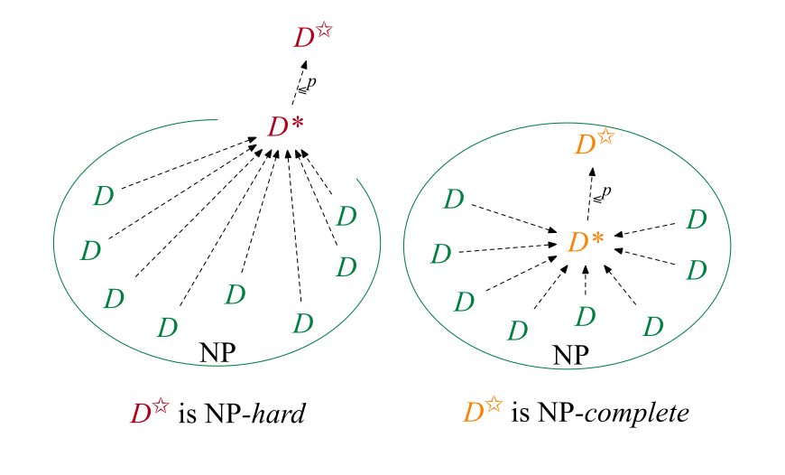
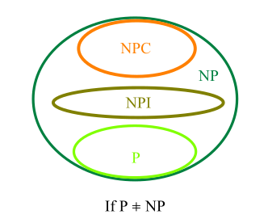

# 1. KONČNI AVTOMATI IN REGULARNI IZRAZI

Končni sistem (FSS) = objekt, ki lahko bere diskretne vhode

## Deterministični končni avtomat

Je peterka: $(Q, \Sigma, \delta, q_{0}, F)$: končna množica stanj, končna množica vhode abecede, začetno stanje, množica končnih stanj, funkcija prehodov $\delta: Q \times \Sigma \rightarrow Q$.

**Definicije:**

- niz $x$ je sprejet z DFA $M$, če $\delta(q_0, x) = p$ za $p \in F$
- jezik $L$ je sprejet z DFA $M$, je množica $L(M) = \{ x \in \Sigma^\ast \mid \delta(q_0, x) \in F \}$
- jezik $L$ je regularna množica (regularen jezik), če je sprejet z nekim DFA

## Nedeterministični končni avtomati

NFA je pridobljen iz DFA tako, da dovolimo *0, 1* ali *več* prehodov iz stanja glede na *enak* vhodni simbol.

Je peterka: $(Q, \Sigma, \delta, q_0, F)$: končna množica stanj, končna množica vhode abecede, začetno stanje, množica končnih stanj, funkcija prehodov $\delta: Q \times \Sigma \rightarrow 2^Q$.

**Definicije:**

- niz x je sprejet z NFA $M$, če $\delta(q_0, x)$ vsebuje nek $p \in F$
- jezik $L$ je sprejet z NFA $M$, je množica vseh nizov, za katero velja: $L(M) = \{x \in \Sigma^\ast \mid \delta(q_0, x) \in F\}$

## Enakovrednost DFA in NFA

Za vsak NFA obstaja *enakovreden* DFA, ki sprejme *enak* jezik kot NFA.

Izrek (kako konstruiramo ekvivalentni DFA): naj bo $L$ množica sprejeta z NFA $M$. Potem obstaja DFA $M'$, ki sprejme natanko ta jezik $L$ - stanja DFA $M'$ bodo ustrezala množicam stanj NFA $M$ - kontrolna enota DFA $M'$ bo hranila sled vseh stanj, v katerih bi lahko bil NFA $M$ po branju enakega vhoda kot ga je prebral $M'$

## NFA z $\varepsilon$-prehodi

NFA model razširimo tako, da vsebuje spontane prehode, to je, prehod na podlagi praznega vhoda $\varepsilon$.

Je peterka: $(Q, \Sigma, \delta, q_0, F)$: končna množica stanj, končna množica vhode abecede, začetno stanje, množica končnih stanj, funkcija prehodov $\delta: Q \times (\Sigma \cup {\varepsilon}) \rightarrow 2^Q$.

$\varepsilon$ - zaprtje($q$): množica stanj, ki so dosegljiva iz stanja $q$ z samo $\varepsilon$-prehodi

**Definicije:**

- niz x je sprejet z $\varepsilon-\mathrm{NFA}$ $M$, če $\delta(q_0, x)$ vsebuje nek $p \in F$
- jezik $L$ je sprejet z $\varepsilon-\mathrm{NFA}$ $M$, je množica $L(M) = \{x \in \Sigma^\ast \mid \delta(q_0, x) \in F\}$

## Enakovrednost $\varepsilon$-NFA in NFA

Izrek: $L$ je množica sprejeta z $\varepsilon-\mathrm{NFA}$ $M$. Potem obstaja $\mathrm{NFA}$ $M'$, ki sprejme $L$.

## Regularni izrazi

Naj bo $\Sigma$ abeceda. Regularni izrazi (r.i.) nad $\Sigma$ (in množice, ki jih označuje) so induktivno definirani:

1. $\emptyset$ je r.i.; označuje prazno množico
2. $\varepsilon$ je r.i.; označuje množico oz. jezik $\{\varepsilon\}$
3. za vsak $a \in \Sigma$, a je r.i.; označuje množico $\{a\}$
4. če $r$ in $s$ označujeta regularnme izraze jezika $R$ in $S$, potem
   - $(r + s)$ je r.i.; označuje množico $R \cup S$
   - $(rs)$ je r.i.; označuje množico $RS$
   - $(r^{\ast})$ je r.i.; označuje množico $R^{\ast}$

## Enakovrednost končnih avtomatov in regularnih izrazov

Jeziki, ki so sprejeti s končnimi avtomati so natanko jeziki, ki so opisani z regularnimi izrazi. $\varepsilon$-NFA je ekvivalenten NFA in DFA, posledično vsi sprejmejo enak razred jezikov. Vsi 4 (DFA, NFA, $\varepsilon$-NFA, regularni izrazi) definirajo enak razred jezikov, regularne množice.

Izrek: za poljuben regularni izraz $r$ obstaja $\varepsilon$-NFA, ki sprejmne jezik $L(r)$ - uporabimo indukcijo po številom operatorjev, s katerimi je zgrajen regularni izraz $r$ - s tem pokažemo, da za vsak regularni izraz $r$, obstaja $\varepsilon-\mathrm{NFA}$ $M = (Q, \Sigma, \delta, q_0, {f_i})$ z enim končnim stanjem in z nobenim prehodom izven, $L(M) = L(r)$. Tak $\varepsilon$-NFA (z enim končnim stanjem) nam omogoča, da jih enostavno združimo v večji $\varepsilon$-NFA.

Izrek: za poljubni DFA M obstaja regularni izraz $r$, ki opisuje $L(M)$ - $L(M)$, jezik tega končnega avtomata, si lahko predstavjamo kot *unijo*
(končno mnogih) množic - vsaka od množic ustreza nekemu *končnemu stanju* avtomata M in vsebuje vse besede, ki pripeljejo M od začetnega do končnega stanja - te množice definiramo *induktivno* (poenostavimo množice); vzporedno konstruiramo vsaki množici pripadajoč regularni izraz

# 2. LASTNOSTI REGULARNIH MNOŽIC

Lema za napihovanje za regularne množice je močno orodje

- za dokazovanje, da so določeni jeziki *neregularni*
- za dokazovanje, da so jeziki določenega FA *končni* ali *neskončni*

**Lema o napihovanju** (za regularne množice)

Naj bo $L$ regularna množica in $n$ neka konstanta (odvisna od $L$), tako da velja sledeče:

- če je z poljubna beseda $z \in L$ in $|z| \geq n$
- potem za besede $u$, $v$, $w$, velja
  - $z = uvw$
  - $|uv|\geq n$
  - $|v|\geq 1$ (v srednjem delu je vsaj 1 znak)
  - $\forall{i} \geq 0$: $uviw \in L$

($n$ je največje število stanj najmajšega FA, ki sprejme $L$)

## Značilnosti zaprtja regularnih množic

Razred regularnih množic je **zaprt za operacijo**, če je operacija, ki se nanaša na regularne množice regularna množica.

Izrek: razred regularnih množic je zaprt za unijo, stik in Klinovo zaprtje.

($L_1$, $L_2$ sta regularna, obstaja tak regularni izraz $r_1$, $r_2$ , da velja $L_1 = L(r_1)$ in $L2 = L(r_2)$. ($r_1,
r_2$ lahko konstruiramo iz pripadajočih FA $M_1$, $M_2$.) Lahko konstruiramo regularni izraz $r_1 + r_2$, ki označuje $L_1 \in L_2$. Tako, da je $L_1 \in L_2$ regularna.)

Izrek: razred regularnih množic je zaprt za komplement in presek.

($L$ je regularen, obstaja DFA $M = (Q,\Sigma,\delta,q_0,F)$, tako da velja $L = L(M)$. Konstruiramo nov DFA $M'$ za $\Sigma^{\ast} - L$. Ideja: $M'$ *naj bi imel komplementarna končna stanja*. $M' = (Q',\Sigma,\delta',q_0',F')$ kjer $Q' := Q$, $\Sigma' := \Sigma$, $\delta' := \delta$, $q_0' := q_0$, $F' := Q - F$. $M'$ sprejme $x$, če $M$ ne sprejme $x$. To pomeni, da $M'$ sprejme $\Sigma^{\ast}- L(M) = \Sigma^{\ast} - L$. $\Sigma^{\ast} - L$ je regularna množica.)

**Zaprtje za zamenjavo in homomorfizem**

Naj bosta $\Sigma$, $\Delta$ abecedi. Zamenjava je funkcija $f$, ki preslika vsak simbol abecede $\Sigma$ v jezik nad abecedo $\Delta$; $f (a) \subseteq \Delta^{\ast}$ za vsak $a \in \Sigma$. Razširimo $f$ na besede v $\Sigma^{\ast} f (\varepsilon) = \varepsilon$ in $f (wa) = f (w) f (a)$;
in potem na jezike $f (L) = \bigcup\limits_{x \in L} f(x)$

Izrek: razred regularnih množic je zaprt za zamenjavo.

(Naj bo $L$ in vsi $f (a)$, $a \in \Sigma$ regularne množice. Naj bo $L$ označen kot regularni izraz $r$ in $f (a)$ kot $r_a$. Ideja: zamenjaj vsako ponovitev $a$-ja v $r$ z $r_a$ . Nato dokaži, da posledično regularni izraz $r'$ označuje $f (L)$. (Uporabi indukcijo nad številom operatorjev (matematičnih znakov) v $r'$.))

**Zaprtje za kvocient**

Definicija: Kvocient jezikov $L_1$ in $L_2$ je množica $L_1/L_2$ definirana: $L_1/L_2 = \{x \mid \exists{y} \in L_2 : xy \in L_1\}$.

Izrek: Razred regularnih množic je zaprt za kvocient poljubnih množic.

## Odločitveni algoritmi za regularne množice

**Praznost in končnost regularnih množic**

Izrek: množica $L(M)$ sprejeta z FA $M$ z $n$ stanji je:

1) neprazna, če $M$ sprejme besedo dolžine $l$, kjer je $l < n$.
Poglej, če je kakšna beseda dolžine $l < n$ v $L(M)$.
2) neskončna, če $M$ sprejme besedo dolžine $l$, kjer je $n \leq l < 2n$.
Poglej, če je kakšna beseda dolžine $n \leq l < 2n$ v $L(M)$

**Enakovrednost končnih avtomatov**

Definicija: dva končna avtomata M1 in M2 sta enakovredna, če sprejmeta enak jezik: $L(M1) = L(M2)$.

Izrek: obstaja algoritem, ki ugotovi, ali sta 2 FA ekvivalentna.
Dokaz: Naj bosta M1 in M2 FA in $L1 = L(M1)$ in $L2 = L(M2)$.
Naj bo $L3 = (L_1 \cap \bar L_2) \cup (\bar L_1 \cap L_2)$. $L3$ je regularen (zaprtje) in sprejet je z FA M3. Lahko pokažemo, da M3 sprejme besedo če $L1 \neq L2$.

## Myhill-Nerode izrek in minimizacija FA

$x$ in $y$ sta v spodnjih definicijah besedi

Definicija: naj bo $L \subseteq \Sigma^{\ast}$ poljuben jezik. Določimo relacijo $R_L$ na $\Sigma^{\ast}$ tako: $xR_Ly$, če je $\forall z \in \Sigma^{\ast} : xz \in L \Leftrightarrow yz \in L$.

Definicija: naj bo $M = (Q, \Sigma, \delta, q_0 , F)$ DFA. Določimo relacijo $R_M$ na $\Sigma^{\ast}$ tako: $xR_My$, če je $\delta(q_0, x) = \delta (q_0, y)$.

Izrek (Myhill-Nerode): naslednje trditve so enakovredne:

1. $L \subseteq \Sigma^{\ast}$ je *regularna množica*;
2. Indeks $R_L$ je *končni* (končno število ekvivalenčnih razredov);
3. $L$ je unija nekaterih ekvivalenčnih razredov $R_M$ (indeks $R_M$ je končen; množica stanj je končna)

Izrek (DFA z minimalnimi stanji): Minimalni DFA, ki sprejme regularno množico $L$, je *edinstven izomorfizem* (preimenovanje stanj).

# 3. KONTEKSNO NEODVISNE GRAMATIKE

**Kontekstno neodvisne gramatike** = končna množica spremenljivk, *vsaka predstavlja* jezik (razred nizov). Jeziki predstavljeni z spremenljivkami so opisani *rekurzivno* in z *primitivni simboli* =
terminali. Pravila, ki se navezujejo na spremenljivke so produkcije.

Kontekstna neodvisna gramatika (CFG) je četverica $G = (V, T, P, S)$
kjer:

- $V$ je končna množica spremenljivk
- $T$ je končna množica terminalov
- $P$ je končna množica produkcij - vsaka je oblike $A \rightarrow \alpha$, kjer je $A \in V$ in $\alpha$ je beseda iz jezika $(V \cup T)^{\ast}$
- S je posebna spremenljivka imenovana začetni simbol

Definicije - naj bo $A \rightarrow \beta$ produkcija $P$ in $\alpha, \gamma \in (V \cup T)^{\ast}$ katerikoli nizi.

- $\alpha A \gamma$ neposredno izpelje $\alpha \beta \gamma$, če uporabimo produkcijo $A \rightarrow \beta$ na nizu $\alpha A \gamma$ (zamenjamo $A$ z $\beta$ v nizu $\alpha A \gamma$)
- dva niza sta povezana z relacijo $\Rightarrow_G$ , če prvi neposredno izpelje drugega z uporabo produkcije v $G$
- jezik dobljen z CFG $G = (V, T, P, S)$ je množica $L(G) = \{ w \mid w \in T^{\ast} \land S \Rightarrow_G^{\ast} w \}$
- jezik $L$ je kontekstno neodvisen (CFL), če je $L(G)$ za nek CFG $G$
- niz $\alpha \in (V \cup T)^{\ast}$ je stavčna oblika, če $S \Rightarrow_G^{\ast} \alpha$
- dve gramatiki $G_1$ in $G_2$ sta ekvivalentni, če $L(G_1) = L(G_2)$

Definicija: naj bo $G = (V, T, P, S)$ CFG. Drevo je izpeljano drevo za $G$, če:

1) Vsaka točka ima oznako, ki je simbol v $V \cup T \cup \{\varepsilon\}$.
2) Oznaka korena je $S$.
3) Če je točka notranja in označena z A, potem mora biti A v V.
4) Če je točka n označena z A in so točke $n_l, n_2, …, n_k$ sinovi $n$-ja (od leve proti desni) z oznakami $X_1, X_2, …, X_k$ , potem je $A \rightarrow X_1X_2…X_k$ produkcija v $P$.
5) Če ima točka $n$ oznako $\varepsilon$, potem je $n$ list in edini sin svojega očeta.

**Povezava med izpeljanimi drevesi in izpeljavami**

Izrek: Naj bo $G = (V, T, P, S)$ CFG. $S \Rightarrow_G^{\ast} \alpha$ iff obstaja izpeljano drevo za $G$ z krošnjo $\alpha$.

**Leve in desne izpeljave**
Izpeljava je leva (leftmost), če je na vsakem koraku izpeljave produkcija uporabljena za najbolj levo spremenljivko (leftmost).

Izpeljava je desna (rightmost), če je na vsakem koraku izpeljave produkcija uporabljena za najbolj desno spremenljivko (rightmost).

**Dvoumnost v gramatikah in jezikih**
CFG $G$ je dvoumen, če ima beseda več kot eno izpeljano drevo (ali če ima beseda več kot eno levo/desno izpeljavo).

CFL $L$ je bistveno dvoumen, če je vsak CFG za $L$ dvoumen. Taki CFL ne obstajajo.

## Poenostavtev konteksno neodvisnih gramatik

Omejimo obliko produkcije:

- vsaka spremenljivka in terminal se pojavi v izpeljavi neke besede v $L$
- ne obstaja nobena produkcija oblike $A \rightarrow B$, kjer sta $A$ in $B$ spremenljivki
- če $\varepsilon \notin L$, potem ni produkcije oblike $A \rightarrow \varepsilon$
- če $\varepsilon \notin L$, potem:
  - vsaka prdukcija ima obliko $A \rightarrow BC$ ali $A \rightarrow b$
  - vsaka produkcija je oblike $A \rightarrow b \gamma$

**Odtsranitev nepotrebnih simbolov**

Naj bo $G = (V, T, P, S)$ gramatika; simbol $X$ je potreben, če obstaja izpeljava $S \Rightarrow^{\ast} \alpha X \beta$; drugače je $X$ nepotreben.

Lema:

- Dan je CFG $G = (V, T, P, S)$ z $L(G) \neq \emptyset$, najdemo lahko ekvivalenten CFG $G' = (V', T, P', S)$ tako, da za vsak $A \in V'$ obstaja $w \in T^{\ast}$, tako da $A \Rightarrow^{\ast} w$
- Dan je CFG $G' = (V', T, P', S)$, efektivno lahko najdemo ekvivalenten CFG $G'' = (V'', T, P'', S)$, tako da za vsak $X \in V''\cup T$ obstajajo $\alpha, \beta \in (V'' \cup T)^{\ast}$, tako da
$A \Rightarrow^{\ast} \alpha X \beta$.

Izrek: vsak neprazen CFL je generiran z CFG brez nepotrebnih simbolov.

**Odstranitev $\varepsilon$-produkcij**

Definicija: $\varepsilon$-produkcija je produkcija oblike $A \rightarrow \varepsilon$.

Izrek: če je $L = L(G)$ za nek CFG $G = (V, T, P, S)$, potem je lahko $L-\{\varepsilon \}$ generiran z CFG $G'$ brez nepotrebnih simbolov in brez $\varepsilon$-produkcij.

**Odstranitev enotske produkcije**

Definicija: enotska produkcija je produkcija oblike $A \rightarrow B$.

Izrek: vsak CFL brez $\varepsilon$ je definiran z gramatiko brez nepotrebnih simbolov, $\varepsilon$-produkcij ali enotskih produkcij.

## Normalna oblika Chomskega

Izrek (Normalna oblika Chomskega): vsak CFL brez $\varepsilon$ je lahko generiran z gramatiko v kateri je vsaka produkcija oblike: $A \rightarrow BC$ ali $A \rightarrow a$ ($A, B, C$ so spremenljivke, $a$ je terminal)

## Normalna oblika Greibachove

Izrek (normalna oblika Greibachove): vsak CFL brez $\varepsilon$ je lahko generiran z gramatiko pri kateri je vsaka produkcija oblike: $A \rightarrow b \gamma$ ($A$ je spremenljivka, $b$ je terminal in $\gamma$ je (lahko tudi prazen) niz spremenljivk, $V^{\ast}$)

## Bistveno dvoumni konteksno neodvisni jeziki

CFL za katerega je vsaka CFG dvoumen, je bistveno dvoumen.

Izrek: CFL $L = \{a^n b^n c^m d^m \mid n \geq 1, m \geq 1\} \cup \{a^n b^m c^m d^n \mid n \geq 1, m \geq 1\}$ je bistveno dvoumen.

# 4. SKLADOVNI AVTOMATI

**Skladovni avtomat (PDA)** je sedmerica $M = (Q, \Sigma, \Gamma, \delta, q_0, Z_0, F)$ - končna množica stanj, končna množica vhodne abecede, končna množica skladovne abecede, začetno stanje, začetni simbol, množica končnih stanj, funkcija prehodov.

$Q \times (\Sigma \cup \{\varepsilon\}) \times \Gamma \rightarrow Q \times \Gamma^{\ast}$

Regularen prehod: $\delta (q,a,Z) = \{(p_1, \gamma_1), (p_2, \gamma_2), …, (p_m, \gamma_m)\}$

$\varepsilon$-prehodi: $\delta (q, \varepsilon, Z) = \{(p_1, \gamma_1), (p_2, \gamma_2), ..., (p_m, \gamma_m)\}$

Trenutni opis (ID) je trojica $(q, w, \gamma)$, kjer je $q$ stanje, $w$ niz vhodnih simbolov in $\gamma$ niz skladovnih simbolov.

**Jeziki sprejeti s PDA**

- $L (M)$, jezik sprejet s končnim stanjem; $L(M) = \{w \in \Sigma^{\ast} \mid (q_0, w, Z_0) \vdash^{\ast} (p, \varepsilon, \gamma) \textrm{ for some } p \in F \textrm{ and } \gamma \in \Gamma^{\ast}\}$
- $N (M)$, jezik sprejet s praznim skladom; $N(M) = \{w \in \Sigma^{\ast} \mid (q_0, w, Z_0) \vdash^{\ast} (p, \varepsilon, \varepsilon) \textrm{ for some } p \in Q\}$

PDA $M = (Q, \Sigma, \Gamma, \delta, q_0, Z_0, F)$ je determinističen, če $\delta$ izpolnjuje dva pogoja za vsak $q \in Q$ in $Z \in \Gamma$:

1. $\delta(q, \varepsilon, Z) \neq \forall a \in \Sigma : \delta(q, a, Z) = \emptyset$
2. $\forall a \in \Sigma \cup \{\varepsilon\} : \mid \delta (q, a, Z) \mid$ $\leq 1$

Deterministični skladovni avtomat = DPDA

## Skladovni avtomati in konteksno neodvisni jeziki

**Enakovrednost sprejetja s končnim stanjem in s praznim skladom**

Izrek: če je $L = L (M_2)$ za nek PDA $M2$, potem je $L = N (M_1)$ za nek PDA $M1$. *Ideja za dokaz: dan je poljuben $L = L (M_2)$, konstruiraj PDA $M1$, ki simulira $M2$ ampak izbriše sklad kadarkoli $M_2$ vstopi v končno stanje. Imamo $L = N (M_1)$.*

Izrek: če je $L = N (M_1)$ za nek PDA $M1$, potem je $L = L (M_2)$ za nek PDA $M_2$. *Ideja za dokaz: Dan je poljuben $L = N(M1)$, konstruiraj PDA $M_2$ ki simulira $M_1$ ampak vstopi v končno stanje kadarkoli $M_1$ izbriše sklad. Imamo $L = L (M_2)$.*

Povzetek: razred jezikov sprejetih s PDA končnim stanjem je enak kot razred jezikov sprejetih s PDA praznim skladom.

**Enakovrednost PDA in CFL**

Izrek: če je $L$ CFL, potem obstaja PDA $M$, da velja $L = N (M)$. *Ideja za dokaz. Naj bo $L$ poljuben CFL. $L$ je lahko generiran z CFG $G$ v normalni obliki Greibachove. Konstruiraj PDA $M$, ki simulira leve izpeljave $G$-ja. (Lažje je imeti $M$ sprejet s praznim skladom.) Tako je $L = N (M)$.*

Izrek: če je $L = N (M)$ za nek PDA $M$, potem je $L$ CFL. *Ideja za dokaz. Naj bo $M$ poljuben PDA. Konstruiraj CFG $G$ na tak način, da je leva izpeljava v $G$ stavka $x$ simulacija PDA $M$, ko je dan vhod $x$. Tako je $L = L(G)$ CFG.*

**Deterministični in nedetermninistični PDA**

Izrek: $\{ww^R \mid w \in (0+1)^{\ast}\}$ je sprejet z PDA ampak ne z vsemi DPDA.

Povzetek: deterministični PDA je *manj močan* kot nedetermnistični PDA.

# 5. ZNAČILNOSTI KONTEKSNO NEODVISNIH JEZIKOV

## Lema o napihovanju za CFL

Lema o napihovanju za CFL pravi, da vsaka dovolj dolga beseda v CFL vsebuje 2 kratki podbesedi blizu skupaj, ki se lahko ponavljata, obe enakovelikrat, in dobljena beseda bo še vedno v istem CFL - ju.

**Lema o napihovanju** (za CFL): naj bo $L$ CFL. Potem obstaja konstanta $n$ (odvisno samo od $L$) tako, da velja: če je $z$ beseda, za katero velja $z \in L$ in $\mid z \mid \geq n$,
potem obstajajo besede $u, v, w, x, y$, tako da velja $z = uvwxy$; $\mid vx \mid$ $\geq 1$, $\mid vwx \mid$ $\geq n$, $\forall i \geq 0: uv^iwx^iy \in L$.

## Značilnosti zaprtja ua CFL

Izrek: razred CFL je zaprt za: unijo, stik, Klinovo zaprtje, zamenjavo (homomorfizem), inverzni homomorfizem.

Izrek: razred CFL ni zaprt za: presek, komplement

Ampak: razred CFL je zaprt za presek z regularno množico:
Izrek: če je $L$ CFL in $R$ regularna množica, potem je $L \cap R$ CFL.

## Odločitveni algoritmi za CFL

**Praznost in končnost**

Izrek: obstajajo odločitveni algoritmi, ki določijo, če je CFL: prazen, končen, neskončen. Ideja dokaza: naj bo $G = (V, T, P, S)$ CFG

- $L (G)$ je neprazen, če in samo če $S$ (začetni simbol) ustvari nek nizov terminalov
- $L (G)$ je končen, če in samo če graf nima ciklov.

**Število členov**

Definicija: problem števila členov za CFG je vprašanje: “Dan je CFG $G = (V, T, P, S)$ in beseda $x \in T^{\ast}$, ali je $x \in L(G)$?"

Odgovor je DA;
obstaja naslednji naivni algoritem:

1. Pretvorite $G$ v normalno obliko Greibachove (GNF) $G$
2. Če je $x = \varepsilon$, potem testiraj, ali je $S \Rightarrow_G^{\ast} \varepsilon$ drugače preveri vse možne izpeljave v $G'$. Skupno moramo pregledati $\leq k \mid x \mid$ najbolj levih izpeljav.

Ta odločitveni algoritem je neučinkovit, ker mora preveriti eksponentno število izpeljav. Obstaja boljši, učinkovitejši odločitveni algoritem, ki se imenuje CYK algoritem:

- temelji na dinamični programerski tehniki
- izvaja v $O(n^3)$ času, kjer $n = \mid x \mid$

# 6. TURINGOV STROJ

Teza o izračunljivosti (Church-Turingova teza): osnovni koncepti računanja/izračunljivosti so formalizirani:

- **algoritem** je formaliziran z *Turingovim programom*
- **računanje** je formalizirano z izvršitvijo Turingovega programa v Turingovem stroju
- **funkcija izračunljivosti** je formalizirana z *Turingovo izračunljivo funkcijo*

**Teza o izračunljivosti (Church-Turingova teza)** pravi, da je vse, kar je možno izračunati v intuitivnem smislu, mogoče izračunati z enim od standardnih univerzalnih modelov računanja in obratno.

## Turingov stroj

Komponente: kontrolno enoto, ki vsebuje Turingov program; trak sestavljen iz celic; in premično okno čez trak, ki je povezano z kontrolno enoto.

Turingov program je parcialna/delna funkcija $\delta: Q × \Gamma \rightarrow Q \times \Gamma \times \{L, R, S\}$, funkcija prehodov.

$\delta$ si lahko predstavljamo kot $tabelo$ $\Delta = Q \times \Gamma$. Brez izgube na splošnosti, lahko privzamemo, da vedno obstaja prehod iz $q_{no}$, in noben iz $q_{yes}$.

TM je sedmerica $T = (Q, \Sigma, \Gamma, \delta, q_1, B, F)$ - končna množica stanj končne kontrolne enote, končna množica vhodnih simbolov, množica tračnih simbolov (vedno podmnožica $\Gamma$), funkcija prehodov (argumenti $\delta(q, x)$ so stanje in tračni simbol; definirana le če obstaja trojica $(p, Y, D)$), začetni simbol, član Q; končna enota je v tem stanju na začetku, prazen simbol (v $\Gamma$), množica končnih stanj, podmnožica Q

Definicija: **Trenutni opis (ID)** je niz $I = \alpha_1 q \alpha_2$ (okno je na prvem simbolu niza $\alpha_2$); oznaka $I \vdash J$

## Uporaba Turingovega stroja

### Računanje funkcij s Turingovim strojem

Naj bo $T = (Q, \Sigma, \Gamma, \delta, q_1, \sqcup, F )$ TM in $k \geq 1$. K-mestna lastna funkcija $T$-ja je delna funkcija $\varphi_T : (\Sigma^{\ast})k \rightarrow \Sigma^{\ast}$: če je vhod $T$-ja sestavljen iz $k$ besed $u_1, … , u_k \in \Sigma^{\ast}$, potem je vrednost $\varphi_T$ pri $u_1, … , u_k$ definirana $\varphi_T (u_1,…, u_k) :=$

- $v$ , če se $T$ ustavi in vrne na trak besedo $v \in \Sigma^{\ast}$
- $\uparrow$, če se $T$ ne ustavi ali trak nima besede v $\Sigma^{\ast}$

Definicija: naj bo $\varphi : (\Sigma^{\ast})^k \rightarrow \Sigma^{\ast}$ funkcija. Potem:

- $\varphi$ je izračunljiva če $\exists TM$, ki lahko izračuna $\varphi$ kjerkoli na dom($\varphi$) $\land$ dom($\varphi$) = $(\Sigma^{\ast})^k$
- $\varphi$ je delno izračunljiva če $\exists TM$, ki lahko izračuna $\varphi$ kjerkoli na dom($\varphi$)
- $\varphi$ je neizračunljiva če ne obstaja TM, ki bi lahko izračunal $\varphi$ kjerkoli na dom($\varphi$)

### Razpoznavanje množic z Turingovim strojem

Beseda $w$ je sprejeta z $T$, če $q_1w  \vdash* \alpha_1 p \alpha_2$, za nek $p \in F$ in $\alpha_1 \alpha_2 \in \Gamma^{\ast}$. Če beseda povzroči, da $T$ vstopi v končno stanje.

Jezik $L$ sprejet z $T$ je množica $L(T) = \{w \mid w \in \Sigma^{\ast} \land w \textrm{ je sprejet z}\ T\}$. Jezik sprejet z $T$ je sestavljen iz točno takih besed.

Definicija: naj bo $S \subseteq \Sigma^{\ast}$ jezik (množica). Potem:

- $S$ je odločljiv, če $\exists$ TM, ki odgovori z DA/NE na "Je $x \in S$?" za vsak $x \in \Sigma^{\ast}$.
  - $x \in S$, potem bo $T$ (ustavi in sprejme $x$) odgovoril z DA
  - $x \notin S$, potem
    - $T$ lahko (ustavi in zavrne $x$) odgovori z NE
    - $T$ lahko (nikoli se ne ustavi) nikoli ne odgovori z NE
- $S$ je polodločljiv, če $\exists$ TM, ki odgovori z DA na "Je $x \in S$?" kadarkoli $x \in S$.
- $S$ je neodločljiv, če ne obstaja noben TM, ki odgovori z DA/NE na
"Je $x \in S$?" za vsak $x \in \Sigma^{\ast}$.

### Generiranje množic z Turingovim strojem

Definicija: naj bo $T = (Q, \Sigma, \Gamma, \delta, q_1, \sqcup, F )$ TM. $T$ je generator, če piše na trak besede iz $\Sigma^{\ast}$, v
zaporedju in razmejevano (delimited) z #. (# je v $\Gamma-\Sigma$).
Jezik generiran z $T$ je množica $G(T) = \{w \mid w \in \Sigma^{\ast} \land T \textrm{ sčasoma zapiše }w \textrm{ na trak } \}$.

### Izračunljivo preštevni jeziki (množice)

Definicija: množica $S$ je izračunljivo preštevna (c.e.), če je $S = G(T)$ za nek TM $T$, to je, če je $S$ lahko generirana z Turingovim strojem.

Izrek: množica $S$ je izračunljivo preštevna iff $S$ je polodločljiva.

## Razširitve/modifikacije Turingovih strojev

### Turingov stroj s končnim pomnilnikom

V svoji kontrolni enoti ima končni pomnilnik, ki je zmožen spomina $k \geq 1$ tračnih simbolov in njihovo uporabo med računanjem. Turingov program: $\delta_V: Q \times \Gamma \times \Gamma^k \rightarrow Q \times \Gamma \times \{L, R, S\} \times \Gamma^k$

### Turingov stroj z večslednim trakom

Trak ima razdeljen v $tk \geq 2$ trakov. Na vsakem traku so simboli iz abecede $\Gamma$. Okno prikazuje $tk$-tuples simbolov, en simbol za vsak trak. Turingov program: $\delta_V: Q \times \Gamma^{tk} \rightarrow Q \times \Gamma^{tk} \times \{L, R, S\}$.

### Turingov stroj z dvosmernim trakom

Trak ima neomejen v obe smeri. Turingov program: $\delta_V: Q \times \Gamma \rightarrow Q \times \Gamma \times \{L, R, S\}$

### Turingov stroj z večtračnim trakom

Ima $tp \geq 2$ neomejenih trakov. Vsak trak ima svoje okno, ki je neodvisno od drugih oken.
Turingov program:$\delta_V: Q \times \Gamma^{tp} \rightarrow Q \times (\Gamma^{tk} \times \{L, R, S\})^{tp}$

### Turingov stroj z večdimenzionalni trakom

Ima $d$-dimenzionalen trak, $d \geq 2$. Okno se lahko premakne v $d$ dimenzij, npr. *2d smeri* $L_1, R_1, L_2, R_2, …, L_d, R_d$.
Turingov program je funkcija:$\delta_V: Q \times \Gamma \rightarrow Q \times \Gamma \{L_1, R_1, L_2, R_2,...,L_d, R_d, S\}.$

### Turingov stroj z nedeterminističnim programom

Turingov program $\delta$ dodeli vsakemu $(q_i, z_r)$ končno množico alternativnih prehodov $\{(q_{j_1}, z_{w_1}, D_1), ((q_{j_2}, z_{w_2}, D_2)\}$. Stroj nedeterministično izbere prehod iz množice in ga naredi.

Nedeterministični TM ni smiseln model računanja, ker lahko napove prihodnost, ko
izbira med alternativnimi prehodi.

## Univerzalni Turingov stroj

### Kodiranje Turingovega stroja

Dan je TM $T = (Q, \Sigma, \Gamma, \delta, q_1, \sqcup, F )$, želimo zakodirati $T$; predstaviti $T$ z besedo nad neko kodirno abecedo.

Univerzalni Turingov stroj je čisto navaden Turingov stroj, ki kot vhod sprejme opis nekega drugega Turingovega stroja in njegov vhod, ter ta stroj na podanem vhodu simulira.

### Oštevilčenje Turingovih strojev

$T$ lahko interpretiramo kot binarno kodo nekega naravnega števila. To število je indeks $T$-ja. Naravno število katerega binarna koda ni v zahtevani obliki je indeks praznega Turingovega stroja. $\delta$ tega TM-ja je povsod nedefirana; za vsak vhod, se ta TM nemudoma ustavi v 0 korakih. Vsako naravno število je indeks točno enega Turingovega stroja.

### Obstoj Univerzalnega Turingovega stroja

Trditev: obstaja Turingov stroj, ki lahko izračuna vse kar je izračunljivo z kakšnim drugim Turingovim strojem.

Ideja za dokaz: ideja je konstruirati Turingov stroj $U$, ki bo sposoben simuliranja kakšnega drugega TM $T$. Da to dosežemo, uporabimo metodo za dokaz z *Tezo o izračunljivosti (CT)*.

### Pomembnost Univerzalnega Turingovega stroja

Mogoče je konstruirati fizični računski stroj, ki lahko računa vse kar je izračunljivo z katerem koli drugim fizičnim računskim strojem.

Praktične posledice: Splošno-namenski računalnik (ENIAC, EDVAC, IAS)

### Izreki iz teorije izračunljivosti

- $S$ je odločljiv $\Rightarrow S$ je pol-odločljiv
- $S$ je odločljiv $\Rightarrow \bar S$ in je odločljiv
- $S$ in $\bar S$ sta polodločljiva $\Rightarrow S$ je odločljiv
- $A$ in $B$ sta polodločljiva $\Rightarrow A \cap B$ in $A \cup B$ sta polodločljiva
- $A$ in $B$ sta odločljiva $\Rightarrow A \cap B$ in $A \cup B$ sta odločljiva

# 7. NEODLOČLJIVOST

## Računski problemi

4 vrste (razredov) računskih problemov: **odločitveni problemi** (rešitev je en sam bit), **problemi iskanja** (rešitev je element množice), **problem štetja** (rešitev je naravno število), **problemi generiranja/problemi preštevanja** (rešitev je zaporedje elementov množice)

## Reševanje problemov

### Jezik odločitvenega problema

Naj bo $D$ odločitveni problem. Naj bo $d$ primerek problema $D$.

To je kodirna funkcija, code : $D \rightarrow \Sigma^{\ast}$, in code $(D)$ je množica kod vseh primerkov problema $D$.
Pišemo $\langle d \rangle$ namesto code $(d)$.

Naj bo code : $D \rightarrow \Sigma^{\ast}$ kodirna funkcija. Izberemo kode vseh pozitivnih primerkov problema $D$ v množico $L(D)$.

Jezik odločitvenega problema $D$ je množica $L(D)$, ki je definirana z
$L(D) = \{\langle d \rangle\in \Sigma^{\ast} | d \textrm{ je pozitiven primerek problema } D\}$.

$d \in D$ je pozitiven $\Leftrightarrow \langle d \rangle \in L (D) \; (\diamond)$. To je povezava med odločitvenimi problemi in množicami (formalnimi jeziki).

Reševanje odločitvenega problema $D$ je lahko zreducirano v razpoznavanje množice $L(D)$ v $\Sigma^{\ast}$.

Kaj nam prepoznavnost L(D) pove o rešljivosti problema D ?

- $L(D)$ je odločljiv $\Rightarrow$ obstaja algoritem, ki za vsak $d \in D$, odgovori z DA ali NE. Obstaja TM, ki se za vsak $\langle d \rangle \in \Sigma^{\ast}$, odloči, ali je ali ni $\langle d \rangle \in L(D)$. Potem uporabi $(\diamond)$.
- $L(D)$ je polodločljiv $\Rightarrow$ obstaja algoritem, ki
  - za vsako pozitivni primerek $d \in D$, odgovori z DA
  - za negativen primerek $d \in D$, v končnem času lahko odgovori z NE ali pa ne odgovori z NE

Obstaja TM, ki za vsak $\langle d \rangle \in L(D)$ sprejme $\langle d \rangle$. Če $\langle d \rangle \notin L(D)$, algoritem lahko zavrže ali ne zavrže $\langle d \rangle$ v končnem času. Potem uporabi $(\diamond)$.

- $L(D)$ je neodločljiv $\Rightarrow$ ne obstaja algoritem, ki bi za vsak $d \in D$ odgovoril z DA ali NE. Ne obstaja TM, ki je sposoben odločanja, za vsak $\langle d \rangle \in \Sigma^{\ast}$, ali je ali ni $\langle d \rangle \in L(D)$. Potem uporabi $(\diamond)$.

Naj bo $D$ odločitveni problem. Rečemo, da je problem:

- $D$ je odločljiv (izračunljiv), če je $L(D)$ odločljiva množica
- $D$ je polodločljiv, če je $L(D)$ polodločljiva množica
- $D$ je neodločljiv (neizračunljiv), če je $L(D)$ neodločljiva množica

## Neizračunljiv problem - problem ustavitve

### Problem ustavljanja (odločtveni problem)

Problem ustavljanja DHalt je definiran: $D_{Halt}$ = “Dan je TM $T$ in $w \in \Sigma^{\ast}$, ali se $T$ ustavi na $w$?”

Izrek: problem ustavljanja $D_{Halt}$ je neodločljiv.

**Univerzalni jezik $K_0$**: je jezik problema ustavljanja; $K_0 = L (D_{Halt} ) = \{ \langle T, w \rangle  \mid T \textrm{ se ustavi na } w \}$

**Diagonalni jezik $K$**: $K = \{ \langle T, T  \rangle  \mid T \textrm{ se ustavi na }\ \langle T \rangle \}$ - jezik, ki ga dobimo iz univerzalnega jezika z uvedbo omejitve $w = < T >$

Dokaz (problem ustavljanja):

- dokaži (v lemi), da je $K$ neodločljiva množica
- to bo impliciralo, da je $K_0$ neodločljiv, posledično, Dhalt je neodločljiv problem

Lema: Množica $K$ je neodločljiva. (dokažemo jo s nasprotjem):

- Predpostavimo, da je $K$ odločljiva množica. Potem mora obstajati TM $D_K$ , ki za vsak $T$, odgovori $\langle T, T \rangle  \in ? K$ z DK $(\langle T, T \rangle ) =$
  - DA, če se $T$ ustavi na $\langle T \rangle$
  - NE, če se $T$ ne ustavi na $\langle T \rangle$

Zdaj konstruiramo nov TM $S$. Namen je konstruirati $S$ na tak način, da ko dana za vhod njegova lastna koda $\langle S \rangle$, bo $S$ razkril nezmožnost DK za predvidevanje ali se ali se ne $S$ ustavi na $\langle S \rangle$.

## Osnovne vrste odločitvenih problemov

**Obstajajo neodločljive množice, ki so polodločljive**

$K_0$ je polodločljiva množica: najti moramo TM, ki sprejme $K_0$. Dan je poljuben vhod $\langle T, w \rangle$, stroj mora simulirati $T$ na $w$, in če se simulacija ustavi, mora stroj vrniti DA in se ustaviti. Če
tak stroj obstaja, bo odgovoril z DA iff $\langle T, w  \rangle  \in ? K_0$. Vemo, da tak stroj obstaja: to je Univerzalni Turingov stroj $U$. Posledično, $K_0$ je polodločljiva množica. Zato $K_0$ imenujemo univerzalni jezik. $K_0$ je neodločljiva (ampak še vedno) polodločljiva množica.

Odločitveni problem D je lahko eden izmed treh vrst:

- Odločljiv (decidable): to pomeni, da obstaja algoritem, ki lahko reši poljubni primerek $d \in D$. Tak algoritem se imenuje odločevalec problema $D$.
- Polodločljivo neodločljiv (semi-decidable undecidable): to pomeni, da ne obstaja algoritem, ki bi rešil poljuben primerek $d \in D$, ampak obstaja algoritem, ki lahko reši poljubnen pozitiven primerek $d \in D$. Tak algoritem se imenuje prepoznalec problema $D$.
- Ni polodločljiv (not semi-decidable): to pomeni, da za poljuben algoritem obstaja pozitiven in negativen primerek $d$ problema $D$,tak, da ju algoritem ne more rešiti.

**Komplementarne množice in odločitveni problemi**
Obstajajo samo 3 možnosti za odločljivost množice $S$ in njegovega komplementa $\bar S$

- $S$ in $\bar S$ sta odločljiva
- $S$ in $\bar S$ sta neodločljiva; en je polodločljiv in drugi ni
- $S$ in $\bar S$ sta neodločljiva in noben od njiju ni polodločljiv

Enako velja za odločljivost odločitvenega problema.

## Prevedbe

- Univerzalni jezik je neodločljiv in polodločljiv
- Neprazen jezik je neodločljiv
- $L_{ne}$ je polodločljiv
- $L_{halt}$ je neodločljiv
- $L_d$ ni polodločljiv
- Če je jezik $L$ odločljiv, je njegov komplement tudi odločljiv
- Jezik $L$ je odločljiv natanko takrat, ko sta $L$ in njegov komplement polodločljiva
- Komplement diagonalnega jezika je polodločljiv, vendar neodločljiv

# 8. TEORIJA RAČUNSKE ZAHTEVNOSTI

## Deterministična časovna zahtevnost, razred zahtevosti DTIME

Naj bo $M = (Q, \Sigma, \Gamma, \delta, q_1, \sqcup, F )$ DTM z $k \geq 1$ dvosmerimi neskončnimi trakovi.

$M$ je deterministične časovne zahtevnosti T(n), če za vsak vhod $w \in \sigma^{\ast}$ dolžine $n$, $M$ naredi $\leq T(n)$ korakov pred ustavitvijo.

Privzeto je, da $M$ prebere vse $w$-je … $T(\mid w \mid) \geq \mid w \mid + 1, T(n) \geq n + 1$, če je $T(n)$ najmanj linearen.

$M$ časovne zahtevnosti $T(n)$ se lahko odloči $w \in ? L(M)$ v $\leq T(\mid w \mid)$ korakih.

Jezik $L$ je deterministične časovne zahtevnosti $T(n)$, če obstaja DTM $M$ deterministične časovne zahtevnosti $T(n)$, da velja $L = L(M)$.

Razred vseh takih jezikov: **DTIME(T(n))** $= \{L \mid L \textrm{ je jezik }\ \land L \textrm{ je deterministične časovne zahtevnosti }\ T (n)\}$. Vsebuje vse $L$-je za katere je problem $w \in ? L$ lahko deterministično rešljiv v $\leq T (\mid w \mid)$ času.

Odločitveni problem $D$ je deterministične časovne zahtevnosti $T(n)$, če ima njegov jezik $L(D)$ deterministično časovno zahtevnost $T(n)$.

Razred vseh takih odločitvenih problemov: $DTIME(T(n)) = \{D \mid D \textrm{ je odločitveni problem }\ \land D \textrm{ je deterministične časovne zahtevnosti }\ T (n)\}$. Vsebuje vse $D$-je čigar primerki $d$ so lahko deterministično rešljivi v $\leq T (\mid \langle d \rangle  \mid)$ času.

## Deterministična prostorska zahtevnost, razred zahtevnosti DSPACE

Naj bo $M = (Q, \Sigma, \Gamma, \delta, q_1, \sqcup, F )$ $DTM$ z 1 vhodnim trakom in $k \geq 1$ delovnimi trakovi.

$M$ je deterministične prostorske zahtevnosti $S(n)$, če, za vsak vhod $w \in \Sigma^{\ast}$ dolžine $n$, $M$ pred zaustavitvijo uporabi $\leq S(n)$ celic na vsakem delovnem traku.

- Celice vhodnega traka niso pomembne.
- Predpostavljeno je, da $M$ uporabi najmanj celico pod začetnim položajem okna. $S(n)$ je najmanj konstantna funkcija 1.

$M$ deterministične prostorske zahtevnosti $S(n)$ se lahko odloči $w \in ? L(M)$ na prostoru $\leq S(n)$.

Jezik $L$ je deterministične prostorske zahtevnosti $S(n)$, če obstaja $DTM$ $M$ deterministične prostorske zahtevnosti $S(n)$, da velja $L = L(M)$.

Razred vseh takih jezikov: **DSPACE(S(n))** $= \{L \mid L \textrm { je jezik }\ \land L \textrm{ je deterministične prostorske zahtevnosti }\ S (n)\}$. Vsebuje vse $L$-je za katere je lahko problem $w \in ? L$ deterministično rešljiv na $\leq S(\mid w \mid)$ prostoru.

Odločitveni problem $D$ je deterministične prostorske zahtevnosti $S(n)$, če ima njegov jezik $L(D)$ deterministično prostorsko kompleksnost $S(n)$.

Razred vseh takih odločitvenih problemov: $DSPACE(S(n)) = \{D \mid D \textrm{ je odločitveni problem }\ \land D \textrm{ je deterministične prostorske zahtevnosti }\ S(n)\}$. Vsebuje vse $D$-je čigar primerki $d$ so lahko deterministično rešljivi na $\leq S (\mid \langle d \rangle  \mid)$ prostoru.

## Nedeterministična časovna zahtevnost, razred zahtevnosti NTIME

Naj bo $N = (Q, \Sigma, \Gamma, \delta, q_1, \sqcup, F )$ edeterministični NTM.

$N$ je nedeterministične časovne zahtevnosti $T(n)$, če za vsak vhod $w \in \Sigma^{\ast}$ dolžine $n$, obstaja izračun v katerem $N$ naredi $\leq T(n)$ korakov pred ustavitvijo. Predpostavljeno je, da $N$ prebere vse $w$-je … $T(\mid w \mid) \geq \mid w \mid + 1, T(n) \geq n + 1$. $T(n)$ je najmanj linearna funkcija.

$N$ časovne zahtevnosti $T(n)$ se lahko odloči $w \in? L(M)$ v $\leq T(\mid w \mid)$ korakih.

Jezik $L$ je nedeterministične časovne zahtevnosti $T(n)$, če obstaja nedeterministični $NTM$ $N$ nedeterministične časovne zahtevnosti $T(n)$ tako, da velja $L = L(M)$.

Razred vseh teh jezikov: **NTIME(T (n))** $= \{L \mid L \textrm{ je jezik }\ \land L \textrm{ je nedeterministične časovne zahtevnosti }\ T (n)\}$. Vsebuje vse $L$-je za katere je lahko problem $w \in? L$ nedeterministično rešljiv v $\leq T (\mid w \mid)$ času.

Odločitveni problem $D$ je nedeterministične časovne zahtevnosti $T(n)$, če je njegov jezik $L(D)$ nedeterministične časovne zahtevnosti $T(n)$.

Razred vseh teh odločitvenih problemov: $NTIME(T(n)) = \{D \mid D \textrm{ je odločitveni problem }\ \land D \textrm{ je nedeterministične časovne zahtevnosti }\ T (n)\}$. Vsebuje $D$-je čigar primerki $d$ so lahko nedeterministično rešljivi v $\leq T (\mid \langle d \rangle  \mid)$ času.

## Nedeterministična prostorska zahtevnost, razred zahtevnosti NSPACE

Naj bo $N = (Q, \Sigma, \Gamma, \delta, q_1, \sqcup, F )$ nedeterministični $NTM$ z 1 vhodnim trakom in $k \geq 1$ delovnimi trakovi.

$N$ je nedeterministične prostorske zahtevnosti $S(n)$, če za vsak vhod $w \in \Sigma^{\ast}$ dolžine $n$, obstaja izračun v katerem $N$ pred ustavitvijo uporabi $\leq S(n)$ celic na vsakem delovnem traku.

- Celice vhodnega traka niso pomembne.
- Predpostavljeno je, da $M$ uporabi najmanj celico pod začetno pozicijo okna. $S(n)$ je najmanj konstanta funkcija 1.

$N$ z prostorsko zahtevnostjo $S(n)$ se lahko odloči $w \in ? L(M)$ na $\leq S(\mid w \mid)$ prostoru.

Jezik $L$ je nedeterministične prostorske zahtevnosti $S(n)$, če obstaja nedeterminističen $NTM$ $N$ nedeterministične prostorske zahtevnosti $S(n)$ tako, da velja $L = L(M)$.

Razred takih jezikov: **NSPACE(S (n))** $= \{L \mid L \textrm{ je jezik }\ \land L \textrm{ je nedeterministične prostorske zahtevnosti }\ S(n)\}$. Vsebuje vse $L$-je za katere $w \in? L$ je lahko nedeterministično rešljiv na $\leq S(\mid w \mid)$ prostoru.

Odločitveni problem $D$ je nedeterministične prostorske zahtevnosti $S(n)$, če je njegov jezik $L(D)$ nedeterministične prostorske zahtevnosti $S(n)$.

Razred takih odločitvenih problemov: $NSPACE(S(n)) = \{D \mid D \textrm{ je odločitveni problem }\ \land D \textrm{ je nedeterministične prostorske zahtevnosti }\ S (n)\}$. Vsebuje vse $D$-je čigar primerki $d$ so lahko nedeterministično rešljivi na $\leq S(\mid \langle d \rangle  \mid)$ prostoru.

## Povzetek razredov zahtevnosti

V smislu formalnih jezikov:

- DTIME($T(n)$) = {$L \mid L$ je jezik $\land$ $L$ je časovne zahtevnosti $T(n)$}
- DSPACE($S(n)$) = {$L \mid L$ je jezik $\land$ $L$ je prostorske zahtevnosti $S(n)$}
- NTIME($T(n)$) = {$L \mid L$ je jezik $\land$ $L$ je nedeterministične časovne zahtevnosti $T(n)$}
- NSPACE($S(n)$) = {$L \mid L$ je jezik $\land$ $L$ je nedeterministične prostorske zahtevnosti $S(n)$}

V smislu odločitvenih problemov:

- DTIME($T(n)$) = {$D \mid D$ je odločitveni problem $\land$ $L(D)$ je časovne zahtevnosti $T(n)$}
- DSPACE($S(n)$) = {$D \mid D$ je odločitveni problem $\land$ $L(D)$ je prostorske zahtevnosti $S(n)$}
- NTIME($T(n)$) = {$D \mid D$ je odločitveni problem $\land$ $L(D)$ je nedeterministične časovne zahtevnosti $T(n)$}
- NSPACE($S(n)$) = {$D \mid D$ je odločitveni problem $\land$ $L(D)$ nedeterministične prostorske zahtevnosti $S(n)$}

Informalno:

- DTIME($T(n)$) = {odločitveni problemi deterministično rešljivi v času $T(n)$}
- DSPACE($S(n)$) = {odločitveni problemi deterministično rešljivi na prostoru $S(n)$}
- NTIME($T(n)$) = {odločitveni problemi nedeterministično rešljivi v času $T(n)$}
- NSPACE($S(n)$) = {odločitveni problemi nedeterministično rešljivi na prostoru $S(n)$}

## Stiskanje trakov, linearna pohitritev in zmajševanje števila trakov

### Stiskanje trakov

Izrek: če ima $L$ prostorsko zahtevnost $S(n)$, potem za vsak $c > 0$, ima $L$ časovno zahtevnost $c \cdot S(n)$. To drži tudi za nedeterministično prostorsko zahtevnost.
Posledica: Za vsak $c > 0$ je DSPACE($S(n)$) = DSPACE($c \cdot S(n)$) in NSPACE($S(n)$) = NSPACE($c \cdot S(n)$).

### Linearna pohitritev

Izrek: naj bo $\inf_{n \rightarrow \infty}T(n)/n = \infty$ in $k > 1$. Potem: če ima $L$ časovno zahtevnosti $T(n)$, potem ima za vsak $c > 0$, $L$ časovno zahtevnost $c \cdot T(n)$. To drži tudi za
nedeterministično prostorsko zahtevnost.

Posledica: če je $\inf T(n) /n = \infty$, potem za vsak $c > 0$ velja:
DTIME($T(n)$) = DTIME($c \cdot T(n)$) in NTIME($T(n)$) = NTIME($c \cdot T(n)$).

### Povzetek

Pod določenimi pogoji:

- DTIME($T(n)$) = DTIME($c \cdot T(n)$)
- NTIME($T(n)$) = NTIME($c \cdot T(n)$)
- DSPACE($S(n)$) = DSPACE($c \cdot S(n)$)
- NSPACE($S(n)$) = NSPACE($c \cdot S(n)$)

Pozitivna konstanta $c$ nima nobenega vpliva na vsebino razreda.

- Primer: DTIME($n^2$) = DTIME($0.33 \cdot n^2$) = DTIME($4 \cdot n^2$) = DTIME($7 \cdot n^2$) = …

Namesto pisanja, da je odločitveni problem $D$ v DTIME($n^2$), lahko rečemo, da: $D$ ima deterministično časovno zahtevnost *of the order O($n^2$)*.

### Zmajševanje števila trakov

Časovna zahtevnost - izrek:

- Če je $L \in$ DTIME($T(n)$), potem je $L$ sprejet v času $O(T^2(n))$ z 1-tračnim TM.
- Če je $L \in$ NTIME($T(n)$), potem je $L$ sprejet v času $O(T^2(n))$ z 1-tračnim NTM.
- Če je $L \in$ DTIME($T(n)$), potem je $L$ sprejet v času $O(T(n) \cdot logT(n))$ z 2-tračnima TM.
- Če je $L \in$ NTIME($T(n)$), potem je $L$ sprejet v času $O(T(n) \cdot logT(n))$ z 2-tračnima NTM.

Prostorska zahtevnost - izrek: če je $L$ sprejet z $k$-delovnimi traki TM prostorske zahtevnosti $S(n)$, potem je $L$ sprejet z 1-delovnim trakom TM prostorske zahtevnosti $S(n)$.

## Relacija med DTIME, DSPACE, NTIME, NSPACE

Izreki:

- $DTIME(T(n)) \subseteq DSPACE(T(n))$; kar je lahko rešljivo v času $O(T(n))$, je lahko rešljivo tudi na prostoru $O(T(n))$.
- $L \in DSPACE(S(n)) \land S(n) \geq log_2 n \Rightarrow \exists c : L \in DTIME(c \cdot S(n))$; kar je lahko rešljivo na prostoru $O(S(n))$, je lahko tudi rešljivo (največ) v času $O(c \cdot S(n))$. (Tukaj je $c$ odvisen od $L$.)
- $L \in NTIME(T(n)) \Rightarrow \exists c : L \in DTIME(c \cdot T(n))$; kar je lahko rešljivo v nedeterminističnem času $O(T(n))$, je lahko rešljivo v največ determinističnem času $O(c \cdot T(n))$. Posledično, zamenjava nedeterminističnega algoritma z determinističnim povzroči največ eksponentno rast v času, ki je potreben za reševanje problema.
- $NSPACE(S(n)) \subseteq DSPACE(S^2(n)), \textrm{ if }\ S(n) \geq log_2 n \in S(n)$ is ``well-behaved.''; kar je lahko rešljivo na nedeterminističnem prostoru $O(S(n))$, je lahko rešljivo na determinističnem prostoru $O(S^2(n))$. Posledično, zamenjava nedeterminističnega algoritma z determinističnim povzroči največ kvadratno rast na prostoru, ki je potreben za reševanje problema.

Funkcija $S(n)$ je **prostorsko predstavljiva**, če obstaja $TM$ $M$ prostorske zahtevnosti $S(n)$, da za vsak $n$, obstaja vhod dolžine $n$ na katerem $M$ uporabi točno $S(n)$ tračnih celic. Če za vsak $n$, $M$ uporabi točno $S(n)$ celic za vsak vhod dolžine $n$, potem rečemo, da je $S(n)$ **popolnoma prostorsko predstavljiva**.

Funkcija $T(n)$ je **časovno predstavljiva**, če obstaja $TM$ $M$ časovne zahtevnosti $T(n)$, da za vsak $n$, obstaja vhod dolžine $n$ na katerem $M$ uporabi točno $T(n)$ prehodov. Če za vse $n$, $M$ naredi točno $T(n)$ prehodov za vsak vhod dolžine $n$, potem rečemo, da je $T(n)$ **popolnoma časovno predstavljiva**.

## Razredi zahtevnosti P, NP, PSPACE, NPSPACE

$P = \bigcup \limits_{i \geq 1}DTIME(n^i)$ je razred vseh odločitvenih problemov rešljivih v determinističnem polinomskem času

$NP = \bigcup \limits_{i \geq 1}NTIME(n^i)$ je razred vseh odločitvenih problemov rešljivih nedeterministično v polinomskem času

$PSPACE = \bigcup \limits_{i \geq 1}DSPACE(n^i)$ je razred vseh odločitvenih problemov determinističmo rešljivih na polinomskem prostoru

$NPSPACE = \bigcup \limits_{i \geq 1}NSPACE(n^i)$ je razred vseh odločitvenih problemov nedeterministično rešljivih na polinomskem prostoru

Izrek: P $\subseteq$ NP $\subseteq$ PSPACE $=$ NPSPACE

Dokaz:

- (P $\subseteq$ NP): Vsak deterministični TM polinomske časovne zahtevnosti si lahko predstavljamo kot (trivialni) nedeterministični TM enake časovne zahtevnosti.
- (NP $\subseteq$ PSPACE): Če je $L \in$ NP, potem obstaja tak $\exists k$, da je $L \in$ NTIME($n^k$). Zaradi izreka je $L \in$ NSPACE($n^k$), in posledično (Savitch) je $L \in$ DSPACE($n^{2k}$). Potem je $L \in$ PSPACE.
- (PSPACE = NPSPACE): PSPACE $\subseteq$ NPSPACE; druga smer: NSPACE = (def) = $\cup$ NSPACE($n^i$) $\subseteq$ (Savitch) $\cup$ DSPACE($n^i$) $\subseteq$ PSPACE.

## Vprašanje P =? NP

Prevladuje prepričanje, da je P $\neq$ NP (P $\subsetneq$ NP).

### Prevedba problema

Ideja: Predpostavimo, da obstaja $D^{\ast} \in$ NP, tako, da lahko z “lahkoto” zmanjšamo vsak $D \in$ NP v ta $D^{\ast}$ v naslednjem smislu:

- mora obstajati funkcija $r : D \rightarrow D^{\ast}$
- ki lahko ”z lahkoto'' preoblikuje katerikoli primerek $d \in D$ v primerek $r(d) \in D^{\ast}$
- tako, da je rešitev s to $r(d)$ z “lahkoto” preoblikovana v rešitev “?" to $d$

### Zmanjševanje polinomskega časa

Problem $D \in$ NP je polinomsko-časovno prevedljiv na problem $D'$, $D \leq_p D$', če obstaja deterministični TM $M$ polinomske časovne zahtevnosti, ki za vsak $d \in D$, vrne $d' \in D'$, tako, da je,
$d$ pozitiven $\Leftrightarrow$ $d'$ je pozitiven. Relacija $\leq_p$ je polinomsko-časovna prevedba.

Najtežji problem v NP (NP - poln problem) je lahko katerikoli problem $D*$ z značilnostmi:

- $D^{\ast} \in$ NP
- $D \leq_p D^{\ast}$, za vsak $D \in$ NP

## NP-poln in NP-težek problem

### NP-polni problemi in NP-težki problemi

Problem $D^{\ast}$ je NP-težek, če $D \leq_p D^{\ast}$, za vsak $D \in$ NP.

Problem $D^{\ast}$ je NP-poln:

- $D^{\ast} \in$ NP
- $D \leq_p D^{\ast}$, za vsak $D \in$ NP.

Posledično, $D^{\ast}$ je NP-poln, če je $D^{\ast}$ v NP in $D^{\ast}$ je NP-težek.

### NP-poln problem, SAT (problem izpolnjivosti)

Boolov izraz induktivno definira:

- Booleanove spremenljivke $x_1, x_2, …$ so Booleanovi izrazi.
- Če sta $E, F$ Booleanova izraza, potem so tudi $\neg E$, $E \lor F$, in $E \land F$.

Booleanov izraz $E$ je izpolnjiv, če so lahko spremenljivke $E$-ja dosledno zamenjane z vrednostmi TRUE/FALSE tako, da $E$ ovrednotimo z TRUE.

Izrek (Cook-Levin): SAT je NP-poln. (Za $D^{\ast}$ lahko vzamemo SAT.)

### Dokazovanje NP-polnih problemov

Naj bo $D \leq_p D'$. Potem:

- $D' \in$ P $\Rightarrow D \in$ P
- $D' \in$ NP $\Rightarrow D \in$ NP

Vsak problem $D$, ki je lahko $\leq_p-$zmanjšan na problem v P (ali v NP), je tudi v P (ali v NP).

Izrek: relacija $\leq_p$ je tranzitivna.
Z drugimi besedami: $D \leq_p D' \land D' \leq_p D^{\prime\prime} \Rightarrow D \leq_p D^{\prime\prime}$.

Posledica:

- $D^{\ast}$ je NP-težek $\land D^{\ast} \leq_p D^\diamond \Rightarrow D^\diamond$ je NP-težek
- $D^{\ast}$ je NP-poln $\land D^{\ast} \leq_p D^\diamond \land D^\diamond \in$ NP $\Rightarrow D^\diamond$ je NP-poln

Metoda dokazovanja NP-težkosti ali NP-polnosti $D^\diamond$:  

### Povzetek

Če je P $\neq$ NP, potem je situacija v razredu NP opisana spodaj:

- NPC je razred vseh NP-polnih problemov.
- NPI je razred vseh NP-vmesnih problemov.

{width=300px}

Če je P $\neq$ NP, potem obstaja problem v NP, ki ni niti v P niti v NPC. Tak problem se imenuje NP-vmesni problem. Primer: Ali je dano naravno število sestavljeno? Če je P $\neq$ NP, potem noben problem v NPC ali NPI nima zahtevnosti polinomskega časa.
