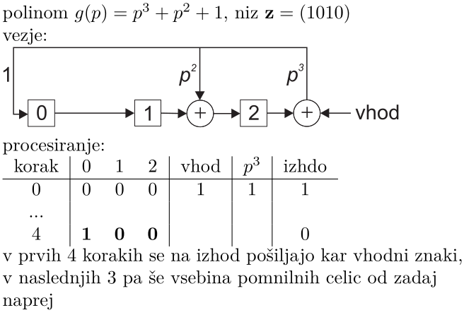

# 1. OSNOVE TEORIJE IN INFORMACIJ

## 1.1 Lastna informacija

Vsak znak je izbran iz množice $n$ različnih, med seboj enakovrednih znakov. Več kot je znakov, več moramo povedati, da opišemo izbrani znak.  
Če imamo $\ell$ znakov, imamo $n^\ell$ možnosti:
$$f(n^\ell) = \ell \cdot f(n)$$
Edina funkcija, ki temu ustreza, je
$$K \cdot \log_b(n).$$

**Shannon:** vsi znaki niso enako verjetni - manj verjetna sporočila nosijo več infomracije.

**Definicija lastne informacije:** $I = \log_b(\frac{1}{p}) = - \log_b(p)$.  

Odvod logaritma $\frac{d \cdot \ln(x)}{dx} = \frac{1}{x}$. Odvod določa naklon premice v neki točki.

## 1.2 Entropija

**Lastna informacija** opisuje dogodek, ki se je zgodil.

**Entropija** je ocena za informacijo, ki jo lahko sprejmemo v prihodnosti (predstavljaj si kot povprečno število korakov); povprečna informacija, ki upošteva vse možne izide; mera za **nedoločenost dogodka**.

$$H(X) = -p \cdot \log(p) - (1 - p) \cdot \log(1 - p)$$

Diskretni vir informacije $X$ je dinamični, naključni sistem, v katerem se dogodki $\{x_1, x_2, \dots, x_n\}$ zgodijo z verjetnostmi $\{p_1, p_2, \dots, p_n\}$.

- $\sum_{i = 1}^n p_i = 1$
- $I_i = \log(\frac{1}{p}) = - \log(p_i)$
- $H(X) = \sum\limits_{i = 1}^n p_i I_i = - \sum\limits_{i = 1}^n p_i \log(p_i)$

Lastnosti entropije:

- zvezna funkcija
- simetrična - vrstni red $p_i$ ni pomemben
- večja od 0
- navzgor omejena z $\log(n)$
- aditivna, če sta dogodka neodvisna: $H(X, Y) = H(X) + H(Y)$
- v splošnem velja $H(X, Y) \leq H(X) + H(Y)$
- poseben primer: več zaporednih dogodkov enega neodvisnega vira: $X^l = H \times \dots \times X \rightarrow H(X^l) = lH(X)$

# 2. KODIRANJE

**Kod** sestavljajo **kodne zamenjave**, ki so sestavljene iz znakov **kodne abecede**. Število znakov v kodni abecedi označujemo z $r$. Je dodelitev kodnih zamenjav znakom osnovne abecede.

## 2.1 Povprečna dolžina kodnih zamenjav

Če so $\{p_q, \dots, p_n\}$ verjetnosti znakov $\{s_1, \dots, s_n\}$ osnovnega sporočila in $\{l_1, \dots, l_n\}$ dolžine prirejenih kodnih zamenjav, je povprečna dolžina kodne zamenjave $L = \sum_{i = 1}^n p_il_i$.

Kod je **optimalen**, če ima najmanjšo možno povprečno dolžino kodnih zamenjav - za kodiranje smo uporabili najmanjše možno število znakov.

Kod je **idealen**, če je povprečna dolžina kodnih zamenjav enaka entropiji.

## 2.2 Tipi kodov

Singularni kodi: različnim znakom je prirejena ista kodna zamenjava. Nesingularnost ni dovolj: ne vemo, kje se znak začne in kje konča.

Kod je **enakomeren**, če je dolžina vseh kodnih zamenjav enaka.

Kod je **enoznačen**, če lahko poljuben niz znakov dekodiramo na en sam način.

Kod je **trenuten**, če lahko osnovni znak dekodiramo takoj, ko sprejmemo celotno kodno zamenjavo. To velja le, če kod ne vsebuje kodne zamenjave, ki bi bila predpona kakšni drugi kodni zamenjavi.

## 2.3 Kodna drevesa

Vsako vozlišče ima največ toliko vej, kot je različnih znakov v abecedi $B$. Veje vodijo do naslednjih vozlišč. Vozlišča, ki predstavljajo kodne zamenjave, označimo z debelo piko.

## 2.4 Kraftova neenakost

Za dolžine kodnih zamenjav $\{l_1, \dots, l_n\}$ in $r$ znaki kodirne abecede obstaja trenutni kod, če in samo če velja $$\sum\limits^n_{i = 1} r ^ {-l_i} \leq 1.$$

## 2.5 Povprečna dolžina zamenjav in entropija

$$H_r(X) \leq L \rightarrow \frac{H(X)}{\log r} \leq L$$

Najkrajše povprečne kodne zamenjave imamo, če je $H_r(X) = L \rightarrow l_i = - \log_rp_i$ (če je za vsak $i$ $l_i$ celo število). V splošnem velja $l_i = \lceil -\log_r p_i \rceil$.

$$L < H_r(X) + 1 \rightarrow L < \frac{H(X)}{\log r} + 1$$

**Omejitev povprečne dolžine kodnih zamenjav**:

$$H_r(X) \leq L < H_r(X) + 1$$

$$\frac{H(X)}{\log r} \leq L < \frac{H(X)}{\log r} + 1$$

Kod je **gospodaren**, če je $L$ znotraj zgornjih mej.

**Učinkovitost koda**: $\eta = \frac{H(X)}{L \log r}$, $0 < \eta \leq 1$.

## 2.6 Shannonov prvi teorem

1. krajše kodne zamenjave za bolj verjetne znake
2. združevanje znakov v večje, sestavljene znake in kodiranje sestavljenih znakov

**TEOREM**: za nize neodvisnih znakov dolžine $n$ $(X^n)$ obstajajo kodi za katere velja
$$\lim_{n \rightarrow \infty} \frac{L_n}{n} = H(X),$$
pri čemer je $H(X)$ entropija vira $X$.

**Posledica:** z večanjem $n$ se zgornja meja lahko poljubno približa entropiji.

**Cena:** kompleksno kodiranje in zakasnitev pri dekodiranju.

# 3. STISKANJE

## 3.1 Shannonov kod

- znake razvrstimo po padajočih verjetnostih
- št. znakov v vsaki kodni zamenjavi: $l_k = \lceil - \log_r p_k \rceil$
- za vse simbole kumulativne verjetnosti: $P_k = \sum^{k - 1}_{i = 1} p_i$
- $P_k$ pretvorimo v bazo $r$ $\rightarrow$ kodna zamenjava je prvih $l_k$ znakov necelega dela števila

## 3.2 Fanojev kod

- znake razvrstimo po padajočih verjetnostih
- znake razdelimo v $r$ čim bolj enako verjetnih skupin
- vsaki skupini dodelimo enega od $r$ znakov kodne abecede
- deljenje ponavljamo, dokler je mogoče

## 3.3 Huffmanov kod

1. Združevanje:
	- poiščemo $r$ najmanj verjetnih znakov $\rightarrow$ združimo v sestavljen znak z verjetnostjo, ki je seštevek verjetnosti vseh znakov
	- na novo razvrstimo znake
	- postopek ponovimo, dokler nam ne ostane $r$ znakov
2. Razdruževanje:
	- vsakemu od preostalih znakov dodelimo po en znak kodirne abecede
	- vsak sestavljen znak razstavimo in mu priredimo po en znak kodirne abecede
	- zaključimo, ko zmanjka sestavljenih znakov

**Optimalnost Huffmanovega koda**

- nima neizrabljenih vej - če bi jih imel, bi obstajale krajše kodne zamenjave, obstajal bi bolj gospodaren kod
- zaradi zgornjega morajo najdaljše kodne zamenjave nastopati v parih (par se razlikuje samo v zadnjem znaku)
- najdaljše kodne zamenjave ustrezajo najmanj verjetnim znakom
- če ima osnovni kod povprečno dolžino $L$, ima kod, v katerem sta najmanj verjetna znaka združena, v najboljšem primeru povprečno dolžino $L - 1 \cdot (p_q + p_{q - 1})$
- ko nam pri postopku združevanja ostaneta samo dva sestavljena znaka, za njiju velja $L = 1$. Če bi obstajal bolj optimalen kod, bi imel $L < 1$, kar pa ni mogoče

**Vsak optimalen kod Huffmanov?**

- vsak optimalen enoznačen kod ni Huffmanov
  - $P = \{\frac{1}{2}, \frac{1}{4}, \frac{1}{8}, \frac{1}{8}\}$
  - $C_H = \{0, 10, 110, 111\}$
  - $C_? = \{0, 01, 011, 111\}$
- vsak optimalen trenuten kod ni Huffmanov
  - $P = \{0.3, 0.3, 0.2, 0.2\}$
  - $C_H = \{10, 11, 00, 01\}$
  - $C_? = \{00, 10, 01, 11\}$

**Nedoločenost Huffmanovega koda**

- Huffmanov kod ni en sam (zamenjava ničel in enic, gradnja drevesa odvisna od razvrščanja simbolov z enakimi verjetnostmi)

**Huffmanov kod za $r > 2$**

- kodiranje začnemo, če za število znakov velja $n = r + k(r - 1), k \geq 0$

**Problem Huffmanovega koda**

- če je entropija vira majhna, je odstopanje med entropijo in $L$ veliko
- problem dodatnega znaka
- rešitev nam predlaga prvi Shannonov teorem

**Kodiranje z razširitvijo abecede**

- več osnovnih znakov združujemo v sestavljenje znake
- s kodiranjem abecede, zgrajenje iz sestavljenih znakov dobimo bolj učinkovite kode
- problem: kombinacijska eksplozija

## 3.4 Aritmetični kod

- state-of-the art pri brezizgubnem stiskanju podatkov
- **blizu optimalnemu kodu** in je **hiter** - ni tako učinkovit kot Huffmanov, a ni težav z kombinacijsko eksplozijo
- vsak niz je predstavljen kot realno število $0 \leq R \leq 1$
- daljši kot je niz, bolj natančno mora biti podano realno število $R$

**Postopek kodiranja**

- **znakov ne rabimo razvrščati**
- začnemo z intervalom $[0, 1)$
- izbrani interval razdelimo na $n$ podintervalov, ki se ne prekrivajo, širine podintervalov ustrezajo verjetnostim znakov, vsak podinterval je en znak
- izberemo interval, ki ustreza izbranemu znaku
- če niz ni končan, izbrani interval ponovno razdelimo
- niz lahko predstavimo s poljubnim realnim številom v zadnjem podintervalu

**Postopek dekodiranja**

- postopek enak
- ustavimo se: vemo koliko znakov ALI imamo stop znak

**Aritmetični kod in entropija**

- ?

## 3.5 Stiskanje na osnovi slovarja

- v besedah se pojavljajo vzorci $\rightarrow$ konstrukcija slovarja na osnovih teh vzorcev
- ne uporablja v naprej znanih verjetnosti za znake
- **kodirnik** med branjem niza gradi slovar in zapisuje reference na nize v slovarju
- **dekodirnik** med branjem kodnih zamenjav rekonstruira slovar in znake
- kodirnik in dekodirnik sprotno gradita slovar

## 3.5.1 Kod Lempel-Ziv

**Kodirnik:**

- preiskuje že poslana besedila, da poišče najdaljši niz, ki se je ponovil
- namesto niza pošlje referenco na niz
- idealno: pregledovanje celotne zgodovine
- praksa: pregledovanje nazaj in naprej je omejeno
- uporablja drseča okna, znaki se premikajo iz desne na levo
- enkoder bere znake v bralnem medpomnilniku in išče podobne nize v iskalnem medpomnilniku
- referenca je podana kot trojček: odmik, dolžina enakega podniza, naslednji znak

**Dekodiranje:**

- sledimo kodnim zamenjavam

## 3.5.2 Deflate

- uporablja pare (odmik, dolžina)
- če ni ujemanja, zapiše znak
- dve kodni tabeli:
  - tabela za znake in dolžine ima 285 simbolov
  - tabela odmikov
- ?

## 3.5.3 Kod Lempel-Ziv-Welch

- najdemo ga v GIF
- slabosti: velik slovar, ne rabimo vsega
- doseže optimalno stiskanje - se približa entropiji

**Kodiranje:**

- osnovni slovar je definiran
- algoritem:

	```
	N = ''
	ponavljaj:
		preberi naslednji znak z
		če je [N, z] v slovarju:
			N = [N, z]
		drugače:
			izpiši indeks k niza N
			dodaj [N, z] v slovar
			N = z
	```

**Dekodiranje:**

- med branjem rekonstruiramo slovar
- algoritem:

	```
	preberi znak k
	v slovarju poišči niz N, ki ustreza indeksu k
	izpiši N
	N_star = N
	ponavljaj:
		preberi znak k
		če je k v slovarju:
			v slovarju za indeks k poišči niz N
		drugače:
			N = [N_star, N_star(1)]
		izpiši N
		v slovar daj [N_star, N(1)]
		N_star = N
	```
- pri rekonstrukciji pridemo do niza, ki ga še ni v slovarju
  - začeti se mora z zadnjim nizom, ki je še v pomnilniku, saj ta še ni šel v slovar
  - zadnji vpis v slovar je torej sprožil prvi znak tega niza

## 3.6 Verižno kodiranje = run length encoding

- večinoma se uporablja, če so podatki dveh tipov
- izkorišča dejstvo, da se določeni podatki ponavljajo
- namesto orig. podatkov se shranjuje dolžina verige: aaaabbc = 4a2b1c
- težava, če se podatki ne ponavljajo

## 3.7 Stiskanje z izgubami

- veliko boljše (pri slikah, zvoku, videu)
- psihovizualni in psihoakustični pristop
- kompresijsko razmerje: stisnjen dokument / osnovni dokument
$$R = C(M)/M$$

# 4. INFORMACIJSKI KANAL

Strukturo, ki opisuje medsebojno povezanost, imenujemo kanal.

{ width=50% }

Kanal prenaša informacijo o spremenljivki $X$ do spremenljivke $Y$. Matematično ga opišemo s **pogojnimi verjetnostmi**, ki povezujejo izhodne verjetnosti z vhodom.

## 4.1 Diskretni kanal brez spomina

Povezuje diskretni naključni spremenljivki s končno množico stanj $X$ in $Y$.

- naključni spremenljivki zavzemata končno mnogo stanj $X = \{x_q, \dots, x_r\}$, $Y = \{y_q, \dots, y_s\}$ z verjetnostmi $P_X = \{p(x_1), \dots, p(x_r)\}$ in $P_Y = \{p(y_1), \dots, p(y_s)\}$
- kanal je definiran kot množica pogojnih verjetnosti $p(y_j | x_i)$ (verjetnost za dogodek $y_j$ na izhodu kanala, če je na vhodu dogodek $x_i$)
- brez spomina je, ker so pogojne verjetnosti konstantne in torej neodvisne od predhodnih simbolov, $\sum_j p(y_j | x_i) = 1$
- popolnoma je podan z $r \times s$ pogojnimi verjetnostmi (**predhodne verjetnosti**)
- pomemben je **binarni simetrični kanal**

{ width=50% }

{ width=50% }

## 4.2 Pogojna entropija

Pogojna entripija spremenljivke $Y$ pri znanem $X$ se zapiše kot $H(Y|X)$.

- če se je zgodil dogodek $x_i \in X$, je entropija dogodka $Y$
$$H(Y|x_i) = - \sum\limits_{j = 1}^s p(y_j|x_i) \log p(y_j|x_i)$$
- velja $0 \leq H(Y | x_i)$
- če o dogodku $X$ vemo le, da se je zgodil:
$$ H(Y|X) = \sum\limits_i p(x_i) H(Y|x_i)\\
= -\sum\limits_{i = 1}^r \sum\limits_{j = 1}^s p(x_i, y_j) \log p(y_j|x_i)$$
- uporabili smo **vezano verjetnost** dogodkov $X$ in $Y$, $p(x_i, y_j) = p(y_j|x_i)p(x_i)$ (vezana = pogojna + lastna)
- splošno velja: $0 \leq H(Y|X) \leq H(Y)$

## 4.3 Vezana entropija spremenljivk

Vezana entropija naključnih spremenljivk $X$ in $Y$ je entropija para $(X, Y)$. Pomembne zveze:

- $p(x_i, y_j) = p(y_j|x_i)p(x_i)$
- $\sum_j p(x_i, y_j) = p(x_i)$
- $\sum_i p(x_i, y_j) = p(y_j)$
- $\sum_{i,j} p(x_i, y_j) = 1$

Velja $H(X, Y) = H(Y|X) + H(X)$. Ker sta spremenljivki enakovredni, velja tudi obratno: $H(X, Y) = H(X|Y) + H(Y)$.

## 4.4 Obrat kanala

Pogoj za obrat je, da poznamo vhodne verjetnosti. Iz njih lahko določimo izhodne verjetnosti, ki jih lahko uporabimo kot vhodne verjetnosti v obrnjen kanal.

{ width=50% }

- izračun izhodnih verjetnosti $p(y_j) = \sum_i p(y_j|x_i)p(x_i)$
- potrebujemo še **obratne pogojne verjetnosti**:
  - velja $p(x_i, y_j) = p(y_j|x_i) p(x_i) = p(x_i|y_j) p(y_j)$
  - **Bayesovo pravilo:**
	$$p (x_i|y_j) = \frac{p(y_j|x_i) p(x_i)}{p(y_j)}$$

## 4.5 Medsebojna informacija

Pove nam, koliko o eni spremenljivki izvemo iz druge spremenljivke.
$$I(X;Y) = H(X) - H(X|Y)$$

Lastnosti:

1. $I(X;Y) = H(X,Y) - H(X|Y) - H(Y|X)$
2. $I(X;Y) = H(X) - H(X|Y)$
3. $I(X;Y) = H(Y) - H(Y|X)$
4. $I(X;Y) = H(X) + H(Y) - H(X,Y)$
5. $I(X;Y)$ je simetrična glede na $X$ in $Y$
6. $I(X;Y) = - \sum_i \sum_j p(x_j, y_j) \log \frac{p(x_i)p(y_j)}{p(x_i, y_j)}$
7. $I(X;X) \geq 0$
8. $I(X;X) = H(X)$

Relacija za zgornjo mejo: $0 \leq H(Y|X) \leq H(Y)$.

Predstavitev relacij z **Vennovim diagramom**:

{ width=50% }

Predstavitev relacij s kanalom:

{ width=50% }

## 4.6 Kapaciteta kanala

Shannonov najpomembnejši in najbolj presenetljiv rezultat je, da je zanesljiva komunikacija skozi nezanesljiv kanal, v katerem prihaja do napak, mogoča.

**Kapaciteta kanala** je največja možna medsebojna informacija, ki jo lahko prenesemo od vhoda na izhod.
$$C = \max\limits_{P(X)} I(X;Y)$$

Binarni simetrični kanal:

- $C = \max_{P(X)} I(X;Y) = \max_{P(X) (H(Y) - H(Y|X))}$
- $p(x_0) = \alpha$, $p(x_1) = 1 - \alpha$
- $I(X;Y) = H(Y) - H(Y|X) = \dots = H(Y) - H(p, 1 - p)$
- $\frac{dI(X;Y)}{d \alpha}$ = 0
- sklep: $C$ je $\max$, ko je $H(Y) = 1$
- $C = I(X;Y)|_{\alpha = 1/2} = 1 - H(p, 1 - p)$

Binarni simetrični kanal z brisanjem:

- $p(x_0) = \alpha$, $p(x_1) = 1 - \alpha$
- $p(y_0) = (1 - p) \alpha$, $p(y_1) = p$, $p(y_2) = (1 - p)(1 - \alpha)$
- $I(X;Y) = (1 - p)H(\alpha, 1 - \alpha)$
- $\frac{dI(X;Y)}{d \alpha} = 0 \rightarrow \alpha = 1/2$
- $C = 1 - p$

## 4.7 Shannonov drugi teorem

Shannon je ugotovil, da nam združevanje znakov v nize daje več možnosti za doseganje zanesljivega prenosa.

Naj bo $M$ število različnih kodnih zamenjav, ki jih lahko oblikujemo z nizi dolžine $n$. **Hitrost koda** (prenosa) je definirana kot
$$R = \frac{\max H(X^n)}{n} = \frac{\log M}{n}.$$
Hitrost je največja takrat, ko so dovoljene kodne zamenjave na vhodu enako verjetne.

Shannonov teorem pravi, da je možna skoraj popolna komunikacija s hitrostjo, enako kapaciteti kanala.

**Za $R \leq C$ obstaja kod, ki zagotavlja tako prevajanje informacije, da je verjetnost napake pri dekodiranju poljubno majhna. Za $R > C$, kod, ki bi omogočal prevajanje informacije s poljubno majhno verjetnostjo napake, ne obstaja.**

Če so znaki neodvisni, je $\log H(X^n) = n \log H(X) \rightarrow R = H$. Lahko si pomagamo z znanimi enačbami: $C = \max\limits_{P(X)} I(X;Y) = I(X;Y) + \varepsilon = H(X) - H(X|Y) + \varepsilon \rightarrow H(X|Y) = H(X) - C + \varepsilon$ - iz $Y$ nedvoumno določimo $X$ samo kadar je dvoumnost $H(X|Y) = 0$. Torej $H(X) = C - \varepsilon \leq C$.

?

# 5. VARNO KODIRANJE

Omejili se bomo na enostavne bločne kode za binarni simetrični kanal. Dolžina bloka je $k$ znakov, abeceda znakov je enaka abecedi kanala, torej imamo $M = 2^k$ blokov $x_1 \dots x_k, x_i \in \{0, 1\}$. Dodamo še nekaj varnostnih znakov, celotna dolžina vsake od $M$ kodnih zamenjav je potem $n$. Pri konstrukciji koda $(n, k)$ moramo med $2^n$ možnostmi izbrati $M$ najbolj primernih zamenjav.

## 5.1 Kontrolne vsote

Podatkovnim bitom dodamo bite za preverjanje parnosti - **paritetni biti** (vsota po modulu 2 mora biti fiksna).

Pri pravokotnih kodih preverjamo sodost po vrsticah in stolpcih, pri trikotnih kodih mora biti vsota elementov v stolpcu in vrstici s paritetnim bitom vred soda.

## 5.2 Hammingova razdalja

**Hammingova razdalja med kodnima zamenjavama** nam pove število znakov, na katerih se razlikujeta. Kodni zamenjavi sta enaki, če je razdalja $0$, razdalja med različnimi kodnimi zamenjavami mora biti vsaj $1$, drugače je kod singularen.

**Hammingova razdalja koda** je podana kot minimalna Hammingova razdalja med dvema kodnima zamenjavama. Definira odpornost koda na napake.

Število napak, ki jih kod zazna: $d \geq e + 1 \rightarrow e_{max} = d - 1$.

Število napak, ki jih kod lahko popravi: $d \geq 2f + 1 \rightarrow f_{max} = \lfloor \frac{d - 1}{2} \rfloor$.

## 5.3 Hammingov pogoj

Za bloke dolžine $n$ lahko zgradimo $2^n$ različnih kodnih zamenjav. Če želimo zagotoviti odpornost na napake, mora biti razdalja $d$ več od $1$. Uporabni kodi imajo št. kodnih zamenjav $M = 2^k < 2^n$.

**Hammingov pogoj:** da bi lahko pravilno dekodirali vse kodne zamenjave, pri katerih je prišlo do $e$ ali manj napak mora veljati
$$M \leq \frac{2^n}{\sum_{i = 0}^e \begin{pmatrix} n \\ i \end{pmatrix}}$$

## 5.4 Linearni bločni kodi

Označimo jih z $L(n, k)$ - $k$ - podatkovni biti, $m$ - varnostni biti.

O linearnih bločnih kodih govorimo kadar

- je vsota vsakega para kodnih zamenjav spet kodna zamenjava
- da produkt kodne zamenjave z $1$ in $0$ spet kodno zamenjavo

Hammingova razdalja linearnega koda je enaka številu enic v kodni zamenjavi z najmanj enicami.

### 5.4.1 Generatorska matrika

Sestavimo kodno zamenjavo v obliki $x = (x_1, x_2, x_3, x_4, x_5, x_6) = (z_1, z_2, z_3, s_1, s_2, s_3)$. Enačbe:
$$x_1 + x_2 + x_4 = 0$$
$$x_2 + x_3 + x_5 = 0$$
$$x_1 + x_3 + x_6 = 0$$

Generiranje kodne zamenjave lahko opišemo z **generatorsko matriko**
$$x = zG = (z_1, z_2, z_3)
\begin{pmatrix}
1 & 0 & 0 & 1 & 0 & 1 \\
0 & 1 & 0 & 1 & 1 & 0 \\
0 & 0 & 1 & 0 & 1 & 1
\end{pmatrix}$$

Za diskretne kanale brez spomina jo vedno lahko zapišemo v obliki $G = (I_k | A)$. Kod, čigar generatorska matrika ima to obliko, je **sistematični kod** - prvih $k$ znakov je enakih sporočilu (podatkovnim bitom). Ostalih $n - k$ znakov so paritetni biti.

### 5.4.2 Matrika za preverjanje sodosti

Prej napisane enačbe lahko zapišemo z **matriko za preverjanje sodosti**
$$H = \begin{pmatrix}
	1 & 1 & 0 & 1 & 0 & 0 \\
	0 & 1 & 1 & 0 & 1 & 0 \\
	1 & 0 & 1 & 0 & 0 & 1
\end{pmatrix}$$

Potem mora veljati $xH^T = 0$, $GH^T = 0$. Če je $G = (I_k | A)$, potem je $H = (A^T | I_{n - k})$. Vsota dveh kodnih zamenjav je nova kodna zamenjava.

## 5.5 Sindrom

{ width=50% }

- $yH^T = (x + e)H^T = e H^T = s$ - vektor $s$ velikosti $1 \times n - k$ je odvisen samo od napake. Imenujemo ga **sindrom**.
- napako ugotavljamo tako, da pogledamo, če je $s = 0$ (ne garantira, da pri prenosu ni prišlo do napake!)

## 5.6 Standardna tabela

## 5.7 Hammingov kod

So družina linearnih bločnih kodov, ki lahko popravijo eno napako. Najlažje jih predstavimo z matriko za preverjanje sodosti, v kateri so vsi stolpci neničelni vektorji. Kod z $m$ varnostnimi biti ima kodne zamenjave dolžine $2^m - 1$. Oznaka koda je $H(2^m - 1, 2^m - 1 - m)$. Če stolpce v matriki $H$ interpretiramo kot števila v binarni obliki, nam oznaka stolpca določa položaj napake. Stolpci v Hammingovem kodu so poljubno razmetani, pomembno je le to, da nastopajo vsa števila od $1$ do $2^m - 1$.

V Hammingovem kodu se za varnostne bite običajno vzamejo tisti stolpci, ki imajo samo eno enico ($1$, $2$, $4$, $8$, $16$, ...).

**Primer:** $H(7,4)$: če postavimo $x = (x_1, x_2, z_1, x_4, z_2, z_3, z_4)$, dobimo iz matrike $H$ za vsak varnostni bit svojo enačbo:
$$x_4 + z_2 + z_3 + z_4 = 0 \rightarrow x_4 = z_2 + z_3 + z_4$$
$$x_2 + z_1 + z_3 + z_4 = 0 \rightarrow x_2 = z_1 + z_3 + z_4$$
$$x_1 + z_1 + z_2 + z_4 = 0 \rightarrow x_1 = z_1 + z_2 + z_4$$

Enačbe opisujejo stolpce varnostnih bitov v matriki $G$:

$$G = \begin{pmatrix}
	1 & 1 & 1 & 0 & 0 & 0 & 0 \\
	1 & 0 & 0 & 1 & 1 & 0 & 0 \\
	0 & 1 & 0 & 1 & 0 & 1 & 0 \\
	1 & 1 & 0 & 1 & 0 & 0 & 1
\end{pmatrix}$$

Če vir nima spomina, lahko stolpce v matrikah $H$ in $G$ sinhrono premečemo, na primer:

$$H = \begin{pmatrix}
	0 & 0 & 0 & 1 & 1 & 1 & 1 \\
	0 & 1 & 1 & 0 & 0 & 1 & 1 \\
	1 & 0 & 1 & 0 & 1 & 0 & 1
\end{pmatrix} \rightarrow \\
H' = \begin{pmatrix}
	0 & 1 & 1 & 1 & 1 & 0 & 0 \\
	1 & 0 & 1 & 1 & 0 & 1 & 0 \\
	1 & 1 & 0 & 1 & 0 & 0 & 1
\end{pmatrix} \rightarrow \\
G' = \begin{pmatrix}
	1 & 0 & 0 & 0 & 0 & 1 & 1 \\
	0 & 1 & 0 & 0 & 1 & 0 & 1 \\
	0 & 0 & 1 & 0 & 1 & 1 & 0 \\
	0 & 0 & 0 & 1 & 1 & 1 & 1
\end{pmatrix}
$$
Če matriki $G'$ naredimo obratne premike kot na matriki $H$, dobimo matriko $G$, ki smo jo določili iz enačb.

Hammingovi kodi spadajo med **popolne kode** - sfere z radijem $1$ okrog kodnih zamenjav ravno zapolnijo ves prostor z $2^n$ točkami, Taki linearni kodi so še ponavljajoči kodi in Golayevi kodi.

## 5.8 Ciklični kodi

$C(n, k)$ je linearni bločni kod, v katerem vsak krožni premik kodne zamenjave da drugo kodno zamenjavo. Zapise lahko poenostavimo z polinomi ($x = (x_{n - 1}, \dots, x_1,x_0) \Leftrightarrow x(p) = x_{n - 1}p^{n - 1} + \dots + x_1p + x_0$).

### 5.8.1 Zapis s polinomi

Zapis krožnega premika za eno mesto:

- osnovni vektor: $x = (x_{n - 1}, x_{n - 2}, \dots, x_0) \Leftrightarrow x(p) = x_{n - 1}p^{n - 1} + x_{n - 2}p^{n - 2} + \dots + x_0$
- **oznake indeksov v obratnem vrstnem redu!!**
- premik za eno mesto: $x' = (x_{n - 2}, \dots, x_0, x_{n - 1}) \Leftrightarrow x'(p) = x_{n - 2}p^{n - 2} + \dots + x_0p + x_{n - 1}$
- zveza: $x'(p) = px(p) - x_{n - 1}(p^n - 1)$
- zaradi mod 2 je ' enakovreden +: $x'(p) = px(p) + x_{n - 1}(p^n + 1)$
- v aritmetiki $\mod (p^n + 1)$ sledi: $x'(p) = px(p) \mod (p^n + 1)$
- **pozor: aritmetika po $\mod 2$ na istih stopnjah polinoma (na bitih) in aritmetika po $\mod (p^n + 1)$ na polinomu**
- krožni premik za $i$ mest: $$x^i(p) = p^ix(p) \mod (p^n + 1)$$

### 5.8.2 Generatorski polinom

Vrstice generatorske matrike lahko razumemo kot kodne zamenjave. Za ciklične kode velja splošno: **generatorski polinom** je stopnje $m$, kjer je $m$ število vranostnih bitov, in ga označimo kot
$$g(p) = p^m + g_{m - 1}p^{m - 1} + \dots + g_1p + 1.$$

Generatorska matrika: $g(p)$ je kodna zamenjava, enako tudi $pg(p), \dots, p^{k - 1}g(p)$, vse $\mod p^n + 1$
$$G = \begin{pmatrix}
	1 & g_{m - 1} & \dots & g_1 & 1 & 0 & \dots & 0 & 0 \\
	0 & 1 & g_{m - 1} & \dots & g_1 & 1 & 0 & \dots & 0 \\
	\vdots & & & & & & & & \vdots \\
	0 & 0 & \dots & 0 & 1 & g_{m - 1} & \dots & g_1 & 1
\end{pmatrix}$$

- polinom $g(p)$ deli polinom $p^n + 1$
- velja torej: $$p^n + 1 = g(p)h(p)$$
- vsak polinom, ki polinom $p^n - 1$ deli brez ostanka, je generatorski polinom

### 5.8.3 Polinom za preverjanje sodosti

- zveza $g(p)h(p) = 0 \mod (p^n + 1)$ spominja na zvezo $GH^T = 0$, ki velja za vse linearne bločne kode
- izraz $x(p) = z(p)g(p)$ pomnožimo na obeh straneh s $h(p)$
- $x(p)h(p) = z(p)g(p)h(p) = z(p)0 = 0 \mod (p^n + 1)$
- iz $x(p)h(p) = 0$ vidimo, da ima $h(p)$ podobno vlogo kot matrika $H$
- množenje bolj podrobno:
  - $$x(p)h(p) = \sum\limits_{i = 0}^{n - 1}x_ip^i \sum\limits_{l = 0}^k h_lp^l = \sum\limits_{i = 0}^{n - 1}x_ip^i \sum\limits_{l = 0}^{n - 1} h_lp^l$$
  - to smo lahko naredili, če vzamemo $h_{k + 1} = \dots = h_{n - 1} = 0$. Vzemimo še $j = i + l$
  $$x(p)h(p) = \sum\limits_{i = 0}^{n - 1} \sum \limits_{j = 0}^{n - 1}x_ih_{j - i}p^j = 0$$
- za vsako stopnjo polinoma mora torej veljati $\sum_{i = 0}^{n - 1}x_ih_{j - i} = 0$
- v matrični obliki $(xH^T)^T = Hx^T = 0$
$$\begin{pmatrix}
	h_0 & \dots & h_k & 0 & \dots & 0 & 0 \\
	0 & h_0 & \dots & h_k & 0 & \dots & 0 \\
	\vdots & & & & & & \vdots \\
	0 & 0 & \dots & 0 & h_0 & \dots & h_k
\end{pmatrix} \cdot \begin{pmatrix}
	x_{n - 1} \\
	\vdots\\
	x_0
\end{pmatrix} = 0$$

### 5.8.4 Kodiranje z množenjem

Kodne zamenjave so večkratniki generatorskega polinoma. Velja
$$x(p) = z(p) \cdot g(p) \mod (p^n + 1)$$
$z(p)$ je polinom, ki ustreza podatkovnemu vektorju $z$. Kod, ki smo ga dobili z množenjem, ustreza generatorski matriki, ki ima v vrsticah koeficiente $p^{k - 1}g(p), \dots, pg(p),g(p)$, zato ni sistematičen.

### 5.8.5 Kodiranje z deljenjem

Kodiranje na osnovi deljenja ustvari sistematičen cikličen kod. Kodna zamenjava je zato sestavljena iz sporočila (podatkovnega bloka) in varnostnega bloka znakov, $x = (z | r)$.

- polinom podatkovnega bloka je $z(p) = z_{k - 1}p^{k - 1} + \dots + z_1p^1 + z_0p^0$
- če polinom pomnožimo s $p^m$, dobimo na desni $m$ ničel $p^m = z_{k - 1}p^{n - 1} + \dots + z_1p^{m + 1} + z_0p^m$
- to ustreza bloku $z$, premaknjenemu za $m$ znakov v levo, $(z_{k - 1} \dots z_0 0 \dots 0)$
- če je ta naš nastavekl dobra kodna zamenjava, mora biti deljiva z generatorskim polinomom
- v splošnem nastavek ne bo deljiv, velja pa $p^m z(p) = g(p)t(p) + r(p)$, kjer je $t(p)$ količnik, $r(p=$ pa ostanek, s stopnjo manj od $m$)
- ostanek lahko zapišemo v obliki niza kot $(0 \dots 0r_{m - 1}\dots r_0)$
- polinom $p^m z(p) + r(p) = g(p)t(p)$ je deljiv z $g(p)$ in je zato ustrezna kodna zamenjava
- kodno zamenjavo dobimo, če ostanek deljenja z generatorskim polinomom prištejemo k osnovnemu nastavku, $(z_{k - 1} \dots z_0 | r_{m - 1}\dots r_0)$

### 5.8.6 Strojna izvedba kodirnika

- kot enostaven končni avtomat, zasnovan kot premikalni register s povratnimi povezavami
- enostavna izvedba
- trije tipi elementov: pomnilna celica tipa D, seštevalnik (XOR), množenje s konstanto (1 = povezava, 9 = ni povezave)
- kodiranje na osnovi množenja:

{ width=50% }

- kodiranje na osnovi deljenja:

{ width=50% }


### 5.8.7 Dekodiranje

- dekodiranje cikličnih kodov sloni na linearnih bločnih kodih
- vzemimo, da je pri prenosu prišlo do napake $y = x + e$, ali polinomsko $y(p) = x(p) + e(p) = z(p)g(p) + e(p)$
- najprej izračunamo sindrom. Ekvivalent enačbe $s = yH^T$ v polinomskem zapisu je $y(p) = q(p)g(p) + s(p)$ oziroma $s(p) = y(p) \mod g(p)$
- če je ostanek deljenja $y(p)$ z $g(p)$ različen od nič, je prišlo do napake
- dekodiranje - odkrivanje napak (izvedba dekodirnika):

{ width=50% }

- dekodiranje - odpravljanje napak:
  - iz $s(p) = y(p) \mod g(p)$ sledi, da je v primeru, ko je napaka na zadnjih $m$ mestih, stopnja $e(p)$ manj kot $m$ in velja kar $e(p) = s(p)$
  - za ostale napake izkorsitimo cikličnost kodov - naredimo trik: osnovno enačbo premaknemo za $i$ mest, $p^iy(p) = p^ix(p) + p^ie(p)$
  - če najdemo pravi $i$, bo veljalo $p^ie(p) = s(p)$
  - verjetnost pravi, da bo pravi tisti $i$, pri katerem bo imel $e(p)$ najmnanj enic
  - to izkorišča algoritem za popravljanje napak na cikličnih kodih
- dekodiranje - klasifikacija napak:
  - napaki, ki se pojavi na izhodu odposlane kodne zamenjave neodvisno od morebitnih napak na sosednjih znakih, pravimo **posamična** ali **neodvisna** napaka
  - do posamičnih napak pride zaradi motenj, ki so krajše od časa pošiljanja enega znaka
  - povezanim napakam na več zaporednih znakih pravimo **izbruh**. Dolžina izbruha je število znakov med prvim in zadnjim napačno sprejetim znakom
  - do izbruha pride, če je trajanje motenj daljše od časa pošiljanja enega znaka
  - **ciklični kodi so posebej primerni za ugotavljanje izbruhov napak**

### 5.8.8 Zmožnost cikličnih kodov

1. odkrivanje napak s cikličnimi kodi $1 < st(g(p)) < n$
	- kod odkrije vsako posamično napako: $e(p) = p^i$
	- za določene generatorske polinome odkrije tudi dve posamični napaki do dolžine bloka $n = 2^m - 1$
	- odkrije poljubno število lihih napak, če $p + 1$ deli $g(p)$
	- odkrije vsak izbruh napak do dolžine $m$
	- odkrije vse razen $2^{-(m-1)}$ izbruhov dolžine $m + 1$
	- kod odkrije tudi vse razen delež $2^{-m}$ izbruhov daljših od $m + 1$
2. popravljanje napak s cikličnimi kodi $1 < st(g(p)) < n$
   - izračun sindroma
   - ciklično prilagajanje sindroma prenesenemu bloku $y$
   - popravijo lahko do $e = \lfloor \frac{d - 1}{2} \rfloor$ posamičnih napak, kjer je $d$ Hammingova razdalja koda
   - popravijo lahko tudi izbruhe napak do dolžine $e = \lfloor \frac{m}{2} \rfloor$

### 5.8.9 CRC

Temelji na cikljičnih kodih. Dodatni triki, ki jih vključujejo standardi:

- registri v LFSR so na začetku nastavljeni na 1
- na koncu sporočila dodamo $m$-bitov
- operacija XOR na fiksnem vzorcu ostanka deljenja
- vrstni red bitov v bajtu
- vrstni red bajtov

Notacija CRC polinomov - biti označujejo prisotnost faktoraj. Večkrat se izpušča eden od faktorev $p^m$ ali $1$.

Veliko uporabljeni CRC-ji:

{ width=50% }

Omenjeni CRC-ji odkrijejo:

- enojne in dvojne posamične napake
- liho število napak
- vse izbruhe dolžine $16/32$

Omenjeni CRC-ji ne odkrijejo:

- $3,1 \cdot 10^{-5} /4,6 \cdot 10^{-10}$ $17/33$-bitnih izbruhov
- $1,5 \cdot 10^{-5} /2,3 \cdot 10^{-10}$ izbruhov dolžine $18/34$ ali več

Polinomi, uporabljeni v standardih izpred 30-50 let, niso najboljši. Pred 10 leti so z brute-force iskanjem našli polinome, ki dajo boljšo Hammingovo razdaljo koda. Enega od predlaganih polinomov uporablja naslednik TCP (Stream Control Transmission Protocol). Ciklični kodi so odlični za detekcijo napak. Za popravljanje napak danes obstajajo boljši kodi.

## 5.9 Prepletanje

Motnje so mnogokrat v obliki izbruhov. V takih primerih pride na določenih kodnih zamenjavah do
velikega števila napak, na drugih pa napak ni. S prepletanjem bitov se da napake porazdeliti med več kodnih zamenjav. Enostavna rešitev: kodne zamenjave v kodirnik vpisujemo vrstico po vrstico, oddaja pa jih stolpec po stolpec. Obratno je na strani dekodirnika.

Načeloma je vzorec skoraj naključen. Matriko prepletanja poznata kodirnik in dekodirnik. Enostavna rešitev z zakasnitvijo: izmenično signali potujejo gor/dol, ena veja je zakasnjena. Dejanske rešitve bolj kompleksne: več vej, zakasnitve tudi do 20.

## 5.10 Konvolucijski kodi

Primerni za odkrivanje napak. Kovolucijske kode generiramo z linearnimi premikalnimi registri, ki so sestavljeni iz pomnilnih celic D in vrat XOR. Gre za nelinearne kode. Kovolucijski kodi so v bistvu avtomati stanj: izhod je odvisen od trenutnega stanja in vhoda - kodirnik ima
spomin! Število pomnilnih bitov, od katerih je odvisen izhod, določa omejevalno dolžino koda (constraint length). Omejevalna dolžina koda je običajno za eno večja od števila pomnilnih bitov. Uporaba: GSM, komunikacija s sateliti, brezžična omrežja 802.11.

Dekodiranje: kompleksno, za vsak korak in vsako notranje stanje ugotavlja kakšna vhodna kombinacija bi pripeljala do želenega zaporedja z najmanj napakami. Dela lahko z verjetnostmi. Super v primerih, ko v kanalu logične vrednosti niso točno določene (0.9 V je zelo verjetno 1 V).

## 5.11 Turbo kodi

- primerni za popravljanje napak
- zelo popularni pred 2000
- zgrajeni so tako, da posamezen znak vpliva na kodno zamenjavo na zelo širokem območju
- dekodiranje je zelo kompleksno, dostikrat vredno truda
- kombinacija prepletanja in kovolucijskih kodov (hitrost koda je 1/3)
- dekodiranje: gradnja približnega sporočila, iterativno izboljševanje z večkratnim pošiljanjem popravljenega sporočila skozi kodirnik.

{ width=50% }

## 5.12 Kodi LDPC

- kodi LDPC (ang. Low Density Parity Check) so linearni bločni kodi
- prvič omenjeni 1962, pozabljeni do 1995 zaradi kompleksnosti
- primerni za popravljanje napak
- vsak bit v kodni zamenjavi je zgrajen iz majhnega števila podatkovnih bitov. Kodi imajo zato zelo redko matriko za preverjanje sodosti (malo enic)
- dekodiranje poteka z algoritmom, ki iterativno izboljšuje rešitev, da najde najustreznejšo kodno zamenjavo
- so super za velike bloke podatkov, hitrost je blizu Shannonovi kapaciteti, zelo majhen delež neodkritih napak
- najdemo jih v 802.11, 10 Gbps Ethernet

## 5.13 Reed-Solomovi kodi

- posplošitev linearnih cikličnih kodov: namesto posameznih bitov obravnavajo meta-znake sestavljene iz $q$ osnovnih znakov
- zelo kompleksna matematika Galousovih obsegov
- so linearni, ciklični, lahko so sistematični
- kodne zamenjave so dolge $2^q - 1$ meta znakov
- trenutno najbolj vroči kodi
- uporaba: DSL (digital subscription line), satelitska komunikacija, CD, DVD, BlueRay
- kodiranje poteka tako, da skozi točke (meta-znake) potegnemo najboljši polinom. Polinom stopnje $m$ je popolnoma podan z $m + 1$ točko
- dodatne točke na krivulji (varnostni biti) so redundantne, kar lahko izkoristimo pri dekodiranju s popravljanjem napak
- tako kot ciklični kodi lahko popravijo izbruhe do dolžine $m/2$, kjer je 
$m$ število varnostnih meta-znakov
- ker dela z meta znaki dolžine $q$ sta posamična napaka in izbruh dolžine $q$ obravnavana enako
- na nivoju bitov lahko kod popravi izbruhe do dolžine $m \cdot q$
- običajno je $q = 8$, tako da je $1$ meta znak $= 1$ bajt. V tem primeru se najpogosteje uporablja kod $RS(255, 223)$ z $32$ varnostnimi meta-znaki
- tak kod lahko odkrije in popravi izbruhe napak do dolžine $16 \cdot 8 = 128$ za binarni simetrični kanal oziroma dvakrat toliko za kanal z brisanjem
- veliko se kombinirajo s konvolucijskimi kodi, ki so odlični za popravljanje posamičnih napak

# 6. Signali in sistemi

Pomembna količina je frekvenca.

## 6.1 Invariantnost sinusoid

- vzemimo zvezni signal, ki prehaja skozi linearni medij (sistem) kot je na primer električno vezje
- v splošnem bo signal na izhodu drugačen od signala na vhodu (zvok, ki ga poslušamo pod vodo je bistveno bolj popačen od tistega, ki ga poslušamo na zraku)
- pomembno pri signalih pa je, da se vhodni signal v obliki sinusoide $$x(t) = A \sin(2 \pi \nu t + \theta)$$ popači v izhodni signal z drugačno amplitudo in fazo $\theta$, vendar ohrani frekvenco $\nu$.
- razlog, da se frekvenca ohrani je v tem, da linearne sisteme lahko zapišemo v obliki elementarnih operacij kot so (množenje s konstanto, odvajanje, integracija, zakasnitev, vsota)

## 6.2 Fourierova transformacija

- vsako periodično funkcijo (če je dovolj lepa) lahko zapišemo kot kombinacijo sinusoid
- v kombinaciji z invariantostjo sinusoid to pomeni, da lahko
  - vsako funkcijo razstavimo na sinusoide
  - obravnavamo obnašanje vsake sinusoide v sistemu posebej
  - na koncu združimo ločene rezultate
- ta koncept se danes uporablja pri vsaki analizi signalov.

## 6.3 Resonanca

- do resonance pride, ko je frekvenca vsiljenega nihanja enaka frekvenci lastnega nihanja. Takrat pride do ojačitve amplitud
- primer: pihanje čez vrat steklenice; če ujamemo pravo frekvenco slišimo globok ton
- resonanca je pomembna lastnost električnih vezij, s katero zagotovimo nihanja, nastavljanje radijskih sprejemnikov na pravo postajo, odstranimo šum

## 6.4 Modulacija in frekvenčni premik

- iz matematične analize vemo, da nelinearne operacije nad signali (kvadriranje, množenje) privedejo do pomembnih transformacij v frekvenčnem prostoru.
- iz osnovne trigonometrije vemo
$$\sin(2 \pi \nu_1 t) \sin(2 \pi \nu_2 t) = \\
\frac{1}{2} [\cos(2 \pi (\nu_1 - \nu_2 )t) - \cos(2 \pi (\nu_1 + \nu_2)t)], \\
cos(2 \pi \nu t) = \sin(2 \pi \nu t + \frac{\pi}{2})$$
- produkt sinusoid s frekvencama $\nu_1$ in $\nu_2$ lahko torej zapišemo kot vsoto sinusoide s frekvenco $\nu_1 + \nu_2$ in sinusoide s frekvenco $\nu_1 - \nu_2$
- to lastnost izkorišča amplitudna modulacija (radijske postaje AM) in frekvenčni premik, s katerim lahko zagotovimo hkraten prenos več signalov po istem mediju

## 6.5 Teorem vzorčenja

- Nyquist in Shannon sta prišla do zaključka, da moramo signal vzorčiti vsaj s frekvenco $2 \nu _c$ , če je najvišja opažena frekvenca v signalu $\nu_c$
- na tem zaključku sloni vsa današnja tehnologije. Rezultat predstavlja tudi osnovo za Shannonovo znamenito formulo za kapaciteto zveznega kanala

## 6.6 Fourierova vrsta

- funkcija je periodična s periodo $T$, če velja $x(t + T) = x(t)$ za vsak $t$, $- \infty < t < \infty$, kjer je je $T$ najmanjša pozitivna vrednost s to lastnostjo.
- funkciji $\sin(t)$ in $\cos(t)$ sta periodični s periodo $2 \pi$
- funkciji $\sin(\frac{2 \pi t}{T})$ in $\cos(\frac{2 \pi t}{T})$ sta potem periodični funkciji s periodo $T$ in frekvenco $\nu_0 = \frac{1}{T}$
- čas merimo v sekundah, frekvenco v številu ciklov na sekundo
- pri analizi signalov zapis večkrat poenostavimo tako, da namesto frekvence uporabimo kotno hitrost $\omega_0 = 2 \pi \nu_0 = \frac{2 \pi}{T}$
- višji harmoniki sinusoid s frekvenco $\nu_0$ so $\sin$ in $\cos$ funkcije s frekvencami, ki so večkratniki osnovne frekvence, $n \nu_0$
- Fourier je pokazal, da lahko vsako periodično funkcijo $x(t)$ s periodo $T$ zapišemo kot
$$x(t) = \frac{a_0}{2} + \sum\limits_{n = 1}^\infty a_n \cos(n \omega_0t) + \sum\limits_{n = 1}^\infty b_n \sin(n \omega_0 t), n \geq 1$$
- to velja za vsako funkcijo, ki zadošča Dirichletovim pogojem:
  - je enoznačna (za vsak $t$ ena sama vrednost)
  - je končna povsod, oziroma je njen integral končen
  - je absolutno integrabilna (ima končno energijo), $\int_0^T |x(t)| dt < \infty$
  - mora imeti končno število ekstremov v vsakem območju
  - imeti mora končno število končnih nezveznosti v vsakem območju
- bolj kompaktna predstavitev je z uporabo Eulerjeve formule $e^{i \phi} = \cos(\phi) + i \sin(\phi)$, $i = \sqrt{-1}$: $$x(t) = \sum\limits_{n = - \infty}^{\infty} c_n e^{in \omega_0 t}$$
- koeficienti so kompleksni: $$c_n = \frac{1}{T} \int_0^T x(t) e^{-in\omega_0}dt = \int_{-T/2}^{T/2} x(t) e^{-in\omega_0}dt$$
- zveza med obema zapisoma:
  - $n = 0: c_0 = a_0 /2$
  - $n > 0: c_n = (a_n - ib_n)/2$
  - $n < 0 : c = (a_{-n} + ib_{-n})/2$
- negativne frekvence so matematični konstrukt, ki nam pride prav pri opisovanju signalov. Vsako sinusoido opišemo z dvema paremtroma: prej $a_n$, $b_n$, zdaj elegantno s $c_n$ in $c_{-n}$.

## 6.7 Fourierova transformacija

- Fourierovo vrsto lahko posplošimo, tako da spustimo $T \rightarrow \infty$
- dobimo Fourierovo transformacijo. Predstavlja jedro vseh frekvenčnih analiz.
- enačba: $$x(t) = \int_{-\infty}^\infty X(\nu)e^{i2 \pi \nu t}d \nu = \frac{1}{2 \pi} \int_{-\infty}^\infty X(t) e^{i \omega t} t \omega$$
- funkcijo $X(\nu)$ imenujemo Fourierova transformacija ali frekvenčni spekter $x(t)$
- iz zgornje enačbe sledi, da je Fourierova transformacija $$X(\nu) = \int_{-\infty}^\infty x(t) e^{-i2 \pi \nu t}dt = \int_{-\infty}^\infty x(t) e^{-i \omega t} dt$$
- primer: vzemimo pulz širine $T$ v času $t = 0$. Dobimo: $X(\nu) = \frac{\sin(\pi \nu T)}{\pi \nu}$
- manjši kot je $T$ v časovnem prostoru, širši je signal v frekvenčnem prostoru
- lastnosti:
  - linearnost: $$f(t) = ax(t) + by(t) \rightarrow F(\nu) = aX(\nu) + bY(\nu)$$
  - skaliranje: $$f(t) = x(at) \rightarrow F(\nu) = \frac{1}{|a|} X(\frac{1}{a}\nu)$$
  - premik: $$f(t) = x(t - t_0) \rightarrow F(\nu) = e^{-i2 \pi \nu t_0} X(\nu)$$
  - modulacija: $$f(t) = e^{i2 \pi t \nu_0} x(t) \rightarrow F(\nu) = X(\nu - \nu_0)$$
  - konvolucija: $$f(t) = \int_{-\infty}^\infty x(t - \tau) y(\tau) d\tau \rightarrow F(\nu) = X(\nu) Y(\nu)$$

## 6.8 Energija signala

- energija signala: $$E = \int_{-\infty}^{\infty} x(t)^2 dt$$
- **Parsevalov teorem:** $$\int_{-\infty}^\infty x(t)^2 dt = \int_{-\infty}^\infty |X(\nu)|^2 d\nu$$
- porazdelitev energije po frekvencah podaja funkcija $|X(\nu)|^2$, ki jo imenujemo **energijska spektralna gostota**
- primer: za enotski pulz iz prejšnjega primera velja $|X(\nu)|^2 = [\frac{\sin(\pi T \nu)}{\pi \nu}]^2$ iz česar se vidi, da je energija zbrana okrog $\nu = 0$ in z višjimi frekvencami hitro pada

## 6.9 Zajem signalov

- zvezen signal $x(t)$ je funkcija zvezne spremenljivke $t$
- diskreten signal je definiran samo za določene čase, ki si najpogosteje sledijo v enakih časovnih intervalih, $x_k = x(k\Delta)$, $\Delta$ je perioda vzorčenja
- signale danes običjano zajemamo z računalniki. Za to se uporabljajo vezja A/D pretvorniki. Imajo končno natančnost, na primer $12$ bit. Signal torej opišemo s končno mnogo različnimi amplitudami ($2^{12}$)
- diskretnemu in kvantiziranemu signalu rečemo tudi digitalni signal
- kvantizacija je običajno tako fina, da jo lahko zanemarimo

## 6.10 DFT

- frekvenca vzorčenja $\nu_s$ (sampling) je obratno sorazmerna periodi vzorčenja, $\nu_s = 1/\Delta$
- iz časovne vrste lahko popolnoma rekonstuiramo zvezni signal, če v signalu nastopajo samo frekvence, ki so manjše od $\nu_c = \nu_s/2 = 1/(2\Delta)$, torej je $F(\nu) = 0$ za $\nu \geq \nu_c$. $\nu_c$ se imenuje Nyquistova kritična frekvenca.
- ocenimo Fourierovo transformacijo iz $N$ zaporednih vzorcev $$x_k = x(k \Delta), k = 0, 1, \dots, N - 1$$
- iz $N$ vzorcev na vhodu v DFT bomo lahko izračunali natanko $N$ neodvisnih točk na izhodu
- namesto, da bi določili DFT za vse točke od $-\nu_c$ do $+\nu_c$ se lahko omejimo samo na določene vrednosti $$\nu_n = \frac{n}{N \Delta}, n = -N/2, \dots, N/2$$ Spodnja in zgornja meja ustrezata ravno Nyquistovi frekvenci
- trenuten zapis vključuje $N + 1$ vrednost. Izkazalo se bo, da sta obe robni vrednosti enaki. Imamo jih zaradi lepšega zapisa
- najprej so stvari trivialne
  $$X(\nu_n) = \int_{-\infty}^\infty x(t) e^{-i2 \pi \nu_n t} dt \approx \sum\limits_{k = 0}^{N - 1} x_k e^{-i2 \pi \nu_n k \Delta} \Delta$$
- če v zgornji enačbi izpustimo $\Delta$, dobimo enačbo za DFT:
  $$X_n = \sum\limits_{k = 0}^{N - 1}x_k e^{-i2 \pi \nu k/N}$$
- povezava s FT je $X(\nu_n) \approx \Delta X_n$
- iz enačbe za DFT sledi, da je DFT periodična s periodo $N$. To pomeni, da je $X - n = X_N - n$
- koeficiente $X_n$ lahko zato namesto na intervalu $[-N/2, N/2]$ računamo na intervalu $[0, N - 1]$
- inverzna DFT
  $$x_k = \frac{1}{N} \sum\limits_{n = 0}^{N - 1}X_n e^{i2\pi nk/N}$$

## 6.11 Močnostni spekter diskretnega signala

- diskretna različica Parsevalovega teorema
  $$\sum\limits_{k = 0}^{N - 1} |x_k|^2 = \frac{1}{N}  \sum\limits_{n = 0}^{N - 1} |X_n|^2$$
- pri diskretni različici je PSD vedno v intervalu $[-\nu_c, \nu_c]$
- močnostni spekter je potem
  $$P(0) = \frac{1}{N^2}|X_0|^2$$
  $$P(\nu_n) = \frac{1}{N^2}[|X_n|^2 + |X_{N - n}|^2], n = 1, 2, \dots, N/2 - 1$$
  $$P(\nu_c) = \frac{1}{N^2}|X_{N/2}|$$

## 6.12 Teorem vzorčenja

- Nyquist-Shannonov teorem pravi, da vsak signal, ki je omejen na določen frekvenčni pas, lahko natančno rekonstruiramo iz vzorcev. Pomembno je le, da je perioda vzorčenja dovolj majhna. Izkaže, se da moramo za popolno rekonstrukcijo signala, v katerem je najvišja frekvenca $\nu_c$, vzorčiti s frekvenco $\nu_s = 2\nu_c$
- skica dokaza: vseh harmonikov je $\nu_cT$, za njihov opis rabimo dvakrat toliko koeficientov. Enakost frekvenčnega in časovnega prostora