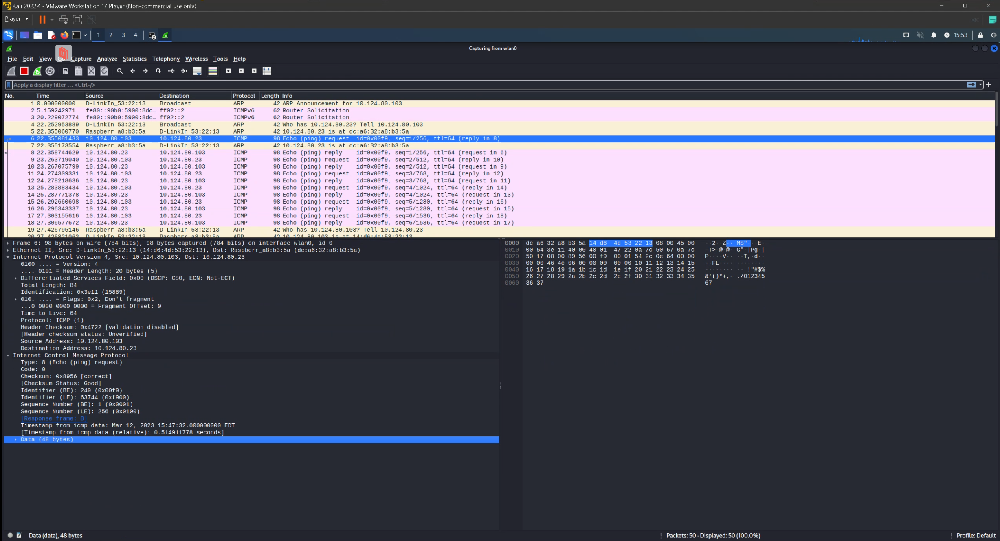
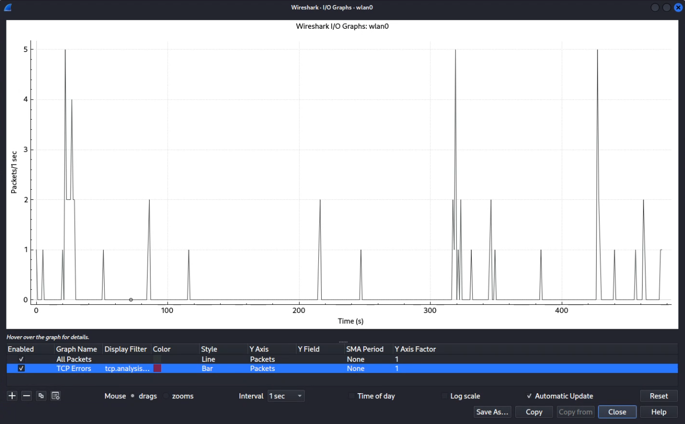
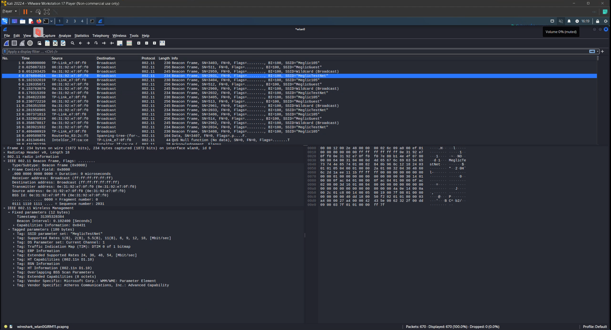

# 1. DOMAČA NALOGA

## 1.1 Zajem ICMP Echo (ping) request paketa

Vsebina paketa:

- Time to Live: 64
- Protocol: ICMP (1)
- Destination Address: 10.124.80.23
- Type: 8 (Echo (ping) request)
- Code: 0
- Timestamp: Mar 12, 2023 15:47:32 EDT

## 1.2 Zajem 802.11 Beacon Frame paketov v načinu *Monitor mode*

Vsebina paketa:

- Destination MAC address: Broadcast (ff:ff:ff:ff:ff:ff)
- Timestamp: 31395328384
- Beacon Interval: 0.102400 \[Seconds\]
- SSID: "MeglicTestNet"
- Supported Rates 1(B), 2(B), 5.5(B), 11(B), 6, 9, 12, 18 \[Mbit/sec\]
- Extended Supported Rates 24, 36, 48, 54 \[Mbit/sec\]
- Current channel: 1

