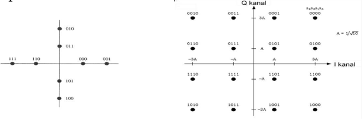
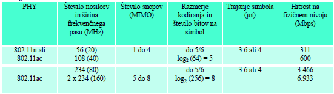

# 1. UVOD V BREZŽIČNA OMREŽJA

## Zakaj

- enostaven dostop do interneta in privatnih omrežij
- št. mobilnih naprav se zelo hitro povečuje
- št. aplikacij, ki so namenjene mobilnim napravam se prav tako hitro povečuje
- nove možnosti in izzivi, ki jih ponuja tehnologija
- možnosti neprestane povezanosti v omrežje
- tehnologija omogoča neprestano povezanost v omrežje
  - računalniki, dlančniki, telefoni, tablice
  - samostojne naprave (npr. zajemanje podatkov iz okolice, ...)

## Stanje in pričakovanja

- preko 95% vseh mikroprocesorjev je v vgrajenih aplikacijah (večinoma cenene, enostavne, prenosljive in enostavno zamenljive naprave)
- tehnologija je uporabniku skrita
  - naprava sama poišče naugodnejši način priključitve v omrežje
  - naprava sama, glede na informacije iz okolja, določa način komunikacije z uporabnikom (npr. lokacija)
- hiter napredek tehnologije
  - povečevanje moči akumulatorjev (energija/maso)
  - povečevanje procesorske moči
  - prijaznejši uporabniški vmesniki
  - povečevanje hitrosti prenosa podatkov
- mobilna omrežja
  - uporabnik (komunikacija s komerkoli, kadarkoli in kjerkoli)
  - naprava (komunikacija z drugo napravo ali omrežjem, kjerkoli in kadarkoli)
  - zahteva po integraciji fiksnih, brezžičnih in mobilnih omrežij
  - problem standardizacije na globalnem nivoju
    - fizični nivo
    - nivo aplikacije
    - AAA (authentication, authorization and accounting)

## Kje so prisotna?

- globalna omrežja
- nacionalna omrežja
- regionalna omrežja
- mestna omrežja
- hišna omrežja (lokalna omrežja)
- osebna omrežja

## Težave

- omejena energija (baterijsko napajanje, pridobivanje energije iz okolice)
- izguba podatkov/naprave (zaradi mobilnosti je večja nevarnost poškodbe, izgube ali tatvine naprave)
- *omejen uporabniški vmesnik*
- *omejen pomnilnik (tako delovni, kot tudi masovni pomnilnik)*
- pogoste motnje pri prenosu podatkov (šibek signal, interference, ...)
- težave pri uporabi določenih frekvenc v različnih državah (nacionalni predpisi)
- še vedno sorazmerno nizka hitrost prenosa podatkov v slabih pogojih (težave pri obremenjenem omrežju)
- visoke zakasnitve in "jitter"
- nižja varnost (enostavno prisluškovanje komunikacijam)
- zaradi neposredne priključitve v omrežje so naprave zelo zanimive za vdore (virusi, SMS spam, ...)
- velika ranljivost (enostavno motenje komunikacij)

## Zgodovina

- **1979**: NMT telefoni (analogni)
- **1992**: začetek postavitve specifikacij za GSM
- **1992**: začetek uporabe GSM
  - popolnoma digitalna zasnova
  - celično omrežje
  - prehajanje med celicami brez prekinitev
  - roaming v Evropi in v preko 200 drugih državah
  - omogoča glasovno komunikacijo, FAX, SMS
  - prenos podatkov 9600 bit/s
- **1998** Postavitev novih standardov, ki nadgrajujejo GSM
  - UMTS
  - Iridijum
- **2000** GSM z višjo hitrostjo prenosa podatkov
  - HSCSD do 57,6 kbit/s
  - GPRS do 50 kbit/s (paketna zasnova prenosa podatkov)
- **2003** Začetek uporabe UMTS
- **2006** HDSPA omogoča prenos večji od 3 Mbit/s
- **2008** resna uporaba spletnih brskalnikov v mobilnih omrežjih
- **2010** začetek uporabe LTE v nekaterih mestih
- **2015** preko 7 milijard naročnin celičnih brezžičnih omrežij
- **2019** uvajanje 5G

## Primeri mobilnih omrežij

- komunikacija med osebami (govor, sms, ...)
- komunikacija oseba / strežnik (npr. bančne storitve)
- komunikacija med vozili (preprečevanje trkov, pozicija, stanje na cesti, ...)
- opozarjanje v primeru naravnih nesreč (npr. opozarjanje pred cunamiji)
- vojaška omrežja

# 2. OSNOVE FIZIČNEGA NIVOJA

## Načini prenosa podatkov

- elektromagnetno valovanje
- svetloba
- ultrazvok (samo v posebnih razmerah)

## Elektromagnetni spekter

- prenos podatkov temelji na oddajanju in sprejemanju elektromagnetnih valov
- elektromagnetno valovanje (EV) lahko opišemo z valovno dolžino, oziroma frekvenco

## Prenos podatkov

- za prenos podatkov ni dovolj samo nosilna frekvenca, temveč določena pasovna širina
- pasovna širina je odvisna od hitrosti prenosa podatkov
- ker se radijski signali uporabljajo za razne namene, je potreben red pri uporabi posameznih frekvenc
- uporaba frekvenc je regulirana na državnem nivoju
- za oddajanje na posamezni frekvenci je potrebna licenca
  - radioamaterji
  - GSM, UMTS (licenco ima ponudnik storitve)
  - TV, radio
- zelo ozek frekvenčni pas je namenjen za uporabo brez licence
  - ISM (Industrial Scientific and Medical) področje
  - v tem področju je omejena oddajna moč

## Širnjenje EV

- odboji
- lomljenje
- raztros

## Brezžični prenosni kanal

- manjšanje moči signala z oddaljenostjo:
  $$P_r = P_t G_t G_R (\frac{\lambda}{4 \pi d})^2$$
  $P_r$ - moč na sprejemni strani, $P_t$ - moč na oddajni strani, $G_t$ - ojačanje oddajne antene, $G_R$ - ojačanje sprejemne antene, $d$ - oddaljenost med sprejemnikom in oddajnikom, $\lambda$ - valovna dolžina radijskega signala
- upoštevajoč slabljenje signala v realnih razmerah:
  $$P_r = P_t G_t G_R (\frac{\lambda}{4 \pi d})^2 \frac{1}{d^y}$$
  $P_r$ - moč na sprejemni strani, $P_t$ - moč na oddajni strani, $G_t$ - ojačanje oddajne antene, $G_R$ - ojačanje sprejemne antene, $d$ - oddaljenost med sprejemnikom in oddajnikom, $\lambda$ - valovna dolžina radijskega signala
- spreminjanje moči signala (fading)
  - spreminjanje je lahko posledica različnih poti sprejetega signala
  - hitre spremembe (fast fading)
  - počasne spremembe (slow fading)
- motnje, ki so posledica drugih izvorov radijskega valovanja (interference)
- Dopplerjev zamik:
  - sprememba frekvence zaradi premikanja sprejemnika ali oddajnika
  - sprememba frekvence je podana:
    $$\Delta f = \frac{\Delta v}{c} f_0$$
    $\Delta f$ - sprememba frekvence, $\Delta v$ - relativna hitrost, $f_0$ - frekvenca oddajnika, $c$ - hitrost svetlobe

## Prenos podatkov (omejitve)

- Nyquistov teorem (maksimalna kapaciteta prenosnega kanala):
  $$C = 2 B \log_2 L \text{ bit/sec}$$
- Shannonov teorem
  $$C = B \log_2(1+(S/N)) \text{ bit/sec}$$
  $C$ - maksimalna kapaciteta kanala, $B$ - širina prenosnega kanala, $L$ - število nivojev, $S/N$ - razmerje signal šum

## Analogna modulacija

- amplitudna modulacija: spreminja se amplituda signala
- frekvenčna modulacija: spreminja se frekvenca signala
- fazna modulacija: spreminja se faza signala
- značilnost sinusnega nihanja:
  $$s(t) = A(t) \sin(2 \pi f(t) + \phi(t))$$
  $a(t)$ - amplituda signala, $f(t)$ - frekvenca signala, $\phi(t)$ - faza signala
- brez modulacije: $s(t) = \sin(2 \pi f_0 t)$
- amplitudna modulacija: $s(t) = A(t) \sin(2 \pi f_0 t)$
- frekvenčna modulacija: $s(t) = \sin(2 \pi f(t)t)$
- fazna modulacija: $s(t) = \sin(2 \pi f_0 t + \phi(t))$

## Digitalna modulacija

- digitalna modulacija je poseben primer analogne modulacije, pri čemer je vhodni signal kvantiziran
- amplitudna modulacija ASK (*Amplitude Shift Keying*)
- frekvenčna modulacija FSK (*Frequency Shift Keying*)
- fazna modulacija PSK (*Phase Shift Keying*)

## Amplitudna modulacija

- za eno spremenljivko:
  $$
  s(t) = \begin{cases}
    A_C \sin(2 \pi f_C t) & \textrm{za binarno vrednost } 1 \\
    0 & \textrm{za binarno vrednost } 0
  \end{cases}
  $$
- dve spremenljivki:
  $$
  s(t) = \begin{cases}
    A_C \sin(2 \pi f_C t) & \textrm{za vrednost } 11_b \\
    \textrm{2/3} A_C \sin(2 \pi f_C t) & \textrm{za vrednost } 10_b \\
    \textrm{1/3} A_C \sin(2 \pi f_C t) & \textrm{za vrednost } 01_b \\
    0 & \textrm{za vrednost } 00_b
  \end{cases}
  $$

## Fazna modulacija

- za eno spremenljivko:
  $$
  s(t) = \begin{cases}
    A_C \sin(2 \pi f_C t + \pi) & \textrm{za binarno vrednost } 1 \\
    A_C \sin(2 \pi f_C t) & \textrm{za binarno vrednost } 0
  \end{cases}
  $$
- za dve spremenljivki:
  $$
  s(t) = \begin{cases}
    A_C \sin(2 \pi f_C t + \pi/4) & \textrm{za vrednost } 11_b \\
    A_C \sin(2 \pi f_C t + 3 \pi/4) & \textrm{za vrednost } 10_b \\
    A_C \sin(2 \pi f_C t + 5 \pi/4) & \textrm{za vrednost } 01_b \\
    A_C \sin(2 \pi f_C t + 7 \pi/4) & \textrm{za vrednost } 00_b
  \end{cases}
  $$

## Modulacija QAM

- QAM (*Quadrature Amplitude Modulation*) je kombinacija amplitude in fazne modulacije

## Hkratni dostop

- v primeru, ko imamo več naprav, je potrebno zagotoviti dostop do skupnega medija
- štirje osnovni načini za dostop (Multiplex)
  - uporaba različnih (ortogonalnih) frekvenc
  - oddajanje v različnih časovnih intervalih, ki se ne prekrivajo
  - uporaba modulacije DSSS (*Direct Sequence Spread Spectrum*)
  - naprave so prostorsko ločene in se med seboj ne motijo

## Različne frekvence

- razbitje spektra na manjše frekvenčne pasove
- pas spektra je nekemu kanalu dodeljen za cel čas
- prednosti:
  - dinamična koordinacija ni potrebna
  - deluje tudi za analogne signale
- slabosti:
  - potratnost pasovne širine v primerih, ko je promet neenakomerno porazdeljen
  - neprilagodljivost

## Različni časovni intervali

- celoten spekter je kanalu dodeljen za določen čas
- prednosti:
  - samo en nosilec v mediju v nekem trenutku
  - visoka propustnost tudi v primeru velikega števila uporabnikov
- slabosi:
  - zahteva natančno sinhronizacijo

## Časovno frekvenčno

- kombinacija časovnega in frekvenčnega multipleksiranja
- pas spektra je nekemu kanalu dodeljen za določen čas
- prednosti:
  - boljša zaščita pred prisluškovanjem
  - zaščita pred frekvenčno selektivnimi motnjami
- slabosti:
  - zahteva natančno sinhronizacijo

## Kodno multipleksiranje

- posamezen kanal ima edinstveno kodo
- vsi kanali istočasno uporabljajo isti spekter
- prednosti:
  - učinkovita raba pasovne širine
  - ni zahteve po sinhronizaciji in koordinaciji
  - dobra zaščita pred motnjami in prisluškovanjem
- slabosti:
  - uporabniki so deležni različne propustnosti
  - zahtevnejša regeneracija signala
- implementacija z uporabo DSSS (Direct-sequence spread spectrum)

## Kognitivni radio

- detekcija neizrabljenega spektra in njegovo deljenje z ostalimi ob izogibanju motnjam
- avtomatizirana izbira najboljšega prostega spektra (inteligentna oblika časovnega / frekvenčnega / prostorskega multipleksiranja)
- razlikovanje med:
  - primarnimi uporabniki: dodeljen specifičen spekter (npr. zakonsko določen)
  - sekundarnimi uporabniki: uporabniki prostega spektra
- primeri:
  - izraba (lokalno) neizrabljenega analognega TV spektra (t.i. *white space*)
  - začasna izraba nerabljenega spektra npr. pozivnikov, radioamaterskega, ...

## Modulacija OFDMA

- OFDMA (*Orthogonal Frequency-division Multiple Access*)
- modulacijo uporabljajo številni novejši standardi (802.11)
- združuje več frekvenčnih kanalov, ki so med seboj ortogonalni
- posamezen kanal uporablja QPSK modulacijo

## MIMO

- MIMO (*Multiple Input Multiple Output*)
  - več oddajnih anten
  - več sprejemnih anten
- povečamo kapaciteto prenosnega kanala
- povečamo zanesljivost (zmanjša se vpliv *fadinga*)
- manjša občutljivost na interference
- omogoča oblikovanje žarka (*beamforming*)

# 3. DOSTOP DO MEDIJA

## Dostop do skupnega medija

- naprave za komunikacijo uporabljajo skupen medij. Ena naprava oddaja, vse ostale sprejemajo oddani signal
- kot skupni medij smatramo skupno žično povezavo, uporabo istega frekvenčnega pasu itd.
- težava nastopi pri hkratnem oddajanju dveh ali več naprav
- v tem primeru sprejemnik ne more pravilno sprejeti podatkov in zato je prenos nepravilen

## Načini dostopa

- skupinski dostop delimo na:
  - dostop brez trkov
    - naprave se dogovorijo o načinu dostopa (Token ring, ...)
    - ena izmed naprav koordinira dostop do medija (GSM, ...)
  - dostop s trki
    - reševanje trkov (Tree, Windows, ...)
    - naključni dostop do medija (Aloha, Csma, ...)

## Dostopi brez trkov - dogovor

Naprave se dogovorijo o načinu dostopa:

- naprave delujejo po natančno določenem načinu, ki je lahko določen vnaprej ali pa se določi ob inicializaciji oziroma spremembi omrežja
- v tem primeru naprava oddaja samo v časovni rezini, ki ji je namenjena
- en od načinov je podajanje žetona. Naprava lahko odda paket, ko prejme žeton. Žeton nato posreduje naslednji napravi. V tem primeru mora vsaka postaja poznati svojega soseda, da so v komunikacijo vključene vse naprave
- takšna omrežja omogočajo dobro izrabo medija ter uvedbo prioritet. Slabosti so: dolg odzivni čas, rekonfiguracija omrežja pri vstopu ali izstopu naprave

## Dostopi brez trkov - koordinacija

Ena izmed naprav koordinira dostop do medija

- v tem primeru je ena izmed postaj koordinator omrežja
- ta postaja določa, katera postaja lahko oddaja v določenem trenutku in tako preprečuje oddajanje več postaj hkrati
- takšen način omogoča zelo dobro izrabo medija, zato se uporablja v mobilnih omrežjih (GSM, UMTS, LTE, ...)
- slabost je v nesimetrični komunikaciji, saj je vedno ena naprava koordinator omrežja
- težave se pojavijo pri vstopu novih naprav v omrežje

## Dostop s trki

Reševanje konfliktov (primer Windows protokol)

- naprave, ki so oddajale in pri tem zaznale trk, se razdelijo v dve skupini. Prva skupina bo v naslednjem koraku oddajala, druga grupa bo počakala, da se oddajanje zaključi. V drugo skupino spadajo tudi vse ostale naprave, ki niso oddajale
- delitev na skupine poteka s pomočjo naključnega generatorja, kjer je predstavnik skupine izbran z verjetnostjo 0,5
- če pri oddajanju ponovno pride do trka, se postopek deljenja aktivne skupine ponovi

## Naključen dostop

- najbolj razširjen algoritem za naključni dostop je ALOHA protokol oziroma njegove izpeljanke
- Aloha protokol je bil razvit leta 1970 na Havajski univerzi
- protokol oziroma njegove izvedenke se uporabljajo praktično v vseh modernih komunikacijskih protokolih, kjer je potreben dostop do skupnega medija (WiFi, GSM, UMTS, LTE). Mobilni protokoli ga uporabljajo pri vključevanju uporabnika
- obstajata dve vrsti Aloha protokola, običajni ter predalčkasti protokol (slotted Aloha)

## Aloha protokol

- primer delovanja protokola:
  - naprava pošlje paket
  - v primer, da je prišlo do napake pri prenosu, naprava počaka naključen čas ter ponovi postopek
- koordinacije med napravami ni, potreben pa je mehanizem za zaznavanje napak
- protokol je primeren za neobremenjena omrežja, kjer je verjetnost napake majhna
- primer delovanja protokola

## Predalčaksti Aloha protokol

- pri predalčkastem Aloha protokolu so naprave med seboj časovno usklajene in lahko oddajajo samo v točno določenih intervalih (predalčkih)
- pri trku se izračuna naključno število predalčkov, ki jih bo naprava preskočila
- ker je točno določen čas oddajanja, se pri trku pokvarijo samo paketi tega predalčka, zato je propustnost enkrat večja
- primer delovanja protokola:

## Propustnost

- predpostavimo, da je verjetnost generiranja $k$ okvirov v intervalu $t$ podana s Poissonovo verjetnostno porazdelitvijo:
  $$\pi_k(t) = \frac{(\lambda t)^2}{k!}e^{-\lambda}; G=\lambda t$$
- Verjetnost $n$ paketov v času $2t$, kjer je $t$ čas trajanja paketa:
  $$P_n = \frac{(2G)^n}{n!} e^{-2G}$$
- verjetnost pri $n=0$, pomeni, da ni bil poslan noben paket in da ni prišlo do trka:
  $$P_0 = e^{-2G}$$
- delež pravilno prenesenih paketov je podan z enačbo:
  $$S = GP_0 = G e^{-2G}$$
- največji delež pravilno prenesenih paketov zveznega Aloha protokola je:
  $$S_{max} = \frac{1}{2e} \approx 0,184$$
- pri predalčkastem Aloha protokolu je čas, v katerem se lahko trk zgodi enkrat krajši, to je $t$:
  $$P_0 = e^{-G}$$
- delež pravilno prenesenih paketov je podan z enačbo:
  $$S = GP_0 = Ge^{-G}$$
- največji delež pravilno prenesenih paketov predalčastega Aloha protokola je:
  $$S_{max} = \frac{1}{e} \approx 0,368$$

## Težave pri dostopu do skupnega medija

- pri dostopu do skupnega medija naletimo na težavo, kako zaznati ter se izogniti trkom na mediju
- zaznava trka mora zahtevati čim manj časa
- ko trk zaznamo, je potrebno v čim krajšem času nadaljevati z uspešnim prenosom podatkov

## Izvedenke algoritmov

- CSMA (Carrier Sense Multiple Access) – preverjanje, ali je medij prost
- CSMA/CD (CSMA with Collision Detection) – v primeru zaznave trka takojšnja prekinitev pošiljanja
- CSMA/CA (CSMA with Collision Avoidance) – pri ponovitvah je dodan naključni čas čakanja
- pri brezžičnem prenosu podatkov je težava pri zaznavi oddajanja več postaj hkrati. Zato je v fazi zaznavanja prostega medija uvedeno potrjevanje
- CSMA/CA with ACK – potrjevanje prejetega paketa
- CSMA/CA with RTS/CTS – postopek zasedanja kanala z zahtevo in potrditvijo

# 4. LOKALNA BREZŽIČNA (WLAN) IN OSEBNA BREZŽIČNA OMREŽJA (PAN)

## IEEE 802.11

### Omrežja LAN in PAN

- v določenih primerih je težko natančno razdeliti protokole v posamezne skupine
- pojavljajo se novi termini, kot so na primer BAN (*Body Area Network*)
- pojavljajo se nove zahteve (sezonska omrežja, ...)

## Pričakovanja in zahteve

## Standard IEEE 802.11

### Značilnosti IEEE 802.11

- PLME (*PHY Layer Management Entity*) - nadzor in upravljanje fizične plasti
- PMD (*Physical Medium Dependent*) – nivo, ki je povezan z medijem
- PLCP (*Physical Layer Convergence Protocol*) – prilagajanje zahtev MAC plasti fizični plasti
- SAP (*Service Access Point*) – dostopna točka med plastmi
- MLME (*MAC Layer Management Entity*) – upravljanje MAC plasti
- PLME (*PHY Layer Management Entity*) – upravljanje fizične plasti
- SME (*Station Management Entity*) – upravljanje naprave

### Arhitektura omrežja

- dva osnovna načina delovanja omrežja:
  - BSS (*Basic Service Set*) – omrežje je vodeno s strani dostopne točke
  - IBSS (*Independent Basic Service Set*) – omrežje se postavlja ad-hoc
- BBS omrežja se lahko povezujejo v večja omrežja ESS (*Extended Service Set*). V tem primeru so dostopne točke (BBS) povezane preko DS (*Distribution System*)

### Naloga naprav v omrežju

- v BBS omrežju se izvajajo naloge postaje (SS - *Station Services*)
  - osnovna naloga je prenos paketov (MSDU - *MAC Service Data Unit*)
  - poleg tega omogoča preverjanje pristnosti (*Autentication*)
- v omrežju BSS DS skrbi za prenos podatkov med napravami, ki nimajo možnosti neposrednega prenosa
- dostopne točke izvajajo naloge DSS (*Distribution System Services*), ki poleg prenašanja paketov obsegajo
  - asociacijo, deasociacijo in integracijo v omrežje

### Izogibanje trkom

- aSlotTime – velikost predalčka
- SIFS – čas med kontrolnimi sporočili (RTS, CTS)
- PIFS – čas do predalčkov (za PCF)
- DIFS – čas do predalčkov (za DCF)
- CW – (*Contention Window*) Okno iz katerega se naključno izbere število predalčkov, ki jih mora naprava počakati pred oddajo paketa
- CWmin najmanjša vrednost CW
- CWmax največja vrednost CW
- CW se podvoji pri vsaki ponovitvi
- naprava izbere naključno število $r$ iz območja ( 0-CW ), ki določa zakasnitev v številu predalčkov. Število se začne zmanjševati po času DIFS
- povečevanje okna pri ponovitvah
- naprava C je izven dosega naprave A $\rightarrow$ ker naprava C ne sprejema signala naprave A, se lahko zgodi, da bi začela oddajati med oddajanjem naprave A
- NAV – *network allocation vector*: rezevacija medija

### Upravljalski paketi

- upravljavski paketi (*management frame*) so podobni podatkovnim paketom, vendar se razlikujejo v oznaki tipa
- upravljavski paketi se tvorijo in zaključijo na MAC nivoju
- upravljavski paketi so:
  - *beacon* (periodični paketi, ki služijo predvsem za sinhronizacijo)
  - paketi za priključevanje v omrežje (*association*)
  - paketi za preverjanje pristnosti (*authentication*)
  - iskanje sosedov (*probe request/response*)

### Nadzorovan dostop

- PCF - *Point Coordinated Function*: čas, ko je omrežje upravljano z ene točke, ki se imenuje:
  - PC *Point Coordinator* ali
  - AP *Access Point*
- takšen način delovanja je v omrežju BSS
- dostopna točka pošilja pakete *beacon*
- takoj po poslanem paketu beacon zasede omrežje in nadzira delovanje omrežja. Ker v tem času ni tekmovanaj za omrežje, se ta čas imenuje CFP (*Contention Free Period*)
- celoten čas med paketi beacon (Superframe) je razdeljen na:
  - CFP (*Contention Free Period*)
  - CP (*Contention Period*)
- v času CP lahko vse naprave dostopajo do medija DCF (*Distributed Coordinated Function*)
- v času CFP nadzorna postaja PC oddaja svoje pakete in povprašuje ostale naprave po podatkih (*Poll*)
- ker je dostop nadzorovan s strani PC, v tem času ni trkov
- pozvana naprava mora v času SIFS odgovoriti na klic, sicer po času PIFS naprava nadaljuje s svojimi aktivnostmi
- naprava PC s posebnim paketom (CF-end) obvesti ostale naprave o koncu CFP periode.
- za tem se začne perioda CP, kjer naprave enakopravno dostopajo do omrežja

### Časovna sinhronizacija

- časovna sinhronizacija je potrebna:
  - za podporo fizičnem nivoju
  - za funkcije, kot je na primer vključitev v omrežje
  - za postopke, ki zmanjšujejo porabo energije
- sinhronizacija se izvaja s paketi *beacon*, ki se pošiljajo z najvišjo prioriteto
- paketi *beacon* se pošiljajo periodično in naprave prejmejo informacijo, kdaj bo poslan naslednji paket *beacon*
- v omrežju BSS dostopna točka pošilja pakete *beacon* in vse ostale naprave glede na to popravljajo svojo lokalno uro
- v omrežju IBSS vse naprave pošiljajo kontrolne pakete:
  - naprava popravlja svojo uro samo v primeru, če je čas v prejetem paketu pred lokalnim časom (lokalna ura zaostaja)
  - po končanem ciklu sinhronizacije se postaje sinhronizirajo na napravo, katere lokalni čas je bil pred časom ostalih naprav
  - naprave pošiljajo kontrolni paket neodvisno po »back off« algoritmu. Ko naprava prejme kontrolni paket, svojega ne pošlje

### Iskanje naprav

- odvisno od tipa omrežja, mora naprava poiskati dostopno točko oziroma ostale naprave, v primeru ad hoc omrežja (IBSS)
- iskanje je lahko pasivno ali aktivno
- v pasivnem načinu iskanja naprava prisluškuje posameznim kanalom in sprejema pakete *beacon*
- ti paketi poleg časa vsebujejo tudi informacije o omrežju
- v aktivnem načinu naprava pošlje paket z zahtevo (*probe frame*) ter počaka na odgovor ostalih naprav (*probe response*)
- ker gre za aktivno zahtevo, ni potrebno čakati na periodične pakete *beacon*
- lahko se zgodi, da je število postaj v aktivnem iskanju manjše (v primeru enosmerne komunikacije)

### Kakovost storitev

- kakovost storitev se lahko delno nadzoruje tudi z uporabo koordinacije prometa PCF (*Point Coordination Function*)
- težave, ki nastopijo v tem primeru so:
  - nedoločljiv čas med dvema paketoma *beacon*, ki lahko zakasni za največ 4,9 ms
  - nedoločljiv čas pošiljanja paketov postaje, ki je bila pozvana za pošiljanje paketov (poll). Najdaljši paket lahko obsega 2312 zlogov. Čas pošiljanja poketa je odvisen od modulacije
- standard IEEE 802.11e vpeljuje funkcijo hibridnega koordiantorja HCF (*Hybrid Coordination Function*) za upravljanje kvalitete storitev
- HFC določa dva načina dostopa do medija:
  - tekmovanje za dostop do medija
  - nadzorovan dostop do medija
- tekmovalni način se imenuje EDCA (Enhanced Distributed Channel Access)
- nadzorovani način dostopa je HCCA (HCF Controlled Channel Access)
- v superokviru (*superframe*) sta še vedno dva načina delovanja: CP, CFP
- EDCA način pošiljanja se lahko uporablja samo v periodi s tekmovanjem CP
- HCCA se lahko uporablja v obeh periodah, s tem, da mora v fazi CP rezervirati čas tako kot vsi ostali paketi. Rezerviran čas se imenuje CAP (*Controlled Access Phase*)
- vse naprave morajo upoševati omejitev časa zasedanja medija TXOP, ki je postavljen v paketu *beacon*
- za zagotavljanje kakovosti storitev je potrebno uvesti prioriteto pri pošiljanju paketov
- omenjene funkcionalnosti uvaja standard IEEE 802.11e
- omrežje s prioritetami se označuje s QBSS
- prioritete pri pošiljanju paketov se dosežejo s povečevanjem časa AIFS pri paketih z nižjo prioriteto
- zaradi daljšega časa lahko paketi z višjo prioriteto zasedejo prenosni kanal
- definiran je tudi čas možnosti oddajanja TXOP (transmission opportunity), ki določa najdalši čas, ko naprava lahko zaseda medij (oddaja)

### Nadzor nad porabo energije

- naprava mora dostopno točko obvestiti, da deluje v načinu majhne porabe energije
- dostopna točka hrani vse pakete (tudi s skupinskimi naslovi) do trenutka, ko je naprava pripravljena sprejeti pakete
- naprave v načinu majhne porabe energije morajo poslušati pakete *beacon*, da pridobijo parametre za sprejem paketa TIM
- dostopna točka pošlje pakete takoj, ko od naprave prejme paket PSPoll
- poleg parametra TIM se uporablja tudi parameter DTIM
- parameter DTIM se pojavi v vsakih nekaj paketov beacon
- ko se pojavi parameter DTIM, vstopna točka na poziv pošlje vse pakete, vključno s paketi s skupinskimi naslovi (*boradcast* in *multicast*). Ti paketi se ob običajnih periodah TIM ne pošiljajo

### Sobivanje IEEE 802.11 b/g

- pri sobivanju se mora napredni standard podrejati starejšim standardom
- če je v omrežju naprava, ki ne podpira novejših standardov, se morajo vse kontrolne informacije prenašati tako, da jih vse naprave lahko sprejmejo
- pomembni so vsi kontrolni paketi (beacon, RTS, CTS, ACK, ...)
- pomembno je predvsem sprejemanje paketov, ki vsebujejo podatek o zasedenosti omrežja (NAV)
- zaželeno je, da je prenosov z nizkimi hitrostmi čim manj, kar pomeni, da naprave med prenosom spreminjajo hitrost in način modulacije

### Hitrost prenosa

???

### Standard IEEE 802.11n

- nadgradnja starejših standardov IEEE 802.11 a/b/g
- omogoča večje hitrosti prenosa
- omogoča uporabo več anten (MIMO)
- izboljšan doseg (dvakrat boljši doseg v prostoru, trikrat izven prostorov)
- povečana zanesljivost prenosa podatkov
- hkrati lahko uporablja dva kanala (40 MHz)
- omogoča sobivanje s starejšimi standardi (a/b/g)

### Izboljšave na fizičnem nivoju

- uporaba več anten MIMO
  - združevanje signalov
  - prostorsko kodiranje
  - prenos z več snopi
  - usmerjanje radijskega snopa
- hkratna uporaba dveh kanalov
- krajši interval *guard*

### Združevanje sprejetih signalov

- v primeru, ko imamo več sprejemnih anten, lahko sprejete signale združujemo tako, da je združen signal močnejši. Komunikacija deluje tudi tudi v primeru, ko ima oddajnik samo eno anteno

### Prostorsko kodiranje

- prostorsko kodiranje (Space block coding) omogoča, da se pri oddajniku z dvema antenama in sprejemniku z eno anteno, poveča zanesljivost prenosa podatkov
- takšen način kodiranja zmanjšuje vpliv nihanja moči signala (fading), saj se informacija prenaša po dveh poteh
- eden izmed načinov kodiranja signala je Alamuti code
- simboli se po vsaki anteni pošiljajo v različnih zaporedjih

### Prenos z več snopi

- največji doprinos pri hitrosti prenosa podatkov v primeru več anten je prenos z več snopi. To pomeni, da v primeru dveh sprejmnih in dveh oddajnih anten, komunikacija poteka preko dveh snopov. To omogoča enkrat hitrejši prenos podatkov
- v primeru $n \times n$ ($n$ oddajnih in sprejemnih anten), je pohitritev $n$ - kratna
- standard IEEE 802.11n omogoča 4 sprejemne in oddajne antene, kar doprinese pohitritev za 4-krat
- WiFi aliance dopušča do $3 \times 3$ antene
- v primeru z MIMO so odboji dobrodošli, saj omogočajo prenos z več snopi. V primeru z eno anteno predstavljajo odboji motnje
- signali, ki do antene pridejo po različnih poteh, se seštejejo. Po ustreznem procesiranju signalov lahko iz prejetih signalov izračunamo različne snope. Rezultat je več paralelnih poti za prenos podatkov
- notacija zapisa $2 \times 3 : 2$
  - prva številka pomeni število oddajnih anten
  - druga številka pomeni število sprejemnih anten
  - tretja številka pomeni število snopov
- čeprav je število sprejemnih anten 3, je lahko število snopov kvečjemu dva (min. števila oddajnih in sprejemnih anten)
- v primeru ko je sprejemnih anten več, se le-te uporabljajo za izboljšanje sprejema signala
- Standard omogoča $4 \times 4 : 4$
- običajne konfiguracije anten so:
  - $2 \times 2 : 2$
  - $2 \times 3 : 2$
  - $3 \times 3 : 2$
  - $3 \times 3 : 3$ postaja vse bolj razširjen zaradi večjih potreb
  - $4 \times 4 : 4$ ne podpira WiFi aliance

### Usmerjanje radijskega snopa

- z uporabo več anten lahko usmerjamo radijski signal. S tem dosežemo boljši sprejem ter manjše motenje delovanja sosednjih naprav

### Boljša izraba frekvenčnega pasu

- nov standard omogoča tudi boljšo izrabo frekvenčnega pasu. Število uporabnih podatkovnih nosilcev se tako poveča iz 48 na 52. Število referenčnih nosilcev ostaja enako, to je 4

### Hkratna uporaba dveh kanalov

- standard omogoča hkratno uporabo dveh sosednjih kanalov
- na tak način se hitrost več kot podvoji
- na 2,4 GHz področju, kjer so na razpolago samo trije kanali, lahko nastopijo težave z ostalimi napravami, ki delujejo na istem frekvenčnem območju
- na 5 GHz področju je kanalov več in se takšnim težavam lažje izognemo
- pri združitvi dveh kanalov se število podatkovnih nosilcev poveča tudi na račun prostega prostora med dvema kanaloma. Število vseh nosilcev je 114, od tega je 6 referenčnih

### Krajši interval *guard*

- pri standardu IEEE 802.11 a/b/g se pri simbolu uporablja 800 ns za *guard* interval in $3,2 \mu s$ za podatkovni nosilec
- standard IEEE 802.11n omogoča zmanjšanje *guard* intervala iz 800 ns na 400 ns
- trajanje simbola se tako z $4 \mu s$ zmanjša na $3,6 \mu s$, kar pomeni povečanje hitrosti za dobrih 10 %

### Hitrost prenosa

- prejšnja tabela prikazuje hitrosti v primerih, ko je hitrost prenosa za vse snope enaka
- zaradi različnih odbojev se pogosto dogaja, da je sprejemni signal posameznega snopa šibkejši in zato se lahko modulacije snopov razlikujejo

### Izboljšave na MAC nivoju

- združevanje paketov
- skupinsko potrjevanje paketov
- zmanjševanje časa med paketi
- manjša poraba energije

### Združevanje paketov

- na MAC nivoju se lahko MAC paketi združujejo in pošiljajo kot en paket na fizičnem nivoju (frame aggregation)
- obstajata dva načina agregacije
  - ko je prejemnik več paketov isti (A-MSDU)
  - ko so prejemniki različni (A-MPDU)
- zaradi združenega pošiljanja paketov je bilo potrebno uvesti tudi nov način potrjevanja paketov
- za boljše izkoriščanje združevanja paketov je velikost paketa na fizični plasti povečana iz 4095 na 65535 zlogov

### Skupinsko potrjevanje paketov

- starejši standardi so zahtevali potrditev po vsakem prejetem paketu
- standard 802.11n uvaja skupinsko potrjevanje prejetih paketov
- takšno potrjevanje se uporablja tudi pri potrjevanju združenih paketov

### Zmanjševanje časa med paketi

- v primeru, ko ista postaja pošilja več paketov, se lahko čas med paketi zmanjša
- tako je namesto časa SIFS (Single inter-frame spacing) uvaja nov krajši čas RIFS (Reduced inter-frame spacing)
  - SIFS je $16 \mu s$
  - RIFS je $16 \mu s$
- čas RIFS se lahko uporablja samo v primeru, če pakete oddaja ista postaja in če celotno omrežje podpira takšen način delovanja

### Manjša poraba energije

- naprave, ki delujejo v načinu manjše porabe energije (Power save mode) se periodično aktivirajo in poslušajo promet
- ker uporaba več anten (MIMO) zahteva poseben postopek za pripravo na delovanje, je energijsko potratna
- zato nov standard omogoča uporabo samo ene antene v načinu majhne porabe energije
- po potrebi lahko naprava aktivira vse antene

### Periodičen prenos podatkov

- v načinu majhne porabe energije je dodan način periodičnega prenosa podatkov
- naprava se naroči na periodičen prenos podatkov
- vstopna točka v enakih intervalih pošilja podatke napravam in za tem sprejema podatke od naprav
- v predvidenih intervalih morajo naprave sprejemati podatke
- ko pride naprava v intervalu PSMP na vrsto za pošiljanje, pošlje podatke. Pošlje lahko več paketov, ki so med seboj ločeni s krajšim časom RIFS
- ko poteče daljši čas SIFS, lahko oddaja naslednja postaja
- takšen način komunikacije je še posebej primeren v primerih, ko imamo stalen tok podatkov, kot je v primeru IP telefona

### Sobivanje z ostalimi napravami

- omrežje lahko deluje v tako imenovanem načinu *greenfield*, kjer vse naprave delujejo po standardu 802.11n:
  - ta način omogoča največje hitrosti
  - omogoča uporabo dveh kanalov (40 MHz pas)
- omrežje lahko deluje v načinu, ko upošteva prisotnost naprav, ki podpirajo samo starejše standarde:
  - dostop do medija mora biti prilagojen starejšim standardom, tako da ga lahko sprejemajo vse naprave v omrežju
  - lahko zaseda dva kanala (40 MHz pas), vendar mora na obeh kanalih ustrezno pošiljati pakete za dostop oziroma rezervacijo medija (NAV vektor)

### Priključitev na dostopno točko

- osnovni pojmi:
  - association: postopek med dostopno točko in postajo, ki omogoča napravi priključitev in uporabo vstopne točke
  - reassociation: omogoča napravi prehod med dvema dostopnima točkama
  - disassociation: obvestilo o prekinitvi trenutne priključitve
  - authentication: Preverjanje pristnosti
  - deauthentication:obvestilo o prenehanju statusa pristnosti
- pred priljučitvijo v omrežje je potrebno preveriti pristnost (*Authentication*)
- naprava lahko preveri pristnost na večih dostopnih točkah, vendar je lahko priključena samo na eno
- priključitev na dostopno točko *Association*:
  - naprava pošlje zahtevo (*Associate request*) po priključitvi v omrežje
  - dostopna točka ji odgovori z ustreznim paketom(*Associate response*)
- prehod med dostopnimi točkami Reassociation:
  - naprava lahko prekine povezavo z eno dostopno točko in se priključi na drugo
  - omenjen postopek je potreben, ko je naprava mobilna in se premika iz območja ene dostopne točke v območje druge dostopne točke
  - naprava pošlje zahtevo (reassociation request) novi dostopni točki
  - dostopna točka odgovori (reassociation response)
  - nova dostopna točka pošlje paket (disassociation frame) stari dostopni točki
- stanje pri priključevanju v omrežje:

### Standard 802.11ac

- standard je bil potrjen januarja 2014 in se počasi širi
- nadgradnja obstoječih standardov (b/g/n)
- deluje samo na frekvenčnem področju 5 GHz
- omogoča velike hitrosti prenosa
- omogoča sobivanje s starejšimi standardi

### Prednosti standarda 802.11ac

- omogoča sobivanje s standardom 802.11n in 802.11a
- večja pasovna širina (do 160 MHz)
- sobivanje je omogočeno tudi pri uporabi širokega frekvenčnega pasu (160 MHz)
- večje število snopov (do 8)
- zmogljivejša modulacija (256 QAM)
- v standardu je opredeljeno generiranje snopa (beam forming)
- generiranje več snopov naenkrat (Multiuser MIMO)

### Primerjava na fizičnem nivoju

- primerjava značilnosti standarda 802.11n in 802.11ac na fizičnem nivoju: pri standardu 802.11n se uporabljajo največ trije snopi (WiFi alliance), čeprav standard dopušča 4 snope
  

### Primerjava hitrosti delovanja

### Energijska učinkovitost

- energijska učinkovitost prenosa podatkov se meri v bitih na mikro Joul

### Načini modulacije

### MIMO

- pri komunikaciji z enim uporabnikom

- pri komunikaciji z več uporabniki (MU-MIMO) - omogoča delitev snopov na uporabnike

- generiranje snopa pri več uporabnikih

- prostorska delitev uporabnikov

### 802.11ac zahteve

### Standard 802.11ax

- naslednik standarda 802.11ac
- deluje v področjih 2,4 in 5 GHz
- kompatibilen s starejšimi standardi 802.11a/b/g/n/ac
- po uvedbi standarda 802.11n leta 2007 spet uvaja velike spremembe v načinu delovanja
- omogoča:
  - 4x višjo povprečno hitrost v primerjavi s standardom 802.11ac
  - modulacijo 1024-QAM (MSC 10 in 11)
  - OFDMA tehnologijo (Orthogonal Frequency Division Multiple Access)
  - MU-MIMO (Multi User MIMO) v obe strani
  - večjo robustnost na odprtem prostoru
  - optimiziran je za uporabo na področjih z veliko gostoto uporabnikov
  - boljšo izrabo frekvenčnega pasu
  - učinkovitejše upravljanje s porabo energije

### Primerjava

### OFDMA

- OFDMA - Orthogonal frequency-division multiple access
- poleg časovnega multipleksa se uvaja še frekvenčni multipleks
- vstopna točka skrbi za frekvenčno in časovno sinhronizacijo odjemalcev
- istočasna souporaba skupnega frekvenčnega pasu se lahko izvaja v obe smeri
- frekvenčno časovni prostor je razdeljen na predalčke (RU – resource unit)
- RU je lahko velik: 26, 52, 106, 242, 484, ali 996 podnosilcev
- število RU glede na pasovno širino:
  

### Naključni dostop

- klasičen naključni način dostopa do medija (802.11 CSMA/CA) je neučinkovit za velike hitrosti
- uvaja se *Random Trigger Frame* (TF-R)
- vstopna točka začne proceduro s TF, kjer določi, kateri RU se lahko v tem ciklu uporabijo za naključni dostop
- po končanem ciklu vstopna točka potrdi pravilno prejete pakete

### "Barvanje"

- odjemalci nastavljajo oddajno moč glede na podatke vstopne točke
- šibek signal odjemalca iz drugega BSS-ja je lahko signal, da naprava ne sme oddajati
- uvaja se barvanje BSS-jev in s tem ima odjemalec informacijo, ali je paket iz njegovega BSS-ja ali tujega

### Nizka poraba energije

- odjemalec se z dostopno točko dogovori, kdaj bo potekala komunikacija
- čas je opredeljen kot TWT (Target Wake Time)
- na takšen način se lahko uporablja daljše čase neaktivnosti odjemalca kot pri standardu 802.11n
- uveden je način, ko dogovor z vstopno točko ni potreben. V tem primeru vstopna točka odda „beackon“, v katerem je ustrezna informacija o TWT elementu

### Wi-Fi direct

- ni IEEE standard
- Wi-FI direct je tehnična specifikacija WiFi Alliance
- imenuje se tudi "Wi-Fi Peer-to-Peer (P2P) Specification"
- omogoča povezavo točka - točka ali točka več točk
- naprava, ki ponuja storitve, je običajno GO (Gropu owner)
- GO deluje kot vstopna točka
- GO se odziva na pakete probe request s SIDD=DIRECT-
- GO odgovor vsebuje
  - SSID=DIRECT-koda_naprave
  - ime naprave
  - način prijave (WPS, ...)
  - dodatne podatke o povezavi
- iskanje servisov (service discovery):
  - Bonjur
  - UPnP
  - WS-discovery
- lahko omogoča majhno porabo energije
- nad tem protokolom deluje Miracast

### WiFi alliance

- neprofitno združenje proizvajalcev opreme
- skrbi, da naprave različnih proizvajalcev brez težav komunicirajo med sabo
- ima preko 600 članov po vsem svetu
- skrbi za ustrezno implementacijo standarda
- predlaga rešitve pri implementaciji
- izvaja testiranje ustreznosti implementacije vseh protokolov, ki jih naprava omogoča

# 5. PRIKLJUČEVANJE V OMREŽJE

## Načini priključevanja v omrežje

- način priključevanja v omrežje je odvisen tudi od tipa omrežja:
  - v ad-hoc omrežjih so vse postaje med seboj enakopravne in priključevanje ne povzroča težav. Priključevanje v omrežje je omejeno na napravo
  - v omrežjih s koordinatorjem mora postaja, ki še ni pripadnik omrežja, svojo namero sporočiti koordinatorju, ki vodi celoten postopek priključevanja
- običajno se pri vključevanju v omrežje izvede:
  - preverjanje pristnosti (authentication)
  - določitev pravic (authorization)
  - določitev načina obračunavanja (accounting)
- omenjene aktivnosti se označujejo z AAA (authentication, authorization and accounting) in se široko uporabljajo v računalniških sistemih

## Šifriranje podatkov

- ker je prisluškovanje v brezžičnih omrežjih zelo enostavno, je tudi zloraba nezaščitenih omrežij precej enostavna
- omrežje lahko deluje v dveh načinih:
  - promet v omrežju ni šifriran
  - promet v omrežju je šifriran, zato je zloraba podatkov zelo otežena
- pri šifriranem prometu se pojavijo naslednje težave:
  - potrebno je določiti ključe za šifriranje
  - če so ključi prešibki, obstaja velika možnost zlorabe omrežja
  - v primeru različnih ključev za uporabnike istega omrežja se pojavijo težave pri skupinskem prometu (broadcast, multicast)
- kako poteka šifriranje prometa?
  - za šifriranje se uporablja psevdo-naključni generator
  - takšno naključno zaporedje se po modulu dva sešteje s podatki, kar daje šifrirano sporočilo
  - če šifrirano sporočilo še enkrat po modulu dva seštejmo z istim naključnim zaporedjem, dobimo osnovno sporočilo

## Psevdo-naključno zaporedje

- psevdo-naključni generator je algoritem, ki tvori zaporedje, ki se sicer ponavlja, vendar je perioda zelo velika (npr. Mersenne Twister ima periodo 219937 - 1, RC4 reda 10500)
- seme (seed) določa začetek zaporedja
- pri enakem semenu daje generator enako zaporedje
- če imata sprejemnik in oddajnik enako seme, lahko tvorita enako psevdo-naključno zaporedje ter ga uporabita za šifriranje in dešifriranje podatkov

## AES

- AES (Advanced Encryption Standard) je najbolj pogosto uporabljen način šifriranja v modernih sistemih
- pomembni koraki:
  - AddRoundKey – xor operacija - vhodna matrika se po modulu dva sešteje z matriko ključa
  - SubBytes – zamenjava zlogov na osnovi preslikovalne (look up) tabele - posamezni zlog se zamenja z uporabo preslikovalne tabele (*look up table*)
  - ShiftRows – premikanje stolpcev - premikanje posameznih elementov matrike
  - MixColumns – iz štirih elementov stolpca izračuna nove štiri elemente - transformacija stolpcev matrike

## EBC način šifriranja

## CBC način šifriranja

## PCBC način šifriranja

## Težave pri šifriranju sporočil

- pri kratkih geslih lahko uporabimo napade s poskušanjem
- če se geslo uporablja neposredno za generiranje ključa (semena) je možnost zlorabe velika, zaradi velikega števila paketov, ki so šifrirani z istim geslom (npr. WEP)
- če vse postaje uporabljajo isto geslo, lahko prisluškujejo prometu ostalih postaj (npr. WEP)
- pri različnih geslih nastane težava pri skupinskih sporočilih (broadcast)
- v večjih omrežjih nastane težava pri delu z gesli (password management)

## Povečanje varnosti

- varnost se bistveno poveča, če glavnega gesla (master key) ne uporabljamo za neposredno šifriranje prometa, ampak samo za preverjanje pristnosti ter za izdelavo začasnih ključev
- glavno geslo se uporablja za izdelavno začasnega ključa (temporal key), ki služi za šifriranje prometa (npr. WPA2):
  - število paketov šifriranih z začasnim ključem je omejeno
  - v primeru razbitja začasnega ključa lahko dešifriramo samo del prometa, nikakor pa to ne vodi do razbitja glavnega ključa
  - število paketov v omrežju, ki so neposredno odvisni od glavnega ključa je zelo majhno (samo določanje začasnega ključa)

## Načini priključevanja

- odprta prijava (brez gesla)
  - Zahteva samo SSID
  - identifikacija je samo MAC naslov
  - promet se ne šifrira
- Priključevanje z geslom
  - WEP
  - WPA
  - WPA2
- WPA in WPA2 podpirata način, kjer je geslo na vstopni točki in avtentikacijo preko strežnika

## WEP

- del specifikacije 802.11
- ključi dolžine 40/104 bitov
- inicializacijski vektor dolžine 24 bitov
- uporablja RC4 šifrirni algoritem
- poglavitna težava je uporaba glavnega ključa za šifriranje podatkov
- prijava:
  - v fazi prijave pošlje AP nešifrirano sporočilo STA
  - STA odgovori z šifriranim sporočilom, ki vsebuje prejeto sporočilo
  - AP odšifrira sporočilo in če je prejeto sporočilo enako poslanemu sporočilu, potrdi prijavo v omrežje
- oblika paketa:
  - v WEP paketu je še glava dolžine 4 bytov, v kateri se nahaja IV ter 4 bytna CRC koda
- pomanjkljivosti:
  - poglavitne pomanjkljivosti WEP šifriranja:
    - inicializacijski vektor (IV) je dolg samo 24 bitov
      - isti psevdo-naključni niz se ponovi po 16.777.216 okvirjih
      - vse naprave pri istem IV uporabljajo enak psevdo-naključni niz
      - zaradi ponovitev psevdo-naključnih nizov se lahko uporabljajo različne metode napadov
  - koda CRC-32 se lahko enostavno zlorabi za pravilno kodo pri lažnem sporočilu, tako je ogrožena integriteta sporočila

## Prehod na nove protokole

- pri prehodu na nove protokole je poglavitna težava v stari strojni opremi, ki le-teh ne podpira
- šifriranje je časovno potrata operacija, zato je v omrežnih karticah izvedeno v strojni opremi
- WPA uporablja isti šifrirni postope kot WEP, kar je omogočilo uporabo obstoječe strojne opreme

## RSN - Robust Security Network

- standard 802.11i uvaja naslednje izboljšave:
  - postopek dela s šifrirnimi ključi
  - štiri-kratno rokovanje (4-Way Handshake) in skupinski ključ (group-key handshake)
  - izboljšani mehanizmi za preverjane pristnosti
    - predhodno dodeljen ključ
    - postopek z uporabo strežnika za preverjanje pristnosti (IEEE 802.1x/EAP)
  - izboljšani mehanizmi ščitenje podatkov (CCMP, TKIP)

## Šifrirni ključi

- glavni ključ (master key MK)
  - Ključ je na STA in AS ali AP, če se AS ne uporablja
  - nikoli ne zapusti naprave
- obojestranski glavni ključ (Pairwise Master Key)
  - izpeljan iz MK in se uporablja za izdelavo začasnega ključa
- obojestranski začasni ključ (Pairwise Transient Key) iz katerega se izpeljejo:
  - key Confirmation Key (KCK) – potrjevanje pri izmenjavi ključev
  - key Encryption Key (KEK) – za distribucijo Group Transient Key (GTK)
  - temporal Key (TK) – šifriranje podatkov

## Načini delovanja

- preverjanje lahko deluje na dva načina
  - uporaba strežnika npr. radius (AS - authentication server)
  - brez uporabe strežnika. Dodeljena glavna ključa sta enaka na STA in AP
- drugi način se uporablja v domačem okolju in manjših omrežjih. Obojestranski glavni ključ (Pairwise Master Key) se izvede iz dodeljenih ključev PSK (pre-shared key)

## Faze priključevanja

- priključevanje v omrežje obsega naslednje faze:
  - iskanje (Discovery)
  - preverjanje pristnosti (Authentication)
  - upravljanje ključev (Key Management)
  - prenos podatkov

## Iskanje zmožnosti naprave

- išče naprave, ki so kandidati za komunikacijo
  - vstopna točka oznanja preko paketa beacon
  - preko zahteve *probe request*
- vstopna točka oznanja možnosti varnega priključevanja
  - načine preverjana pristnosti
  - načine šifriranja
  - načine šifriranja skupnega prometa
- naprava izbere izmed ponujenih možnosti

## Preverjanje pristnosti

- preverjanje pristnosti (802.1X)
  - centralni strežnik za upravljanje z gesli (AS)
  - medsebojno preverjanje pristnosti med STA in AS
  - generira se obojestranski glavni ključ (Pairwise Master Key)

## 4-kratno rokovanje

- obe postaji poznata PMK
- obe postaji izbereta naključni števili (ANonce, SNonce)
- izmenjata si obe številki in izpeljeta začasni ključ PTK
- inicializirata začetek komunikacije

## Dostava skupinskega ključa

- dostavi se skupinski ključ, ki se uporablja pri šifriranju skupinskih paketov
  - broadcast
  - multicast
- skupinski ključ je za vse naprave, ki so priključene na AP enak

## WPA

- WPA je nadgradnja protokola WEP, kjer se lahko uporablja isto strojno opremo
- uveden je postopek TKIP - Temporal Key Integrity Protocol, ki odpravlja pomanjkljivosti protokola WEP:
  - uvaja MIC - Message Integrity Code
  - zaporedna številka paketa ni več javna
  - WEP ključ pri uporabi obstoječe opreme je vedno drugačen
  - uporaba začasnih ključev

## TKIP - prednosti

- odpravlja slabosti protokola WEP
  - pretvori začasni ključ in zaporedno številko paketa v WEP ključ in IV
  - uporaba začasnih ključev:
    - različni ključi se uporabljajo za različne naprave v omrežju
    - ključ se zamenja na vsakih 65,536 okvirjev
    - glede na WEP protokol je vedno drug ključ in IV
- zagotavlja pravilen vrstni red okvirjev
  - uporablja 48 bitov za zaporedno številko okvirja
  - sprejemnik zavrže pakete, ki niso v zaporedju
- zagotavlja integriteto sporočila z uvedbo 64-bitne MIC kode

## WPA2

- WPA2 je nadgradnja protokola WPA, ki uvaja večjo varnost:
  - Counter Mode with CBC-MAC (CCMP)
  - šifrirani podatki in MIC
  - preverjanje pristnosti glave (ali je bila spremenjena)
  - AES šifrirni algoritem

## Vrste EAP protokolov

- EAP-TLS obojestransko preverjanje pristnosti, ki temelji na standardu X.509 (privzeto pri 802.11i)
- EAP-TLSS/PEAP tunelirani TLS, ne zahteva uporabniških certifikatov
- PEAP preverjanje pristnosti preko tunela, podoben EAP-TLSS
- EAP-GTC uporablja gesla za enkratno uporaboEAP-FAST oba imata enak ključ, preverjanje preko varnega tunela, podobnost z VPN

## WPA3

- WPA3 je nadgradnja protokola WPA2, ki je bil vpeljan leta 2004
- WPA3 je *Wi-Fi Alliance* najavila januarja 2018
- WPA3 uvaja:
  - večjo varnost
  - šifriranje prometa pri odprtem dostopu
  - enostavno priključevanje naprav brez prikazovalnikov
- ne omogoča uporabe starih tehnologij, kot na primer WEP, TKIP, ...
- izboljšave protokola EAP
- uvaja nove tehnologije:
  - WPA-PSK se zamenja s SAE
  - PMF je vedno vključen
  - opcijsko uvaja 192-bitne ključe

## WPA3 – brez strežnika (osebni)

- uvaja se SAE (Simultaneous Authentication of Equals), ki se je že uporabljal pri IEEE802.11s (Mesh)
- geslo se nikoli ne prenaša preko omrežja. Uporablja se "*Zero knowledge proof*"
- glavni ključ "*Master key*" ne temelji več na geslu
- samo ena možnost preverjanja v postopku priključevanja v omrežje

## WPA3 Dragonfly Handshake

- WPA3 uvaja nov način štirikratnega rokovanja, ki se imenuje *Dragonfly Handshake* ali *Simultaneous Authentication of Equals (SAE)*
- bistvo tega protokola je Zero knowledge proof, pri čemer obe napravi preverita ali poznata geslo in se ne prenaša nobena informacija, razen te, da poznata geslo

## WPA3 – s strežnikom

- zahteva se uporaba PMF: *WPA2 - Enterprise + Protected Management Frames (PMF)*
- opcijsko se lahko uporablja 192-bitni ključ:
  - 192-bitni ključ pri EAP-TLS načinu
- 192-bitni način zahteva da RADIUS strežnik in odjemalec podpirata EAP-TLS z 192-bitnim delovanjem

## Odprt dostop

- omogoča uporabo šifriranja brez interakcije uporabnika (podobno kot HTTPS)
- uporablja izmenjavo ključev po načinu *Diffie-Hellman Key Exchange*
- podpira samo AES način šifriranja

## Enostavno priključevanje

- naprava IoT ima na embalaži natisnjeno enolično QR kodo, ki vsebuje javni ključ in kanal (*WiFi channel*), na kateri naprava (IoT) deluje
- QR koda se prebere z mobilno napravo
- ob vklopu IoT naprave se vzpostavi komunikacija
- z javnim ključem se mobilna naprava priključi na IoT napravo in vzpostavi varen kanal
- prenesejo se vsi potrebni parametri za priklop na vstopno točko

# 6. OMREŽJE GSM

## GSM

- kratica za *Global System for Mobile Communications* in je zbirka priporočil in specifikacij za celično omrežje
  - priporočila omogočajo delovanje naprav različnih proizvajalcev in tudi prehajanje uporabnikov med različnimi operaterji (*roaming*)
- omrežje je popolnoma digitalno
- je skladno z digitalnim telefonskim omrežjem ISDN (*Integrated Services Digital Network*)
- omrežje GSM temelji na celičnem omrežju
- področje, ki ga pokriva GSM omrežje je razdeljeno v *celice*; jedro vsake celice je *bazna* postaja
- mobilna naprava v celici komunicira z bazno postajo preko radijskih valov
- vsaka bazna postaja lahko prejme oziroma odda klic za vsako napravo, ki je v njenem dosegu
- omrežje GSM uporablja različni frekvenci za sprejem in oddajo
- vsako področje (sprejemno in oddajno) je razdeljeno na več kanalov

## Prednosti

- v primerjavi z analognimi sistemi omogoča večje število uporabnikov
- zelo učinkovita izraba frekvenčnega prostora (samo 25 kHz na uporabnika)
- v primerjavi z analognim signalom je digitalni signal neprimerno manj občutljiv na motnje
- ker je manj občutljiv na motnje, lahko ena bazna postaja pokriva večje področje
- z uvajanjem digitalnega prenosa zvoka se je kvaliteta le-tega povečala
- pri prenosu digitalnega signala se lahko uporabljajo metode za odkrivanje in popravljanje napak
- v primeru interferenc z drugimi signali je, v primerjavi z analognim signalom, neprimerno bolj robusten
- omrežje GSM omogoča visoko stopnjo zasebnosti v omrežju
- vsak uporabnik se mora v omrežje ustrezno prijaviti
- vsa komunikacija, ki poteka preko radijskih valov, je kodirana
- mobilna naprava se identificira ločeno od uporabnika, kar omogoča gradnjo baze ukradenih naprav
- vsi podatki o uporabniku se hranijo na SIM kartici; na kartici je shranjen tudi ključ za šifriranje, ki kartice nikoli ne zapusti
- omrežje omogoča enostavno prehajanje mobilne naprave med baznimi postajami
- vsaka naprava meri jakost signala baznih postaj in glede na jakost signala se odloči za menjavo bazne postaje
- poleg prenosa govora, omogoča še kratka sporočila, prenos fax sporočil, prenos podatkov (2,4 kb/s, 4,8 kb/s in 9,6 kb/s)
- omogoča dodatne funkcionalnosti kot so: preusmeritev klica, obveščanje o klicu, ...

## Frekvenčna področja

- omrežje GSM uporablja različne frekvence za sprejem in oddajo
- frekvenčno področje je razdeljeno na kanale, ki so široki 200 kHz
- osnovno področje obsega frekvence med 890-915 MHz in 935-960 MHz, to je 124 različnih kanalov; sprejemni in oddajna frekvenci sta med seboj razmaknjeni za 45 MHz
- razširjeno EGSM področje obsega frekvence med 880-890 MHz in 925-935 MHz, to je dodatnih 50 kanalov
- področje DCS1800 obsega frekvenčni področji 1710,2–1784,8 MHz in 1805,2–1879,8 MHz ima 373 kanalov. Sprejemni in oddajna frekvenci sta med seboj razmaknjeni za 95 MHz

## Izraba frekvenčnega pasu

- na osnovnem GSM področju je na razpolago 124 kanalov
- vsak kanal ima 8 časovnih predalčkov, od tega se jih 7 lahko uporablja za prenos informacij
- tako dobimo največ $124 \cdot 7 = 868$ vzporednih telefonskih zvez
- ker število vzporednih zvez ni dovolj veliko, je potrebno iste frekvence uporabljati na geografsko ločenih področjih
- z uporabo istih frekvenc se področje razdeli na celice, kar privede do celičnih omrežij

## Fizična plast

- frekvenčno področje je razdeljeno na več paralelnih kanalov
- GSM ima dva ločena kanala za prenos od omrežja proti mobilni napravi in obratno
- na vsakem frekvenčnem kanalu se uporablja časovni multipleks (time division multipleks), ki kanal razdeli na osem enakih predalčkov
- trajanje enega predalčka je $577 \mu s$
- trajanje osmih predalčkov, ki se potem ponavljajo, je 4,615 ms
- če združujemo vse predalčke z isto številko, dobimo osem logičnih kanalov, ki tvorijo *multiframe*
- *multiframe* za prenos podatkov je dolg 26 okvirjev, za prenos kontrolnih sporočil pa 51 okvirjev
- ker se uporablja časovni multipleks, lahko v različnih predalčkih oddajajo različne mobilne naprave, zato je potrebna natančna časovna sinhronizacija
- sistem korigira oddajane s 6 biti, kar omogoča 63 nivojev časovne korekcije. Vsak nivo časovne korekcije je ekvivalenten zakasnitvi enega bita na fizičnem nivoju
- ker je potrebno upoštevati čas od bazne postaje do mobilne postaje in nazaj, je kompenzacija zakasnitve (TA timing advance) v eni smeri 31,5 bita, kar znese okoli $113 \mu s$
- omenjena zakasnitev določa maksimalno razdaljo med bazno postajo in mobilno postajo, ki znese 35 km. Bazna postaja tako lahko pokriva krog s premerom 70 km
- naprave lahko spreminjajo oddajno moč glede na kvaliteto prejetega signala
- kontrola oddajne moči je razdeljena v 16 nivojev, kjer vsak nivo pomeni 2 dBm
- v primeru mobilne postaje in razreda moči 4, se moč lahko spreminja od nivoja 0 (33 dBm = 2W) do nivoja 15 (3 dBm = 2,0 mW)

## Tipi paketov

- v enem časovnem oknu (predalčku), ki je dolg $577 \mu s$, se lahko prenaša pet različnih tipov paketov:
  - *Normal paket*: podatkovni paket (podatki/zvok), ki prenaša 114 bitov informacije
  - *Dummy paket*: ima enako zgradbo, kot podatkovni paket, vendar ne prenaša informacije. Služi za zapolnitev praznih predalčkov na strani bazne postaje
  - *Access paket*: paket za prijavo v omrežje
  - *Synchronization paket*: omogoča mobilni napravi sinhronizacijo v omrežje
  - *Frequency correction paket*: služi za popravek frekvence mobilne naprave

## Multiframe

- fizični kanal je razdeljen na osem logičnih kanalov (TS-0 do TS-7)
- prva dva logična kanala sta običajno rezervirana za kontrolna sporočila
- po ostalih logičnih kanalih poteka podatkovni promet
- podatki posameznega kanala tvorijo *multiframe*
- podatkovni *multiframe* združuje 26 okvirjev
- kontrolni *multiframe* je dolg 51 okvirje
- celotna slika zgradbe *hyperfame*, ki ga sestavljajo *superframe* in navzdol *multiframe*

## Signalizacija

- signalizacija je razdeljena v tri skupine:
  - BCH (Broadcast Channel) – je enosmerni kanal (proti mobilni napravi), preko katerega bazna postaja obvešča vse mobilne naprave
  - CCCH (Common Control Channel) – kanal za skupne informacije
  - DCCH (Dedicated Channels) – kanali, ki so rezervirani za posameznega uporabnika

### BCH (Broadcast Channel)

- BCCH (Broadcast Control Channel)
  - pošilja se proti mobilni napravi
  - vsebuje značilnosti omrežja (konfiguracijo radijskega dela) in tudi značilnosti sosednjih omrežij
  - neaktivne naprave (*idle*) ga morajo sprejemati vsaj enkrat na 30 sek
  - pošilja se v časovnem okviru 0 BCH kanala
- SCH (Synchronisation Channel)
  - pošilja se proti mobilni napravi
  - prenaša informacije za sinhronizacijo. Vsebuje številko okvira TDMA in informacijo o BTS
- FCCH (Frequency Correction Channel)
  - pošilja se proti mobilni napravi
  - uporablja se za časovno sinhronizacijo (zaradi različne oddaljenosti mobilnih naprav od bazne postaje, premikanja mobilne naprave)
  - omogoča lažje lociranje kanala BCCH

### CCCH (Common Control Channel)

- RACH (Random Access Channel)
  - vedno v smeri proti bazni postaji
  - ko mobilna naprava želi vzpostaviti komunikacijo, pošlje ta paket
  - paket se pošlje v naključno izbranem okvirju, ki je rezerviran za RACH
  - če pride do trka z drugo mobilno napravo, ni odgovora na zahtevo, zato se paket po naključnem času čakanja ponovno pošlje
- AGCH (Access Grant Channel)
  - pošilja se proti mobilni napravi
  - omrežje dodeli mobilni napravi okvirje, v katerih lahko oddaja (SDCCH ali TCH)
- PCH (Paging Channel)
  - pošilja se proti mobilni napravi
  - omrežje ga uporablja za vzpostavljanje povezave proti uporabniku
- NCH (Notification Channel)
  - informacije o skupinskih zvezah

### DCCH (Dedicated Channels)

- SDCCH (Standalone Dedicated Control Channel)
  - dvosmerni kanal (komunikacija točka-točka)
  - uporablja se v primeru, ko še ni vzpostavljene povezave
  - uporablja se za vzpostavitev zveze, SMS sporočila in osveževanje informacije o lokaciji
- SACCH (Slow Associated Control Channel)
  - uporablja se za korekcijo radijskega dela pri aktivni povezavi
  - omrežje pošilja kontrolne informacije
  - mobilna naprava vrača informacije o meritvah radijskega signala
- FACCH (Fast Associated Control Channel)
  - dvosmerna povezava v primeru aktivne povezave (TCH)
  - uporablja se za koordinacijo menjave bazne postaje
  - pošilja se namesto podatkovnih paketov (»krade« čas podatkovnim paketom)

## Prenos govora

- govor se digitalno procesira in opiše s tremi vrstami parametrov (260 bitov):
  - parametri za filter govornega trakta (36 bitov)
  - parametri za filter periode (36 bitov)
  - kodiranje ostalega signala (188 bitov)
- za potrebe prenosa se 260 bitov razdeli v tri skupine, glede na pomembnost informacij:
  - class Ia: zelo pomembne informacije, dodatne ščitene s CRC kodo (50 bitov)
  - class Ib: pomembne informacije za reprodukcijo glasu (132 bitov)
  - class II: manj pomembne informacije, ki služijo za boljšo reprodukcijo glasu (78 bitov)
- prva in druga skupina podatkov se dodatno opremi z redundančnimi biti (konvolucijski kodirnik)
- skupaj je dolžina govornega paketa 456 bitov, kar se prenese v 4 fizičnih paketih po 114 bitov
- čas med dvema paketoma je 20 ms
- na fizičnem nivoju se perioda 20 ms doseže z dodatnimi paketi v *multiframe*, ki ne prenašajo informacije (12. in 25. paket)
- podatkovni paketi (114 bitov) se pred oddajo kodirajo z algoritmom A8

## Slika omrežja

- omrežje sestavljajo:
  - BSS (Base Station Subsystem)
    - BTS (Base Transciver Station)
    - BSC (Base Station Controller)
    - TRAU (Transcoder and Rate Adaptation Unit)
  - MSC Area
    - MSC (Mobile Switching Center)
    - VLR (Visited Location Register)
  - HLR (Home Location Register)
  - EIR (Equipment Identity Register)
- posebno vlogo v omrežju ima Gateway MSC, ki je priključen v javno omrežje PSTN

## SIM kartica

- na SIM kartici so zapisane vse informacije o uporabniku:
  - IMSI (International Mobile Subscribers Identity ) identifikacijska številka uporabnika, ki se prenaša po omrežju samo pri inicializaciji
  - MSISDN (Mobile Station International Standard Data Number ) telefonska številka uporabnika
  - TMSI (Temporary Mobile Subscriber Identity ) začasna identifikacijska številka uporabnika, ki se občasno menja
  - LAI (Location Area Identity ) koda trenutne lokacije uporabnika
  - Ki (Subscribers Authentication Key ) šifrirni ključ uporabnika
- kartica je lahko zaščitena s pin kodo in lahko hrani dodatne informacije

## BTS (Base Transceiver Station)

- gradnik GSM omrežja, katerega naloga je radijska povezava z mobilno napravo
- omogoča do 16 kanalov (TX/RX)
- vsak kanal je deljen med 7 uporabnikov
- glede na vrsto uporabe je lahko postavljen kot: macrocell, microcell, omni, sectored, itd.
- z BSC je povezan z žično ali mikrovalovno povezavo

## BSC (Base Station Controller)

- BSC nadzira delovanje BSS (Base Station Subsystem), ki lahko obsega več deset BTS
- opravlja večino nalog povezanih z mobilno napravo in tako razbremeni MSC (Mobile Switching Center)
- glavne naloge:
  - prenašanje zvez med različnimi BTS
  - nadzor MAHO (protokol za prehod med BTS)
  - nadzor oddajne moči (tako bazne kot mobilne naprave)
  - sinhronizacija (Clock distribution)
  - nadzor in upravljanje

## MSC (Mobile Switching Center)

- skrbi za povezavo zemeljskega omrežja z GSM omrežjem
- običajno deluje kot ISDN telefonska centrala z dodatnimi funkcionalnostmi mobilnega omrežja
- GSM omrežje lahko ima več kot en MSC center
- en MSC vrši funkcijo komunikacije z javnim omrežjem – GMSC (Gateway MSC)
- vsi klici izven omrežja potekajo preko GMSC

## Registry HLR/VLR

- HLR (Home Location Register)
  - na logičnem nivoju je v omrežju samo en HLR
  - vsi podatki, ki so vezani na uporabnika:
    - IMSI
    - naročniško razmerje
    - dodatne storitve, ki jih uporabnik lahko koristi
    - trenutna lokacija mobilne naprave
  - običajno predstavlja sestavni del MSC
- VLR (Visitor Location Register)
  - začasni podatki o uporabniku, za potrebe gostiteljskega MSC
  - običajno je na MSC samo en VLR
  - poglavitna naloga je zmanjšati število poizvedb v HLR

## AUC (Authentication center)

- center za preverjanje pristnosti uporabnika
- je del HLR
- omogoča šifriranje podatkov:
  - A5/1 USA + Europe
  - A5/2 COCOM seznam držav
  - ni šifriranja v ostalih državah

## Prenos zveze

- prenos zveze se izvrši zaradi zagotavljanja kakovosti povezave ali zaradi ustrezne porazdelitve prometa
- postopek za prenos zveze je izveden v mobilni napravi, BSS in MSC
- meritve signala gostiteljske bazne postaje in okoliških baznih se izvajajo v mobilni napravi in prenašajo na bazno postajo
- obstajajo štiri načini prenosa zveze:
  - Intra-Cell Handover sprememba kanala v okviru iste BTS
  - Intra-BSC Handover sprememba kanala, pri čemer se zamenja BTS, vendar v okviru iste BSC
  - Inter-BSC Handover sprememba kanala, pri čemer se zamenja BTS, vendar v okviru iste MSC
  - Inter-MSC Handover sprememba kanala, pri čemer se zamenja tudi MSC področje

## GSM na letalih

- na letalih se postavi bazna postaja, ki pokriva področje letala
- ta bazna postaja moti ostale kanale, da ne bi prišlo do nenadzorovane povezave mobilne naprave z zunanjo bazno postajo
- bazna postaja na letalu nadzira vse mobilne naprave na letalu
- bazna postaja na letalu je z zunanjim omrežjem povezana preko satelitske povezave

# 7. OMREŽJE GPRS

## Pregled tehnologij

- GSM – osnova je prenos zvoka, omogoča pa tudi komutirano podatkovno zvezo do 14,4 kb/s
- HSCSD (High-Speed Circuit-Switched Data) – omogoča združevanje več časovnih rezin pri GSM. Z združitvijo 4 časovnih rezin imamo na voljo hitrost 57,6 kb/s. Uporabljal se je zelo malo
- **GPRS** (General Packet Radio Service) – omogoča realne hitrosti do 85,6 kb/s
- **EDGE** (Enhanced Data rates for Global Evolution) – nadgrajeni GPRS, ki omogoča realne hitrosti do 230 kb/s

## Značilnosti

- GPRS (General Packet Radio Service) je nadgradnja sistema GSM in uvaja paketni prenos podatkov
- prednosti omrežja GPRS:
  - krajši čas dostopa do omrežja
  - ni potreben poseg v obstoječo strojno opremo (BTS/BSC)
  - podpira terminale, ki omogočajo prenos zvoka in podatkov ali samo podatkov
  - večja hitrost prenosa
  - obračunavanje stroškov glede na količino prenesenih podatkov
- uporablja isti fizični kanal kot omrežje GSM, razlika je samo na logičnem nivoju
- rezervacija prostora za prenos podatkov je dinamična in se prilagaja potrebam po prenosu podatkov
- prilagajanje je ločeno za smer proti uporabniku in obratno
- ne zahteva stalno rezerviranih kanalov in se lahko prilagaja prenosu zvoka
- omogoča nepretrgano povezanost naprave v računalniško omrežje

## Komutirana povezava

- komutirana povezava:
  - zveza se postavlja od začetka do konca, kar pomeni, da so za čas trajanje zveze rezervirane prenosne poti na celotni poti
  - zagotovljena je konstantna hitrost prenosa podatkov za celotno trajanje povezave
  - zato ni težav s preobremenjenostjo prenosnih poti, ko je le-ta vzpostavljena
  - zakasnitev podatkov po takšni povezavi je konstanta
  - daljša pot samo poveča zakasnitev
  - idealna je za aplikacije, ki so občutljive na spreminjanje zakasnitev (jitter). Npr. prenos zvoka, slike, itd.
  - ni potrebna dodatna informacija za usmerjanje paketov

## Paketni prenos podatkov

- paketni prenos podatkov:
  - paketi se pošiljajo samo v primeru, ko so podatki na voljo
  - ko naprava paketov ne pošilja, lahko kanal uporablja druga naprava
  - paketi morajo biti opremljeni z informacijami za usmerjanje
  - zelo težko je zagotavljati kvaliteto storitve (čas potovanja paketa skozi omrežje, izgube paketov)
  - dobra izraba skupnega medija
  - zelo primeren za aplikacije, ki naključno dostopajo do medija (dostop od interneta, elektronska pošta, itd.)
- prednosti omrežja GPRS:
- z dinamično alokacijo prenosnega kanala je teoretična hitrost prenosa do 170 kb/s. Naprave običajno uporabljajo razred 10, ki omogoča hitrosti do 80kb/s
- z zmogljivejšim načinom modulacije (EDGE for GPRS = EGPRS) je v razredu 10 možno doseči 230 kb/s
- GPRS omogoča obračun stroškov glede na količino prenesenih podatkov. Uporabniki ne plačajo časa vzpostavljene podatkovne zveze kadar po njej ne poteka prenos podatkov
- omogoča hitro vzpostavitev podatkovne zveze (pod 5 sekund)
- v primeru prekinitev (npr. vožnja skozi predor) se zveza ne prekine
- omogoča prehajanje med baznimi postajami (roaming)

## Arhitektura omrežja

- omrežje GPRS je nadgradnja omrežja GSM
- pri tem so potrebni minimalni posegi v obstoječe omrežje
- omrežji uporabljata isti radijski del (BTS) in kontrolni del za radijske zveze (BSC)
- v kontrolnem delu (BSC) se ločita omrežji GSM in GPRS

## Elementi omrežja

- SGSN - Serving GPRS Supporting Node
- GGSN – Gateway GPRS Supporting Node
- VLR – Visitor Location Register
- HLR – Home Location Register
- PDN – Packet Data Network
- PLMN – Public Land Mobile Network
- PCU - Packet Control Unit (med BSC in SGSN; na sliki ni prikazan)

### Element omrežja SGSN

- naloge SGSN (Serving GPRS Supporting Node) so:
  - opravlja preverjanje pristnosti uporabnika (avtentikacija)
  - logičen priklop in odklop mobilne naprave
  - skrbi za dostavo podatkovnih paketov do in od mobilne naprave
  - v VLR osvežuje informacijo o lokaciji vseh uporabnikov, ki so nanj priključeni

### Element omrežja GGSN

- naloge (GGSN – Gateway GPRS Supporting Node) so:
  - služi za povezavo z zunanjim omrežjem, npr. internetom
  - GPRS pakete preko protokola PDP (Packet Data Protocol) pošilja drugim modulom GGSN
  - prihajajoče pakete pošilja ustreznim modulom SGSN

### Elementi omrežja PCU

- dodeljevanje predalčkov za podatkovne pakete (PDTCH) v radijskem delu v obe smeri
- kontrola pretoka v obe smeri in upoštevanje prioritet
- odkrivanje napak in ponovno pošiljanje napačno poslanih paketov
- klicanje uporabnika (Subscriber paging)
- preverjanje zakasnitev pri prejetih paketih

## Usmerjanje podatkov

- mobilna naprava se preko protokola GPRS lahko poveže v privatno omrežje (intranet) ali javno omrežje (internet)
- tok podatkov se vedno vrši preko *domače* GGSN, kar pomeni, da ima mobilna naprava ne glede na fizično lokacijo IP številko svojega ponudnika
- takšen pristop poenostavi:
  - usmerjanje podatkovnega prometa
  - dodeljevanje IP številk
  - premikanje mobilne postaje med baznimi postajami (roaming)

## Menjava bazne postaje

- menjavo bazne postaje sproži mobilna naprava
- pri menjavi bazne postaje se prestavi virtualni kanal do domače GGSN

## Kvaliteta storitev

- kvaliteta storitev se ocenjuje glede na zakasnitev ter napake
- največja zakasnitev mora veljati za 95 % prometa. Zakasnitev se meri od mobilne naprave do vstopa v drugo omrežje (internet ali intranet)
- kvaliteta storitev se ocenjuje tudi glede na verjetnost napak

## Razredi mobilnih naprav

- GPRS podpira tri vrste terminalov
  - razred A: hkraten prenos podatkov (GPRS) in zvoka (GSM)
  - razred B: spremlja delovanje obeh omrežij (GPRS in GSM), vendar ne more hkrati prenašati podatkov in zvoka
  - razred C: omogoča samo storitve GPRS (vgrajene naprave, prenosni računalniki, itd.)
- razred A se ne uporablja, ker za delovanje potrebuje podvojen radijski del
- običajno element GPRS omrežja SGSN in element omrežja GPS MSC nista povezana. Standard povezavo omogoča, vendar se redko uporablja
- ker ni povezave med sistemoma, je težava pri vzpostavitvi klica v primeru, da naprava prenaša podatke
- običajno omrežje GSM počaka, da se podatki prenehajo prenašati in preko običajnih mehanizmov opozori uporabnika

## Stanja mobilne naprave

- mobilna naprava je lahko v enem od treh stanj:
  - *idle* – naprava s strani podatkovnega prometa ni dosegljiva. Po proceduri GPRS *attach* preide v stanje pripravljenosti (*Ready*)
  - *standbay* – naprava je v stanju pripravljenosti ter je dosegljiva, vendar nima dodeljenega aktivnega kanala
  - *ready* – naprava je aktivna ter vrši se prenos podatkov v obe smeri

## Zgradba *multiframe*

Pri prenosu podatkov je multiframe sestavljen iz 52 TDMA okvirjev, od tega je 48 podatkovnih.

## Kodiranje podatkov

Podatki se razdelijo na manjše dele, opremijo z glavo ter podatki za odpravo napak. Tako opremljeni podatki se pošiljajo v 4 okvirjih na fizičnem nivoju.

## Hitrosti prenosa

- največja hitrost prenosa je odvisna od načina kodiranja. Naprava izbere način kodiranja podatkov na osnovi meritve kvalitete signala. Tabela velja za en logični kanal
- GPRS lahko pri prenosu združuje več logičnih kanalov. Naprave so zaradi oddajne moči omejene na največ 4 oddajne logične kanale
- naprave običajno podpirajo najvišjo hitrost pri razredu 10
- razred 10 omogoča največ 4 sprejemne in največ 2 oddajna logična kanala na terminalu, pri čemer je največja vsota kanalov 5
- največja hitrost prenosa podatkov pri razredu 10 je 85,6 kb/s

## Rezervacija prostora

- GPRS je paketni prenos podatkov
- v multiframe paketu se dinamično dodeljujejo po 4 okvirji skupaj
- v multiframe paketu so lahko okvirji različnih naprav
- dodeljevanje je odvisno od prometa
- za zmanjšanje časa zakasnitve se običajno vsi okvirji naprav sprostijo z zakasnitvijo. Na tak način se poveča hitrost, npr. potrjevanja paketov

## Sobivanje GPRS in GSM

- GPRS in GSM skupaj uporabljata kanale za signalizacijo
- ostale kanale si delita, vendar je posamezen kanal vedno pod kontrolo samo enega protokola
- praktično gre za dva neodvisna sistema, ki uporabljata skupni radijski del

## Standard EDGE

- standard EDGE omogoča pohitritev prenosa podatkov pri:
  - GPRS, kar imenujemo Enhanced GPRS (EGPRS)
  - HSCSD, kar imenujemo Enhanced Circuit Switched Data (ECSD)
- standard uvaja 8-PSK način modulacije, kar pomeni tri bite na simbol. To pomeni približno trikrat višjo hitrost prenosa

## Protokol WAP

- težave pri mobilnih aplikacijah na mobilnih napravah:
  - zakasnitev podatkovnih paketov
  - velika varianca časa zakasnitve podatkovnih paketov
  - omejena hitrost prenosa podatkov
  - visoka cena prenosa podatkov, predvsem izven domačega omrežja
  - majhen ekran
- zaradi omenjenih težav običajen format opisa spletnih strani (HTTP) ter način prenosa podatkov (TCP) ne dosegata ustreznih zmogljivosti
- protokol WAP je optimiziran na zgoraj navedene težave mobilnih omrežij
- protokol WAP upošteva naslednje omejitve mobilnih komunikacij:
  - omejena pasovna širina kanala
  - omejena procesorska moč mobilne naprave
  - zanesljivost prenosnega kanala
- WAP uporablja lasten opisni jezik WML (Wireless Markup Language)
- poglavitna razlika je v tem, da so uvedene kartice, ki opisujejo ekransko sliko. Pri prenosu se običajno prenese več kartic
- pri prenosu preko mobilne omrežja se uporablja protokol UDP, ki ne zahteva potrjevanja paketov

## Protokol MMS

- protokol MMS je nadgradnja sporočilnega sistema SMS in omogoča uporabo multimedijskih sporočil
- SMS sporočila se prenašajo preko posebnih kanalov v omrežju GSM
- MMS sporočila se prenašajo preko protokola IP in uporabljajo sistem, ki je podoben elektronski pošti
- samo sporočilo o prejetem MMS sporočilu se pošlje kot SMS, ki vsebuje URL naslov MMS sporočila

## Zakasnitev

- eden izmed pomembnih parametrov pri ocenjevanju učinkovitosti omrežja je čas, ki mine od poslane zahteve do prejetega odgovora (RTD - round trip delay)
- ocenjen čas dostopa do spletne strani
  - zahteva DNS (prenosni kanal še ni odprt): 750ms
  - vzpostavitev TCP povezave: 550 ms
  - zakasnitev zahteva/odgovor: 1200ms
- skupna ocenjena zakasnitev dostopa do spletne strani: 2800 ms = 2,8 s
- nekateri spletni brskalniki omogočajo pošiljanje skupinskih zahtev in tako zmanjšajo zakasnitev

# 8. OMREŽJE UMTS

## Standard UMTS

- UMTS (Universal Mobile Telecommunications System) je sistem mobilne telefonije tretje generacije
- začetek postavljanja standarda sega v leto 1990, kar je deset let po razvoju GSM standarda
- UMTS združuje komutirane zveze za prenos govora in paketne povezave za prenos podatkov
- radijski del je bil izdelan na novo in uporablja tehnologijo WCDMA (wideband code division multiple access)

## Različice standarda

- UMTS različice je standardiziral 3GPP (3rd Generation Partnership Project)
- različice so poimenovane po letnicah izdaje:
  - verzija 99 (1999)
  - verzija 4 (2004)
  - verzija 5 (2005)
  - verzija 6 (2006)
  - verzija 7 (2007)

## Frekvenčno področje

- za potrebe omrežja UMTS je bil v Evropi in Aziji določeno novo frekvenčno območje:
  - 12 kanalov s širino 5 MHz v območju od 1920 MHz do 1980 MHz v smeri proti uporabniku
  - 12 kanalov s širino 5 MHz v območju od 2110 MHz do 2170 MHz v obratni smeri
- v Severni Ameriki za potrebe UMTS niso rezervirali posebnega frekvenčnega pasu. Za UMTS uporabljajo isto frekvenčno območje kot za GSM

## Verzija 99

- prva verzija UMTS, ki prinaša popolnoma prenovljen radijski del, ki se imenuje UTRAN (UMTS terrestrial radio access network)
- uporablja WCDMA (wideband code division multiple access) tehnologijo kodrianja
- omogoča hitrosti do 384 kb/s proti mobilni napravi in do 64–128 kb/s v obratni smeri

### Arhitektura omrežja

- UMTS verzija 99 je nadgradnja omrežja GSM.
- uvaja nov radijski del in s tem modula Node-B in RNC (radio network controller)
- v smislu novih funkcionalnosti je bila posodobljena programska oprema obstoječih modulov
- zaradi novih funkcionalnosti je bil nadgrajen modul HLR.
- zadgrajena je bila obstoječa oprema za paketni prenos podatkov GPRS
- ker UMTS verzija 99 uporablja večino modulov GSM, je implementacija prehajanje med omrežjema pri prenosu govora GSM in UMTS dokaj enostavna
- zaradi različnih hitrosti, ki jih ponujata omrežji GSM in UMTS, menjava omrežij pri podatkovnem prenosu ni brez motenj
- pri prenosu podatkov v omrežju se še vedno uporabljajo E1 povezave, ki so bile projektirane za prenos zvoka

## Verzija 4

- uvaja se omrežje BICN (bearer independent core network), ki je neodvisno od nosilca
- tako se za prenos zvoka, namesto MSC, uporablja Media gateway, ki za prenos uporablja tehnologijo IP
- za potrebe signalizacije se še vedno uporablja MSC (SS7)
- pomembna novost v primerjavi z verzijo 99 je zamenjava E1 povezav z ATM povezavami

## Verzija 5

- pomembna prednost je uvajanje tehnologije IP od začetka do konca (mobilna naprava – mobilna naprava)
- uvaja se IMS (IP multimedia subsystem ), ki ga sestavlja CSCF (call session control function ) in MGCF (media gateway control function)
- IMS nadomešča MSC, ki tako ni več potreben
- CSCF je v osnovi SIP (session initiation protocol), ki se uporablja v IP telefoniji in je nadgrajen za potrebe mobilne telefonije
- CSCF poleg nadzora govornega kanala nadzira tudi video zveze (video call)
- MGCF je potreben samo v primeru, ko je klic preusmerjen v starejše ali fiksno (PSTN) omrežje
- omrežje omogoča tudi prehajanje med baznimi postajami brez prekinitev za podatkovni promet

### HSDPA

- HSDPA (High Speed Downlink Packet Access) omogoča bistveno višje hitrosti prenosa podatkov:
  - od 1.4 do 3.6 Mb/s proti uporabniku, v primeru slabega sprejema je možno doseči 800 kb/s
  - izpopolnjeni terminali lahko omogočajo hitrosti tudi do 14 Mb/s
  - hitrost prenosa proti bazni postaji ostaja enaka
  - s povečanjem hitrosti prenosa se lahko zmanjša število baznih postaj

## Verzija 6 - HSUPA

- pri HSUPA (High Speed Uplink Packet Access ) se poveča hitrost prenosa podatkov proti bazni postaji
  - teoretično omogoča hitrosti nekaj Mb/s proti bazni postaji
  - realna hitrost prenosa proti bazni postaj se giblje okoli 800 kb/s

## Novi koncepti

- bistvena novost je način komunikacije v radijskem delu
- GSM je zaradi optimizacije radijskega dela imel določene kanale na fizičnem nivoju
- UMTS uvaja ločitev fizičnega in logičnega nivoja.
- s tem načinom se poenostavlja komunikacija in dopušča enostavnejšo nadgradnjo fizičnega nivoja
- uvaja se radijski nosilec RAB (Radio Access Bearer )
- višji nivoji se tako ne ukvarjajo z radijskim delom, temveč samo določijo lastnosti le-tega:
  - razred storitve (govor, tok podatkov, interaktivni razred ter razred v ozadju)
  - največjo hitrost
  - zagotovljeno hitrost
  - zakasnitev
  - verjetnost napake
- ločuje plast dostopa od plasti, ki ni odvisna od dostopa

## CDMA

- CDMA (Code Division Multiple Access) način modulacije uvaja enostavno spreminjanje hitrosti prenosa podatkov
- omogoča enostavno prehajanje med baznimi postajami
- bazne postaje lahko uporabljajo isto frekvenco
- uvajanje nove bazne postaje ne zahteva nove frekvence, temveč samo usklajevanje izhodne moči sosednjih baznih postaj
- pomembna prednost je majhna zakasnitev pri prenosu podatkov
- vse mobilne naprave oddajajo na isti frekvenci, ločijo se le po kodi oddajanja
- bitna hitrost na fizičnem nivoju (chips) je bistveno večja od bitne hitrosti prenosa podatkov. Tako je vsak podatkovni bit prenesen kot zaporedje bitov, ki se imenujejo chips
- kode so določene z zaporedjem chipsov, ki morajo biti med seboj ortogonalni. Ortogonalnost pomeni, da pri množenju različnih zaporedij dobimo nič
- paziti je potrebno, da je moč signala mobilnih naprav pri sprejemu (bazni postaji) približno enaka

## OVSF

- OVSF (orthogonal variable spreading factor) so kode različnih dolžin, ki so med seboj ortogonalne
- pri UMTS je hitrost prenosa chipsov konstantna in znaša 3.84 Mb/s
- dolžina kode (število chips na bit) določa hitrost prenosa podatkov (bit na sekundo)
- s spreminjanjem dolžine kode se spreminja hitrost prenosa podatkov

## Generiranje signala

- podatki, ki se kodirajo z OVSF kodo, se za tem kodirajo še z dodatno kodo
- proti mobilni napravi:
  - spreading:
    - omogoča naslavljanje posameznih naprav
    - omogoča določanje različnih hitrosti za posameznega uporabnika
  - scrambling:
    - omogoča ločevanje baznih postaj med seboj
    - zagotavlja enakomerno zasedenost spektra
- proti bazni postaji:
  - spreading:
    - omogoča določanje različnih hitrosti za posameznega uporabnika
  - scrambling:
    - zagotavlja enakomerno zasedenost spektra
    - omogoča ločevanje uporabnikov
    - časovna sinhronizacija zaradi oddaljenosti naprave ni potrebna
    - omogoča enostavno prehajanje mobilnih naprav med baznimi postajami (soft handover)

## Vpliv moči signala

- za učinkovito delovanje mora biti jakost sprejetega signala mobilnih naprav pri sprejemu (bazni postaji) približno enaka
- zato se jakost mobilnih naprav stalno popravlja (1500-krat na sekundo)
- če želi mobilna naprava oddajati z višjo hitrostjo, mora imeti boljše razmerje signal/šum, zato mora povečati oddajno moč. To lahko vpliva na ostale naprave, ki prav tako povečajo oddajno moč
- če se želi mobilna naprava, ki je na robu dosegljivosti, vključiti v omrežje, mora oddajati z največjo oddajno močjo
- ker se ostalim napravam poslabša sprejem (povečanje šuma), povečajo svojo oddajno moč, kar pomeni, da bi morala tudi naprava na robu dosegljivosti povečati oddajno moč
- ker naprava na robu dosegljivosti ne more povečati izhodne moči, se ji povezava prekine
- zgoraj opisani fenomen, je poznan kot dihanje omrežja, saj se omrežje veča in manjša

## Prednosti radijskega dela

- poglavitna pomanjkljivost radijskega dela pri GSM (EDGE) je velika zakasnitev
- pri UMTS je komunikacijski kanal vedno odprt
- kontrolni in podatkovni promet sta združena v istem kanalu
- hitrost komunikacijskega kanala se prilagaja zahtevam uporabnika
- hitrost se spreminja z dodelitvijo nove kode (spreading factor)
- če uporabnik dolgo časa ni aktiven, se kanal lahko zapre, saj se tako prihrani na energiji
- pri prehodu med omrežji ne prihaja do izpada povezave, kot je to pri EDGE
- pri UMTS je največja hitrost prenosa podatkov proti uporabniku 384 kb/s in 64 ali 128 kb/s v nasprotni smeri
- UMTS omogoča komutirano povezavo hitrosti 64 kb/s, kar je primerno tudi za videotelefonijo
- če se moč signala na sprejemniku zmanjša, omrežje zmanjša hitrost in tako ohrani komunikacijo

## Prenosni kanali

- UMTS deli kanale glede na nivo:
  - logični nivo
  - transportni nivo
    - razdeli paket na manjše dele (10, 20, 40 ali 80 ms)
    - določi način kodiranja za odkrivanje in popravljanje napak
    - usklajevanje fizične in logične hitrosti
  - fizični nivo
    - zadolžen je za prenos paketov na fizičnem nivoju
- delitev na nivoje poenostavi ločitev med radijskim in nadzornim delom
- logični kanali:
  - BCCH (broadcast control channel): spremljajo ga vsi uporabniki v stanju neaktivnosti, saj se po njem prenašajo informacije o omrežju
  - PCCH (paging control channel): uporablja se za obveščanje uporabnikov o zahtevi po povezavi (govorni klic, SMS, ...)
  - CCCH (common control channel): dvosmerni kontrolni kanal (npr. uporabnik želi vzpostaviti povezavo)
  - CTCH (common traffic channel): skupni kanal za informiranje uporabnikov (npr. o posebni ponudbi omrežja)
  - DCCH (dedicated control channel): kontrolni kanal, ki je namenjen samo enemu terminalu
  - DTCH (dedicated traffic channel): kanal za prenos podatkov
- transportni kanali:
  - BCH (broadcast channel): transportni del za BCCH
  - PCH (paging channel): transportni del za PCCH
  - FACH (forward access channel): skupen kanal, preko katerega omrežje obvešča terminale
  - DCH (dedicated channel): dvosmeren uporabniški kanal
  - DSCH (downlink shared channel): prenos podatkov po deljenem kanalu
  - RACH (random access channel): kanal, preko katerega terminal obvesti omrežje o svoji zahtevi, ko je v neaktivnem stanju
- fizični kanali:
  - P-CCPCH (primary common control physical channel): primarni kanal za pošiljanje informacij o omrežju (konstantna hitrost prenosa podatkov 30 kb/s)
  - S-CCPCH (secondary common control physical channel): sekundarni kanal, po katerem se lahko prenaša vrsta različnih informacij, zato se hitrost kanala spreminja
  - PRACH (physical random access channel): kanal za naključni dostop do omrežja
  - DPDCH (dedicated physical data channel): uporabniški podatkovni kanal
  - DPCCH (dedicated physical control channel): uporabniški kontrolni kanal
  - PDSCH (physical downlink shared channels): deljen kanal

## Iskanje bazne postaje

- ob vklopu terminala mora le-ta poiskati ter se sinhronizirati v omrežje:
  - sprejema signal na P-SCH kanalu, ki je za vse bazne postaje enak. Izbere najmočnejši signal
  - začne sprejemati na S-SCH kanalu, kjer se oddaja 15 paketov z različnimi vzorci (chips). Možnih je 64 kombinacij
  - za določitev osnovne kode začne sprejemati CPICH kanal, kjer poizkuša dekodirati z 8 kodami. Ko najde pravo, lahko začne sprejem na kanalu PCCPCH
  - število možnih kod je 256 (64 x 8)

## Začetna komunikacija

- začetek komunikacije se lahko začne:
  - ob obnovitvi informacije o lokaciji
  - ob vzpostavitvi klica s strani uporabnika
  - ob odgovoru na poziv omrežja (paging message)
  - ob vzpostavitvi podatkovnega kanala
  - b začetku oddajanja po daljši neaktivnosti
- ko se naprava prvič, ali po daljšem času neaktivnosti, želi priklopiti v omrežje, še nima podatka o oddajni moči
- če bi oddajala z največjo močjo, bi motila ostale naprave.
- začne oddajati z manjšo močjo in čaka na odgovor. Če odgovora ne prejme, postopoma povečuje oddajno moč
- ko ji bazna postaja odgovori, se lahko začne komunikacija

## Značilnosti RACH

- Aloha algoritem na skupnem kanalu (slotted aloha)
- bazna postaja ne nadzira moči oddajnika terminala
- čas dostopa je odvisen od kakovosti sprejema in je lahko med 5 in 50 ms, povprečno pa 15 ms
- čas dostopa se poveča v primeru kolizij

## Status naprave

- naprava je lahko v različnih načinih:
  - ni priklopljena v omrežje (Idle)
  - je priklopljena v omrežje in lahko kadarkoli začne z oddajanjem (Cell-Fach, Cell-DCH)
  - je priklopljena, vendar je potreben klic naprave (Cell-PCH, URAPCH)
- ni priklopljena v omrežje (Idle):
  - naprava nima vzpostavljene povezave
  - naprava ima odprt podatkovni kanal, vendar se je zaradi daljše neaktivnosti zaprl radijski kanal. Ko se sproži nova zahteva po podatkovni komunikaciji, mora naprava preiti v način Cell-DCH ali Cell-FACH
- način Cell-DCH (obvezen)
  - vzpostavljena je povezava in vzpostavljeni so kanali na fizičnem nivoju. Naprava ima zagotovljen prenos podatkov
- način Cell-FACH (obvezen)
  - uporablja se pri prenosu manjše količine podatkov
  - za prenos podatkov se uporablja skupni kanal
- način Cell-PCH in URA-PCH (opcijski)
  - podobna sta načinu Idle, z razliko, da je logična povezava še vedno vzpostavljena
  - v načinu Cell-PCH je naprava klicana samo v okviru ene celice. Naprava mora omrežje obvestiti o menjavi celice
  - način URA-PCH je podoben Cell-PCH z razliko, da deluje na nivoju regije ULTRAN (UTRAN registration area – paging channel)

## Mobilnost terminalov

- mobilnost terminalov je razdeljena na dva nivoja:
  - mobilnost, ki jo nadzoruje jedro omrežja
    - MM (mobility management) za govorno omrežje skrbi naprava MSC
    - PMM (packet mobility management) za paketno omrežje skrbi SGSN
  - mobilnost, ki jo nadzoruje radijski del omrežja (RNC)
- na takšen način jedru omrežja ni potrebno nadzorovati natančne lokacije posameznega terminala
- MM (mobility management) za govorno omrežje:
  - MM detached: naprava ni priklopljena v omrežje
  - MM idle: naprava je priklopljena v omrežje in lahko kadarkoli vzpostavi povezavo. Lokacija naprave je poznana
  - MM connected: naprava ima vzpostavljeno povezavo
- PMM (packet mobility management) za paketno omrežje:
  - PMM detached: naprava ni priklopljena v omrežje
  - PMM connected: naprava je priklopljena v omrežje (SGSN lahko kadarkoli pošlje podatke napravi). Odvisno od QoS je naprava lahko v načinu Cell-DCH, Cell-FACH, Cell-PCH ali URA-PCH
  - PMM idle: naprava je priključena v omrežje, vendar ni aktivne signalizacije. SGSN mora najprej vzpostaviti povezavo in nato lahko pošlje podatke

## Prehajanje med postajami

- težave pri prehodu med UMTS in GSM:
  - ker GSM radijski del terminala ni aktiven, terminal nima informacij o kvaliteti GSM signala
  - lahko se izvede "slep" preklop, kjer terminal preklopi na GSM brez informacij o jakosti signala
  - nekateri terminali omogočajo kratkotrajno prekinitev UMTS povezave z namenom merjenja jakosti GSM signala

## Zmogljivost UMTS omrežja

Zmogljivost UMTS omrežja (različica 99) je zelo odvisna od nastavitev. Nastavitve predvsem vplivajo na hitrost prehajanja med stanji terminala (Idle, Cell-DCH, Cell-FACH, Cell-PCH in URA-PCH), saj operaterji ne podpirajo vseh stanj. Razlika v odzivnosti omrežja je lahko tudi faktor 2.

## Zakasnitev

- eden izmed pomembnih parametrov pri ocenjevanju učinkovitosti omrežja je čas od poslane zahteve do prejetega odgovora (RTD - round trip delay)
- ocenjen čas dostopa do spletne strani je 610 ms:
  - zahteva DNS (prenosni kanal še ni odprt): 200 ms
  - vzpostavitev TCP povezave: 160 ms
  - zakasnitev zahteva/odgovor: 250 ms
- ocenjena vrednost za EDGE je bila 2,8 s

## High-Speed Downlink Packet Access (HSDPA)

- glavna prednost HSDPA je hitrost prenosa, ki omogoča prenosne hitrosti v smeri uporabnika med 500 kb/s in 3,6 Mb/s na uporabnika. Standard predvideva hitrosti do 14,4 Mb/s
- uvedena je 16QAM modulacija
- uvedeno je hitro potrjevanje paketov
- krajši paketi (običajno 10 ms, opcijsko 2 ms)

## Prenosni kanali

- logični kanali:
  - HS-DSCH (high-speed downlink shared channels): skupen hitri kanal za prenos podatkov proti terminalom
  - DPCCH (dedicated physical control channel): poseben fizični kanal v smeri proti omrežju, ki služi za prenos kontrolnih sporočil, kot npr. potrjevanje paketov
  - DCCH (dedicated control channel): poseben kontrolni kanal med RNC in terminalom
  - DTCH (dedicated traffic channel): podatkovni kanal v smeri proti omrežju

## Potrjevanje paketov

- ker so paketi IP omrežja veliki (do 1,5 kB), lahko napaka na prenosnem nivoju, kjer so paketi zelo kratki, povzroči ponovitev celega paketa (npr.TCP)
- zato je na najnižjem nivoju uvedeno hitro potrjevanje paketov (HARQ - Hybrid ARQ)
- potrjuje se vsak paket in v primeru napake, se pošiljanje ponovi

## Zmogljivost omrežja

- HSDPA omogoča modulacijo 16QAM, ki omogoča enkrat hitrejši prenos podatkov v primerjavi s QPSK modulacijo
- v odvisnosti od jakosti signala lahko omrežje izbira ugodnejšo modulacijo
- poleg vrste modulacije se lahko spreminja še dolžina kode in število paralelnih kanalov HS-DSCH na uporabnika
- terminal neprestano pošilja informacijo o kvaliteti kanala (CQI - channel quality index), kar omogoča ustrezne nastavitve omrežja
- pri petih paralelnih kanalih in modulaciji 16QAM je hitrost prenosa 3,6 Mb/s
- v primeru manj ugodne modulacije QPSK hitrost pade na 900 kb/s
- na hitrost prenos med drugim vpliva:
  - kvaliteta signala
  - število aktivnih HSDPA uporabnikov v celici
  - število govornih in video povezav v celici
  - interferenca sosednjih omrežij
  - kategorija terminala
  - hitrost povezave med Node-B in RNC

## High-Speed Uplink Packet Access (HSUPA)

- glavna prednost HSUPA je povečanje hitrosti v smeri od terminala proti omrežju
- teoretična zgornja meja je 5,8 Mb/s
- realna hitrost prenosa podatkov je okoli 800 kb/s
- uvaja poseben kanal v smeri omrežja, ki izboljša delovanje v primeru aplikacij, ki nimajo konstantne hitrosti prenosa podatkov (E-DCH enhanced dedicated channel)
- več nalog za prenos podatkov se prenese na Node-B
- v HSUPA načinu lahko terminal oddaja z največjo močjo, pri čemer ostali terminali ne smejo oddajati. V naslednjem trenutku oddaja drugi terminal, itd. Tako se dosežejo velike prenosne hitrosti
- obstajata dva načina komunikacije:
  - način, kjer omrežje določa, kdaj lahko terminal oddaja. V tem načinu ni zagotovljene minimalne hitrosti prenosa za vsakega uporabnika
  - način (Non-scheduled transmissions NST), kjer je zagotovljena minimalna hitrost prenosa brez predhodne najave. Ta način zmanjša število kontrolnih paketov in posredno zakasnitev

## Prenosni kanali

- logični kanali:
  - E-DCH (enhanced-DCH): nov kanal za prenos podatkov v smeri omrežja
  - HS-DSCH (high-speed downlink shared channels): skupen hitri kanal za prenos podatkov proti terminalom
  - DPCCH (dedicated physical control channel): poseben fizični kanal v obeh smereh, ki služi za prenos kontrolnih sporočil
  - E-HICH (enhanced HARQ information channel): poseben kanal za hitro potrjevanje sporočil
  - E-AGCH (enhanced access grant channel): skupen kanal za dinamično dodeljevanje prenosne hitrosti
  - E-RGCH (enhanced relative grant channel): poseben kanal za povečevanje/zmanjševanje prenosne hitrosti

## Multimedia Broadcast Multicast Services (MBMS)

- v različici 6 je bil vpeljan protokol za prenos multimedijskih vsebin več uporabnikom hkrati. Primer takšnega prenosa je prenos televizijskih programov
- MBMS omogoča broadcast in multicast načine prenosa
- terminal se mora prijaviti na storitev in po preverjanju lahko začne s sprejemom

## Odprava napak

- ker je v tem primeru sprejemnikov več, potrjevanje sprejema oziroma ponovitve v primeru napak niso smiselne
- vsaka naprava lahko prejme pakete z različnimi napakami
- problem napačno sprejetega paketa se rešuje na več načinov, ki skupaj omogočijo odpravo od 1 % do 10 % napak:
  - Macro-diversity: sprejemanje signala z več baznih postaj hkrati
  - Time-diversity: kombiniranje različno zakasnjenih podatkov (shranjevanje v čakalno vrsto)
  - uporaba boljšega kodiranja z redundantnimi podatki
- z uporabo vseh načinov odprave napak, sistem omogoča zanesljivo delovanje pri hitrostih 64, 128 in 256 kb/s. Čas prenosa paketov (TTI) je povečan na 40 ali 80 ms

## High speed packet access (HSPA)

- Third Generation Partnership Project (3GPP) je poimenoval verzije 7, 8, 9 in 10 HSPA in predstavlja logično nadaljevanje verzije 6 (HSDPA + HSUPA)
- HSPA uvaja vrsto novosti, ki povečujejo hitrost prenosa, zmanjšujejo porabo energije in izboljšujejo uporabniško izkušnjo
- HSPA se razvija vzporedno z LTE (Long Term Evolution) in uporablja veliko enakih tehničnih rešitev

## Manjšanje porabe

Bistvena izboljšava je manjšanje porabe, ki so jo dosegli s prenehanjem stalnega oddajanja kontrolnih kanalov v smeri proti uporabniku. Prav tako se izključuje oddajnik mobilne naprave. To velja tudi za komutirane zveze (prenos zvoka)

## Prenos zvoka

- uveden je bil VoIP. Vendar je zaradi kompatibilnosti s starejšimi verzijami še vedo omogočena komutirana govorna zveza
- komutirana govorna zveza ne uporablja posebnega kanala in zaradi odpravljanja napak lahko prihaja do različnih zakasnitev paketov (jitter)
- ker se uporablja naprednejše tehnike kodiranja zvoka (AMR kodiranje) je izkoriščenost frekvenčnega pasu bistveno boljša

## Hitrejše prehajanje med načini delovanja

HSUP omogoča bistveno hitrejše prehajanje med načini delovanja, kar pomeni hitrejšo aktivacijo podatkovne povezave.

## Zakasnitev poti

Pomemben performančni faktor je zakasnitev celotne poti. Večja kot je zakasnitev, slabša je uporabnikova izkušnja.

## Radijski del

- HSPA omogoča pri dobrem razmerju signal/šum uporabo boljših modulacij:
  - v smeri proti terminalu: QPSK, 16QAM, 64QAM
  - v smeri proti bazni postaji: QPSK, 16QAM
- od verzije 8 naprej podpira uporabo več anten (2 x 2 MIMO)
- višje verzije omogočajo hkratno uporabo več kanalov

## Zmanjševanje gradnikov

- verzija 6 ima štiri osnovne gradnike:
  - base station (node-B)
  - RNC (Radio Network Controller)
  - SGSN (Serving GPRS Support Node)
  - GGSN (Gateway GPRS Support Node)
- verzija 8 obsega samo dva osnovna gradnika:
  - base station (node-B)
  - Access Gateway (a-GW), ki ga sestavljata kontrolni del MME (Mobility management entity) in uporabniški del SAE GW (System Architecture Evolution Gateway)

## Femtocell

- standard omogoča tudi postavitev domačih baznih postaj (Home node-B). Prednosti so:
  - povezava z operaterjem preko javnega omrežja (internet)
  - majhna oddajna moč, kar omogoča doseg v obsegu objekta
  - omogoča dodatno pokritost slabo pokritih območij (npr. v stavbi)
  - majhna fizična velikost (velikost WiFi usmerjevalnika)
- izzivi domačih baznih postaj
  - cena
  - interferenca z ostalimi postajami
  - varnost

# 9. OMREŽJE LTE

## Standart LTE in SAE

- LTE (Long-Term Evolution) je logično nadaljevanje standarda UTMS, oziroma njegovega naslednika HSPA
- LTE definira predvsem radijski del
- poleg standarda LTE se paralelno uvaja manj poznan standard SAE (System Architecture Evolution)

## Zahteve LTE

- zahteve pri postavljanju standarda LTE lahko razdelimo na:
  - zmogljivost prenosa podatkov
  - sistemska zmogljivost
  - uvajanje tehnologije
  - prilagodljivost radijskega spektra
  - arhitektura
  - upravljanje frekvenčnega spektra
  - kompleksnost
  - splošni cilji

### Zmogljivost prenosa podatkov

- maksimalne hitrosti prenosa (peak rate) pri 20 MHz spektru so:
  - 100 Mb/s v smeri proti terminalu
  - 50 Mb/s v smeri proti bazni postaji
- zahteve lahko zapišemo tudi kot:
  - 5 b/s/Hz v smeri proti terminalu
  - 2,5 b/s/Hz v smeri proti bazni postaji
- zakasnitev naj bo manjša od 10 ms
- podpirati mora FDD in TDD način delovanja
- prehod v aktiven način delovanja
  - 100 ms iz Idle načina delovanja
  - 50 ms iz Cell_PCH načina delovanja
- čas prenosa kratkega IP paketa v smeri proti terminalu ali obratno naj ne bi presegel 5 ms pri neobremenjenem omrežju
- omrežje naj bi omogočalo delovanje vsaj 200 aktivnim terminalom pri uporabi 5 MHz področja, oziroma 400 aktivnih terminalov pri širšem frekvenčnem področju

### Sistemske zmogljivosti

- osnova za primerjavo je verzija 6 HSPA
- uvaja se mera za 5 % terminalov, ki so na obrobju omrežja in ima 95 % terminalov boljše pogoje delovanja
- sistemske zahteve pri premikanju terminala:
  - 0-15 km/h: največja zmogljivost
  - do 120 km/h je pričakovati majhen vpliv na zmogljivost
  - nad 120 in do 350 km/h mora sistem zagotavljati povezavo pri prehajanju med celicami
  - največja podprta hitrost je 350 km/h, oziroma v nekaterih primerih (odvisno od frekvenčnega področja) tudi do 500 km/h
- doseg posamezne bazne postaje:
  - v dosegu 5 km je pričakovana največja zmogljivost omrežja
  - do 30 km je dopustno zmanjševanje hitrosti prenosa zaradi slabšega razmerja signal/šum ter interferenc sosednjih postaj
  - standard ne izključuje dosega do 100 km, vendar ne postavlja performančnih zahtev
- zahteva zmogljivejši MBMS prenos: kodiranje 1 b/s/Hz in približno 16 TV kanalov

### Uvajanje tehnologije

- uvajanje nove tehnologije je pogojeno s sobivanjem s staro tehnologijo, kar pomeni:
  - prehajanje (roaming) terminalov med različnimi tehnologijami (GSM, UMTS, HSPA, LTE)
  - sobivanje na istih frekvenčnih območjih
- prehajanje med različnimi tehnologijami je precej široko definirano: 300 ms v aktivnem načinu (prenos podatkov) ali 500 ms v pasivnem načinu. Prav tako je opredeljeno prehajanje v primeru prenosa MBMS

### Prilagodljivost radijskega spektra

- naprave morajo omogočati uporabo večjega števila radijskih frekvenc
- naprave morajo omogočati sobivanje z obstoječo tehnologijo
- omogočen mora biti način:
  - TDD (Time Division Duplex), kar pomeni uporabo istega frekvenčnega pasu za komunikacijo v obeh smereh
  - FDD (Frequency Division Duplex)

### Arhitektura

- zahteve, ki jim mora zadostiti celoten sistem:
  - LTE RAN je paketno usmerjen in mora omogočati komunikacijo v realnem času in komutirane povezave
  - zmanjšati se mora občutljivost sistema na napake (single points of failure) brez posega v hrbtenico omrežja
  - LTE RAN zmanjšati in poenostaviti se mora število vmesnikov
  - omogočati mora zagotavljanje kvalitete storitev na celi poti (end-to-end QoS)
  - omogočiti mora čim manjšo varianco časa pri prenosu paketov (jitter) za višje protokole (npr. TCP/IP)

### Upravljanje frekvenčnega spektra

- z učinkovitim upravljanjem radijskega spektra se omogoča:
  - zagotavljanje kvalitete storitev, ki jih zahtevajo višji nivoji na radijskem delu z dodeljevanjem ustreznih kanalov ter ustreznim časovnim razporejanjem oddajanja
  - omogočati mora učinkovito prenašanje višje nivojskih protokolov (npr. IP kompresija glave)

### Kompleksnost

- zahteve po manjši kompleksnosti sistema:
  - tako terminala kot omrežja
  - število opcijksih možnosti mora biti zmanjšano, kar poenostavi napravo in tudi testiranje

### Splošni cilji

- splošne zahteve so predvsem znižanje stroškov tako naprav kot obratovanja
- znižanje stroškov se nanaša na celoten sistem in ne samo na radijski del
- podpira se splošne vmesnike, ki omogočajo uporabo naprav različnih proizvajalcev

## Zahteve SAE

- zahteve SAE (System Architecture Evolution)
  - mobilnost med raznimi sistemi (GSM, UMTS, ...) tako pri komutiranih kot paketnih zvezah
  - podpiranje IPv4 in IPv6 ter mobilnosti
  - omogočati mora visoko stopnjo varnosti, hkrati pa omogočati legalno prestrezanje prometa
  - visoka stopna privatnosti (skrivanje lokacije uporabnika, skrivanje identitete, ...)
  - omogočati mora različne načine obračunavanja prometa

## Radijski del

- v smeri proti terminalu se uporablja OFDM način modulacije. Prednosti so:
  - relativno dolgo trajanje simbola, kar povečuje robustnost
  - omogoča enostavno deljenje kanalov med uporabnike
  - enostavno zasedanje in sproščanje kanalov
  - enostavna podpora skupinskemu pošiljanju (broadcast in multicast), kjer vse postaje oddajajo isti signal
- v smeri proti omrežju se uporablja DFTS-OFDM modulacija:
  - učinkovitejša poraba energije
  - manjša interferenca med napravami

## Delitev kanalov

- prenos podatkov je sestavljen iz množice kanalov s pasovno širino 180 kHz (15 kHz na nosilec). Sistem posameznemu terminalu dodeljuje kanale ter določa čas aktivnosti
- pri dodeljevanju kanalov se upošteva tudi nihanje jakosti signala (fadding), motnje, interference, ...
- pri delitvi kanalov ter jakosti le-teh se upošteva tudi interferenca s sosednjimi baznimi postajami

## Hitro potrjevanje paketov

- LTE uporablja hitro potrjevanje paketov (Fast hybrid ARQ with soft combining), ki je izvedeno podobno kot pri HUPA
- poleg tega se uporablja še postopek inkrementalne redundance, ki združuje informacije prejetih paketov (enakih paketov, ki pa niso bili pravilno dekodirani)

## Uporaba več anten

- več anten se lahko uporablja za:
  - sprejem signala, kjer se poveča sprejeta energija in tako zmanjša razmerje signal/šum
  - oblikovanje žarka
  - delovanje v načinu MIMO, kjer se poveča hitrost prenosa podatkov

## Skupinsko pošiljanje

- skupinsko pošiljanje paketov (broadcast, multicast) je izvedeno tako, da vse bazne postaje oddajajo enak signal
- signal je na isti frekvenci, z isto modulacijo in natančno sinhroniziran (z uporabo GPS)
- terminal tako prejeti signal z dveh ali več baznih postaj obravnava kot signal iz enega vira, ki je potoval po različnih poteh in zato so zakasnitve različne

## Dvosmernost

LTE omogoča delovanje na paru frekvenc FDD (Frequency Division Duplex) ali tudi na eni sami frekvenci TDD (Time Division Duplex).

## Oblika paketa

Alokacijo fizičnih blokov PRB (physical resource blocks) upravlja bazna postaja NodeB. Osnovni paket je dolg 10 ms.

## Dostop do omrežja

- preden začne naprava komunicirati z omrežjem mora:
  - najti celico znotraj omrežja ter se nanjo sinhronizirati
  - sprejeti in dekodirati informacijo o sistemskih informacijah
- ko naprava pridobi navedene informacije, lahko začne s proceduro naključnega dostopa do omrežja

## Sistemske informacije

- sistemske informacije obsegajo:
  - informacije o operaterju, omejitvah omrežja, alokaciji frekvenčnih področji, načinu komunikacije (TDD, FDD)
  - informacije, ki jih terminal potrebuje za dostop do omrežja (parametri za naključni dostop, frekvence, ...)
  - informacije za menjavo bazne postaje
  - informacije o sosednjih omrežjih (GSM, UMTS, HSPA, ...)
- informacije se prenašajo periodično. Zakasnitev je odvisna od tipa informacije in je od 80 ms do 640 ms

## Naključni dostop do omrežja

- naključni dostop do omrežja se prične:
  - pri vzpostavljanju povezave. Prehod iz stanja RRC_IDLE v stanje RRC_CONNECTED
  - pri ponovni vzpostavitvi povezave v primeru napake
  - pri prehodu med postajami, ko se mora terminal priključiti na novo postajo
  - ko se pojavi potreba za prenos podatkov in terminal ni sinhroniziran

## Opis kanalov

- transportni kanali proti terminalu:
  - Broadcast Channel (BCH)
  - Downlink Shared Channel (DL-SCH)
  - Paging Channel (PCH)
  - Multicast Channel (MCH)
- transportni kanalu proti omrežju:
  - Uplink Shared Channel (UL-SCH)
  - Random Access Channel (RACH)
- kontrolni logični kanali:
  - Broadcast Control Channel (BCCH)
  - Paging Control Channel (PCCH)
  - Common Control Channel (CCCH)
  - Multicast Control Channel (MCCH)
  - Dedicated Control Channel (DCCH)
- podatkovni logični kanali:
  - Dedicated Traffic Channel (DTCH)
  - Multicast Traffic Channel (MTCH)
- fizični kanali proti terminalu:
  - Physical Downlink Shared Channel (PDSCH)
  - Physical Downlink Control Channel (PDCCH)
  - Physical Hybrid ARQ Indicator Channel (PHICH)
  - Physical Broadcast Channel (PBCH)
  - Physical Multicast Channel (PMCH)
- fizični kanali proti omrežju:
  - Physical Random Access Channel (PRACH)
  - Physical Uplink Shared Channel (PUSCH)
  - Physical Uplink Control Channel (PUCCH)

## Arhitektura sistema

- arhitektura sistema je nadaljevanje HSPA
- glavni namen je poenostavitev omrežja in uvajanje delitve na jedro omrežja in radijsko dostopni del (RAN)
- glavne naloge radijsko dostopnega dela (RAN) so:
  - kodiranje, modulacija in druge funkcije fizičnega nivoja
  - ARQ in stiskanje glav paketov
  - upravljanje z resursi radijskega dela, prehajanje med celicami
- glavne naloge jedra omrežja so:
  - politika nadzora podatkovnih tokov uporabnika
  - obračunavanje
  - varnostne funkcije (šifrianje, ...)
  - upravljanje prehajanja med celicami
  - QoS in nadzor nad podatkovnimi nosilci
  - povezava z zunanjim omrežjem

## Jedro omrežja

- jedro omrežja EPC (Evolved Packet Core ) sestavljajo:
  - MME (Mobility Management Entity) ki upravlja prehajanje v in med omrežji
  - SGW (Serving Gateway) usmerja pakete in služi kot sidrni portal za NodeB pri prehajanju med postajami
  - PDN Gateway (Packet Data Network Gateway ) povezuje omrežje z zunanjim omrežjem

## Prenos zvoka

- LTE je načrtovano kot IP omrežje in ne podpira komutiranih povezav
- težave nastopijo pri prehodu na starejša omrežja, ki zvok prenašajo preko komutiranih povezav
- nekateri ponudniki so zvok prenašali preko starejših omeržij (UMTS, GSM, ...), podatke pa preko LTE
- prenos zvoka preko IP omrežja je zaradi nizke hitrosti zahteval veliko kontrolnih paketov na radijskem delu, ki so presegali število podatkovnih paketov

## VoLTE

- VoLTE se je uvedel kot protokol za prenos zvoka in SMS sporočil v omrežjih LTE
- načrtovan je bil tako, da je čim bolj neodvisen od jedra omrežja LTE
- omogoča prehod med LTE in starejšimi generacijami mobilnih omrežij
- VoLTE podpira tudi višjo prioriteto klicev v sili (112, 911)

## VoWifi

- ker VoLTE uporablja samo IP omrežje, je bilo tehnično gledano enostavno uporabiti drugo prenosno pot
- VoWifi je prenos zvoka preko Wifi omrežja
- ker Wifi omrežje ni pod nadzorom mobilnega operaterja, se uvaja nov element Evolved Packet Data Gateway (ePDG)
- s strani omrežja se ePDG obnaša kot VPN

## LTE-Advanced

- nadaljevanje LTE je LTE-Advanced, kjer so posodobili:
  - frekvenčni pas za prenos podatkov se je razširil z 20 MHz na 100 MHz
  - skupaj lahko uporablja različne frekvence s pasovi po 20 MHz
  - izboljšana je uporaba več anten, tudi ko te niso na istem mestu
- ker so hitrosti prenosa podatkov zelo visoke, je za učinkovito delovanje potreben dober sprejemni signal. Zato so uvedeni ponavljalniki signala (Remote Radio Equipments), ki so povezani na NodeB

# 10. OMREŽJE 5G

## Osnovni tipi naprav

- eMBB: (Enhanced mobile broadband) hitro mobilno omrežje, v katerem bo uporabnik imel enako izkušnjo kot v žičnem omrežju
- uRLLC: (Low Latency, High Reliability) visoko zanesljiva omrežja so na primer potrebna za: samovozeče avtomobile, telemedicino, ...
- mMTC: (Internet of Things) počasno omrežje, ki omogoča priključitev zelo velikega števila naprav

## Zahteve

- največja hitrost prenosa podatkov: 20 Gb/s (10 Gb/s proti omrežju)
- prekinitev povezave (mobilnost): 0 ms
- pasovna širina: minimalna 100 MHz, do 1 GHz
- zanesljivost: $10^{-5}$ (~5 min / leto)
- mobilnost: podpirati mora hitrosti do 500 km/h
- največja izraba spektra: 30 b/s/Hz (15 b/s/Hz proti omrežju)
- gostota naprav: do 1.000.000 na kvadratni kilometer
- energijska učinkovitost: 3 dni za pametne telefone / 15 let za IoT
- zakasnitev: 4 ms (1 ms za URLLC)
- hitrost na napravo: 100 Mb/s (50 Mb/s proti omrežju)
- povprečna izraba spektra: med 3,3 in 9 b/s/Hz
- povprečna izraba spektra (5 %): med 0,045 in 0,3 b/s/Hz
- hitrost prenosa na področje: 10 $Mb/s/m^2$

## 5G – NR

- 5G uvaja izboljšave na radijskem delu (5G New Radio):
  - uporaba visokih frekvenc
  - zelo vitka zasnova (*ultra-lean design*) radijskega dela, ki zmanjšuje porabo energije in poenostavlja izvedbo
  - obsega elemente, ki omogočajo kompatibilnost z bodočimi generacijami
  - zelo kratka zakasnitev na radijskem delu
  - omogoča uporabo velikega števila anten in s tem generiranje usmerjanja radijskih signalov
  - na visokih frekvencah se uvaja dinamični HD, ker se tako dosega boljša izkoriščenost radijskega spektra

## Zmanjševanje zakasnitev

- s povečanjem širine prenosa simbola se zmanjša čas trajanja simbola
- dolžina enega predalčka, ki vsebuje 14 simbolov, se tako zmanjša z 1 ms na 0,25 ms
- naprava mora potrditi prejem v enem predalčku (*hybrid-ARQ*)

## Usmerjanje radijskega signala

- uporablja se MIMO z velikim številom anten in tako se signal lahko dobro usmeri
- takšen način je predviden za visoke frekvence

## Sobivanje z LTE

- 5G NR omogoča več kot samo enostaven prehod med tehnologijami:
  - omogoča hkratno povezavo med LTE in 5G
  - 5G NR lahko uporablja del LTE spektra, ki se dinamično dodeljuje glede na potrebe
  - dvojna povezljivost je neodvisna od jedra omrežja

## 3GPP različica 15

- 3rd Generation Partnership Project (3GPP) je organizacija, ki postavlja standarde za mobilno telefonijo
- različica 15 je bila zamrznjena junija 2019, kar pomeni, da na tej različici ni več sprememb, zato se je s tem omogočila uporaba
- omogoča uporabo eMBB (Enhanced Mobile Broadband)
- zaradi enostavnejšega prehoda na novo tehnologijo omogoča dva načina uporabe - samostojno in skupaj z 4G (LTE)
- različica 15 omogoča uvedbo dveh različic arhitektur: Non-Stand Alone (NSA) in Stand-Alone (SA)

# 11. VIRTUALIZACIJA

## Možnosti

- Možnosti za virtualizacijo v mobilnih omrežjih:
  - virtualizacija računalnikov
  - virtualizacija žičnih omrežij
  - virtualizacija brezžičnih omrežij
  - virtualizacija omrežnih funkcij

## Zakaj virtualizacija?

- možnosti uporabe virtualizacije:
  - peskovnik (Sandbox)
  - okolje z več operacijskimi sistemi
  - neodvisnost od strojne opreme
  - porazdelitev bremena na strojno opremo
  - povečevanje zanesljivosti

## Izvedba virtualizacije

- virtualizacija je lahko izvedena samostojno ali nad operacijskim sistemom
- druge možnosti virtualizacije:
  - CP/CMS (Control Program/Cambridge Monitor System) IBM konec 60 in začetek 70. let prejšnjega stoletja
  - java virtual machine (JVM)
  - Containers
    - Docker (PaaS - Platform as a service)
    - Container Linux

## Virtualizacija omrežij

- možni načini virtualizacije omrežij:
  - virtualizacija omrežne kartice (NIC)
  - virtualizacija stikala, usmerjevalnika
  - virtualizacija povezave
  - virtualizacija omrežja
- bolj poznane tehnologije:
  - VPN (virtual private network)
  - VLAN (virtual LAN)
  - MPLS (multiprotocol label switching)

## Programsko definirana omrežja

- programsko definirana omrežja SDN (software defined network):
  - neodvisno upravljanje
  - izolacija uporabnikov
  - določanje zmogljivosti s strani uporabnikov

## OpenFlow

- OpenFlow je protokol za upravljanje in nadzor omrežnih stikal in usmerjevalnikov
- OpenFlow loči med kontrolerjem in stikali
- stikala so lahko različnih proizvajalcev

## Virtualizacija omrežnih funkcij

- NFV (Network functions virtualization)
  - glavna naloga NFV je ločevanje omrežnih funkcij od strojne opreme
  - s tem dosežemo optimizacijo omrežnih funkcij
  - poenostavi razvoj novih omrežnih funkcij
- NFV je potrebno ločevati od VNF (virtualized network functions), kjer gre samo za virtualizacijo funkcij

## vRAN

- vRAN - virtualizacija radijskega dela
- en strojni vmesnik lahko ima več radijskih delov
- omogoča sobivanje različnih tehnologij
- omogoča enostavno spreminjanje spodnjih plasti
- omogoča uporabo radijskega dela več različnim ponudnikom mobilnih storitev
- poenostavi delo z velikim številom vstopnih točk

# 12. OMREŽJA LPWA

- kratica LPWA je okrajšava za Low Power Wide Area
- omrežja, ki za svoje delovanje potrebujejo zelo malo energije (pričakovano baterijsko delovanje je 10 let)
- pokrivajo zelo široka področja
- hitrost prenosa je zelo majhna
- predvidevajo zelo veliko število terminalov
- omogočajo mobilnost naprav
- prilagojena so za IoT
- prilagojena so za M2M
- v nekaterih državah storitev že ponujajo mobilni operaterji
- pojavlja se tudi v obliki odprtih omrežij (LoRa, SigFox)

## Področja uporabe - primeri

- energetika in vodooskrba
- logistika
- industrija
- kmetijstvo in okolje
- medicina
- pametna mesta, pametne stavbe
- široka potrošnja

## Delitev naprav glede na tip

- tip 1: Spremljanje lokacije osebe ali objekta
- tip 2: Spremljanje lokacije za industrijske potrebe, spremljanje v realnem času
- tip 3: Zajemanje podatkov v objektih (Tip 3a) in izven objektov (Tip 3b)
- tip 4: Naprave, ki so priključene na zunanji vir napajanja

### Tip 1

- obsega spremljanje lokacije, oddaljeno spremljanje zdravstvenega stanja, nosljivi računalniki (wearable computers)
- značilnosti:
  - komunikacija je sprožena na zahtevo
  - zelo malo sporočil in kratka sporočila
  - zahtevana dvosmerna komunikacija, velika mobilnost in ustrezno ščitenje podatkov (osebni podatki)
  - posodobitve programske opreme preko omrežja (firmware)

### Tip 2

- obsega spremljanje lokacije za industrijske potrebe v realnem času, spremljanje živine in okolja
- značilnosti:
  - običajno je komunikacija prožena na zahtevo
  - ocenjeno na okoli 100 sporočil na dan
  - zahtevana dvosmerna komunikacija, ustrezno ščitenje podatkov
  - posodobitve programske opreme preko omrežja (firmware)

### Tip 3

- obsega pametne stavbe in pametna mesta, delo z odpadki, ...
- deli se na dva tipa:
  - komunikacija v objektih in
  - komunikacija na prostem
- značilnosti:
  - naprave so stacionarne
  - komunikacija je v rednih časovnih intervalih
  - zahtevana dvosmerna komunikacija, ustrezno ščitenje podatkov
  - posodobitve programske opreme preko omrežja (firmware)

### Tip 4

- obsega naprave, ki so priključene na vir napajanja (javna razsvetljava, avtomati za prodajo, bela tehnika)
- značilnosti:
  - naprave so stacionarne in priključene na vir napajanja
  - komunikacija je zelo različna in podrejena potrebam naprave
  - zahtevana dvosmerna komunikacija, ustrezno ščitenje podatkov
  - posodobitve programske opreme preko omrežja (firmware)

## Načini povezovanja naprav

Naprave se lahko povezujejo na strežnik ali na drugo napravo.

## Način komunikacije

- naprave običajno komunicirajo zelo redko in prenašajo zelo malo podatkov
- v običajnih mobilnih omrežjih bi signalizacija presegla količino koristnih informacij
- težava je, ker še ni uveljavljenih novih protokolov za komunikacijo med napravami ter strežnikom
- še vedno se uporablja protokol IP

## Zahteve

- zahteve, ki jih mora omrežje zadovoljevati lahko razdelimo na:
  - količina podatkov
  - zahteve QoS
  - časovna občutljivost (zakasnitev pri prenosu podatkov)
  - začetek komunikacije (naprava ali strežnik)

## Pomanjkljivosti obstoječih omrežij

- relativno dolg čas prijave v omrežje
- omrežje zahteva aktivni terminal (keep alive)
- po prekinitvi (time out) je zahtevana nova prijava v omrežje
- če je podatkovnega prometa malo, predstavlja signalizacija večji delež prometa po mobilnem omrežju
- ni optimizirano za zelo majhno porabo energije

## Optimizacija omrežji

- omrežje je potrebno optimizirati na naslednje zahteve:
  - omogočitev zelo velikega števila naprav na eno celico
  - zniževanje cene
  - možnost začetka zveze (triggering)
  - izogibanje preobremenitvi omrežja
  - naslavljanje (neodvisno od tel. številke)
  - skupinsko dodeljevanje pravic določenemu tipu naročnika (npr. električni števec)

## Zmanjševanje potrebe po resursih

- uporaba resursov zaradi ohranjanja zveze, mobilnosti
- ohranjanje ali prekinitev zveze (trenutna meja 3. min)
- signalizacija generira promet, ki je lahko bistveno večji od podatkovnega prometa
- zmanjševanje konic v prometu

## Standardi

- standardi za prenos podatkov, ki so namenjeni ponudnikom mobilnih storitev so:
  - LTE Cat 1 – LTE standard za mobilno telefonijo, ki ni optimiziran za IoT
  - LTE Cat M1 (imenovan tudi eMTC) – vpeljuje se predvsem v ZDA, kjer vodi ponudnik Verizon
  - LTE Cat-NB1 (imenovan tudi NB-IoT) – vpeljuje se v Evropi, kjer vodi Nemški telekom in njegove podružnice (Nizozemska, Avstrija, Poljska, Slovaška, Madžarska, Hrvaška in Grčija)
  - EC-GSM (EC-GPRS) – podjetje Orange skupaj s proizvajalci opreme postavlja testne poligone

### LTE Cat M1

- posebnosti :
  - dolga življenjska doba baterije – okoli 10 let
  - nizka cena terminala (v razredu gsm, gprs terminalov)
  - povečan doseg (> 155,7 dB izgub na poti)
  - spremenljiva hitrost prenosa podatkov med 10 kbps in 1 Mbps glede na potrebe naprave
- uvajanje:
  - uporablja LTE spekter
  - sobivanje z ostalimi LTE standardi
  - omogoča FDD, TDD in HF način delovanja
  - uporablja se lahko obstoječa LTE oprema s programsko nadgradnjo
- posebnosti radijskega dela:
  - deluje s pasovno širino 1,08 MHz
  - lahko menja kanale
  - omogoča TTI bundling/repetition
  - nov razred moči za terminale: 20 dBm
  - dodatne poenostavitve

### NB-IOT

- posebnosti :
  - dolga življenjska doba baterije – okoli 10 let
  - nizka cena terminala (manjša kot LTE Cat M1)
  - povečan doseg (do 164 dB izgub na poti)
  - omogoča zelo veliko število naprav na celico, okoli 50.000 na celico
- uvajanje:
  - frekvenčni kanal:
    - samostojen (zasede obstoječi GSM kanal)
    - v kanalu LTE, kjer zasede neuporabljene bloke med kanali
    - zaseda bloke v običajnem LTE kanalu
  - optimizacije delovanja:
    - zanjšanje hitrosti prenosa
    - ne podpira mobilnosti
    - optimizacija protokolov
- posebnosti radijskega dela:
  - ozek kanal 180 kHz
  - proti terminalu se uporablja OFDMA modulacija
  - proti omrežju:
    - SC-FDMA modulacija – *Single-tone transmission*
    - SC-FDMA modulacija – *Multi-tone transmission*

### EC-GSM-IOT

- posebnosti:
  - dolga življenjska doba baterije – okoli 10 let
  - nizka cena terminala (v razredu gsm, gprs terminalov)
  - povečan doseg (do 164 dB/154 dB izgub na poti – odvisno od oddajne moči terminala 33 dBm/12 dBm)
  - omogoča zelo veliko število naprav na celico, okoli 50.000 na celico
  - varnost sistema primerljiva z GSM/EDGE
- uvajanje:
  - uporablja področje GSM
  - hitrost prenosa se prilagaja glede na pokritost
  - uporabljene modulacije
    - GMSK: med ~350bps in 70kbps
    - 8PSK: do 240 kbps

## Poraba energije

- uvajajo se metode manjšanja porabe energije:
  - "*deep sleep mode*", kjer je lahko naprava v načinu mirovanja. V tem načinu je naprava stalno priključena v omrežje, vendar komunicira samo v točno določenih intervalih
  - način eDRX (extended idle-mode discontinuous reception) omogoča zgoraj navedeno funkcionalnost

## Podeljevanje certifikatov

- dve organizaciji podeljujeta certifikate:
  - Global Certification Forum – združuje preko 90 proizvajalcev opreme
  - North American MNO – združenje mobilnih operaterjev severne Amerike, ki podeljuje certifikate za svoje področje

# 13. SATELITSKA KOMUNIKACIJA

## Posebnosti

- prednosti satelitske komunikacije:
  - pokritost velikih področij
  - omogoča komunikacijo na težko dostopnih krajih
  - omogoča komunikacijo z letali
- slabosti:
  - mobilne naprave podpirajo samo govorno komunikacijo in majhne hitrosti
  - za večje hitrosti je potrebna večja usmerjena antena
  - komunikacijski sateliti so dragi
  - ni možnosti popravila in vzdrževanja satelitov

## Orbite

- sateliti se lahko nahajajo na različnih orbitah:
  - geostacionarna orbita (GSO)
    - geostacionarna zemeljska orbita (GEO): 35786 km
  - ne geostacionarna orbita (NGSO):
    - srednja zemeljska orbita (MEO): med 2000 km in 35786 km
    - nizka zemeljska orbita (LEO): med 160 km in 2000 km

## Zakasnitve

- zakasnitve so odvisne od orbite, ki predstavlja oddaljenost satelita od zemlje:
  - geostacionarna zemeljska orbita: ~260 ms
  - nizka zemeljska orbita: ~10 ms
- v primeru, ko poteka komunikacija preko satelitskega omrežja, se zakasnitev še poveča
- velika zakasnitev povzroča težave pri protokolih, kot so TCP

## Dostop do interneta

- sateliti, ki so v geostacionarni orbiti, omogočajo prenos podatkov v obe smeri
- primer satelita je EU satelit KA-SAT (eutelsat):
  - moč satelita < 14 kW
  - masa satelita ~ 6 t
  - pričakovana življenjska doba 16 let
  - datum izstrelitve: 26. 12. 2010
  - celotna kapaciteta: preko 90 Gpbs
  - maksimalna hitrost na uporabnika: 20 Mbps/ 6 Mbps

## Primer Iridium

- sateliti v nizki orbiti
- konstelacija 66 satelitov in 7 v pripravljenosti
- razdeljeni v 6 ravnin z 11 sateliti
- polarna orbita 780 km
- čas orbite: 100,5 min
- začetek postavljanja leta 1990, prvi klic leta 1998
- leta 2017 izstreljen prvi satelit naslednje generacije Iridium next

## Iridium - konstelacija

- vsak satelit pokriva področje premera ~ 2800 milj
- vsako področje je razdeljeno na 48 pod področji
- vsako pod področje pokriva premer ~ 250 milj

# 14. VPRAŠANJA

## Fizično nivo

1. **Kako lahko izboljšamo kakovost radijske povezave?**
  - Zmanjšamo razdaljo med sprejemnikom in oddajnikom, odstranimo fizične ovire med sprejemnikom in oddajnikom, povečamo moč oddajnika, poskrbimo da ni interference od drugih oddajnikov.
2. **Pri radijski komunikaciji se poleg jakosti signala uporablja še parameter za kakovost signala (RSNI). Kaj nam ta parameter pomeni?**
  - RSNI - Received signal to noise indicator: to nam pove razmerje med signalom in šumom. Meri se v dB
3. **Kaj pomeni kratica MIMO in kaj omogoča?**
  - MIMO - multiple input multiple output
  - Omogoča več sprejemnih/oddajnih anten ter tako poveča kapaciteto in 	zanesljivost prenosnega kanala, zmanjša občutljivost in interference ter omogoča oblikovanje žarka (beamforming).
4. **Novejši standardi uporabljajo modulacijo OFDMA. Kakšne so prednosti omenjene modulacije?**
  - Združuje več frekvenčnih kanalov, ki so med seboj ortogonalni; posamezen kanal pa uporablja QPSK modulacijo. Istočasna uporaba frekvenčnega pasu v obe smeri
5. **Kaj je 8-QAM (Quadrature amplitude modulation) modulacija?**
  - Kombinacija amplitudne in fazne modulacije, kjer lahko z enim simbolom prenesemo 3 bite oziroma 8 različnih vrednosti.
6. **Kakšne vrste modulacije poznate?**
  - Analogna (frekvenčna, amplitudna, fazna) in digitalna (poseben primer analogne, pri čemer je vhodni signal kvantiziran). QAM je kombinacija amplitudne in fazne.
7. **Kaj je interferenca radijskega signala?**
  - Interferenca je sprememba signala, ki nastane zaradi trka dveh signalov. Signala sta lahko iz istega vira in sta se na poti odbila od površin, lahko pa sta iz dveh različnih virov.
8. **Kakšne so značilnosti komutirane povezave?**
  - Pri uporabi komutirane povezave se širina rezervira samo za enega uporabnika (kot včasih žica od centrale do telefona).
  - Pri tem imamo konstantno hitrost in zakasnitev.

## Dostop do medijev

1. **Na kakšne načine se lahko izvede uporaba skupnega medija?**
  - Dostop brez trkov
    - Dogovor o načinu dostopa (Token bus)
    - Ena izmed naprav koordinira dostop do medija (GSM, ...)
  - Dostop s trki
    - Reševanje trkov (Tree, Windows, ...)
    - Naključni dostop do medija (Aloha, CSMA/CD, ...)
2. **Kaj pomeni izraz »Contention window« in v kakšnih mejah se spreminja?**
  - CW - (Contention Window) Okno iz katerega se naključno izbere število predalčkov, ki jih mora naprava počakati pred oddajo paketa. Spreminja se tako, da se vsakic ko ne prejmemo CTS za paket, okno pomnoži z 2, dokler ne pride do neke zgornje meje.
3. **Zakaj sta pri radijski komunikaciji protokolu CSMA dodana še RTS in CTS?**
  - RTS(request to send) se pošlje po tem ko je bil kanal prost za več kot čas DIFS (distributed inter-frame space), prejemnik pa se na ta ukaz odzove z ukazom CTS(clear to send) potem ko je bil kanal prost za čas SIFS (short inter-frame space). Za tem se začne prenos podatkov.
  - RTS/CTS se uporabi za rezervacijo kanala za prenos podatkov, zato, da se kolizija lahko pojavi samo pri kontrolnih paketih/sporočilih.
4. **Opišite delovanje protokola Aloha in Slotted Aloha.**
  - **Aloha**: Ko ima postaja pripravljene podatke, jih pošlje. Pošiljatelj ugotavlja ali je bil prenos uspešen ali je prišlo do kolizije. V primeru kolizije pošiljatelj po naključnem času ponovno pošlje podatke. Prepustnost: 18%
  - **Slotted Aloha**: Podatke je mogoče začeti pošiljati samo na začetku časovnega predalčka, s tem je skrajšan čas morebitne kolizije. Prepustnost je 2x večja kot pri navadni Alohi: 37 %
5. **Zakaj je pri predalčlastem aloha protokolu propustnost, v primerjavi z običajnim aloha protokolom, enkrat večja?**
  - Ker pri navadni ALOHI pošiljamo podatke naključno po trku, pri slotted ALOHI pa pošiljamo v naključnih oknih/slott-ih in je manj verjetnosti za ponoven trk.

## WLAN

1. **Kako je izvedena časovna sinhronizacija v ad-hoc omrežju 802.11 b/g/n?**
  - V omrežju IBSS vse naprave pošiljajo kontrolne pakete:
    - naprava popravlja svojo uro samo v primeru, če je čas v prejetem paketu pred lokalnim časom
    - po sinhronizaciji se postaje sinhronizirajo na napravo, katere lokalni čas je bil pred časom ostalih naprav
    - ko naprava prejme kontrolni paket, svojega ne pošlje.
2. **Zakaj se pri brezžičnih protokolih uporablja mehanizem RTS/CTS?**
  - Mehanizem se uporablja za izvedbo uporabe skupnega medija za izogibanje trkom, z RTS naprava zahteva uporabo kanala za določen čas in dostopna točka odobri z CTS.
3. **Kakšna je razlika med CFP (Contention free period) in CP (Contention period)?**
  - V času CP lahko vse naprave dostopajo do medija, V času CFP dostopna  točka oddaja svoje pakete.
4. **Katere načine sinhronizacije ure poznamo v 802.11 protokolu?**
  - Preko beacon paketov
  - ?(BSS-dostopna točka pošilja beacon pakete in IBSS-ad-hoc, vse naprave pošiljajo kontrolne pakete po back off algoritmu)
5. **Kakšna je razlika med časovniki TIM in DTIM pri 802.11 protokolu?**
  - TIM se pošlje ob vsakem beacon paketu, DTIM se poslje na vsakih nekaj beaconov. Ko se pojavi paket DTIM, vstopna točka na poziv pošlje vse pakete (tudi broadcast in multicast, ki se ob običajnih periodah TIM ne pošiljajo).
  - Ob TIM paketu mora naprava poslati zahtevek za podatke, ob DTIM paketu pa vstopna točka zmeraj odpošlje pakete (naprava jih mora sprejeti) 
6. **Kateri so upravljalski paketi v omrežju 802.11? Na kratko opiši njihovo funkcijo?**
  - **beacon** - sinhronizacija in informacije o omrežju
  - **(de)association** - priključevanje v omrežje
  - **(de)authentication** -  preverjanje pristnosti
  - **probe request/response** - iskanje sosedov
7. **Kakšna je naloga paketa beacon v 802.11 protokolu?**
  - Beacon spada pod upravljavski paket in na MAC nivo; Beacon je tako periodični paket z informacijami o dostopni točki, predvsem potreben za sinhronizacijo. Beacon paketi se zato pošiljajo z najvišjo prioriteto. Pri tem naprava po prejemu beacon paketa ve, kdaj bo poslan naslednji beacon paket. (V omrežju BSS-basic service set(omrežje je vodeno s strani dostopne točke) dostopna točka pošilja pakete beacon in vse naprave glede na to popravljajo svojo lokalno uro.)
8. **Kakšne so bistvene izboljšave pri standardu 802.11ac v primerjavi s standardom 802.11n?**
  - 160 Mhz pasovna širina
  - večje število snopov (do 8)
  - multi user MIMO (generiranje več snopov naenkrat)
  - višja hitrost prenosa
  - v standardu opredeljeno generiranje snopa
  - zmogljivejša modulacija (256 QAM)
  - delovanje na 5ghz območju
9. **Kaj pomeni barvanje paketov pri standardu 802.11ax?**
  - Vsak BSS ima svojo barvo, tako lahko odjemalec ve ali je nek paket od njegovega BSS ali ne. Šibek signal odjemalca iz drugega BSS lahko pomeni da ne smemo oddajati.
10. **Kako je izveden dostop do skupnega medija pri 802.11ax?**
  - Uporablja OFDMA tehnologijo (Orthogonal Frequency Division Multiple Access). Poleg časovnega multipleksa se uvede še frekvenčni multipleks. Istočasna souporaba skupnega frekvenčnega pasu se lahko izvaja v obe smeri. Frekvenčno časovni prostor je razdeljen na predalčke (RU – resource unit). Uporabljajo se frekvenčni kanali, ki so med seboj ortogonalni. Uporablja naključni dostop, Random trigger frame, ker je CSMA/CA neučinkovit pri velikih hitrostih.
11. **Kako je izvedeno sobivanje različnih različic protokola 802.11 (b/g/n)?**
  - Novejši/napredni standard se mora podrejati starejšim. Če je v omrežju naprava, ki ne podpira novejših standardov se morajo vse kontrolne informacije (beacon, RTS, CTS, ACK, ..) prenašati tako, da jih vse naprave lahko sprejemajo. Pomembno je predvsem prejemanje paketov, ki vsebujejo podatek o zasedenosti omrežja (NAV). Zaželeno je, da je prenosa z nizkimi hitrostmi čim manj, kar pomeni, da naprave med prenosom spreminjajo hitrost in način modulacije. Hitrost 802.11g po upoštevanj RTS in CTS paketov znaša: 26,9 Mbps (deklerirana: 54Mbps).
12. **Zakaj se pri 802.11 protokolu uporablja vektor NAV (Network Allocation Vector)?**
  - Vektor NAV (network allocation vector) se uporablja za rezervacijo medija, da se izognemo trkom. NAV vsebuje informacijo o zasedenosti omrežja – zato je predvsem pomembno sprejemati ta NAV paketek. Uporablja se skupaj v navezi z RTS in CTS. Odpravlja problem skritega vozlišča (hidden node).
13. **Kakšen postopek uporabljajo novejše različice 802.11 za nižanje porabe energije?**
  - Pri novejših načinih ko imamo implementiran MIMO (802.11n) se pri varčevanju omogoči uporabo samo 1 antene in s tem povzročimo periodičen prenos podatkov-periodično se aktivirajo in poslušajo promet (ko pride naprava v intervalu PSMP na vrsto za pošiljanje, pošlje podatke – več paketov pa lahko loči s časom RIFS. Ko poteče daljši čas SIFS lahko oddaja naslednja postaja (npr. Za IP telefonijo)). Potem se naprava odzove samo na določene pakete (TIM, DTIM) - *pazi, zdaj je najnovejši standard že ax*.
14. **Kaj morajo upoštevati novejši standardi (npr. 802.11n), da lahko sobivajo s starejšimi?**
  - Naprednejši standard se more podrejati starejšim, to pomeni da če je v  omrežju naprava, ki ne podpira novejšega standarda, se morajo vse kontrolne informacije prenašati tako, da jih vse naprave lahko sprejmejo.
15. **Kaj je WiFi direct? Kako odjemalec vidi (najde) ponudnika storitev?**
  - Wifi direct je povezava med dvema ali več napravami brez uporabe dostopne točke ali internetne povezave. Naprava, ki ponuja storitve, je običajno GO (Group owner). GO deluje kot vstopna točka. Odjemalec jo lahko najde s probe request. Iskanje servisov je možno z Bonjur, UPnP in WS-discovery.
16. **Kako je na najnižjem nivoju izveden QoS (WiFi)?**
  - QoS definira standard 802.11e, kateri vpeljuje HCF (Hybrid Coordination Function) za upravljanje kvalitete storitev. Ima dva načina delovanja - Tekmovalni način se imenuje EDCA, Nadzorovani način dostopa je HCCA. Prioriteta paketov je realizirana z večanjem časa AIFS (Arbitration inter-frame spacing) pri paketih z nižjo prioriteto. Da paketi z visoko prioriteto ne zasedejo medija za preveč časa, je definiran TXOP (transmission opportunity), ki določa najdaljši čas, ko naprava lahko zaseda medij (oddaja). 

## Priključevanje v omrežje

1. **Kako je rešeno pošiljanje skupnih paketov (multicast, broadcast) v protokolu WPA?**
  - AP (oziroma AS odvisno od uporabe) generira GTK (Group transient key) in ga pošlje uporabnikom šifriranega z KEK (Key Encryption Key). Ta (GTK)  ključ se uporablja za šifriranje multicast in broadcast prometa.
2. **Kakšna je naloga glavnega gesla (master key) v WPA protokolu?**
  - Master key se uporablja pri avtentikaciji in sicer med asociacijo avtentikacijskega strežnika in naprave. Master key nikoli ne zapusti naprave. Je pa tudi geslo s katerim se naprava poveže z dostopno točko. Iz glavnega ključa so nato izpeljani PMK -Pairwise master key, ki se uporabi za izdelavo začasnega ključa PTK(Pairwise Transient Key), iz katerega se izpelje: Key Confirmation Key (KCK) – potrjevanje pri izmenjavi ključev, Key Encryption Key (KEK) – za distribucijo Group Transient Key (GTK), Temporal Key (TK) – šifriranje podatkov
3. **Kaj je bistvo štirikratnega rokovanja pri priključevanju v omrežje?**
  - Bistvo štirikratnega rokovanja je, da dostopna točka in postaja preverita ali poznata glavno geslo (PSK/PMK), brez da bi si to geslo izmenjali.
4. **Kakšne novosti uvaja WPA3?**
  - Večjo varnost (za avtentikacijo uporablja SAE (Simultaneous Authentication of Equals), Protected Management Frames se vedno uporablja, možnost uporabe 192-bitnega ključa) šifriranje prometa pri odprtem dostopu, enostavno priključevanje IoT naprav
5. **Zakaj je potrebna priključitev v omrežje (Association) tudi v primeru, ko ne uporabljamo gesla (odprto omrežje)?**
  - Z asociacijo se nekako “prijavimo” v omrežje. Dostopni točki in ostalim napravam sporočimo da smo del omrežja in tako lahko dejansko komuniciramo v omrežju.
  - Gre za logični priklop v omrežje. Tako dostopna točka ve da komunicira z mano in hkrati moja naprava ve da komunicira s točno določeno dostopno točko (in ne z ostalimi, ki so v dosegu).
6. **Kakšne so pomanjkljivosti WEP protokola?**
  - Poglavitna težava je uporaba glavnega ključa za šifriranje podatkov. Prekratek IV - ne more zagotoviti da se ne uporabi isti psevdo naključni niz. Koda CRC-32 se lahko enostavno zlorabi za pravilno kodo pri lažnem sporočilu, tako je ogrožena integriteta sporočila.
7. **Na kakšen način je izvedeno preverjanje pristnosti za WiFi omrežja z velikim številom uporabnikov (npr. eduroam)?**
  - Namesto uporabe PSK(pre shared key) avtentikacije, se za avt. uporablja poseben strežnik - AS (Authentication Server), ki ima v bazi shranjene uporabniška imena in gesla vseh odjemalcev. Tako je dostopna točka kot neke vrste posrednik, dejansko avtentikacijo opravlja AS ponavadi s pomočjo EAP protokola. Tako avtentikacijo definira standard 802.11x. Primer protokola: RADIUS.
8. **Imamo brezžično omrežje, ki uporablja strežnik za preverjanje pristnosti (npr. Radius) pri uporabi protokola WPA2. Ali lahko pridobimo glavni ključ, če vdremo v vstopno točko?**
  - Pri uporabi RADIUSA se glavni ključ nahaja na STA in na AS, na dostopni točki ključa ni niti se ne prenaša čez njo.

## GSM

1. **V katerih primerih je pri GSM protokolu potrebno uporabljati naključni dostop do medija?**
  - Vedno ko se začne povezava, oziroma vsakič, ko nimamo dodeljenega kanala. (Po kanalu RACH (Random Access Channel), v smeri proti bazni postaji)
2. **Kakšne možnosti prenosa podatkov omogoča standard GSM? Kakšne so prednosti/slabosti takšnega prenosa?**
  - GSM omogoča samo komutirano povezavo
  - Prednosti:
    - konstanta hitrost prenosa podatkov
    - ni težav s preobremenitvijo
    - zakasnitev je konstantna
    - ni potrebna dodatna informacija za usmerjanje paketov
  - Slabost je predvsem to, da zelo slabo izrabi skupni medij. Tudi ko naprava ne pošilja/sprejema podatkov je linija zasedena
3. **Pri radijski komunikaciji so motnje zelo pogoste. Kako je pri protokolu GSM poskrbljeno za zanesljiv prenos zvoka?**
  - GSM uporablja komutirano povezavo, kar pomeni, da ima uporabnik zagotovljeno prenosno pot od njegovega terminala do terminala na drugi strani zveze. Pri tem imamo konstantno hitrost in zakasnitev.   proti izgubi podatkov uporablja 3 razrede (skupaj 260 bitov): prva classa Ia prenaša zelo pomembne informacije s CRC kodo in dodatnimi redudančnimi biti; classa Ib prenaša pomembne podatke za reprodukcijo glasu ter dodatne redudančne bite ter classa II  pa je za prenos manj pomembnih informacij za boljšo reprodukcijo glasu. Pri prenosu se zato zvok opiše s tremi vrstami parametrov: parametri za filter govornega trakta, filter za periodo ter za kodiranje ostalega signala. Pri tem imajo vsi redudančne bite ter vse skupaj je šifrirano z algoritmom A8.
4. **Kakšni sta funkciji HLR in VLR v omrežju GSM?**
  - Home Location Register je del MSC (Mobile Switching Center) vsebuje vse informacije (lokacija, identiteta naročnika,... ) o (svojih) uporabnikih. V VLR (tudi del MSC) se pa vnesejo podatki tistih uporabnikov ki gostujejo v tem MSC, zato da se zmanjša število poizvedb v HLR gostujočih uporabnikov.
5. **Zakaj se v GSM omrežju informacije o lokaciji zapišejo na SIM kartico?**
  - Informacije o geolokaciji oz. sosednjih baznovanjem na bazno postajo, brez sorazmerno ih postajah se zapišejo na SIM, da lahko ob izključitvi naprave takoj nadaljujemo s povezpočasnega ponovnega iskanja po velikem številu frekvenc preko raznih protokolov.
6. **Kakšna je naloga skupnega kontrolnega kanala pri GSM (CCCH - Common Control Channel)?**
  - Posreduje skupne informacije, notifikacije, paging, access granted in RACH (random access channel)
7. **Ali lahko pri aktivni GPRS povezavi sprejmemo govorni klic?**
  - Da in ne (to je rekel na vpogledu), vemo da je GSM komutirana povezava GPRS pa paketna povezava zato mora imeti naprava oba dela ločena, da lahko uporabljamo oboje hkrati, drugače ju ne moremo.

## GPRS

1. **Kakšna je razlika med GSM in GPRS pri prenosu podatkov?**
  - Pri GSM je komutirana povezava GPRS ima pa paketen prenos podatkov.
  - Podatki se pri GPRS pošljejo le, ko so na voljo in to nam da boljšo izkoriščenost kanala. Poleg tega se poraba računa na količino prenešenih podatkov, ne na minutni impulz.
2. **Na kakšen način se dostavi MMS sporočilo in preko katerega prenosnega protokola ga uporabnik prebere?**
  - Pošlje se kot neka vrsta SMS-a, ki vsebuje povezavo do MMS sporocila ki se prenese prek IP protokola.
3. **Bistvena prednost med GSM in GPRS pri prenosu podatkov?**
  - Podatki se pri GPRS pošljejo le, ko so na voljo in to nam da boljšo izkoriščenost kanala. Poleg tega se poraba računa na količino prenešenih podatkov, ne na minutni impulz.
4. **Zakaj se, ne glede na lokacijo mobilne naprave, podatkovni promet vedno usmerja v domače omrežje?**
  - Zato da vedno dobi domačo IP številko. Poleg tega se poenostavi usmerjanje podatkovnega prometa, dodeljevanje IP številk, lažje premikanje mobilne postaje med baznimi postajami (roaming).
5. **Zakaj ima GPRS 2 sekundi pri vzpostavitvi?**
  - Zaradi tega, ker pri GPRS traja zahteva DNS 750 ms, vzpostavitev TCP 550 ms in pa zakasnitev zahteva/odgovor 1200 ms, kar nam da 2,5 s za vzpostavitev. (To fiks ni pravilen odgovor…)

## UMTS

1. **Ali imata standarda UMTS 99 in GSM kaj skupnega?**
  - Kompletno jedro omrežja je praktično enako, radijski del je nov pri UMTS in UMTS je mala dodelava jedra omrežja
2. **Ali se jedri omrežja UMTS v99 in GSM/GPRS bistveno razlikujeta?**
  - Ne. UMTS pa s to verzijo pridobi popolnoma nov radijski del – UTRAN (ki 	uporablja WCDMA). Pri novem radijskem delu ima 2 nova modula – Node-B in RNC, ostali moduli pa imajo posodobljeno programsko opremo (nadgrajen pa je modul HLR ter oprema za prenos podatkov GPRS). Ker ima UMTSv99 večina modulov iz GSM je prehajanje med omrežji za zvok enostavno, 	zatakne se pri prenosu podatkov zaradi višje hitrosti pri UMTS.
3. **Kako se priključuje terminal v UMTS omrežje, po tem, ko je prejel podatke o bazni postaji?**
  - Ker so pri UMTS vsi na isti frekvenci morajo imeti kontrolo moči. začne z minimalno močjo in postopoma povečuje moč, dokler bazna postaja ne odgovori.
4. **Zakaj se oddajna moč pri standardu UMTS neprestano popravlja?**
  - Ker mora biti za učinkovito delovanje jakost sprejetega signala mobilnih naprav pri sprejemu (bazni postaji) približno enaka. ( To je posledica uporabe spread-spectrum tehnologij za dostop do medija. Pazit je treba da eni kodirani signali, drugih ne utopijo v šumu )
5. **Kaj je femtocel in kakšne so njegove prednosti ter slabosti?**
  - Femtocell je ubistvu bazna postaja za domačo uporabo.
  - Prednosti
    - povezava z operaterjem preko interneta
    - doseg v obsegu objekta
    - omogoča dodatno pokritost slabo pokritih območji (klet)
    - majhna fizična velikost
  - Slabosti
    - visoka cena
    - interferenca z osalimi postajami
    - slaba varnost
6. **Kaj pomeni mehak prehod med baznimi postajami (soft handover)?**
  - Pomeni da se terminal brez prekinitve prestavi iz ene bazne postaje na drugo močnejšo bazno postajo. Pri tem uporabnik ne čuti prehoda in zveza se ne prekine – enostavno prehajanje med baznimi postajami.
7. **Zakaj je bilo pri protokolu HSDPA uvedeno hitro potrjevanje paketov (HARQ–Hybrid ARG)?**
  - Ker se hitrost prenosa podatkov zelo poveča (do 14 Mb/s proti uporabniku), zato je potrebno hitro potrjevanje, da dosežemo želeno hitrost in čim manjšo izgubo zaradi zasedenosti omrežja. 
  - HARQ je bilo uvedeno ker so IP paketi omrežja veliki (do 1.5 kb) in lahko povzročijo napako na prenosnem delu, kjer so paketi zelo kratki in s tem povzročijo ponovitev prenosa celotnega paketa (npr TCP paket). 
8. **Pri UMTS protokolu vsi terminali uporabljajo isto frekvenco. Zakaj se terminali med seboj ne motijo?**
  - Ker uporabljajo različne kode oddajanja (CDMA). Pazijo tudi, da je moč signala vseh mobilnih naprav pri bazni postaji približno enaka.
9. **Kako je izvedeno odpravljanje napak pri skupinskem prenosu vsebin (MBMS Multimedia broadcast multicast service)?**
  - Macro-diversity: sprejemanje signala z več baznih postaj hkrati
  - Time-diversity: kombiniranje različno zakasnjenih podatkov (shranjevanje v čakalno vrsto)
  - Uporaba boljšega kodiranja z redundantnimi podatki
10. **Kako se pri standardu UMTS med seboj razlikujejo bazne postaje istega ponudnika in različnih ponudnikov?**
  - Vse mobilne naprave oddajajo na isti frekvenci, ločijo se le po kodi oddajanja (CDMA). (Predvidevam da je to mišljen tuki) (malo dvomim, ker 2 ponudnika ne bosta nikol mela zakupljenga istega frekvenčnega območja)
  - Različne frekvence za ponudnike
11.** Zakaj se pri HSUP standardu lahko uporablja kanal za naključni dostop tudi za prenos podatkov?**
  - Hitrejše prehajanje med različnimi načini delovanja na prosojncah. Za manjšo količino podatkov je hitreje da se prenesejo po RACH kot da se odpira nov kanal za prenos podatkov.

## LTE

1. **Zakaj je pri standardu LTE možna ločitev radijskega dela od jedra, pri standardu GSM pa to ni bilo mogoče?**
  - GSM standard je bil optimiziran na bit natančno, vsak bit je dejansko imel svojo funkcijo. Pri LTE pa imamo veliko hitrost prenosa podatkov, zato lahko enostavno ločimo jedro od radijskega dela, zaradi tega, ker lahko pošljemo vse ostale kontrolne podatke.
  - Pri LTE-ju delitev kanalov (Transportni kanali, logični, fizični) omogoča neodvisnost jedra omrežja od radijskega dela.
2. **Pri LTE protokolu lahko sosednje bazne postaje uporabljajo iste frekvence. Zakaj se postaje med seboj ne motijo?**
  - V jedru uporabljajo vse iste frekvence, na obrobju si pa frekvence razdelijo.
3. **Standard LTE omogoča uporabo cele vrste frekvenčnih pasov. Kakšne so prednosti in slabosti višjih, oziroma nižjih frekvenc?**
  - Na nižjih frekvencah so valovi daljši, kar je bolj primerno za situacije kjer so na poti signala lahko ovire, je pa na teh frekvencah tudi omejena pasovna širina, zaradi česar so hitrosti prenosa splošno nižje. Višje frekvence so primerne za komunikacijo med točkama, kjer ni ovir in lahko uporabijo širši frekvenčni pas, kar omogoča višje hitrosti.
4. **Kako je izvedeno prehajanje terminalov pri standardu LTE za skupinski prenos podatkov (npr. TV programov)?**
  - Uporablja se ista frekvenca in oddajniki so med seboj sinhronizirani s pomočjo GPS. Terminal tako prejeti signal z dveh ali več baznih postaj obravnava kot signal iz enega vira, ki je pripotoval po različnih poteh in zato so zakasnitve različne
5. **Kako je pri LTE izvedeno prehajanje med postajami pri sprejemanju skupinskega prometa (broadcast, multicast)?**
  - Ker se uporablja OFDMA način modulacije – s tem omogočimo da pri 	skupinskem prometu vse bazne postaje oddajajo isti/enak signal. Signal je na isti frekvenci, z isto modulacijo in natančno sinhroniziran (uporaba GPS). 	Terminal tako prejeti signal z dveh ali več baznih postaj obravnava kot signal iz enega vira, ki je potoval po različnih poteh in zato so zakasnitve različne.
6. **Zakaj potrebujemo različne kanale pri LTE-ju?**
  - V kanale so razdeljene različne funkcionalnosti omrežja (za podatkovni promet, za kontrolni promet ipd.) Vsi mobilni protokoli tako ali drugače 	razdelijo promet v kanale. Pri LTE-ju delitev kanalov (Transportni kanali, logični, fizični) omogoča neodvisnost jedra omrežja od radijskega dela.
7. **Ali je potrebno pri standardu LTE upoštevati Dopplerjev zamik? Odgovor utemeljite.**
  - Da, saj se naprava v omrežju premika. To je sprememba frekvence zaradi premikanja sprejemnika oziroma oddajnika. LTE podpira hitrosti premikanja terminala do 350 km/h, v nekaterih primerih tudi 500 km/h.
8. **Ali protokol LTE omogoča prehod na starejša omrežja brez prekinitev?**
  - Glede na določene zahteve mora to standard podpirati. kar se tiče zvoka ni težav pri prehodu. težave je glede prenosa podatkov, saj je zelo velika razlika pri hitrostih prenosa.
9. **Kaj je VoWiFi in kakšne so njegove značilnosti?**
  - Voice over WiFi, je implementacija Voice-over LTE in se uporablja kjer je na voljo WiFi oziroma če je naprava povezana na WiFi omrežje. Preko WiFija se lahko pogovarjamo z uporabniki 4g/lte omrežja. Seamless switching med WiFi in LTE. Operater nam zaračuna minute kot da smo v domačem omrežju. Slabost je da operater ne nadzoruje WIFI omrežja.
10. **Zakaj se pri standardu LTE uporablja več anten?**
  - Sprejem signala, kjer se poveča sprejeta energija in tako zmanjša razmerje signal/šum
  - oblikovanje žarka
  - delovanje v načinu MIMO, kjer se poveča hitrost prenosa podatkov.
11. **Kdaj se uporablja eDRX (Extended Discontinuous Reception)?**
  - eDRX se uporablja za zmanjševanje porabe energije pri LTE omrežju. Omogoča, da gre naprava v t.i. “deep sleep mode”, ker je v načinu mirovanja, komunicira pa samo v občasnih točno določenih intervalih.

## 5G

1. **Kaj je posebnost NSA (Non-Stand Alone) arhitekture pri prehodu na 5G?**
  - Uporablja obstoječe 4g LTE omrežje za kontrolne funkcije omrežja.
2. **Kaj so omrežne rezine v peti generaciji mobilne telefonije?**
  - To so logična omrežja (virtualizacija), ki razdelijo fizično omrežje na rezine, ki so namenjene za en način uporabe (npr. rezina za IoT, za mobilno komunikacijo, za potrebe zdravstva, ...). Te rezine je mogoče upravljati glede na potrebe, lahko se jih izolira, rezine si lahko med sabo delijo vire,...
3. **Kako je pri 5G izvedeno usmerjanje radijskega snopa?**
  - Usmerjanje poteka na način MIMO s sinhronim oddajanjem preko velikega števila anten (npr. 64), predvsem na visokih frekvencah in z mnogo odboji.

## Virtualizacija

1. **Kaj omogoča virtualizacija radijskega dela?**
  - vRAN (Virtualized Radio Access Network) omogoča:
    - več radijskih delov na en vmesnik
    - sobivanje različnih tehnologij (katerih?)
    - enostavno spreminjanje spodnjih plasti (ločenih od jedra omrežja)
    - več ponudnikov mobilnih storitev lahko uporablja isti radijski del
    - poenostavljeno delo z velikim številom dostopnih točk

## IoT

1. **Kaj je bistvena razlika med NB-IoT in LTE**
  - NB-IoT je izpeljanka LTE tehnologije za naprave, ki porabijo manj energije (LPWA naprave). Vpeljuje se v Evropi. + Nizka cena terminala, povečan doseg, downlink OFDMA, uplink FDMA

## Satelit

1. **Kako je izvedeno Iridium omrežje, da za dostop ne potrebujemo usmerjene antene?**
  - Ne potrebujemo usmerjene antene, saj je omrežje sestavljeno iz zadostnega števila nizko orbitnih satelitov (kateri krožijo), ki pokrivajo območje.
2. **Kako ponudniki internetnih storitev preko satelitov v geostacionarni orbiti rešujejo problem uporabe istih frekvenc?**
  - Sateliti ne oddajajo samo en signal (tako kot satelit za prenos TV kanalov), vendar več snopov, ki uporabljajo različne frekvence na tak način kot celično omrežje pri GSM. Enake frekvence so prostorsko ločene, kar omogoča uporabo istih frekvenc.
3. **Kaj so prednosti in slabosti pri prenosu podatkov preko satelita v geostacionarni orbiti?**
  - Prednosti:
    - Pokritost velikih področij
    - Omogoča komunikacijo na težko dostopnih krajih
    - Omogoča komunikacijo z letali
  - Slabosti:
    - Večja zakasnitev, kot pri nizki orbiti
    - Majhne hitrosti
    - Za večje hitrosti je potrebna večja usmerjena antena
    - Cena
    - Ni možnosti popravila in vzdrževanja satelitov
4. **SpaceX uvaja svoje omrežje Starlink. Zakaj je potrebno tako veliko število satelitov? Kaj s tem pridobimo?**
  - Ker so sateliti omrežja Starlink v nizki orbiti (zaradi želje po čim nižji zakasnitvi) posledično vsak satelit pokriva manjše geografsko območje. Ker je cilj satelitskega omrežja Starlink nuditi satelitski internet celotnemu svetu, je posledično potrebno ogromno število satelitov.
5. **Zakaj se antena pri satelitskem sistemu Starlink po začetni nastavitve ne premika več, čeprav se sateliti, glede na anteno, premikajo?**
  - Starlink antena je phased array antena, ki je sestavljena iz več majhnih anten katera lahko (kot pri WiFi) usmerja signal brez fizičnega premikanja krožnika (antene)
