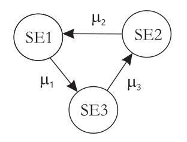
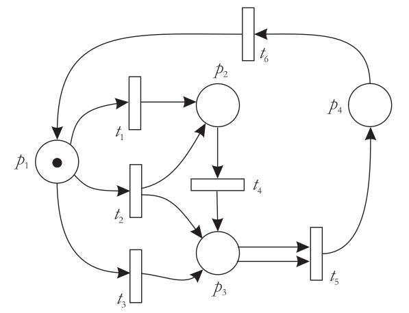
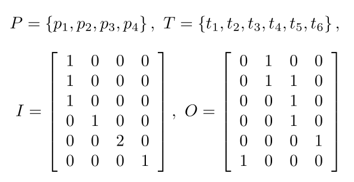

# 1. UVOD V MODELIRANJE RAČUNALNIŠKIH OMREŽJI

V zadnjih 40 letih so se RO (računalniška omrežja) izboljšala na področju *zmogljivosti* (stalno povečanje hitrosti prenosa podatkov, pravočasno prihajanje podatkov do ponorne točke v željenem vrstnem redu) in *zanesljivosti* (večja robustnost in posledično dosegljivost).

Dosegljivost:
$$T_{total} = T_u + T_d$$
$$A_{network} =  \frac{T_u}{T_{total}} = \frac{T_u}{T_u + T_d}$$

$A_{network}$ - mera za oceno dosegljivosti, $T_u$ - uptime, $T_d$ - downtime, $T_{total}$ - čas opazovanja RO.

Uporabniku so omrežja predvsem nevidna, saj delo temelji predvsem na storitvah, ki jih RO omogočajo. Uporabnik je pogosto pozoren le na dosegljivost storitve ($A_{service}$), ki pa je ponavadi manjša ali enaka dosegljivosti omrežja:
$$A_{service} \leq A_{network}$$

Uporabnik meri kakovost omrežja ponavadi po dveh faktorjih: deklarirana hitrost pretoka podatkov do njega (*download speed*) in od njega (*upload speed*). Obe hitrosti merimo v bps (*bits per second*) oz v Mbps (*megabits per second*) in Gbps (*gigabits per second*).

## 1.1 Osnovni model komunikacijske poti

Pretok podatkov je z vidika uporabnika običajen ali pa degradiran.

Posamezno komunikacijsko pot sestavljajo:

- *izvor podatkov*: naprava, ki je podatke poslala v omrežje
- *pot po omrežju*: zaporedje fizičnih prenosnih medijev in omrežnih naprav, po katerih potujejo podatki
- *ponor podatkov*: naprava, ki je podatke sprejela

## 1.2 Zahteve, strežniki, čakalne vrste

Osnovni gradniki modeliranja RO so:

- *zahteve*: entiteta, ki potuje od izvorne do ponorne točke (paketki)
- *strežnik*: segment omrežja, ki ga zahteva (paketek) za določen čas zasede in v tem času servira zahtevo; fizični prenosni mediji, omrežne naprave
- *čakalne vrste*: pomnilniški vmesnik, v katerem zahteva čaka, da bo postrežena

## 1.3 Modeliranje in simulacije toka paketov v računalniških omrežjih

Glavni cilji modeliranja RO so:

- določanje odzivanja modela omrežja v normalnih in nenormalnih pogojih delovanja
- izvajanje natančnega uglaševanja modela omrežja
- izvajanje $\text{IF-THEN}$ analiz v modelu omrežja
- iskanje kompromisa med ceno in zmogljivostjo realnega omrežja

Vse ugotovitve, ki jih pridobimo na osnovi modela omrežja in simulacij nad njimi, lahko uporabimo pri gradnji novega omrežja ali pri spremembah na že obstoječem.

### 1.3.1 Terminologija modeliranja RO

Osnovni terminološki pojmi:

- *opazovano omrežje*: že obstoječe realno omrežje ali omrežje v fazi načrtovanja
- *komponente omrežja*: množica vseh sestavnih delov, ki sestavljajo komunikacijske poti
- *stanje omrežja*: množica vseh tipov zahtev (paketkov), njihovo število in pozicijo v omrežju na neki časovni točki $t$
- *modeliranje omrežja*: delovni proves, ki nas pripelje do *modela* obstoječega ali načrtovanega omrežja
- *model omrežja*: opis komponent sistema in formalni opis njihove povezanosti
- *simulacija na modelu omrežja*: postopki navideznega izvajanja strežbe, ki nam dajo kvantitativne rezultate
- *validacija* in *verifikacija modela omrežja*:  

- *simulacijska hipoteza*: predpostavljeni simulacijski rezultati, do katerih naj bi nas pripeljala simulacija ob vnaprej določenih pogojih

Vzpostavljeni konceptualni model je popolnoma verna slika opazovanega omrežja ali njegov posplošitev (približek). Glavna prednost modela je, da nam omogoča hitre spremembe strukture opazovanega omrežja in napove posledice. Sledi validacija modela - na vhod dostavimo breme. Če model z odzivom izkazuje vnaprej določeno stopnjo ujemanja, je validacija uspešna. Simulacija je izvajanje modela, ki ponazori dinamiko paketkov v opazovanem modeliranem omrežju. Modeliranje in simulacije uporabljamo za analizo pravilnosti in zmogljivosti delovanja opazovanega sistema.

### 1.3.2 Koraki za izgradnjo cikličnega procesa simulacijske analize

Simulacijski cikel temelji na *komponentah omrežja, vhodnih spremenljivkah modela omrežja, zmogljivostnih metrikah* in na *povezavah* med komponentami omrežja.

Koraki izgradnje cikličnega procesa simulacijske analize:

- identifikacija opazovanega omrežja in problemov
- formulacija opazovanega omrežja in problema (postavimo meje, definiramo zmogljivostne matrike, zasnovujemo konfiguracije omrežja)
- zbiranje podatkov o opazovanem omrežju (željni omrežni parametri, podatki o vseh komponentah)
- formulacija in razvoj modela (zgradimo mrežni diagram omrežja)
- validacija in verifikacija omrežja
- dokumentiranje modela zaradi kasnejših nadgradenj
- izdelava simulacijskega načrta (izboljšanje zmogljivosti, odprava ozkih grl, ...)
- določitev začetnih in robnih pogojev simulacij (npr. začetno število zahtev v omrežju, ...)
- izvajanje simulacijskih eksperimentov
- interpretacija simulacijskih rezultatov
- izdelava sklepa o morebitnih spremembah opazovanega realnega omrežja ali njegovega modela

### 1.3.3 Prednosti in slabosti modeliranja in izvajanja simulacij

Prednosti:

- možnost boljšega razumevanja zakonitosti dinamike v opazovanem omrežju
- možnost testiranja hipotez o dinamiki v omrežju
- možnost analize običajne dinamike v omrežju, dinamike v stresnih razmerah in dinamike ob prekomernem zvečanju bremena
- identifikacija vhodnih spremenljivk, glede na njihov vpliv na simulacijske rezultate
- identifikacija ozkih grl v omrežju
- možnost uporabe različnih ocenjevalnih matrik

Slabosti:

- dodaten potreben čas
- razpoložljivost resursov

# 2. TEORIJA STREŽBE

Temeljni pojmi: zahteve, čakalne vrste, strežniki. Teorija strežbe nam je v pomoč pri izvajanju analize zmogljivosti delovanja RO.

## 2.1 Model strežnega sistema

Osnovni objekt opazovanja je model strežnega sistema. Zahteve vstopajo na vstopni strani, obdelane pa izstopajo na izstopni strani. Vstopajočim zahtevam pravimo tudi *vhodno breme sistema*. Notranjost je sestavljena iz čakalnih vrst, strežnikov in poti.

Vsak model vsebuje eno ali več *strežnih poti*, ki vodijo od vstopne do izstopne točke modela. Posamezno pot sestavlja zaporedje parov - pred vsakim strežnikom se nahaja čakalna vrsta.

Za strežbo zahteve na izbrani strežnik veljajo zakonitosti:

- z izbiro strežne poti bo ob normalnem delovanju strežnega sistema zahteva po nekem določenem času postrežena na vseh strežnikih, ki se nahajajo na izbrani strežni poti
- v posameznem strežniku se lahko istočasno obdeluje le ena zahteva; če v tem času pride na vhod strežnika nova zahteva, se ta uvrsti v čakalno vrsto. Ta bo zadrževala zahteve po v naprej določeni *strežni disciplini* (ponavadi je to $\text{FIFO}$), dokler strežnik ne bo prost.
- strežba neke zahteve ima vedno neko časovno trajanje $t$ ($t > 0$), ki je odvisna od hitrosti delovanja strežnika in velikosti ter vrste zahteve

Zmogljivost strežnika podajamo s parametrom *intenzivnost strežbe*. Merska enota je podana kot število obdelanih zahtev na časovno enoto, matematična oznaka je $\mu_i (i = 1,...,n)$; $n$ je število strežnikov v opazovanem modelu.

V modelu so lahko strežniki tudi prenosni mediji.

## 2.2 Čakalne vrste v modelih strežnih sistemov

Osnovne tri značilnosti čakalne vrste: *dolžina* (št. čakalnih mest), politika *zavržbe zahtev* in *strežna disciplina* (metoda jemanja zahtev iz čakalne vrste).  
S teoretičnega vidika so lahko čakalne vrste *končne* ali *neskončne*, v praksi pa ni tako.  
Če se končna vrsta s časoma zapolni, prihaja do *izgubljanja zahtev*; pri tem se lahko zavržejo novoprispele zahteve ali pa zahteve, ki so že bile predhodno uvrščene v čakalno vrsto.

Najbolj razširjene osnovne strežne discipline:

- *$\text{FIFO}$ disciplina*: vrstni red jemanja iz vrste je enak prihajanju zahtev v vrsto
- *$\text{LIFO}$ disciplina*: vrstni red jemanja iz vrste je obraten vrstnemu redu prihajanja v vrsto
- *prioritetna disciplina*: vrstni red jemanja iz vrste je pogojen s prioritetami - prva gre iz vrste zahteva z najvišjo prioriteto
  - *strežba s prekinitvami*: če ima novoprispela zahteva višjo prioriteto kot zahteva, ki je trenutno v obdelavi, se obdelava trenutne zahteve prekine in začne obdelava zahteve z višjo prioriteto
  - *strežba brez prekinitev*: če ima novoprispela zahteva višjo prioriteto kot tista, ki je trenutno v obdelavi, počaka obdelavo do konca in šele nato vstopi v obdelavo
- *naključna disciplina*: vrstni red jemanja je naključen
- *$\text{SFJ}$ disciplina*: iz vrste se vzame zahteva, ki bo imela najkrajši čas obdelave
- *$\text{LFJ}$ disciplina*: iz vrste se vzame zahteva. ki bo imela najdaljši čas obdelave
- *dodeljevanje časovnih rezin strežbe*: vsaki novoprispeli zahtevi se ob prihodu dodeli vnaprej določena enotska rezina strežnega časa; po preteklem času se strežba vrne v čakalno vrsto, če ni bila še do konca obdelana, v nasprotnem primeru pa zapusti strežnik

Čakalne vrste v rač. sist. in omrežjih realiziramo s pomniliki - *vmesniki*. Najpogostejše čakalne vrste imajo politiko "$\text{FIFO}$ *with tail drop*". Najnovejša strategija je "*krožni principu*" (najprej paketek iz 1. vrste, nato iz 2., ...., potem iz n-te vrste in nazaj iz 1. vrste).

## 2.3 Strežna enota in strežna mreža

**Definicija 1** Strežna enota je sestavljena iz $n$ $(n \geq 1)$ vzporedno vezanih strežnikov $S_i$ $(i = 1, ..., n)$ s skupno čakalno vrsto. Strežniki so funkcionalno in zmogljivostno ekvivalentni.

**Definicija 2** Funkcionalna ekvivalentnost paralelno vezanih strežnikov pomeni, da vsi strežniki ponujajo enak tip strežbe, njihova zmogljivostna ekvivalentnost pa pomeni, da imajo vsi paralelno vezani strežniki enako intenzivnost strežbe $(i = 1, ..., n : \mu_i = \mu)$.

Vstopajoča zahteva je v strežni enoti deležna natanko ene strežbe v natanko enem od $n$ strežnikov. Posamezna zahteva nima možnosti izbire strežnika, v katerem bo postrežena.

Paralelna vezava strežnikov nam omogoča *razširljivost* ali *skalatibilnost* strežne enote (hitrejša obdelava poljubne količine vstopajočih zahtev). Poleg intenzivnosti strežbe $\mu$ je pomembna tudi *intenzivnost porajanja* ali *vstopanja* zahtev v strežno enoto $\lambda$ (merska enota: število zahtev, ki vstopi v strežno enoto v nekem časovnem intervalu).

**Definicija 3** Strežna mreža je skupej zaporedno, vzporedno, ali mešano vezanih $m$ $(m > 1)$ strežnih enot.

V vsaki strežni mreži se nahajata vsaj dve strežni enoti (torej vsaj dva strežnika in vsaj dve čakalni vrsti); zahteve so v strežni mreži postrežene vsaj enkrat. V strežni enoti si zahteva ne more "izbrati" poti, v strežni mreži pa si jo lahko.

## 2.4 Kendallova notacija strežnih enot

To je šestorček $A/B/m/k/P/Q$, s katerim enolično opišemo poljubno strežno enoto.

- $A$ - vrsta porazdelitve *medprihodnih časov* vstopajočih zahtev v strežno enoto (čas med prihodom sosednjih zahtev)
- $B$ - vrsta porazdelitve *strežnih časov* zahtev
- $m$ - število paralelno vezanih strežnikov v strežni enoti
- $k$ - kapaciteta strežne enote (maksimalno število zahtev, ki se lahko naenkrat nahajajo v strežni enoti); kapaciteto zapišemo z izrazom $k = m + \text{len(queue)}$ ($m$ - število strežnikov); prevzeto je kapaciteta neskončna
- $P$ - velikost populacije zahtev, prevzeto je neskončna
- $Q$ - tip strežne discipline v čakalni vrsti strežne enote; prevzeto $\text{FIFO}$

Za parametra $A$ in $B$ uporabljamo naslednje oznake:

- $D$: deterministična porazdelitev
- $M$: eksponentna porazdelitev
- $E_k$: Erlangova porazdelitev $k$-tega reda
- $G$: splošna verjetnostna porazdelitev

### 2.4.1 Vrste porazdelitev

Deterministična porazdelitev je idealizirana, eksponentna porazdelitev pa je najpogosteje uporabljana na področju modeliranja strežbe zahtev v rač. sistemih in omrežjih. Obe temeljita na *slučajnih spremenljivkah* in *njunih verjetnostnih porazdelitvah*

**Deterministična porazdelitev**

Je primer izrojene verjetnostne porazdelitve slučajne spremenljivke, kjer ima slednja vedno enak izid. Za medprihodne in strežne čase velja:

- medprihodni časi so konstantni
- strežni časi so konstantni

V primeru determinističnega porajanja zahtev velja:
$$t_{interarrival} = \frac{1}{\lambda}$$

, pri čemer je $t_{interarrival}$ predstavlja konstanten medprihodni čas; v primeru deterministične intenzivnosti strežbe velja:
$$t_{service} = \frac{1}{\mu}$$

, kjer $t_{service}$  predstavlja konstanten strežni čas.

Tak sistem v splošnem zapišemo kot $D/D/1$ sistem.

**Eksponentna porazdelitev**

Opisuje časovne intervale med posameznimi dogodki v Poissonovi porazdelitvi. Dogodki so praviloma med seboj neodvisni in naključni.

*Funkcija gostote verjetnosti* eksponentne porazdelitve za slučajno spremenljivko $X$ se izračuna:
$$f(x, \lambda) = 
\begin{cases}
\lambda e^{-\lambda x},  & x \geq 0, \\
0, & x < 0.
\end{cases}
$$

*Zbirna funkcija verjetnosti*:
$$F(x, \lambda) = 
\begin{cases}
1 - e^{-\lambda x}, & x \geq 0, \\
0, & x < 0.
\end{cases}$$

$\lambda$ označuje *parameter stopnje funkcije*.  
Zbirna funkcija ($\text{CDF}$):
$$P(X > x) = e^{-\lambda x}$$
ponazarja verjetnost, da je slučajna spremenljivka $X$ večja od neke podane vrednosti $x$ in
$$P(X \leq x) = 1 - e^{-\lambda x}$$
, ki ponazarja verjetnost, da je vrednost slučajne spremenljivke $X$ manjša ali enaka neki podani vrednosti $x$.

Pri eksponentn porazdelitvi velja, da so časi med seboj neodvisni, naključni in porazdeljeni skladno z omenjeno porazdelitvijo. Z izrazom
$$r = -t * \ln(1 - p)$$
ponazorimo način izračuna spremenljivke $r$ (simulirani medprihodni ali strežni čas; $p$ - naključno izbrana vrednost iz intervala $[0, 1]$; $t$ - pričakovani čas ali inverzna vrednost ene od intenzivnosti ($\lambda$ ali $\mu$)).

### 2.4.2 Kvantitativne metrike za ocenjevanje zmogljivosti strežnih enot

- družina metrik *števila zahtev* $N$:
  - *število zahtev v strežni enoti*: $N$
  - *število zahtev v čakalni vrsti*: $N_q$
  - *število zahtev v strežbi*: $N_s$
- družina metrik *časov prebivanja zahtev*:
  - *čas prebivanja zahteve v strežni enoti*: $T$
  - *čas prebivanja zahteve v čakalni vrsti*: $W$
  - *čas strežbe zahteve v strežniku*: $x$
- *verjetnostno pogojeni metriki*: $P_k$ (verjetnost nahajanja $k$ zahtev v strežni enoti)

Skupno število zahtev v strežni enoti:
$$N = N_q + N_s$$  
Čas prebivanja zahteve v strežni enoti:
$$T = W + x$$

Nekaj primerov uporabe metrik pri analizi modela omrežja:

- spremljamo vrednost metrike $N_q(t)$ - izgubljanje paketkov
- želimo čim krajša časovna zadrževanja paketov na prenosnih medijih in omrežnih napravah
- razmerje med $W$ in $x$ naj bo čim manjše
- verjetnost nahajanja $k$ zahtev v omrežju

### 2.4.3 Littlovo pravilo

$$N = T * \lambda$$
Ta relacija ob pravilni interpretaciji vseh spremenljivk velja za vse vrste strežnih enot. Strežnik ne more zapustitit več zahtev, kot jih je v strežnik prispelo.
$$N_q = \lambda * W$$
$$N_s = \lambda * x$$

### 2.4.4 Uporabnostni faktor strežne enote

*Uporabnostni faktor* $\rho$ strežne enote nam pove, kolikšna je odstotkovna zasedenost strežnikov v strežni enoti. Je razmreje med reničnim časom zasedenosti enega ali več strežnikov v strežni enoti in časom opazovanja strežne enote:
$$\rho = \frac{\lambda}{\mu}$$
Uporabnostni faktor strežne enote z $m$ strežniki:
$$\rho = \frac{\lambda}{m * \mu}$$

Stabilne so tiste strežne enote, kjer velja $\rho < 1$.

Sorodna metrika je tudi *intenzivnost prometa* v strežni enoti (merska enota *Erlang*).

### 2.4.5 Zakon o ohranitvi pretoka

Intenzivnost prihajanja zahtev v *stabilno strežno enoto* na daljši rok opazovanja je enaka intenzivnosti odhajanja zahtev iz takšne strežne enote.

Zaključki (intenzivnost prihajanja $a$, intenzivnost odhajanja $b$):

- če $a > b$, potem je v strežni enoti vedno več zahtev $\rightarrow$ s časom bi postala nestabilna; takšni enoti pravimo, da je *nasičena* $\rightarrow$ ta relacija ne more veljati
- če $a < b$, potem naj bi se v notranjosti strežnika porajale nove zahteve, kar pa ni predvieno $\rightarrow$ ta relacija ne more veljati
- edina možnost je $a = b$, kar potrjuje zakon

## 2.5 Poissonov proces

To je proces štetja naključno porajajočih se $k$ dogodkov na časovnem intervalu $[0, t]$. Naključna spremenljivka $X(t)$ predstavlja število med seboj neodvisno porajajočih se dogodkov na časovnem intervalu in je porazdeljena po *Poissonovi verjetnostni porazdelitvi*:
$$P(X(t) = k) = \frac{(\lambda t)^k}{k!}e^{-\lambda t}$$.
$\lambda * t$ je povprečje Poissonove slučajne spremenljivke; predstavlja povprečno število pojavitev dogodkov v časovnem intervalu.

### 2.5.1 Povezanost Poissonove in eksponentne porazdelitve

Poissonova porazdelitev je diskretna porazdelitev, eksponentna pa zvezna porazdelitev.
$$P(X \leq t) = 1 - P(X > t) = 1 - e^{-\lambda t}$$

### 2.5.2 Lastnosti Poissonovega procesa

- *Superpozicija*: ob predpostavki, da imamo $k$ odvisnih Poissonovih procesov, ob njihovi združitvi v nov enoten proces velja, da je tudi nov proces Poissonov proces
- *Brez pomnjenja*: če smo opazovali proces na nekem časovnem intervalu, ne moremo določiti, kdaj v prihodnosti bo prispela nova zahteva, poznamo pa verjetnost porajanja.

## 2.6 Stohastičen proces

**Definicija 4** Stohastičen proces, čigar dinamiko pogojuje družina slučajnih spremenljivk $\{X(t), t \in T\}$ definiranih v verjetnostnem prostoru, pri čemer $X$ predstavlja slučajno spremenljivko, $T$ pa indeksno množico posamezne sklučajne spremenljivke, s katero slučajno spremenljivko indeksiramo.

Posamezno vrednost $X(t)$ imenujemo **stanje** opazovanega procesa, množico vseh vrednosti pa **prostor stanj** opazovanega procesa. Če je prostor stanj diskreten, stohastični proces poimenujemo za **stohastično verigo**, če pa je zvezen, potem poimenujemo za **stohastičen proces z zvezno zalogo stanj**.

Če je indeksna množica $T$ diskretna, potem stohastičen proces poimenujemo za **diskretni časovni stohastični proces** (tudi **stohastična frekvenca**), če pa je zvezna, poimenujemo za **zvezni časovni stohastičen proces**.

Spremembo stanja procesa imenujemo *tranzicija* ali *prehajanje*.

Stohastične procese delimo na 4 različne skupine.

## 2.7 Diskretna časovna Markovska veriga

Markovski proces je posebna oblika stohastičnega procesa za katerega velja, da nima pomnjenja (vpliv na naslednje stanje procesa ali menjavo njegovega stanja je pogojen le s trenutnim stanjem procesa).

**Definicija 5** Stohastično zaporedje $\{X_k, k \in T\}$ imenujemo za diskretno časovno Markovsko verigo, če za vsak nabor indeksov $i$, $j$ in $k$ velja pogojna verjetnost izraza
$$P[X_{k + 1} = j | X_0 = i_0, X_1 = i_1,...,X_k = i_k] = P[X_{k + 1} = j | X_k = i_k] = p_{ij}$$

Pri tem izraz $X_{k + 1} = j$ pomeni, da je veriga na $k + 1$ koraku v $j$-tem stanju, $p_{ij}$ pa predstavlja verjetnost neposrednega prehajanja iz $i$-tega v $j$-to stanje procesa.

Verjetnost nahajanja verige v stanju $j$ na $k$-tem koraku označimo z izrazom $\pi_{j}^{(k)} \equiv P[X_k = j]$.  
Veriga skozi diskretne časovne korake menja svoje stanje (prehaja med stanji) $\rightarrow$ ponazorimo z diagramom stanj. Z izrazom $\text{nek xy izraz, predoug in se mi ga neda pisat}$ izračunamo verjetnost nahajanja verige v kateremkoli stanju na poljubnem časovnem koraku.

### 2.7.1 Matrični zapis verjetnosti stanj

Če je Markovska veriga časovno homogena, se njene prehajalne verjetnosti $p_{ij}$ skozi čas ne spreminjajo. Če predpostavimo, da je število možnih stanj verige končno, lahko prehajalne verjetnosti zapišemo v obliki reda $n * n$. Imenovali jo bomo za *matriko verjetnosti prehajanj M*
$$M = (p_{ij}=, 1 \leq i \leq n, 1 \leq j \leq n)$$

Za to matriko veljata relaciji:
$$\forall i: \sum\limits_{j = 1}^n p_{ij} = 1 \\
\forall i, j: 0 \leq p_{ij} \leq 1$$

Potrebujemo še matrični zapis začetnega stanja verige, ki izraža porazdelitev verjetnosti glede na opazovani prostor stanj:
$$\pi^{(0)} = (\pi_1^{(0)}, \pi_2^{(0)},..., \pi_n^{(0)})$$

Vektor $\pi^{(k)}$ - porazdelitev stanj na poljubnem diskretnem časovnem koraku $k$.

Stanja lahko izračunamo z zaporedjem izrazov
$$\pi^{(1)} = \pi^{(0)}M, \\
\pi^{(2)} = \pi^{(1)}M, \\
.... \\
\pi^{(k)} = \pi^{(k - 1)}M \\
\Rightarrow \\
\pi^{(k)} = \pi^{(0)}M^k$$

### 2.7.2 Stacionarna stanja v diskretnih časovnih Markovskih verigah

V večini sistemov iz realnega okolja obstajajo neke limite vrednosti verjetnosti stanj, ki niso odvisne od njihove začetne porazporeditve. Ti sistemi imajo *stacionarna stanja*.

**Definicija 6** Diskretna časovna Markovska veriga $\{X_k\}$, ki je aperiodična, nereducibilna in časovno homogena, je tudi ergodična. Za ergodične Markovske verige vedno obstajajo limitne verjetnosti po izrazu
$$\pi_j = \lim\limits_{k \rightarrow \infty} \pi_j^{(k)} = \lim\limits_{k \rightarrow \infty} P[X_k = j], j = 0, 1,..., n,$$
ki so neodvisne od začetnega stanja verjetnostne porazdelitve $\pi^{(0)}$.

Markovska veriga je *reducibilna*, če vsebuje več kot eno izolirano podmnožico stanj (iz poljubnega stanja ni mogoče priti v kako drugo stanje sistema iz druge podmnožice in v nobeno stanje te podmnožice ne vodi povezava iz ostalih stanj). Primer je podan z matriko verjetnosti prehajanj $M$ po izrazu
$$M = \frac{1}{2} * \left[ \begin{matrix}
  1 & 1 & 0 & 0 \\
  1 & 1 & 0 & 0 \\
  0 & 0 & 1 & 1 \\
  0 & 0 & 1 & 1
\end{matrix} \right] ,$$
možna prehanja med stanji pa z *diagramom prehajanja stanj*.

Markovska veriga je *periodična*.

## 2.8 Zvezna časovna Markovska veriga

Če v Markovsko verigo namesto diskretnega časa vpeljemo zvezni čas, se prehajanje med stanjema lahko izvrši v poljubni točki zveznega časovnega intervala.

Neda se mi več

## 2.9 Rojstno - smrtni proces

Je posebna oblika zvezne časovne Markovske verige, v katerih so možni prehodi iz trenutnega stanja verige le v njemu sosednja stanja.  
Recimo, da imamo v času $t$ opravka s številom $k$ zahtev v sistemu. Prehod iz stanja $k$ v stanje $k + 1$ predstavlja rojstvo (v sistem vstopi nova zahteva), prehod v stanje $k - 1$ pa smrt zahteve (zahteva je bila uspešno servisirana in je zapustila sistem). Rojstvo in smrt se ne moreta zgoditi istočasno, ravno tako ne more biti istočasno več smrti ali rojstev. Stanje sistema (cela števila) označujejo število zahtev v sistemu. V diagramui $\lambda_i$ predstavlja *intenzivnost rojevanja* novih zahtev v stanju sistema $i$, $\mu_i$ pa *intenzivnost umiranja* zahtev v stanju sistema $i$.

Matrika intenzivnosti prehajanja za rojstno-smrtni proces zapišemo z izrazom
$$Q = \left[ \begin{matrix}
  -\lambda_0 & \lambda_0 & 0 & 0 & ... \\
  \mu_1 & -(\lambda_1 + \mu_1) & \lambda_1 & 0 & ... \\
  0 & \mu_2 & -(\lambda_2 + \mu_2) & \lambda_2 & ... \\
  0 & 0 & \mu_3 & -(\lambda_3 + \mu_3) & ... \\
  ... & ... & ... & ... & ...
\end{matrix} \right].$$

## 2.10 Vzorčne strežne enote

Primeri vzorčnih strežnih enot z značilnostmi:

- proces v sstrežni enoti je stohastične narave
- prihajalni proces v strežni enoti je Poissonov proces
- strežni čas v strežni enoti so porazdeljeni eksponentno
- proces v posamezni strežni enoti je Markovskega tipa oziroma brez zmožnosti pomnjenja
- prihajanje in strežbo zahtev ponazorimo z rojstno-smrtnim procesom

### 2.10.1 Strežna enota $M/M/1$

Temelji na Poissonovem prihajalnem procesu, eksponentni porazdelitvi strežnih časov in enem strežniku. Mankajoči parametri so povzeti po privzetih vrednostih.

$\lambda$ in $\mu$ sta neodvisni od števila zahtev v njej in ne spreminjata.
$$\lambda_k = \lambda, \mu_k = \mu$$

Poseben primer je *omahljiv strežni sistem*, kjer se intenzivnost prihajanja zahtev spreminja v odvisnosti od števila zahtev v strežni enoti, intenzivnost procesiranja pa se ne spreminja.

### 2.10.2 Strežna enota $M/M/1/s$

Ta strežna enota ima v primerjavi z $M/M/1$ končno kapaciteto ($k = s$) in ob enem strežniku čakalno vrsto končne dolžine $s - 1$ mest ($s$ zahtev - ena v obdelavi, ostale v čakalni vrsti). Značilnosti prihajalnega in strežnega procesa ostajata nespremenjeni. V primeru, da se v strežni enoti nahaja $s$ ali več zahtev, se novoprispela zahteva ali ena imed zahtev v čakalni vrsti zavrže $\Rightarrow$ **izguben sistem**.  
$\lambda$ in $\mu$ sta neodvisni od števila zahtev v njej in ne spreminjata.

### 2.10.3 Strežna enota $M/M/m$

Ta strežna enota, za razliko od prejšnjih dveh, vsebuje $m$ paralelno vezanih funkcionalno ekvivalentnih strežnikov ($m > 1$). Vsaka zahteva je obdelana enkrat na poljuben od $m$ strežnikov. Značilnosti prihajalnega in strežnega procesa sta enaki kot pri $M/M/1$ - imamo neskončno vrsto.

S povečanjem št. strežnikov $m$, strežni enoti povečujemo intenzivnost strežbe.

### 2.10.4 Strežna enota $M/M/m/m$

Kapaciteta sistema je enaka številu strežnikov v sistemu ($k = m$) $\Rightarrow$ v strežni enoti nimamo čakalne vrste $\Rightarrow$ tudi ta model je izguben.

Na grafični ponazoritvi imamo zaradi splošnosti narisano tudi čakalno vrsto, čeprav je dolžina le-te 0.

### 2.10.5 Strežna enota $M/M/m/m/c$

Imenujemo jo tudi *Engstenov izgubni sistem*. Od prejšnje se ralikuje zgolj v velikosti populacije zahtev, ki ni več neskončna, temveč je omejena in dovolj majhna, da na vhodnem delu strežne enote intenzivnost prihajanja glede na število zahtev v sistemu niha.

Če je velikost populacije $c$ manjša od $m$, imamo opravka z obvladljivo strežno enoto, v kateri imamo ves čas vsaj en prost strežnik, kar pomeni, da je sistem z vidika zmogljivosti predimenzioniran.

### 2.10.6 Strežna enota $M/G/1$

Od strežne enote $M/M/1$ se razlikuje le v procesu strežbe, kjer strežni časi niso več eksponentno porazdeljeni, ampak je njihova porazdelitev poljubna ali splošna. $G$ torej predstavlja katerokoli verjetnostno porazdelitev časa strežbe z njegovim znanim povrpečjem $x$ in varianco $\sigma_x^2$. Pri tem dopuščamo možnost, da vnaša odvisnost od preteklih vrednosti slučajne spremenljivke $\Rightarrow$ proces strežbe ni več nujno Markovski proces.  
Recimo, da je v $M/G/1$ strežno enoto s $\text{FIFO}$ strežno disciplino vstopila $i$-ta zahteva in nas zanima njen čakalni čas. Le-ta bo sestavljen kot vsota časov strežbe zahtev, ki se nahajajo v vrsti pred opazovano zahtevo in preostalega časa strežbe zahteve, ki je že v obdelavi v strežniku.

### 2.10.7 Strežna enota z delnim vračanjem zahtev v strežbo

Izvajanje poteka po konceptu dodeljevanja časovnih rezin strežbe. Zahteva vstopi v strežžnik, se obdeluje neko vnaprej predvideno število časovnih enot, potem pa strežbo zaključi ne glede na to, ali je bila zahteva postrežena do konca, ali ne.  
Za to strežno enoto je specifično verjetnostno pogojeno vejanje na izhodni strani strežne enote.

## 2.11 Prioritetna strežba v strežnih enotah

Predpostavimo, da imamo opravka s strežno enoto, v katero vstopajo zahteve z različnimi prioritetami $p$ iz množice
$$p \in \{1, ..., P\},$$
pri čemer $p = 1$ predstavlja najmanjšo možno prioriteto, $p = P$ pa vnaprej znano največjo možno prioriteto. Iz čakalne vrste vedno vzamemo zahtevo z največjo prioriteto; če je takih zahtev več, vzamemo iz vrste tisto, ki je v vrsti najdlje ($\text{FIFO}$).  
Ločujemo med neprekinitvenim in prekinitvenim modelom prioritetne strežbe.
Vse to velja zgolj za $M/G/1$ strežno enoto, ker je ob možnosti prekinjanja strežbe veljavnost eksponentne porazdelitve strežnih časov mnogokrat vprašljiva.

### 2.12 Strežne mreže

Strežne mreže ločujemo na dve skupini in sicer na *odprte* in *zaprte* strežne mreže. V prve zahteve vstopajo iz zunanjega okolja in se vanj potrežene vračajo. V drugih kroži konstantno število zahtev, ki okolja sistema zaprte strežne mreže ne zapuščajo, poleg tega pa vanj nove zahteve ne vstopajo. Stanje strežne mreže običajno ponazorimo s številom zahtev v njenih strežnih enotah.

Predpostavimo, da imamo opravka z zaprto strežno mrežo, sestavljeno iz treh strežnih enot tipa $M/M/1$ (SE1, SE2 in SE3).Intenzivnost strežbe strežnih enot so po vrsti $\mu_1$, $\mu_2$ in $\mu_3$. V strežni mreži se nahajat dve zahtevi; ti zahtevi prehajata ločeno med strežnimi enotami.

Strežna enota SE1 predaja postreženo zahtevo z intenzivnostjo $\mu_1$ strežni enoti SE3, ta predaja postreženo zahtevo z intenzivnostjo $\mu_3$ strežni enoti SE2 itd. Intenzivnost predaje zahteve naslednji strežni enoti v ciklu je pogojena z intenzivnostjo strežbe enote, ki zahtevo predaja.

# 3. PETRIJEVE MREŽE

## 3.1 Gradniki Petrijevih mrež

Struktura Petrijevih mrež je sestavljena iz pet osnovnih tipov gradnikov:

- *akcij*
- *pogojev*
- *usmerjenih povezav* med akcijami in pogoji
- *usmerjenih povezav* med pogoji in akcijami
- *žetonov*, s katerimi so številčno definirane kratnosti izpolnjenosti posameznih pogojev

Interpretiramo si lahko kot zaporedje izvedenih akcij. Za izvedbo posamezne akcije morajo bit izpolnjeni neki zanjo specifični, vnaprej podani pogoji.  
Proženje akcije lahko povzroči neveljavnost izpolnjenih pogojev potrebnih za njeno proženje, istočasno pa lahko izvedba akcije povzroči ipolnjenost nekih novih pogojev, ki ne sodijo v množico pogojev potrebnih za njeno proženje.  
Posamezen pogoj je v PM lahko izpolnjen ali pa neizpolnjen. V primeru izpolnjenosti nas zanima tudi *kratnost njegove izpolnjenosti*; kratnost označujemo z *žetoni*.

## 3.2 Gradniki Petrijevih mrež

### 3.2.1 Formalna definicija Petrijeve mreže

**Definicija 7** Petrijeva mreža je četvorček $C = (P, T, I, O)$, pri čemer $P$ predstavlja končno množico pogojev, $T$ končno množico akcij, $I$ vhodno in $O$ izhodno preslikavo. Množici $P$ in $T$ sta si tuji ($P \cap T = \empty$).

Običajno preslikavi $I$ in $O$ zapišemo v obliki *prehajalnih matrik* reda $m \times n$, pri čemer $m$ predstavlja število akcij in $n$ številio pogojev.

### 3.2.2 Definicija grafa Petrijeve mreže

**Definicija 8** Graf Petrijeve mreže je dvodelni usmerjen graf $G = (V, A)$, kjer $V$ $(V = P \cup T)$ predstavlja množico vozlišč in $A$ multimnožico povezav med njimi $(a_i = (v_j, v_k))$. Velja naslednja relacija:
$$\forall i: a_i = (v_j, v_k), (v_j \in T) \& (v_k \in P) \lor (v_j \in P) \& (v_k \in T).$$

### 3.2.3 Označitve pogojev v Petrijevih mrežah

Formalno označitve Petrijeve mreže na $k$-tem časovnem koraku zapišemo z vektorjem $o(k)$
$$o(k) = (o_1(k), o_2(k), ..., o_n(k)), \forall i \in {1, ..., n} : o_i(k) \in \mathbb{N}_0,$$
pri čemer $n$ predstavlja število pogojev ($n = |P|$), $o_i(k)$ pa število žetonov v $i$-tem pogoju na $k$-tem diskretnem časovnem koraku izvajanja modela Petrijeve mreže.

**Definicija 9** Označitev Petrijeve mreže $C = (P, T, I, O)$ je funkcija, ki množico stanj $P$ preslika v vektor nenegativnih celih števil po izrazu
$$o: P \rightarrow \mathbb{N}_0.$$

Z označitvijo pogojev pridemo do označene Petrijeve mreže - petorček $M = (P, T, I, O, o(k))$.

Za naš primer Petrijeve mreže predpostavimo *začetno označitev* $o(k_0) = (0, 2, 1, 3)$

### 3.2.4 Proženje izvajanja akcij v Petrijevih mrežah

Predpostavke, povezane z izvajanjem akcij in pomenom časa v Petrijevih mrežah:

- *diskretnost časa*: simulirana dinamika opazovanega modela na osnovi Petrijeve mreže se izvaja v diskretnih časovnih korakih
- *istočasnost izvajanja le ene akcije*: na posameznem diskretnem časovnem koraku se lahko izvede le ena akcija; paralelno izvajanje več akcij tako ni možno
- *hipnost izvedbe akcije*: čas trajanja izvedbe posamezne akcije je hipen ali infinitezimalen

Glede na navede predpostavke je dinamika v Petrijevi mreži enolično določena s časovnim zaporedjem izvedenih akcij.  
Posamezna akcija se lahko sproži, le je na $k$-tem diskretnerm koraku omogočena (če se po vsaki usmerjeni povezavi, ki vstopa v to akcijo, lahko prenese žeton iz pogoja, ki predstavlja izvor usmerjene povezave).

Sprožitev in v nadaljevanju izvedba akcije $t_i$ odvzame žetone iz pogojev, iz katerih vodijo usmerjene povezave proti opazovani akciji; po vsaki usmerjeni povezavi le en žeton.

Dve pomembni značilnosti prenosa žetonov preko prožene akcije $t_j$ v ponorne pogoje:

- čas prehajanja žetonov od pogojev, s katerimi je pogojena omogočenost akcije $t_j$, do pogojev, v katere ista akcija odlaga žetonem je hipen ali infinitezimalen
- ni nujno, da je število žetonov, ki vstopajo v proženo akcijo enako številu žetonov, ki iz nje izstopajo

### 3.2.5 Drevo označitve v Petrijevi mreži

Začetna označitev: $o(k_0) = (1, 0, 0, 0)$.

Drevo ponazarja tri možne tokove, vsakega lahko zapišemo s časovnim zaporedjem stanj:

- tok z začetnim proženjem akcije $t_1$: po dveh izvedenih akcijah dosežemo **končno stanje**, v katerem obtiči model
- tok z začetnim proženjem akcije $t_2$: po štirih izvedenih akcijah se vrnemo v začetno stanje $(1, 0, 0, 0)$; to stanje imenujemo **ciklično stanje**
- tok z začetnim proženjem akcije $t_3$: po eni izvedeni akciji dosežemo **končno stanje**, v katerem obtiči model

Ob analizi dinamike v Petrijevih mrežah moramo bit pozorni tudi na akcije brez vhodnih povezav. Take akcije so vedno omogočene in se lahko neprestano prožijo $\rightarrow$ **neskončne veje**.

Pri tvorbi in analizi dreves označitev moramo bit pozorni na:

- *končna stanja* ali *listi drevesa*: končna stanja v drevesu označitve predstavljajo stanja, v katerih se dinamika v modeliranem sistemu ustavi in opcijsko lahko predstavljajo nepravilno delovanje sistema
- *ciklična stanja*: so zaželjena, saj po opravljeni dejavnosti vidni skozi zaporedje akcij ponazarjajo zmožnost vračanja sistema v neko začetno stanje pripravljenosti
- *neskončne veje v drevesu*: so nezaželene, saj v realnih sistemih ne moremo zagotoviti poljubne količine resursov

### 3.2.6 Dosegljivost stanj v Petrijevi mreži

Označitev $o'$ je *neposredno dosegljiva* iz označitve $o$, ko obstaja takšna akcija $t_j$, ki nas z izvajanjem pripelje diz označitve $o$ v označitev $o'$ $\Leftrightarrow$ $o' =\delta(o, t_j)$.

### 3.2.7 Nedeterminizem in konkurenčnost

Eden od temeljnih konstruktov je *nedeterminizem* izbire akcije za proženje.

Izbira akcije poteka naključno; ena akcija bo izvedena, druga pa zaradi odsotnosti žetona ne bo izvedena.

## 3.3 Splošni zgledi modeliranja s Petrijevimi mrežami

### 3.3.1 Računalniški strežniški sistem

Pomeni posameznih pogojev in akcij:

- $p_1$: v sistem je vstopila zahteva in čaka na obdelavo v enoti $R_1$
- $p_2$: enota $R_2$ je prosta
- $p_3$: zahteva čaka na obdelavo v enoti $R_2$ ali v enoti $R_3$
- $p_4$: zahteva je dokončno obdelana
- $p_5$: enota $R_2$ je prosta
- $p_6$: enota $R_3$ je prosta
- $t_1$: zahteva se obdeluje na $R_1$
- $t_2$: zahteva se obdeluje na $R_2$
- $t_3$: zahteva se obdeluje na $R_3$

### 3.3.2 Problem dveh kitajskih mislecev

Pomeni posameznih pogojev in akcij:

- $p_1$: prva paličica je prosta
- $p_2$: prvi mislec je pripravljen za prehranjevanje
- $p_3$: druga paličica je prosta
- $p_4$: prvi mislec je pripravljen za razmišljanje
- $p_5$: drugi mislec je pripravljen za prehranjevanje
- $p_6$: drugi mislec je pripravljen za razmišljanje
- $t_1$: prvi mislec se prehranjuje
- $t_2$: prvi mislec razmišlja
- $t_3$: drugi mislec se prehranjuje
- $t_4$: drugi mislec razmišlja

Pri tem problemu lahko pride do *smrtnega objema*: eno paličico ima lahko prvi mislec, drugo pa drugi mislec. Oba čakata še na drugo paličico, ki pa je ne bosta nikoli dobila $\Rightarrow$ to stanje je končno.

### 3.3.3 DO WHILE programski stavek s čuvajem

$$\text{do } \{S\} \text{ while } (P)$$

Pomeni posameznih pogojev in akcij:

- $p_1$: v sistem je vstopila zahteva za izvajanje programskega stavka
- $p_2$: pogoj predstavlja funkcijo čuvaja; le ob njegovi prisotnosti je možno izvršiti programski stavek
- $p_3$: zahteva čaka na izvedbo $S$ stavka
- $p_4$: izvedba $S$ stavka je opravljena
- $p_5$: pogoj $P$
- $p_6$: DO WHILE stavek je končan
- $t_1$: ob prisotnosti čuvaja se izvede vstop v programski stavek
- $t_2$: izvede se $S$ stavek
- $t_3$: ker pogoj $P$ ni izpolnjen, se izvajanje programskega stavka zaključi in čuvaj se vrne v svoj izhodiščni pogoj
- $t_4$: ker je pogoj $P$ izpolnjen, se vrnemo na ponovno brezpogojno izvajanje stavka $S$

*Inhibirna povezava*: po njej se pripelje žeton, če pogoj (iz kjer prihaja žeton) ni izpolnjen.

### 3.3.4 IF programski stavek s čuvajem

$$\text{if } (P) \text{ then } \{S_1\} \text{ else } \{S_2\}$$

Pomeni posameznih pogojev in akcij:

- $p_1$: v sistem je vstopila zahteva za izvajanje programskega stavka
- $p_2$: pogoj predstavlja funkcijo čuvaja programskega stavka
- $p_3$: zahteva je pred preverjanjem veljavnosti pogoja $P$, ki določi katero zaporedje ukazov izvesti
- $p_4$: pogoj $P$
- $p_5$: eno od obeh možnih zaporedij programskih ukazov je izvedeno
- $t_1$: ob prisotnosti čuvaja se izvede vstop v programski stavek
- $t_2$: izvede se zaporedje programskih ukazov $S_1$
- $t_3$: izvede se zaporedje programskih ukazov $S_2$

### 3.3.5 FOR programski stavek s čuvajem

$$\text{for } (i = 1 \text{ to n}) \text{ do } \{S\}$$

Pomeni posameznih pogojev in akcij:

- $p_1$: v sistem je vstopila zahteva za izvajanje programskega stavka
- $p_2$: pogoj predstavlja funkcijo čuvaja programskega stavka
- $p_3$: zahteva je pred odločitvijo ali stavek $S$ glede na vrednost števca $n$ izvesti ali ne
- $p_4$: predstavlja števec $n$, ki mora biti pred za£etkom izvajanja programskega stavka inicializiran z $n$ žetoni
- $t_1$: ob prisotnosti čuvaja se izvede vstop v programski stavek
- $t_2$: izvede se stavek $S$
- $t_3$: programski stavek je dokončno izveden v celoti

### 3.3.6 Proizvodno porabniški sistem

Pomeni posameznih pogojev in akcij:

- $p_1$: proizvodni proces je pripravljen na proizvodnjo ene enote
- $p_2$: ena enota je proizvedena
- $p_3$: pogoj predstavlja funkcijo vmesnika, kjer proizvedene enote čakajo na prevzem s strani porabniškega procesa
- $p_4$: ena enota je prevzeta iz vmesnika
- $p_5$: porabniški proces je pripravljen na porabo ene enote
- $t_1$: proizvede se ena enota
- $t_2$: proizvodni proces preda enoto v vmesnik ($p_3$) in inicializira se ponovna pripravljenost na proizvodnjo (žeton preide v $p_1$)
- $t_3$: porabniški proces prevzame enoto iz vmesnika
- $t_4$: porabniški proces porabi enoto in inicializira se ponovna pripravljenost na porabo (žeton preide v $p_5$)

Problem take mreže je, da lahko pogoj $p_3$ začne kopičiti žetone. Dodamo nov pogoj ($p_6$), ki skladišči enote; proizvodnja se začasno zaustavi, dokler v pogoju $p_6$ ni vsaj enega žetona.

### 3.3.7 Problem branja in pisanja

Pomeni posameznih pogojev in akcij:

- $p_1$: pripravljena je zahteva za branje
- $p_2$: omogočen je dostop do enkratnega branja podatkov
- $p_3$: vmesnik, v katerem je shranjenih $n$ dostopnih pravic
- $p_4$: omogočen je dostop do enkratnega pisanja podatkov
- $p_5$: pripravljena je zahteva za pisanje
- $t_1$: izvede se zaseganje začasne pravice za enkratno branje iz $p_3$
- $t_2$: izvede se branje, v nadaljevanju pa se začasna pravica do branja vrne v $p_3$
- $t_3$: izvede se zaseganje začasne $n$-kratne pravice za pisanje (zaseg $n$ žetonov iz pogoja $p_3$)
- $t_4$: izvede se pisanje, v nadaljevanju pa se začasna $n$-kratna pravica do pisanja vrne v $p_3$

### 3.3.8 Problem medsebojnega izklučevanja

Pomeni posameznih pogojev in akcij:

- $p_1$: pred kritično sekcijo se nahaja zahteva
- $p_2$: zahteva je zapustila kritično sekcijo
- $p_3$: prisotnost enkratne pravice dostopa do kritične sekcije
- $t_1$: dodelitev dostopne pravice do kritične sekcije iz pogoja $p_3$ in njen začetek; črtkana povezava med akcijama $t_1$ in $t_2$ ponazarja množico pogojev in akcij, ki se lahko izvedejo med akcijama $t_1$ in $t_2$
- $t2$: konec kritične sekcije in vračanje dostopne pravice v pogoj $p_3$

### 3.3.9 Modeliranje diagrama poteka

### 3.3.10 Modeliranje delovanja končnega avtomata

Zapis kakršnegakoli končnega avtomata temelji na osnovi obstoja treh nepraznih množic $X$, $Q$ in $Y$. $X$ predstavlja nabor različnih možnih vhodnih črk avtomata, $Q$ nabor različnih možnih notranjih stanj avtomata, $Y$ pa nabor različnih možnih izhodnih črk. Formalno:
$$A =(X, Q, Y, \delta, \lambda).$$

Pravila za formiranje modela končnega avtomata:

- črke vhodne abecede se preslikajo v pogoje; za naš primer tako velja sklep $X = \{x_1, x_2\} \Rightarrow P_1 = \{p_{x1}, p_{x2}\}$
- stanja avtomata se preslikajo v pogoje; za naš primer tako velja sklep
$Q = \{q_1, q_2, q_3\} \Rightarrow  P_2 = \{p_{q1}, p_{q2}, p_{q3}\}$
- prehajanja med stanji avtomata, ki istočasno vršijo formacijo izhodnih črk, se preslikajo v akcije; za naš primer
$$t_1 = (\delta(x_1, q_1), \lambda(x_1, q_1)), t_2 = (\delta(x_1, q_2), \lambda(x_1, q_2)), \\
t_3 = (\delta(x_2, q_2), \lambda(x_2, q_2)), t_4 = (\delta(x_2, q_3), \lambda(x_2, q_3))
$$
- ker se formacija črke izvede že v akciji, ki izraža posamezno prehajanje v avtomatu, moramo za vsako črko izhodne abecede pripraviti le pogoj, v katerega se bodo odlagali žetoni, kar bo ponazarjalo tvorbo izhodne črke; za naš primer tako velja sklep $Y = \{y_1, y_2\} \Rightarrow P_3 = \{p_y1, p_y2\}$
- formira se dokončna množica pogojev $P$ $(P = P_1 \cup P_2 \cup P_3)$; za naš primer tako velja izraz $P = \{p_x1, p_x2, p_q1, p_q2, p_q3, p_y1, p_y2\}, T = \{t_1, t_2, t_3, t_4\}$
- 

### 3.3.11 Petrijeve mreže kot generatorji jezikov

**Definicija 10** $L$ je jezik Petrijeve mreže, če obstajajo Petrijeva mreža $C = (P, T, I, O)$, preslikava $\rho : T \rightarrow \Sigma$, začetna označitev $o(k_0)$ in množica končnih označitev $F$, tako da velja izraz
$$L = \{\rho(\beta) \in \Sigma*: \beta \in T* \text{ and } \delta(o(k_0), \beta) \in F\}.$$

Imamo jezik $L = L_1 \cup L_2, L_1 = a(a \lor b)b, L_2 = a^nb^n , n \geq 1$.

Pomeni posameznih pogojev in akcij:

- $p_1$: v generator je vstopila zahteva za generiranje besede jezika $L_1$
- $p_2$: zahteva nedeterministi£no izbira med generiranjem črke $a$ ali $b$
- $p_3$: zahteva je pred generiranjem zadnje črke v besedi in sicer je to črka $b$
- $p_4$: beseda jezika $L_1$ je bila uspešno generirana
- $a$: generira se črka $a$
- $b$: generira se črka $b$
- $p5$: v generator jezika je vstopila zahteva za generiranje besede jezika $L_2$
- $p_6$: zahteva nedeterministi£no izbira med generiranjem črke $a$ ali $b$
- $p_7$: pomnjenje števila ($n - 1$) generiranj črke $a$
- $p_8$: zahteva deterministično izbira akcijo $b$, vse dokler pogoj $p_7$ ni prazen
- $p_9$: beseda jezika $L_2$ je bila uspešno generirana
- $\text{Dummy}$: akcija nima zmožnosti generiranja črke; izvede se pod pogojem, da smo iz pogoja $p_7$ preko izvajanja akcije $b$ počrpali vse žetone
- $a$: generira se črko $a$
- $b$: generira se črko $b$

## 3.4 Analiza Petrijevih mrež

### 3.4.1 Varnost Petrijeve mreže

Posamezen pogoj v mreži je *varen* natanko takrat, če se skozi simulacijo dinamike v opazovani Petrijevi mreži število žetonov v tem pogoju nikdar ne dvigne nad 1.

**Definicija 11** Posamezni pogoj $p_i \in P$ je v Petrijevi mreži $C = (P, T, I, O)$ z začetno označitvijo $o$ varen natanko takrat, ko za vse označitve $o' \in R(C, o)$ velja $o'_i \leq 1$. Velja tudi $o_i \leq 1$. Petrijeva mreža $C$ je varna natanko takrat, ko so varni vsi njeni pogoji.

Analiza varnosti se uporablja na področjih modeliranja logičnih enačb, ...; sistemov, ki zahtevajo le dve možni stanji.

### 3.4.2 Omejenost Petrijeve mreže

Je splošnejša oblika značilnosti varnosti. PM je $k$-omejena natanko takrat, ko je $k$ največje število žetonov, do katerega pride v enem od pogojev v njenem drevesu označitve.

**Definicija 12** Posamezni pogoj $p_i$ $(p_i \in P)$ Petrijeve mreže $C = (P, T, I, O)$ z začetno označitvijo $o$ je $k$-omejen, če za vse $o' \in R(C, o)$ velja $o'_i \leq k$. Petrijeva mreža $C$ je $k$-omejena, če je vrednost k maksimalna gledano preko vseh omejenostih pogojev.

### 3.4.3 Konzervativnost Petrijeve mreže

Opazovana Petrijeva mreža je *konservativna* natanko takrat, ko število žetonov v pogojih Petrijeve mreže skozi čas (skozi zaporedje izvajanja akcij) ostaja enako.

**Defnicija 13** Petrijeva mreža $C = (P, T, I, O)$ z začetno označitvijo $o$ je striktno konzervativna, če za vse $o' \in R(C, o)$ velja izraz
$$\sum\limits_{i = 1}^{|P|} o'_i * w_i = \sum\limits_{i = 1}^{|P|} o_i * w_i.$$

## 3.5 Zgleda modeliranja s področja računalniških omrežij

### 3.5.1 Poenostavljen model protokola med oddajnikom in sprejemnikom

### 3.5.2 Model nedeterministične izbire naslovnika sporočil

## 3.6 Razširitve Petrijevih mrež

Poleg inhibirnih povezav med možne konstrukte razširjenih Petrijevih mrež sodijo sledeči dejavniki:

- *stohastičnost*: dopuščamo verjetnostno pogojenost vejanj
- *mehkost*: dopuščamo mehkost izvajanja akcij (delno izvajanje akcij)
- *časovnost*: omogočamo, da posameznim akcijam pripišemp časovnost njihovega trajanja
- *"barvanje" žetonov*: možnost, da posamezen žeton deklariramo z množico spremenljivk

## 3.7 Časovne Petrijeve mreže

Omogočajo nam vpeljavo *časa trajanja* posameznih akcij (zaloga vrednosti je množica naravnih števil).

**Definicija 15** Šstorček $PN = (P, T, I, O, o(k_0), D)$ imenujemo za časovno Petrijevo mrežo, kjer $P$ predstavlja končno množico pogojev, $T$ končno množico akcij, $I$ vhodno ter $O$ izhodno matriko in $o(k_0)$ začetno označitev. $D$ predstavlja vektor nenegativnih števil vključujoč ničlo, ki posameznim akcijam določajo časovno trajanje, pri čemer velja izraz
$$D = (d_1, d_2, ..., d_m), m = |T|, \forall i: d_i \in \mathbb{N}_0.$$

Akcija se sproži, ko so izpolnjeni vsi pogoji; le-ti morajo biti izpolnjeni vse do konca trajanja opazovane akcije.

### 3.7.1 Model servisiranja računalniškega sistema

$R$ - čas servisiranja, dolg $R$ časovnih enot
$D$ - na vsakih $D$ časovnih enot obisk kontrolorja
$t_1$ - teče življenska doba delovanja sistema
$L$ - življenska doba
$t_5$ - potek servisiranja

### 3.7.2 Model Stop&Wait protokola

# 4. BARVNE PETRIJEVE MREŽE

## 4.1 Definicija barvnih Petrijevih mrež

Omogočajo nam formalno specifikacijo *pomena* oz. *tipa žetona*, ki ju dosežemo z dodeljevanje enolične deklaracije (dodelitev sestavlene podatkovne strukture oz. njegove barve posameznemu tipu žetona) posameznemu tipu žetona.  
V fazi gradnje modela moramo deklarirati *tipe žetonov* oz. definirati njim ustrezne podatkovne tipe - *barvne nabore*.

**Definicija 18**: Barvna Petrijeva mreža je definirana kot osmerček $C = (P, T, I, O, o(t_0), D, C, S)$, pri čemer $P$ predstavlja končno množico pogojev, $T$ končno množico akcij, $I$ vhodno in $O$ izhodno preslikavo. Množici $P$ in $T$ sta si tuji ($P \cap T = \emptyset$). Vektor $o(t_0)$ predstavlja začetno označitev mreže, $D$ pa vektor časovnih trajanj posameznih akcij. Velja izraz
$$C: P \rightarrow S,$$
kjer $S$ predstavlja množico vseh barvnih naborov, $C$ pa barvno preslikavo. Slednja posameznemu pogoju določi zanj potrebne barvne nabore.

## 4.2 Model enosmernega oddajno sprejemnega protokola z neidealno prenosno potjo

cursed shit neda se mi vec

# 5. METRIKE IN ORODJA ZA OCENJEVANJE ZMOGLJIVOSTI RAČUNALNIŠKIH OMREŽIJ

## 5.1 Latenca v RO

**Definicija 17** Latenca je čas, ki preteče od izdaje uporabniške zahteve do prejema kakršnegakoli odziva sistema, od katerega odziv pričakujemo.

Primeri: nalaganje spletne strani, čas zagona programa, čas nalaganja OS. Čas latence: čas prenosa do ponora + čas čakanja v ponoru za obdelavo + čas obdelave in priprave odgovora na zahtevo + čas prenosa odgovora do izvora zahteve.

*Omrežno latenco* lahko definiramo:

- z vidika *posameznega paketa*: čas za pot od izvora do ponora
- z vidika *posamezne zahteve*: čas za pot od izvora do ponora (ena zahteva je iz več paketov)
- z vidika *posamezne zahteve in odgovora nanjo*: čas za pot od izvora do ponora + čas za pripravo odgovora + čas za pot odgovora od ponora do izvora

Latenca, definirana z vidika posameznega paketa, je pogojena z *vplivnimi faktorji*:

- *dolžina poti med oddajnikom in sprejemnikom*
- *vrsta prenosnih medijev na poti*
- *pasovne širine na prenosnih medijih* (večja kot je širina, krajša je latenca)
- *zanesljivost prenosnega medija*
- *hitrost delovanja aktivnih naprav v omrežju*
- *količina prometa*
- *porajanje občasnih motenj*

### 5.1.1 Primer definicije omrežne latence

Matematični izračun latence:
$$L_{total} = \sum\limits_{i = 1}^n (L_{SF_i} + L_{SW_i} + L_{Q_i}) + \sum\limits_{i = 1}^{n - 1} L_{WL_i},$$
pri čemer $n$ predstavlja št. aktivnih naprav na komunikacijski poti $n - 1$ pa št. prenosnih medijev.
Pomeni ostalih spremenljivk:

- $L_{SF_i}$: *shranjevalna in posredovalna latenca*; definirana je kot $L_{FS} = \frac{FS}{BR}$, kjer je $FS$ velikost obravnavanega paketa, $BR$ pa bitna hitrost odhodnega prenosnega medija
- $L_{SW}$: *tovarniška latenca aktivne naprave*
- $L_{WL}$: *latenca ožičenja* (1000km približno 5ms)
- $L_Q$: *latenca čakanja*

### 5.1.2 Posplošitev definicije latence

Definicijo lahko posplošimo na tak način, da latenco izenačimo z vsoto časov, ki izhajajo iz sledečih procesov na vsaki aktivni napraviali omrežni povezavi:

- *procesov propagacije*: čas, potreben za potovanje posameznega bita od ene aktivne naprave do druge
- *procesov transmisije* ali *serializacije*: čas, potreben za odpošiljanje zaporedja bitov, ki jih enega za drugim v ustreznih časovnih rezinah odlagamo na vodilo
- *procesov usmerjanja*: čas, potreben za obdelavo paketa na aktivni napravi
- *procesov čakanja*: čas, ki ga posamezen paket preživi v čakalni vrsti

Moment *zadnje milje*: delež celotne latence paketa, ki izhaja iz časa porabljenega na komunikacijski poti od hrbtenice ponudnika naslovnika do končne točke naslovnika.

## 5.2 Število skokov paketa

Število skokov je definirano s številom aktivnih naprav (usmerjevalniki, stikala, ponavljalniki, prehodi, požarni zidovi, zvezdišča, ...), ki jih paket obišče med izvorom in ponorom. Večje kot je število skokov, slabša je karakteristika omrežne poti. Uporabimo jo tudi za grobo oceno fizične razdalje.

Uporablja se jo tudi pri komunikacijskih protokolih. RIP protokol dekrementira TTL značko za vsak skok. Ko nek usmerjevalnik prejme paket z TTL značko 0, paket zavrže.

## 5.3 Zgostitve prometa

To je situacija, ko pride do čakanja zahtev v čakalnih vrstah pred posameznimi akrivnimi napravami ali prenosnimi mediji.  
Dejavniki:

- časovna pogostost
- velikost zgostitve prometa
- možnost, izvedljivost ter finančno in časovno zahtevnost nadgradnje
- identifikacija vzrokov za zgostitve
- možnost rekonfiguriranja aktivni naprav

## 5.4 Strukturna neuravnoteženost omrežja

Pod tem pojmom smartramo neustreznost omrežnih resursov (aktivne naprave s pripadajočimi licenčnimi zmogljivostnimi karakteristikami, omrežne povezave,ki sestavljajo naše omrežje), neustreznega njihovega števila in neustreznost njihove razporeditve. *Ozka grla* povzročijo zgostitev prometa.

## 5.5 Orodja za ocenjevanje zmogljivosti računalniških omrežij

- emulatorji omrežji z nastavljivimi parametri
- mrežni monitorji, generatorji in analizatorji
- generatorji dnevniških datotek
- stresna orodja (znižujemo razpoložljivost omrežnik resursov)
- bremenska orodja (zvišujemo breme v omrežju)
- uravnoteževalna orodja (uravnotežimo sistemske resurse)

# 6. PRIDOBIVANJE VREDNOSTI KVANTITATIVNIH SPREMENLJIVK OMREŽJA

Če hočemo zgraditi verodostojni model opazovanega omrežja, potrebujemo čim natančnejše vrednosti njegovih kvantitativnih spremenljivk:

- *z meritvami*
- *s približnimi ocenami*: ocene pridobimo na osnovi našega poznavanja prometa

*Meritev omrežnega prometa*: enkratno ali občasno izvajanje meritev.  
*Monitoring omrežnega prometa*: meritve prometa se izvajajo neprestano + izvajanje analize meritev v realnem času in uporaba le te za upravljanje z omrežnim prometom. Izvajamo z periodičnim zajemanjem ali vzorčenjem podatkov (frekvenca odvisna od namena).

## 6.1 Vzorčenje vrednosti kvantitativnih spremenljivk

Delimo jih na skupine:

- *vzorčenje količine prometa*: na aktivnih napravah z neko v naprej podano časovno periodo
- *vzorčenje vrste in vsebine prometa* (z wiresharkom)
- *vzorčenje zasedenosti sistemskih resursov*: na aktivnih napravah, kjer običajno merimo zasedenost dinamičnega pomnilnika, procesorja, ...
- *vzorčenje vrednosti ambientnih podatkov*: podatki o ambientnih razmerah v prostorih, kjer se nahaja aktivna oprema (npr. temperatura, delovanje ventilatorjev, ...)
- *vzorčenje neposrednih preformans omrežja*: pošiljanje paketov na ponorno točko s sprotnim merjenjem časov potovanja paketov (ping, traceroute, iperf, netstat)
- *vzorčenje števila uporabnikov na neki napravi*: beležimo breme zaradi uporabnikov

## 6.2 Vplivnostni fakotrji na izide meritev

Ključne nevarnosti:

- porajanje *sistemske napake*
- porajanje *šumov*
- izmera *nereprezentativnih vrednosti* kvantitativnih spremenljivk

### 6.2.1 Sistemska napaka in šum meritev

Razlagi sistemske napake in šuma:

- *porajanje sistemske napake*: v meritve se nam zaradi neustrezne zasnove merilnega postopka prikladla sistemska napaka (npr. zasedenost pomnilnika, ...)
- *porajanje šuma*: npr. če merimo čas, lahko s proženjem začetka ali konca meritve zamujamo ali prehitevamo

Sistemska napaka zaradi *invazivnosti meritev*, šum zaradi *neponovljivosti realnega bremena* v omrežju.

### 6.2.2 Naključnost rezultatov meritev

Dogajanje v RO je do neke mere naključno pogojeno, zato ne moremo vedno priti do enakih kvantitativnih rezultatov. Izvedemo lahko več ponovitev meritve.

### 6.2.3 Časovne karakteristike meritev

Časovni trendi:

- *dnevni trendi*: dnevna krivulja izmerjenih vrednosti (zelo niha)
- *tedenski trendi*: krivulja je enakomerna
- *sezonski trendi*: npr. količina prometa je manjša poleti

## 6.3 Izvajanje monitoringa v omrežjih

Izvajanje monitoringa lahko z vidika upravljanja z omrežjem izvajamo na dva načina:

- *pragovni monitoring*: zanimajo nas zgolj vzorčne vrednosti, ki presegajo nek vnaprej določen prag
- *monitoring trendov*: zanimajo nas trendi vzorčnih vrednosti

## 6.4 Določanje kvantitativnih vrednosti opazovanih spremenljivk brez možnosti meritev

V takih primerih se lahko zatečemo k *metodi določanja sistemskih spremenljivk na osnovi podobnih omrežij* ali pa k *metodi profila množice uporabnikov*.

Identificirati moramo geografsko območje po nekaterih parametrih:

- določitev števila naročniških komunikacijskih priključkov
- določitev vrst priključkov
- določitev dnevni, tedenskih in sezonskih trendov za posamezne vrste priključkov
- določitev storitev po posameznih vrstah priključkov

# 7. KVALITATIVNE METRIKE ZA OCENJEVANJE RAČUNALNIŠKIH OMREŽIJ

## 7.1 Kvaliteta storitve

Je ena od osnovnih metrik za kvalitativno oceno delovanja računalniškega omrežja ter s tem posredno njegovega ponudnika.  
Osnovna definicija QoS opiše kot zmožnost zagotavljanja dogovorjenega zmogljivostnega nivoja pretoka podatkov ali zmogljivosti storitve.  
Vrednotimo po zmogljivostnih parametrih:

- intenzivnost porajanja napak
- pasovna širina ali hitrost
- prepustnost
- latenca
- dosegljivost
- prihajanje paketov v ponorno točko v nepravem zaporedju
- prihajanje paketov z različnimi latencami
- itd.

Mnogokrat QoS nastopa kot samoevalvacijska metrika ali metrika, s katero svojo storitev ocenjuje sam ponudnik storitev omrežja.  
Za doseganje QoS se ponudnik zateka k metodam prioritizacije prometa in rezervacijam resursov (različne prioritete različnim aplikacijam).

Sporazum o zagotavljanju storitev temeljina treh predpostavkah:

- kvaliteta storitev
- dosegljivost storitve
- odgovornost

## 7.2 Kvaliteta uporabniške izkušnje

Opiše uporabnikovo videnje QoS, ki jo ponuja ponudnik. Uporabljeni so kriterijski parametri:

- cena storitve
- zanesljivost in dosegljivost storitve
- efektivnost storitve
- privatnost in varnost storitve
- prijaznost uporabniškega vmesnika storitve
- svoje zaupanje do storitev

## 7.3 Vsebinska analiza paketov v omrežju

Osnovna metoda za zagotavljanje analize vsebine prometa je "globok vpogled v pakete" in služi za kasnejše filtriranje prometa.

V tehničnem smislu na nivoju paketov globok vpogled v pakete vrši sledeče funkcije:

- blokiranje paketov
- upočasnjevanje toka paketov
- preusmerjanje paketov
- označevanje paketov
- poročanje o paketih

# 8. MODELI GENERIRANJA PROMETA V RAČUNALNIŠKIH OMREŽJIH

...

## 8.3 Vloga generatorjev psevdo naključnih števil

Izračunavanje medrojstnih časov zahtev pogojenih z neko porazdelitvijo je v večini primerov pogojeno z uporabo naključnih števil. Za njihovo generiranje so v programskih orodjih zadolženi *generatorji psevdo naključnih števil*.
$$x_n = f(x_{n - 1}, x_{n - 2},...,x_0)$$

Primer: $x_n = (5x_{n - 1} + 1) \text{ mod } 16$ (vrnjeno bo vedno celo število med 0 in 15 $\rightarrow$ generator je zmožen generiranja 16 različnih števil; po 16-ih korakih generiranja se števila začnejo ponavljati).  
Novo izračunano število je odvisno samo od predhodno ozračunanega psevdo naključnega števila.

Število $x_0$ se imenuje *seme*. Praviloma ima uporabnik generatorja možnost določanja semena. Seme je lahko tudi število, ki ne pripada množici izračunanih števil.  
Dober generator mora biti računsko enostaven, da za izračun ne porabimo preveč procesne moči. Perioda ali dolžina cikla mora bit čim večja, sicer se generirana števila začnejo prehitro ponavljati. Sosednja števila morajo biti statistično neodvisna in enakomerno porazdeljena.