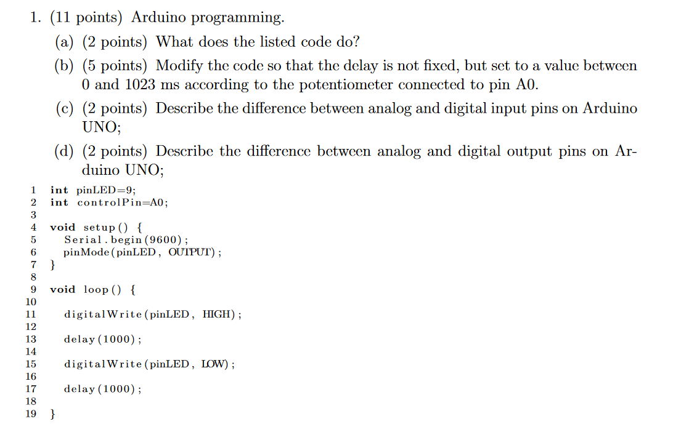
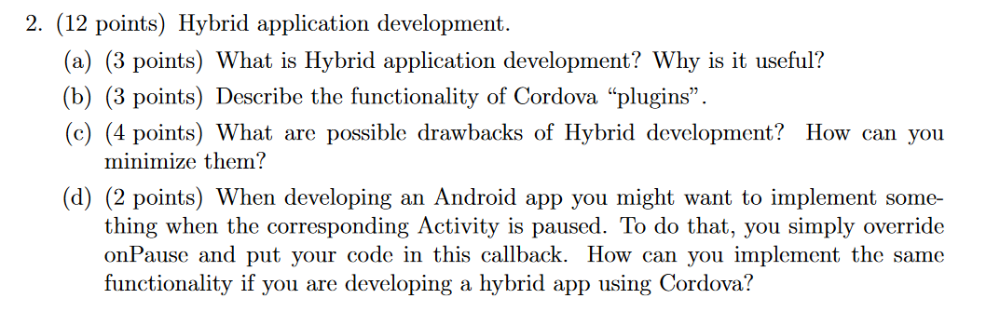
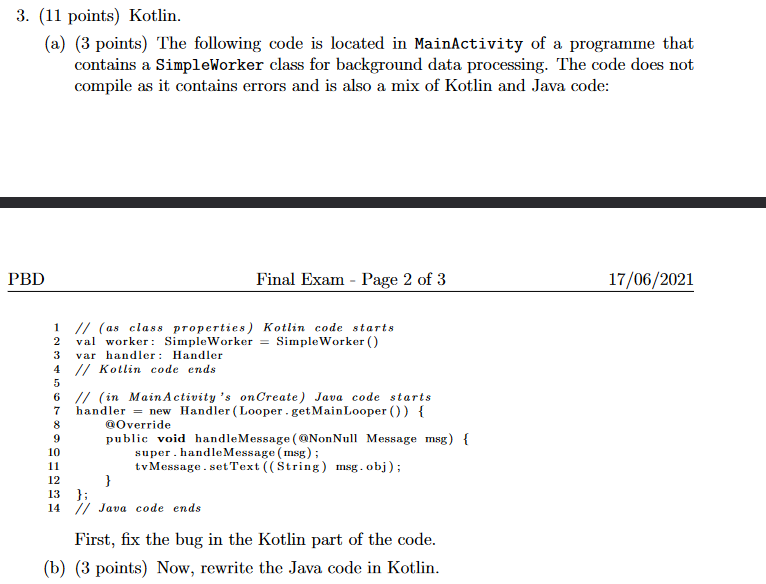
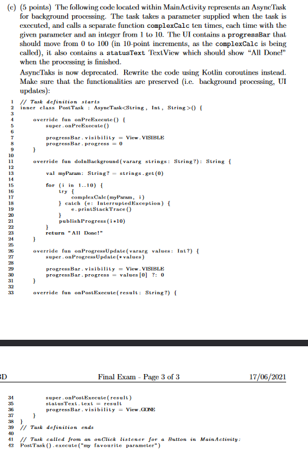
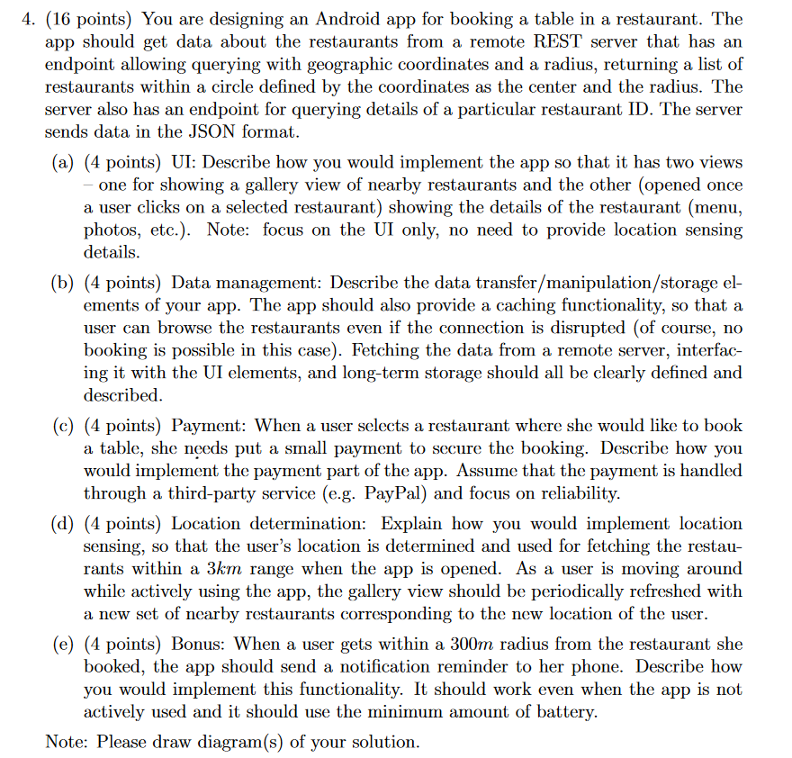
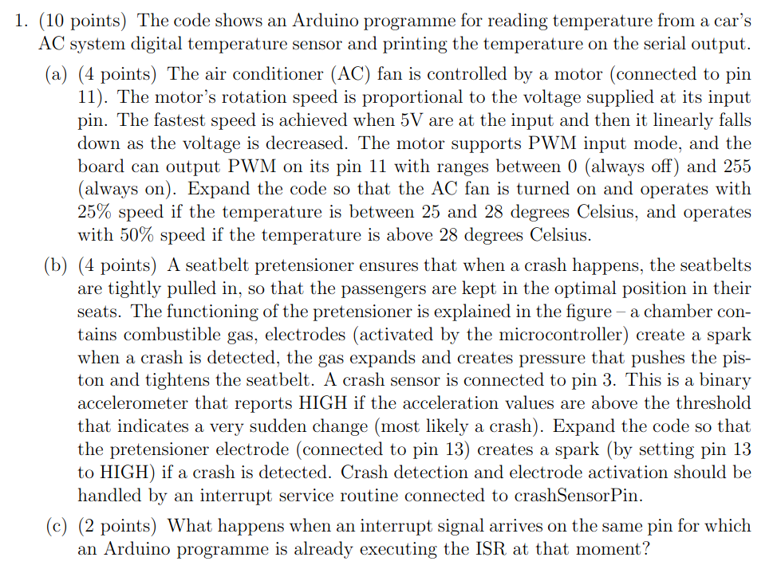
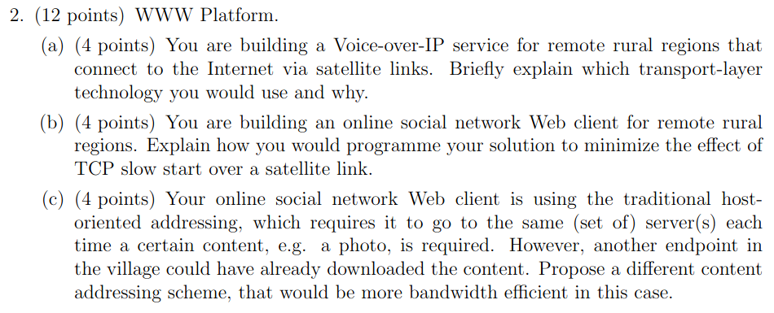
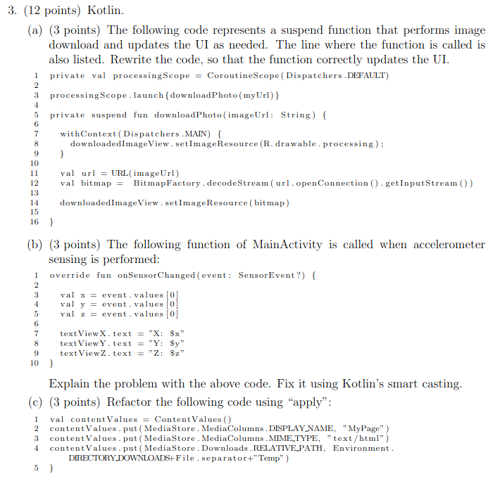
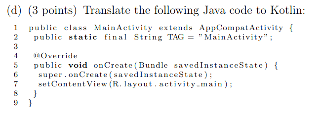
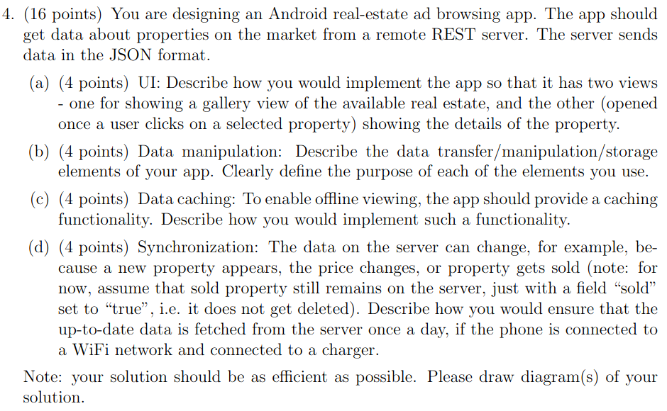

# 1. IZPIT



a) LED flashes (turn on, 1 s, turn off, 1 s,...)

b)
```kotlin
        int pinLED = 9;
        int controlPin = A0;

        int potentiometer = 0;
        void setup(){
        Serial.begin(9600);
        pinMode(pinLED, OUTPUT);
        pinMode(controlPin, INPUT);
        }

        void loop(){
        potentiometer = analogRead(controlPin);
        digitalWrite(pinLED, HIGH);
        delay(potentiometer);
        digitalWrite(pinLED, LOW);
        delay(potentiometer);
        }
```
c) Analog Input Pins: These pins can measure voltage levels ranging from 0 to 5 volts. They can provide a resolution of 1024 distinct values (0 to 1023) representing the input voltage.  
Digital Input Pins: Digital input pins can only read two states: HIGH or LOW. They are typically used to detect the state of a switch or a sensor that provides a binary (on/off) signal. Digital input pins are also compatible with 5-volt logic signals.
d) Isti shit sam d ma analog 0 do 255



a) Hybrid application development refers to the process of creating mobile applications using web technologies such as HTML, CSS, and JavaScript, which are then wrapped in a native container. This approach allows developers to build applications that can run on multiple platforms, including iOS, Android, and others. Hybrid development combines the benefits of web development with the ability to access device features and APIs through native wrappers.  
The key advantage of hybrid application development is its cross-platform compatibility. By using a single codebase, developers can target multiple platforms, saving time and effort compared to building separate native applications for each platform. Hybrid apps also have access to device features, such as camera, accelerometer, and geolocation, through various frameworks and plugins.

b) Cordova plugins are add-ons or extensions that enhance the functionality of hybrid applications built with Apache Cordova (formerly known as PhoneGap). Cordova provides a set of core APIs that allow access to native device features, but plugins extend this functionality by providing additional APIs for specific features or services.  
Cordova plugins can be developed by the community or by third-party developers and can cover a wide range of functionalities, such as accessing the device's camera, reading contacts, playing audio, interacting with the file system, integrating with social media platforms, and much more. These plugins provide a bridge between the JavaScript code in the hybrid app and the native APIs of the underlying platform, enabling developers to leverage native features seamlessly.

c) Possible drawbacks of hybrid development include:  
    - Performance: Hybrid apps may not perform as well as native apps, especially for graphics-intensive or processor-intensive tasks. The overhead of the web-based rendering engine and the bridge to native APIs can impact performance.
    - User Experience: Hybrid apps may not provide the same level of user experience as native apps. They may feel less responsive or lack the native look and feel, which can affect user satisfaction.
    - Limited Access to Device APIs: Hybrid apps rely on plugins to access certain device features and APIs. If a required plugin is not available or poorly maintained, it may limit the app's capabilities.
  To minimize these drawbacks, consider the following approaches:  
    - Optimize Performance: Employ techniques such as optimizing JavaScript code, using efficient CSS and HTML, and leveraging hardware acceleration to enhance app performance.
    - Utilize Native Components: Incorporate native components or frameworks where necessary to provide a more native-like experience and improved performance for specific features.
    - Choose Plugins Carefully: Research and select well-maintained plugins with good community support to ensure access to required device APIs and functionality.

d) `document.addEventListener("pause", callback);`





a & b) 
```
        // (as class properties)
        val worker: SimpleWorker = SimpleWorker()
        lateinit var handler: Handler

        // (in MainActivity's onCreate)
        handler = object : Handler(Looper.getMainLooper()) {
            override fun handleMessage(msg: Message) {
                super.handleMessage(msg)
                tvMessage.text = msg.obj as String
            }
        }
```

c)
```kotlin
val = scope = CoroutineScope(Dispatchers.Default)

// inside a button event listener:
scope.launch {
    withContext(Dispatchers.Default) {
        backgroundProcessing("my favourite parameter")
        for (i in 1..10) {
            try {
                complexCalc("my favourite parameter", i)
            } catch (e: InterruptedException) {
                e.printStackTrace()
            }
            progressBar.visibility = View.VISIBLE
            progressBar.progress = i * 10
        }
    }
    statusText.text = "All Done!"
    progressBar.visibility = View.GONE
}
```



a) The app would have 1 Activity with a NavHostFragment and 2 Fragments; ListFragment that would contain would contain a RecyclerView to list of all restaurants (e.g. CardViews) and would use an Adapter would to connect the views with data objects. DetailsFragment would contain all the specific information regarding a restaurant and buttons to book it (ImageView, TextView,...)
The 2 fragmants would be connected using the nav graph, IDs must be passed through so the right restaurant is displayed 

b) The Fragments should obtain the data from ItemsViewModel, where the data is stored in LiveData objects. The
ViewModel communicates to Repository class, which manages storing/fetching of data from REST API and the locat database. For the REST API, we will need Retrofit and define a DTO (we will also need GSON). For the local database, we will use Room to create it, then define the operations using DAO. The @Entity object Item will define a table of data in there. Once ran, the app pulls data from the server via the Repository, stores it in the database, and shows listings to the user via the Fragments that obtain the information from the ItemsViewModel.

c) Using WorkManager and the Repository class, we can request for data every 24 hours to check for any changes.

# 2. IZPIT



a & b)
```c
#include <OneWire.h>
#include <DallasTemperature.h>

#define ONE_WIRE_BUS 2

OneWire oneWire(ONE_WIRE_BUS);
DallasTemperature sensors(&oneWire);

const int crashSensorPin = 3;       // the number of the crash sensor pin
const int pretensionerPin = 13;     // the number of the seatbelt pretensioner pin
const int ACfanPin = 11;            // the number of the AC fan pin

void setup() {
  pinMode(crashSensorPin, INPUT);
  pinMode(pretensionerPin, OUTPUT);
  pinMode(ACfanPin, OUTPUT);

  attachInterrupt(digitalPinToInterrupt(crashSensorPin), seatbelt, RISING);

  Serial.begin(9600);
  sensors.begin();
}

void loop() {
  // Temperature reading
  sensors.requestTemperatures(); // Send the command to get temperatures
  float temperature = sensors.getTempCByIndex(0);

  Serial.print("The temperature is: ");
  Serial.print(temperature);
  Serial.println(" degrees Celsius");

  // AC fan control (part a)
  if (temperature >= 25 && temperature <= 28) {
    analogWrite(ACfanPin, 64); // 25% speed-ish (or just do 0.25 * 255)
  } else if (temperature > 28) {
    analogWrite(ACfanPin, 128); // 50% speed-ish (or just do 0.5 * 255)
  } else {
    analogWrite(ACfanPin, 0); // Fan off
  }

  // Pretensioner electrode activation (part b)
  if (crashDetected) {
    digitalWrite(pretensionerPin, HIGH);
    delay(1000); // Electrode activation duration (1 second)
    digitalWrite(pretensionerPin, LOW); // Deactivate electrode
    crashDetected = false; // Reset crash detection
  }
}

void seatbelt(){
  digitalWrite(pretensionerPin, HIGH);
}
```

c) When an interrupt signal arrives on the same pin for which an ISR is already executing, it will wait for the currently executing ISR to finish before executing the new interrupt.



a) The most suitable transport-layer technology would be User Datagram Protocol (UDP),  a connectionless transport protocol that provides a lightweight and efficient way to transmit data over the network.  
In this scenario, the primary concern is real-time communication and minimizing latency. UDP offers lower overhead compared to Transmission Control Protocol (TCP) since it does not include mechanisms like reliable delivery, congestion control, and flow control. This lower overhead results in reduced latency and ensures faster transmission of voice packets.  
Additionally, satellite links tend to have high latency and limited bandwidth, which can introduce delays and packet loss. UDP's connectionless nature allows it to better handle these conditions. It enables the VoIP application to send packets without waiting for acknowledgments, which can help mitigate the impact of latency and provide a smoother voice communication experience.  
However, it's important to note that UDP does not provide built-in reliability or error recovery mechanisms. Therefore, the VoIP application would need to incorporate mechanisms such as packet loss detection, retransmission, and jitter buffering to ensure reliable voice transmission over the satellite link.

b) Connection pooling: Maintain persistent connections to avoid slow start.  
Multiplexing and pipelining: Send multiple requests within a single connection to maximize network efficiency.  
Adjust initial congestion window: Increase the initial packet allowance to expedite congestion window growth.  
Use satellite-specific congestion control algorithms like BBR or CUBIC.  

c) To improve bandwidth efficiency in the scenario of an online social network web client, a content-centric addressing scheme like Content-Centric Networking (CCN) or Named Data Networking (NDN) can be used. Instead of relying on server addresses, content is identified by unique names. When a user requests content, routers cache it, allowing subsequent requests within the village to be served locally, reducing reliance on remote servers and improving bandwidth efficiency. (Alternative: peer-to-peer)




a) (pri vrstici 11-14):
```kotlin
withContext(Dispatchers.Main) {
  val url = URL(imageUrl)
  val bitmap = BitmapFactory.decodeStream(url.openConnection().getInputStream())
}
```

b)
```kotlin
override fun onSensorChanged(event: SensorEvent?) {
        val x = event?.values[0]
        val y = event?.values[1]
        val z = event?.values[2]

        textViewX.text = "X: $x"
        textViewY.text = "Y: $y"
        textViewZ.text = "Z: $z"
}
```

c)
```koltin
val contentValues = ContentValues().apply {
    put(MediaStore.MediaColumns.DISPLAY_NAME, "MyPage")
    put(MediaStore.MediaColumns.MIME_TYPE, "text/html")
    put(MediaStore.Downloads.RELATIVE_PATH, "${Environment.DIRECTORY_DOWNLOADS}${File.separator}Temp")
}
```



a) 1 Activity with NavHostfragment and 2 Fragments EstatesListFragment & DetailsFragment  
EstatesListFragment: RecycleViewer to store list of estates (e.g. CardView), uses Adapter to get data  
DetailsFragment: Details regarding the estate (ImageView, textCiew,...)  
The two are connected with nav graph, the ID is passed so the right estate details are shown

b) ItevViewModel which is stored in a LiveData object (observed by the Fragments). It communicates with the Repository class, which we use to access REST API and local database. For the local db, we use Room and define functions with DAO, then we also need to define an @Entity object to have a table for data. For REST API, we use Retrofit and GSON, then define functions in DTO.  
When the user first opens the app data from REST API is fetched and added in the local db. When offline, the app can now access that local db (of course we cannot buy the estates when offline).

c) mentioned in b)

d) With WorkManager and Repository we check for data changes every 24 hours and update them (posledično tudi Views) accordingly.