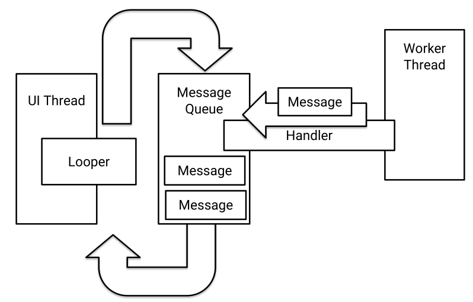
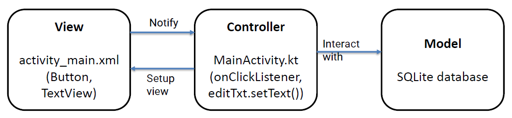
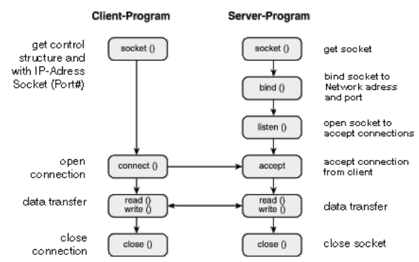

# 1. OVERVIEW OF PLATFORMS

## 1.1 What is a Platform?

**Platform is the environment in which a software application is executed.**

**Environment** = hardware and/or software (e.g. computer architecture, operating systems, APIs, programming frameworks etc.).

### Abstraction levels of platform

*From "32-bit platform" to "Platform-as-a-service.*

1. **Hardware level** - processing capabilities, IO capabilities
2. **Middleware level** - drivers, operating systems
3. **Higher level** - APIs, Cloud, etc.

### Platform breakdown

- web platforms
- mobile platforms
- industrial/embedded platforms
- gaming platforms

## 1.2 Web platforms

> **The Web is not equal to The Internet** - Web is most popular service running on top of the internet.

### History

In 1989 Tim Berners-Lee joins hypertext with internet to create **the World Wide Web**, *Hypertext* is text document with references that can be immediately accessed. We need: information storage, connectivity.

WWW creates a global information space, storage is implemented via **web servers**, hypertext documents are written in **HTML** and communcation is done over internet with client-server protocol **Hyper Transfer Protocol HTTP**.

### HTTP's properties

HTTP uses **request-response** client-server protocol. Web browser (client) issues request and web server sends response (requests: GET, POST, PUT, DELETE, etc). For resource locators are used **URLs** (uniform resource locators) - URLs are translated to IP address using DNS (domain name system).

HTTP is stateless protocol, for saving states cookies are used.

HTTPS is used for encrypted communication.

### Web platform evolution

1. **Single-tier architecture** - user interface, business logic and data are all within the same programme.
2. **Multi-tier architecture** - different layer for presentation, logic and data. Better for scaling and upgrading, layers are more flexible.

| **Layer**                            | **Environment & language**               |                                                                                                                     |
| ------------------------------------ | ---------------------------------------- | ------------------------------------------------------------------------------------------------------------------- |
| Presentation layer (frontend)        | HTML5, JS, CSS, AJAX, Angular, Bootstrap | dealing with UI, user iteractions                                                                                   |
| Application/Business layer (backend) | Java, .Net, Python, Rust, Apache, etc.   | dealing with app logic, data fetching, processing, interaction with frontend, etc.                                  |
| Data layer                           | MySQL, Oracle, PostgreSQL, MsSQL, etc    | dealing with data storage and organization (SQL vs NoSQL); relational (MySQL) vs. non-relational (MongoDB) database |

### MEAN architecture

> M - MongoDB (database)
> E - ExpressJS (backend Web server framework)
> A - Angular (frontend developement)
> N - Node.js (event-driven server-side and networking)


## 1.3 Mobile computing platforms

### Mobile Computer Development Timeline

- 1994 - IBM Simon (first *"smartphone"*): cellular telephony + emailing, faxing + apps
- late 1990's - PDAs (personal digital assistant): Nokia 9000 Communicator, eary versions of mobile operating systems
- early 2000's - Mass adoption: Blackberry
- 2007 - iPhone: touchscreen, sensors, App Store
- 2008 - Android OS: open source, Linux-based
- today: more than 1 billion users, dynamic market, millions of apps

### Mobile Platform - Operating Systems

1. **Symbian** - started in 1998, used by Nokia, Samsung, Sony Ericsson, etc., very resource efficient, smartphones brought new affordances
2. **iOS** - specific hardware, not transplantable, development supported through iOS Software Developement Kit, Objektive-C or Swift
3. **Android** - open source, created by Google, based on Linux, runs on different hardware platforms, developement supported through Android SDK and Android Studio

### Conclusions

- mobile phones are **personal** devices, user **interaction** remains crucial
- platform should allow easy application developement and disctribution
- **context awareness** makes mobiles adaptive to the current situation (access to sensors etc.)

## 1.4 Embedded systems

Computer systems are often (98%) embedded in everyday objects. Today arround 100 billion microcontrollers compared to 5 bilion smartphones and 2 bilion PCs.

Embedded systems are very constrained systems (energy, autonomous operation, real-time operation, etc.). They interact with environment through sensors, react to it through actuator and communicate via wireless.

Embedded systems are programmed in low-level languages (memory and energy constraints), C, C++ or assembler. Task completion time constraints call for real-time OS - event-driven pre-emptive multitasking. Low priority tasks are executed in an infinite loop, high priority events are executed via interrupt routine and preempts the current task.

They can have real-time OS (microkernel), specific purpose OS or none (only bootloader) (Arduino).

## 1.5 Gaming Platforms

- need for high-quality graphics
  - hardware: Graphical processing units (GPUs)
  - software: Game engines
- game developement in high-level languages (C#/JavaScript for Unity)

# 2. PLATFORM CONSTRAINTS

Hypermedia is globally connected via HTTP and the Internet.

## 2.1 REST - Representational State Transfer

Rules:

- client-server model: black box to each other
- statelessness: server doesn't track state of client
- cacheability
- layered system requests could be forwarded/translated
- uniform interface (client-modify or delete the resource, identify every resource)
- code on demand (servers can customize client's functionality)

## 2.2 Constraints

- **statelessness** - client needs to send context, in practise developers implements their own solutions (adding headers, etc.)
- **HATEOAS** - communication that does not involve a human user can be tricky

Constraints of MEAN:

- non-relational database can be an issue
- just a set of technologies, replaceable

Constraints of HTTP:

- **expressivity of the HTTP vocabulary** - can you accomplish everything with GET, POST, PUT, DELETE?
- **Keep-Alive connection** - uses memory and other resources
- **non secure by default**
- connection-oriented and too heavy for certain application

Constraints of TCP/IP:

- **host-oriented**: addressing by location, not by content
- **impact of TCP engeneering** on Web apps
- **TCP performance** in resource constrained networks

## 2.3 Embedded Platform Overview

- computing embedded in (everyday) devices
- small form factor, limited resources
- interact with the environment through sensors
- react to the environment through actuators
- need to communicate via wireless
- hardware-aware development
- limited resources
- deploy and forget (no troubleshooting, autonomous functioning)
- limited baterry charge $\rightarrow$ extreme energy efficiency

# 3. MOBILE PLATFORM PROGRAMMING

## 3.1 Constraints and Challenges

- energy (no large batteries, not connected to a charger)
- processing constraints: app gets only small share of the total resources
- user interaction constraints (intuitive and responsive despite limitations)
- uniform user experience
- wireless constraints (wireless signal, quality varies, availability & cost)
- context sensing challenges: inconsistent sensors, raw data has to be processed to use on high-level
- security & privacy

# 4. ANDROID PROGRAMMING

## 4.1 Architecture

**The Android Platform** contains: Android mobile OS, Android libraries (androidx, support libraries, ...), application frameworks and key apps.

### 4.1.1 Key Android Features

1. **Tailored for battery-powered devices** - process management, when app is not used it gets suspended
2. **Tailored for low-memory devices** - when memory is low, suspended apps are terminated
3. **Support for direct manipulation interfaces** - touchscreen gestures, sensors, notifications
4. **Open ecosystem of applications**


### 4.1.2 Linux Kernel Services

1. **Memory and process management**
   - usually one process per app
   - processes are allocated a certain amount of memory
   - Android automatically manages the process lifecycle
   - interprocess communication
2. **Security management**
   - based on Security-Enhanced Linux
   - only the kernel and a few core applications run as a root
   - each app is assigned a unique UID runs in its own sandbox
   - each app gets set of permissions
3. **Bad programming is the biggest threat**
   - exposing data to other apps, insecure networking, buggy native code, dynamic code loading
4. **Power management**
   - screen dimming, process killing
   - wakelocks - prevent the device from going to "sleep"
   - *Project Volta* - from Lollipop onwards, the OS takes care of scheduling periodic jobs for the apps
5. **File and network I/O**
6. **Device drivers**

### 4.1.3 Native Libraries

- System C library (bionic libc)
- Surface manager (composing windows on the screen)
- Open GL (3D graphics)
- OpenMAX (audio, video, and image processing)
- Media Framework (recording and playback of audio/video/photos)
- SQLite
- Webkit
- Natural Networks API

### 4.1.4 Android Runtime

1. **Android core libraries** - besides standard Java libraries.
2. **Process virtual machine (VM)** - Dalvik/Android runtime.
   - ART: when the *.apk* is installed, ART uses ahead-of-time (AOT) compilation to convert it and save it as native machine code
   - Dalvik: trace-based just-in-time (JIT) compilation
3. **Compilation and workflow (with ART)**
  - app written in Java/Kotlin
  - compiled to Java bytecode files *(.class files)*
  - DX converts Java bytecode files to a single DEX bytecode file *(.dex file)* optimised for space
  - *.apk* file is generated with the dex file and all the application resources, manifest, etc.

### 4.1.5 Application framework

1. **Package Manager**:
   - keeps track of the installed applications
2. **Window Manager**:
   - manages aapplication's windows - `setContentView` connects the given View with activity's Window
3. **Content Providers**:
   - applications are sandboxed
   - content provider manages acess data between applications
4. **Location Manager**:
   - provides location and movement information
   - ways to access location info: directly through Location Manager or Google Play Location Services (preferred)
5. **Notification Manager**:
   - means for application to initiate interaction with a user
   - Notification Manager also allows to peek into other applications’ notifications
6. **Resource Manager**: Android application resources - non-compiled static content of application (images, music, etc.)
   - support for different screen sizes, orientations, languages, platform versions,...
7. **Activity Manager**:
   - manages the application lifecycle and navigation through the stack of application pages that a user sees
8. **View System** - for building app's User Interface (UI):
    - defined by an XML file

## 4.2 Basic Application Components

1. **Activity** - has a graphical user interface (GUI)
2. **Service** - performs background processing
3. **BroadcastReceiver** - subscribes to events of interest
4. **Intent** - communicates an intention to perform an action
5. **ContentProvider** - encapsulates and exposes data

## 4.3 Activity Lifecycle

It's the primary class for managing user interaction. One Activity usually implements a single focused task a user can do. Activity interface itself is usually defined in a separate layout file, an XML file in the resources. Activities are kept active only when user can iteracts with them, when not in use (in background) there are stopped. If OS needs resources activities may be destroyed.

**Activity state**

1. **Active/Running** - in the foreground, visible and user can iteracts with them
2. **Paused** - lost focus, but still visible, maintains state and member information
3. **Stopped** - completely obscured by another activity, retains state and member information, however, no longer visible and it could be terminated by the OS


### onCreate()

It is called when activity is first created, it sets up initial state (create and configure views, set activity's content view, bind data, etc.). Method also gets Bundle with Activity's previous state.

**`super.onCreate()`** - hides some complex code that must be called in order to instantiate the Activity properly.

### onStart()

It is called when the activity is becoming visible.

### onRestart()

It is called if the activity is becoming visible, after being stopped. Will be followed by `onStart()` and `onResume()`

### onResume()

It is called **when the activity is visible** and is about to start interacting with the user. In it we start foreground-only activities (e.g. getting user location and show it on the map).

### onPause()

It is called when activity loses focus and another activity is about to start. We use it to commit unsaved changes to persist data, stop animations and CPU-intensive processing. Processing in this method should be done quickly, because next activity will not start until this method ends.

### onStop()

It is called when activity is no longer visible (because another activity is being started for example). We release resources that are not needed while the activity is not visible and we perform CPU-heavy shutdown operations. After this method still exists but is no longer connected to Window Manager.

- Called when the Activity is no longer visible
  - Another Activity is being started, an existing one is being brought in front of this one, or this one is being destroyed
- Release resources that are not needed while the activity is not visible
- Perform CPU-heavy shutdown operations
- Your activity still exists, but is not connected to Window Manager
  - Returning (via onRestart()) will set the Activity state back to the last seen value

### onDestroy()

It is called when activity is about to get destroyed (when `finish()` is called, when OS calls it or the back button is pressed). In it resources are released (such as Threads).  
*It **may not be called** if Android kills application.*

### 4.3.1 Design Decisions - Placing App Functionalities

- Instantiate member variables of the class: `onCreate()`
- Register listeners for events: `onResume()`/`onStart()`
- Unregister listeners for events: `onResume()`/`onStop()`
- Kill threads that the activity has spawned: `onDestroy()`

### 4.3.2 Saving Activity State

`onSaveInstanceState()` is called when the Activity gets stopped to store state in a Bundle. It is not part of the lifecycle. In a bundle we should store only "Light" values and not big objects.

Bundle is restored in `onRestoreInstanceState()` or in `onCreate()`.

## 4.4 Starting Activities

To start activity we have to create Intent specifying activity to start, then we pass intent to one of
the methods:

- `startActivity()` - launches the Activity described by the Intent
- `startActivityForResult()` - we excpect result to be returned from started activity (via `setResult()`)

### 4.4.1 Task

**Task** is **collection of Activities** that users iteracts when performing certain job. Activities in task could be from the same application or not.

**Backstact** - activities are arranged in a stack in the order of creations. When launched activity is pushed on top of stacka nd when destroyed activity is popped of stack. In the backstack there can be more then one instance of same activity.


### 4.4.2 Intent

**Intent** is data structure that represents an operation to be performed or event that has occured. It serves as a glue between activities and it holds abstract description of an action to be performed.  
Intent Fields: Action, Data, Category, Type, Component, Extras

### Action Field

Represents desired operation:

- ACTION_DIAL - dial a number
- ACTION_EDIT - start a component that can edit a certain piece of data (to be defined)
- ACTION_GET_CONTENT - start a component that can get a certain piece of data (to be defined)

```kotlin
val newIntent = Intent(Intent.ACTION_DIAL)
// OR
val newIntent = new Intent()
newIntent.setAction(Intent.ACTION_DIAL)
```

### Data Field

Is formated like URI (e.g. `Uri.parse("content://contacts/people/1"`) contact of a person "1")

```kotlin
val newIntent = Intent(Intent.ACTION_VIEW,
Uri.parse("geo:0,0?q=Ljubljana, Slovenia, 1000"))
// OR
val newIntent = Intent(Intent.ACTION_VIEW)
newIntent.setData(Uri.parse("geo:0,0?q=Ljubljana, Slovenia, 1000"))
```

### Category Field

Gives additional information about the component that can handle an intent

- `CATEGORY_BROWSABLE` - can be invoked by a browser to display data referenced by a URI
- `CATEGORY_LAUNCHER` - can be the initial activity of a task and is listed in the top-level app launcher

### Type Field

Specifies MIME (internet standard) type of intent data:

- image/*, image/png, image/jpeg
- text/html, text/plain

```kotlin
Intent.setType(type: String?)
// OR
Intent.setDataAndType(data: Uri?, type: String?)
```

### Component Field

Specifies **explicit name** of component class to use in intent. **If component field is set then the implicit matching is skipped**, and the specified component is launched. In this case all of the other Intent attributes become optional.

```kotlin
val newIntent = Intent(packageContext: Context!, cls: Class<*>!)
// OR
val newInt = Intent ()
  //and one of:
  setComponent(), setClass(), or setClassName()
```

### Extras Field

Bundle of additional information associated with intent. Different method depending on the data type:

- `putExtra(name: String!, value: String?)`
- `putExtra (name: String!, value: FloatArray?)`
- etc.

```kotlin
val newInt = Intent(Intent.ACTION_SEND)
newInt.putExtra(android.content.Intent.EXTRA_EMAIL, arrayOf<String>("bob@yahoo.com", "alice@microsoft.com"))
```

### Specifying IntentFilters

Setting activity to handle sending text and media.

```xml
<activity android:name="ShareActivity">
    <!-- This activity handles "SEND" actions with text data -->
    <intent-filter>
      <action android:name="android.intent.action.SEND"/>
      <action android:name="android.intent.action.SEND_MULTIPLE"/>
      <category android:name="android.intent.category.DEFAULT"/>
      <data android:mimeType="text/plain"/>
      <data android:mimeType="application/vnd.google.panorama360+jpg"/>
      <data android:mimeType="image/*"/>
      <data android:mimeType="video/*"/>
    </intent-filter>
</activity>
```

### 4.4.3 Flags

Specify how Intent should be handled:

- `FLAG_ACTIVITY_NO_HISTORY` - don’t keep the activity on the history task
- `FLAG_ACTIVITY_NEW_TASK` - the activity is started in a new task

Note: these flags can **change the default backstack behaviour**, and can result in unintuitive applications - **use carefully**!

```koltin
val newInt = Intent(Intent.ACTION_SEND)
newInt.setFlags(Intent.FLAG_ACTIVITY_NO_HISTORY)
```

```xml
["multiple"|"singleTop"|"singleTask"|"singleInstance"]
```

## 4.5 Android UI

UI is usually provided via Activities and Fragments: `setContentView(View v)`.

### 4.5.1 View

**View** is the main class on which the View System operates, it is responsible for drawing itself and handlign events. From View we **derive** other UI objects (Button, EditText, MapView,...). View and its derived classes can be instantiated through **XML** code or **Kotlin/Java** source code.

Other View Examples:

- TextView
- EditText
- CheckBox
- SeekBar
- Switch
- CalendarView
- AdapterViews: separation between the data (model) and children views, manages the data and provides it to the views (example ListView)

### View Events

Stem from **user interaction** and lifecycle changes. Listeners are used for handling View
events:

- `OnClickListener.onClick()` capture View clicked event
- `OnLongClickListener.onLongClick()` capture View clicked and held for some time
- `OnTouchListener.onTouch()` capture View touched

### View Parameters

XML attributes that define positioning, behaviour, rendering. Positioning and sizing should be relative in order to support different screen sizes.

### Displaying Views

Views are organised in a tree** with the root View containing all the others. Displaying Views includes:

- Measuring each of the elements (calling `onMeasure()`)
- Aligning the children (calling `onLayout()`)
- Rendering the view (`onDraw()`)

### Grouping Views

ViewGroup is an invisible View that contains other Views.It is used for grouping and organizing views.

### 4.5.2 Layouts

- LinearLayout: Child views arranged in a single horizontal or vertical row
- RelativeLayout: Child views are positioned relative to each other and to parent view
- ConstraintLayout: The latest, fastest layout that allows complex flat organisation

### 4.5.3 App Bar

Allows quick access to frequently used operations (title, logo, navigation, action menu). It is similar to the application bar in desktop apps.  
**Toolbar** was introduced in API 21 (Lollipop) to replace **ActionBar** introduced in API 11. It is more general than ActionBar, as it can be placed anywhere within the view hierarchy.

Use Toolbar as App Bar:

```gradle
dependencies {
  implementation 'androidx.appcompat:appcompat:1.1.0'}
```
```xml
<androidx.appcompat.widget.Toolbar
  android:id="@+id/toolbar"
  android:layout_width=”match_parent"
  android:layout_height="wrap_content”
  ...
/>
```
```kotlin
import androidx.appcompat.app.AppCompatActivity
import androidx.appcompat.widget.Toolbar

class MyActivity : AppCompatActivity () {
  override fun onCreate(savedInstanceState: Bundle?) {
    super.onCreate(savedInstanceState)
    setContentView(R.layout.activity_my)
    Toolbar toolbar = findViewById(R.id.toolbar)
    setSupportActionBar(toolbar)
  }
}
```

### 4.5.4 Menus

Formalised in Android to provide consistent user experience across applications. Activities support menus - add items to a menu, handle `onClick` events for the menu. Menu types: options menu, context menu, popup menu

### Options Menu

Primary menu where actions such as "compose new email", "settings" and similar are added.

```xml
<?xml version="1.0" encoding="utf-8"?>
<menu xmlns:android=
  "http://schemas.android.com/apk/res/android">
  <item android:id="@+id/new_game"
    android:icon="@drawable/ic_new_game"
    android:title="@string/new_game"
    android:showAsAction="ifRoom"/>
  <item android:id="@+id/help"
    android:icon="@drawable/ic_help"
    android:title="@string/help" />
</menu>
```
```kotlin
override fun onCreateOptionsMenu(menu: Menu?): Boolean {
  val inflater: MenuInflater = getMenuInflater()
  // or simply menuInflater using Kotlin Android Extensions
  inflater.inflate(R.menu.game_menu, menu)
  return true
}

override fun onOptionsItemSelected(item: MenuItem): Boolean {
  when (item.itemId) {
    R.id.new_game -> {
      newGame()
      return true
    }
    R.id.help -> {
      showHelp()
      return true
    }
  }
}
```

### Context Menu

Options that affect the selected item in the context of the current UI frame.

```kotlin
val btn: Button = findViewById(R.id.btn)
registerForContextMenu(btn)

override fun onCreateContextMenu(menu: ContextMenu?, v: View?, menuInfo: ContextMenu.ContextMenuInfo?) {
  super.onCreateContextMenu(menu, v, menuInfo)
  menuInflater.inflate(R.menu.context_menu, menu)
}

override fun onContextItemSelected(item: MenuItem): Boolean {}
```

### 4.5.5 Fragments

Main purpose of Fragments is to support more dynamic and flexible UI designs and UI element reusability. Fragment has layout and lifecycle, but unlike activity, Fragment needs parent Activity, doesn't need to be the only fragment on the screen and doesn't talk directly to other fragments.

Fragment Lifecycle is similar to Activity lifecycle:

- Fragment creation in `onCreate()`
- Fragment UI in `onCreateView()`
- Fragment moving to the background in `onPause()`
- Fragment lifecycle is attached to the underlying Activity lifecycle
- 
Note: a Fragment is not automatically added to the backstack, but you can add it manually - `addToBackStack()`.

```xml
<LinearLayout
xmlns:android="http://schemas.android.com/apk/res/android"
  android:orientation="horizontal"
  android:layout_width="match_parent"
  android:layout_height="match_parent">
  <fragment android:name="com.example.news.ArticleListFragment"
    android:id="@+id/list"
    android:layout_weight="1"
    android:layout_width="0dp"
    android:layout_height="match_parent" />
    <fragment android:name="com.example.news.ArticleReaderFragment"
    android:id="@+id/viewer"
    android:layout_weight="2"
    android:layout_width="0dp"
    android:layout_height="match_parent" />
</LinearLayout>
```
```kotlin
val fragmentTransaction = supportFragmentManager.beginTransaction()
val fragment: ExampleFragment = ExampleFragment()
fragmentTransaction.add(R.id.fragment_container, fragment)
fragmentTransaction.commit()
```

### Communicating between Fragment and Activity

In fragment we can access context or parent activity through `getContext()` or  `getActivity()`. Activity can access fragment via FragmentManager `findFragmentByID()` or `findFragmentByTag()`.

```kotlin
val fragment: ExampleFragment = supportFragmentManager.findFragmentById(R.id.example_fragment) as ExampleFragment
```
```kotlin
class FragmentA: ListFragment() {
  var listener: OnArticleSelectedListener? = null
  //...
  // Container Activity must implement this interface
  interface OnArticleSelectedListener {
    fun onArticleSelected(Uri articleUri)
  }
  //...
  override fun onAttach(context: Context) {
    super.onAttach(context)
    try {
      listener = context as OnArticleSelectedListener
    } catch (e: ClassCastException) {
      throw ClassCastException(context.toString() + "      must implement OnArticleSelectedListener")
    }
  }
  //...
  override fun onListItemClick(l: ListView, v: View,  position: Int, id: Long) {
    // Append the clicked item's row ID with
    //the content provider Uri
    val noteUri : Uri = ContentUris.withAppendedId(ArticleColumns.CONTENT_URI, id)
    // Send the event and Uri to the host activity
    listener.onArticleSelected(noteUri);
  }
  //...
}
```

### 4.5.6 Material design

Guidelines for designing UI components, it is a design library that has to be included as a dependency in module. It includes components like CoordinatorLayout, BottomSheet, FloatingActionBar, Tabs, etc.

```gradle
dependencies {
  // ...
  implementation 'com.google.android.material:material:<version>'
  // ...
}
```

### Navigator Drawer

DrawerLayout contains:

- **main layout** that shown when the drawer is pulled in
- **NavigationView** that shown when the drawer is pulled out

```xml
    <androidx.drawerlayout.widget.DrawerLayout ...>
      <include
        layout="@layout/some_main_layout"
        android:layout_width="match_parent"
        android:layout_height="match_parent" />
      <com.google.android.material.navigation.NavigationView
        android:id="@+id/nav_view"
        android:layout_width="wrap_content"
        android:layout_height="match_parent"
        android:layout_gravity="start"
        android:fitsSystemWindows="true"
        app:headerLayout="@layout/nav_header"
        app:menu="@menu/navigation_menu" />
    </androidx.drawerlayout.widget.DrawerLayout>
```

**Fragment Navigation with Navigation Drawer** - first child should be a placeholder for fragments
(usually FrameLayout). NavigationView's `onNavigationItemSelected` shoud:

- **create a new Fragment** as needed
- **call a FragmentManager** that will `beginTransaction` to replace the content of the placeholder with this new fragment
- transactions has to be commited: `commit()`

### 4.5.7 Navigation Component

It solves the issue of complex navigation (many Fragments), different interaction methods (drawer, bottom navigation, tabs, etc.) and backstack.
  
### 4.5.8 Binding Views in Kotlin Code

Key idea is to avoid all those findViewById calls. Two major solutions:

- ~~Android Kotlin Extensions - Synthetics~~ (deprecated)
- View Binding - optional feature available for both Java and Kotlin

### View Binding Feature

```gradle
buildFeatures {
  viewBinding true
}
```
```kotlin
private lateinit var binding: FirstScreenBinding

override fun onCreate(savedInstanceState: Bundle?) {
  super.onCreate(savedInstanceState)
  binding = FirstScreenBinding.inflate(layoutInflater)
  val view = binding.root
  setContentView(view)
  binding.my_button.text = “Set in Kotlin!”
}
```

## 4.6 Data Storage

### 4.6.1 SharedPreference

In SharedPreferences we store small amount of primitive type. Data is stored on device in **key-value pairs** and only app that creates it can access it. When app is unistalled from device, SharedPreferences are deleted from device.

### Accessing SharedPreferences

- Reading
```kotlin
val settings: SharedPreferences = getApplicationContext().getSharedPreferences(“preferences”, Context.MODE_PRIVATE)

var wasLaunched: Boolean = settings.getBoolean(“launched”, false)
```
- Need to know the type of data:
  - `getBoolean()`
  - `getString()`
  - `getAll()` returns a Map of key-value pairs
- Writing
```kotlin
val settings: SharedPreferences = getApplicationContext().getSharedPreferences(“preferences”, Context.MODE_PRIVATE)
val editor: SharedPreferences.Editor = settings.edit()
editor.putBoolean(“launched”, true)
editor.commit()
```
- Different put methods for different data types
- Don’t forget to save changes by calling
  - **`editor.commit()`** - synchronous (avoid calling on the main thread) or
  - **`editor.apply()`** - changes the in-memory object immediately, but writes to disk asynchronously

### PreferenceFragmentCompat

A special Fragment that connects XML preference hierarchy with SharedPreferences.
```xml
<androidx.preference.PreferenceScreen
  xmlns:app="http://schemas.android.com/apk/res-auto">
  <SwitchPreferenceCompat
    app:key="notifications"
    app:title="Enable message notifications"/>
  <Preference
    app:key="feedback"
    app:title="Send feedback"
    app:summary="Report technical issues or suggest new features"/>
</androidx.preference.PreferenceScreen>
```
```kotlin
class MySettingsFragment : PreferenceFragmentCompat() {
  override fun onCreatePreferences(savedInstanceState: Bundle?, rootKey: String?) {
    setPreferencesFromResource(R.xml.preferences, rootKey)
  }
}
```

### 4.6.2 File Storage

Android uses common Java File API, that means that files can be saved as **internal** or **external** files.

### Internal Files

- Find where to save files
  - **`getFilesDir()`** an internal directory for your app
  - **`getCacheDir()`** an internal directory for your app's temporary cache files
    - File createTempFile() - to create a unique filename
    - If the system begins running low on storage, it **may delete these cache files**
- Read/write methods
  - `FileOutputStream **openFileOutput** (String name, int mode)` opens file for writing (creates it if needed)
  - `FileInputStream **openFileInput** (String name)` opens a file for reading

### External Files

- **Private** external files -accessible by your application only
  - Removed when your application is uninstalled
  - `getExternalFilesDir()` to get a directory where these files live
  - Use Environment class constants for storing files in appropriate directories
```kotlin
    val myFile: File = File(context.getExternalFilesDir(Environment.DIRECTORY_PICTURES), albumName)
```
- **Public** external files -accessible by other applications as well
- Remain on the device even after your app is uninstalled
- `getExternalStoragePublicDirectory()` is deprecated!
- Storage Access Framework: for storing and accessing non-media files (e.g. pdfs)
- MediaStore: for storing and accessing media files (e.g. pictures)
- Reading and writing to external storage requires permissions on
```xml
    <manifest ...>
      <uses-permission
      android:name="android.permission.WRITE_EXTERNAL_STORAGE”/>
    </manifest>
```
- Before working with external storage, check if the storage is mounted
```kotlin
    fun isExternalStorageWritable(): Boolean {
      val state = Environment.getExternalStorageState()
      if (Environment.MEDIA_MOUNTED.equals(state)) {
        return true
      }
    return false
    }
```

### Moving Target

- Public external files API is deprecated
- Scoped Storage introduced in API 10
  - Apps cannot make files in their data directories accessible to other apps
  - requestLegacyExternalStorage to use the old way
- MediaStore and Storage Access Framework
- New permissions in API 11
  - READ_EXTERNAL_STORAGE for MediaStore access
  - MANAGE_EXTERNAL_STORAGE

### 4.6.3 SQLite

Relational database kept in a single file (write operation gets exclusive lock over app) that supports ACID transactions (Atomic, Consistent, Isolated and Durable).

Use SQLite when SQL queries can be used for improved data presentation. Database will be removed after app is unistalled.

### Working with SQLite

- Work directly via the following key classes:
  - SQLiteOpenHelper: to create, open, modify the tables in the database
  - SQLiteDatabase: to query the database
- Work indirectly through an Object Relational Mapping (ORM):
  - Room - Google’s own ORM
  - Greendao
  - ORMlite

### SQLiteOpenHelper

- Subclass SQLiteOpenHelper for your database
  - **Define your schema** - formal declaration of how the database is organized, and the SQL statements that you use to create your database
- Call `super()` from the subclass constructor to initialize the underlying database
- Execute database creation in `onCreate()`
  - `onCreate()` of the helper is called when a component tries to access a not-yet-existing database
  - SQLiteOpenHelper abstracts the costly DB creation operations, and runs them only when needed
- Access the database via SQLiteOpenHelper:
  - `getReadableDatabase()` (or just `readableDatabase`)
  - `getWritableDatabase()` (or just `writableDatabase`)
- These operations may take some time, thus, run them on a background thread using coroutines

### SQLiteDatabase

- Insert into database by calling `insert()` with ContentValues key-value pairs
- Query the database with `query()` and `rawQuery()`
- ListViews populated with Adapters connected to the database are often the most convenient way of displaying DB content

### Examining DB Content

- Databases stored in `/data/data/<packagename>/databases/`
- Can examine database with sqlite3
```bash
    # adb -s emulator-5554 shell
    # sqlite3
    > /data/data/si.uni_lj.fri.pbd.databaseexamplekotlin/databases/contacts_db
```

## 4.7 Permissions

Android apps are andboxed with **user and group ID** that are unique. By default only most basic functionalities are available to an application, other have to be explicitly asked for.

Permissions are declared in `AndroidManifest.xml`:
```xml
  <uses-permission android:name= "android.permission.ACCESS_FINE_LOCATION"/>
```

**Normal permissions** (FLASHLIGHT, VIBRATE, BLUETOOTH, etc.): the OS will automatically grants these at install time. **Dangerous permissions** (READ_CONTACTS, SEND_SMS, ACCESS_COARSE_LOCATION, etc.): the OS will explicitly ask the user to grant access for dangerous permissions. **Special permissions** (very sensitive, e.g. MANAGE_EXTERNAL_STORAGE): toggles in Special app access page in system settings

**Custom Permissions** can be added to application if application performs privileged/dangerous function.
```xml
<permission android:name="com.testpackage.mypermission"
  android:label="my_permission"
  android:protectionLevel="dangerous"/>
```
Any app that wants to launch yours must request `"com.testpackage.mypermission"`

**Component permissions** - permissions can be defined for individual components restricting which other component can call them

- Activities: which components can call `startActivity()`
- Services: which components can start or bind to a Service
- BroadcastReceivers: which components can receive and send broadcasts
- ContentProviders: which components can read and write content provider data

**Permissions design**: 

- do not request permissions unless you really need them
- show immediate benefit of granting a permission
- use Intents to call other apps in case you don’t need to handle the functionality within your app

## 4.8 Notifications

Notifications are managed via NotificationManager (or, preferably, via **`NotificationManagerCompat`**), notification is posted via **`notify()`** and clered via **`cancel()`** and **`cancelAll()`**.
```kotlin
notification = new NotificationCompat.Builder(this)
  .setContentTitle(notificationTitle)
  .setContentText(notificationText)
  .setSmallIcon(R.drawable.icon)
  .setContentIntent(pendingIntent).build();
```

Notifications are the only way for your app to initiate interaction with the user

- can be a core functionality of your app (e.g. Facebook messenger)
- use to show new/important information to the user, to increase user engagement, to get feedback from the user, to show that a Service is running, ...

Do not overuse and minimise interruptions.

## 4.9 Background Processing

### 4.9.1 Threads

**UI (Main) Thread** is created and started when application is launched - loops infinetely and listens for events on UI components. Intensive work can prevent UI thread from processing UI interaction tasks. That is why heavy/slow operations should be run in **background threads**.

### Thread and Handlers

The most general method. Straightforward solution - create worker Thread, put infinite loop in it and listen for new tasks. Each task is executed and result is reported back to the UI Thread via a Handler. If looped is broken, thread is killed.

**Looper** keeps thread alive in an infinite loop (automatically created for UI thread).

**MessageQueue** hold Messages/Runnables for thread (message for passing data to thread, runnable - task that is executed when thread is free).

**Handler** associated with particular thread and allows sending messages/runnables to the MessageQueue and process them.



### 4.9.2 Services

Activities run on UI (main) thread and have UI attached. Services can run on either main or separated threads and don't have UI attached. Services are more independent then threads and they run even after Activity is destroyed.

Multiple startService calls do not nest - you only have one service; however, `onStartCommand()` will be called repeatedly. Service will be stopped only once with `Context.stopService()` or `stopSelf()`.

**Background services** are for actions that do not have to be noticed by the user. **Foreground services** are actions that user needs to be aware of and should have control of (e.g. music player app). Foreground service must show a notification.

Services can be created explicitly using **`Context.startService()`** or implicitly, if not already running, when a client requests connection to a Service via **`Context.bindService()`**.  
Services can be stopped from within the Service with **`stopSelf()`** or from another component with **`Context.stopService()`**.

**Bound Services** are like servers in client-server paradigm, they are started through binding and they return IBinder object. Services remains running as long as connection is established.

### Note on Foreground Services

- More robust than background service
  - Google aims to minimize background processing
  - FS for immediate guaranteed tasks, such as mobile payments, apps for unlocking garages, etc.
- In API 26 and above
  - Starting a foreground service should be done with:
  - **`startForegroundService()`** - a promise that it will go to foreground and show a notification followed by
  - **`startForeground()`** - the actual notification is shown

### 4.9.3 Broadcast

Broadcasts allows messages (warpped in **Intents**) to be sent from other components of app, other apps or from Android system.

```kotlin
val intent = Intent()
intent.setAction(ACTION)
intent.putExtra(STOP_SERVICE_BROADCAST_KEY, RQS_STOP_SERVICE)
sendBroadcast(intent)
```

Broadcasts are captured in an app/component if a BroadcastReceiver is **dynamically** registered in the code:

```kotlin
class NotifyServiceReceiver: BroadcastReceiver(){
  override fun onReceive(arg0: Context, arg1: Intent) {
    ...
  }
}
```

You can register for receiving only certain kinds of Intents:

```kotlin
val intentFilter = IntentFilter()
intentFilter.addAction(ACTION)
registerReceiver(notifyServiceReceiver, intentFilter)
```

Broadcast receiver should also be registered in `AndroidManifest.xml`, then `onReceive()` is implmented in code:

```xml
<receiver android:name=".MyBroadcastReceiver" android:exported="true">
  <intent-filter>
    <action android:name="android.intent.action.BOOT_COMPLETED"/>
    <action android:name="android.intent.action.INPUT_METHOD_CHANGED"/>
  </intent-filter>
</receiver>
```

```kotlin
class MyBroadcastReceiver : BroadcastReceiver() {
  override fun onReceive(arg0: Context, arg1: Intent) {
    ...
  }
}
```

### 4.9.4 IntentService

**IntentService** is Service that runs on separated thread and queues up requests and processes them one by one. It is suitable for **long running one-off tasks** when programmer doesn't want to affect UI responsiveness. IntentService survives Activity lifecycle changes and is called using explicit Intent (started on demand, stopped when it runs out of work).

1. IntentService should be defined in `AndroidManifest.xml`:
```xml
<service
  android:name=".FetchAddressIntentService"
  android:exported="false"/>
```
1. Class where IntentService is used should be extended with `IntentService`:
```kotlin
class FetchAddressIntentService: IntentService() {
...
}
```

### Invoking IntentService

IntentService is created with explicit Intent and started using `startService()`. Additional data can be added using extra field.

### Handling results

To handle results `BroadcastReceiver` has to be implemented in Activity (with `onReceive()`). Register the receiver for a particular action for times when you would like to handle IntentService results (usually when your Activity is in the foreground). Broadcast from your IntentService `sendBroadcast()` from your IS using the same Intent action as the above.

### JobIntentService

- Android API 26 introduced restrictions for running background tasks
  - IntentService of a terminated app will be terminated before completion
- JobIntentService
  - Exactly like IntentService for API<26
  - Uses Job class for API 26 and higher
    - **Restarts** after an app is killed
- Usage
  - `onHandleWork` instead of `onHandleIntent`
  - static **`enqueueWork`**

### 4.9.5 AsyncTask

**AsyncTasks** are used for **short** and more **interactive** tasks, it is runned on separated worker thread, but keeps link with main UI thread via: `onPreExecute`, `onProgressUpdate` and `onPostExecute`. Background task is defined in `doInBackground()` and started with `Task().execute`.

```kotlin
class PostTask : AsyncTask<String, Int, String>() {
  override fun onPreExecute() {
    super.onPreExecute();
    val bar = findViewById(R.id.progressBar) as ProgressBar
    bar.visibility = View.VISIBLE
    bar.progress = 0
  }
}
```
This is done in the **background**, and the status is communicated via **`publishProgress()`**
```kotlin
override fun doInBackground(vararg params: String?): String {
  val url = params[0]
  for (i in 1..10) {
    try {
      Thread.sleep(1000)
    } catch (InterruptedException e) {
      e.printStackTrace()
    }
    publishProgress(i)
  }
  return "All Done!"
}
```
Connects with the UI thread
```kotlin
override fun onProgressUpdate(vararg values: Int?) {
  super.onProgressUpdate(*values)
  val bar = findViewById(R.id.progressBar) as ProgressBar
  bar.visibility = View.VISIBLE
  bar.progress = 0
}
```
Immediately **after** the task is finished
```kotlin
override void onPostExecute(result: String?) {
  super.onPostExecute(result)
  val bar = findViewById(R.id.progressBar) as ProgressBar
  bar.visibility = View.GONE
  status.text = getString(R.string.after)
}
```

### 4.9.6 Kotlin Coroutines

Asynchronously executed code that does not block the thread it is launched from.

- Corountine $\neq$ Thread
  - Coroutines can reuse Threads
  - Lighter than a Thread
- Coroutine scope
  - Coroutines are managed within groups - scopes
  - GlobalScope - tied with the app lifecycle
  - You can create scopes for your purpose
- Suspend function
  - Contains coroutine code
  - Can be paused and resumed
```kotlin
suspend fun heavyProcessing() {
...
}
```
- Dispatchers
  - Designate threads on which a coroutine will run
  - `Dispatchers.Main`
  - `Dispatchers.IO`
  - `Dispatchers.Default`
- Launching coroutines
  - `launch` - does not return a result to the caller, used when called from traditional functions
  - `async` - allows the caller to wait for the result using `await()`
  - `withContext` - to launch in a different context
    - E.g. from the Main context, launch a child coroutine in the Default context

### 4.9.7 Periodic/Occasional Task Scheduling

**Contraints**: limited battery capacity (long and frequent background processing is main reason for inefficient energy use). That is why Android limits and controls background processing via *wake lock, foreground service, AlarmManager, WorkManager (JobScheduler++), DwonloadManager, SyncAdapter*.

### Wake Lock

App prevents phone from going to a low-power sleep mode, to use it app has to have special permission:
```xml
<uses-permission android:name="android.permission.WAKE_LOCK" />
```
Acquire a wake lock:
```kotlin
val wakeLock: PowerManager.WakeLock =
  (getSystemService(Context.POWER_SERVICE) as PowerManager).run {
    newWakeLock(PowerManager.PARTIAL_WAKE_LOCK, "MyApp::MyWakelockTag").apply {acquire()}
}
```
Release: `wakeLock.release()`

### AlarmManager

AlarmManager is used for running periodic operations at specified times or with specified time interval, used it for tasks that need to be done with exact times between them, but don't used for: periodic backup to the server (use SyncAdapter), checking for new notifications/messages from serve (use Firebase messaging if possible).

There are several types of alarms (depending on exactness):

- **inexact** - Android will decide how to group alarms coming from multiple apps in order to optimize energy use
- **exact** - alarm will be executed at prescribed time, unless device is in sleep mode
- **exact while idle** - alarm will be executed at prescribed time (+/- 9 minutes), even if device is in sleep mode

For the actual clock alarms (`setAlarmClock`), a user will see a clock icon, you need a permission `Manifest.Permission.SCHEDULE_EXACT_ALARM`.

Alarm types (depending on clock):

- **RTC** - real time clock (`RTC_WAKEUP`)
- **ELAPSED_REALTIME** - time since booted (`ELAPSED_REALTIME_WAKEUP`)

To use AlarmManager firstly you need to create `BroadcastReceiver` that manges task you want to perform when alarm is ready. Then you set an alarm with defined type (exact/inexact, one off/repeating, RTC/ELAPSED), starting time, repeating interval (optionally) and supplying Intent that starts BroadcastReceiver.

After device is rebooted, alarm has to be restored:

1. App has to have necessary permission
```xml
<uses-permission
  android:name="android.permission.RECEIVE_BOOT_COMPLETED"/>
```
2. App has to create receiver:
```kotlin
class SampleBootReceiver : BroadcastReceiver() {
  override fun onReceive(Context context, Intent intent) {
    if (intent?.action ==
      "android.intent.action.BOOT_COMPLETED") {
      // Set the alarm here.
    }
  }
}
```
3. Receiver has to be registered in manifest
```xml
<receiver android:name=".SampleBootReceiver">
  <intent-filter>
    <action android:name="android.intent.action.BOOT_COMPLETED"></action>
  </intent-filter>
</receiver>
```

### Doze Mode

Doze mode is mode when device is not charging nor actively used. In this state system sleeps most of the time, but it performs periodic maintence periods when it wakes up and performs tasks from backlog. During sleep mode wake locks are ignored, network access is suspended, AlarmManager is deferred to later time, jobs are not scheduled, sync adapters do not run.

To program with Doze mode in mind use Firebase cloud messaging (FCM) for communication apps - high priority messages can wake device up, WorkManager for scheduling jobs or request to be exempt from Doze (use only for specific apps).

To test apps in Doze mode force device/emulator to idle mode:
```bash
adb shell dumpsys deviceidle force-idle
```

### WorkManager

WorkManager guarantees deferrable, constraint-aware execution with respect to system restrictions. Worker is unit of work:
```kotlin
class UploadWorker(context: Context, params: WorkerParameters):  Worker (context, params) {
  override fun doWork(): Result {
    // Do the work here, e.g. upload the images.
    uploadImages()
    // Indicate whether the task finished successfully
    return Result.success()
  }
}
```
In *WorkRequest* we set constraints, types of execution, e.g.:
```kotlin
val constraints = Constraints.Builder()
  .setRequiresDeviceIdle(true)
  .setRequiresCharging(true)
  .build()

// ...then create a OneTimeWorkRequest that uses those constraints
val request = OneTimeWorkRequest.Builder(CompressWorker::class.java)
  .setConstraints(constraints)
  .build()
```
We run tasks using:
```kotlin
WorkManager.getInstance().enqueue(request);
```

### When to Use What?

- **Best effort execution**
  - E.g. updating an ImageView based on an API call
  - Need to update UI, which may or may not be available (a user can navigate back from your app)
- **Guaranteed execution at the current moment**
  - E.g. the user hits a “Pay” button, the transaction is processed, and the user is notified
  - We must ensure that the payment goes through and the user informed
- **Guaranteed eventual execution**
  - E.g. reminding a user to exercise
  - Should be executed every once a while
- Guaranteed execution at exact (periodic) times
  - E.g. control an oven through an Android app
  - Extremely difficult, if not impossible on certain devices
- **Specialised solutions for particular use cases**
  - E.g. synchronise data with a server
  - E.g download large content in the background
  - E.g. remind a user to buy milk when at a grocery store

# 5. MOBILE SENSING

**Mobile Phone Sensing Challenges**:

- Phone sensing requires a significant engineering effort:
  - Frequent sampling with what was supposed to be an occasionally used feature
    - **Accuracy** problems
    - **Battery** lifetime
    - **Processing** overhead
- Android is trying to lower the sensing overhead:
  - E.g. Google Play Services for location updates
- Manufacturers start viewing sensors as a central component of their platforms

**Pros and Cons of Smartphone Sensing**:

- **Pros**
  - **Personalised** - suited for sensing human activities
  - Low cost of deployment and maintenance (millions of users where each user charges their own phone)
- **Cons**
  - General purpose hardware, often inappropriate sensor placement lead to inaccurate sensing of the target phenomena
  - Multi-tasking OS. Main purpose of the device is to support other applications, yours can get killed
  - Apps could get uninstalled

## 5.1 Sensor Framework

**SensorManager class** - system service for sensing managment, used for accelerometer, magnetometer, barometer, temperature sensor, light, proximity, etc. (before using sensor, check if sensor is present).
```kotlin
private val sensorManager = getSystemService(Context.SENSOR_SERVICE) as SensorManager
val deviceSensors: List<Sensor> = sensorManager.getSensorList(Sensor.TYPE_ALL)
```
- **Sensor class** - sensor types are constants, data reporting is either streamed or on changed.
- **SensorEvent class** - events contains new sensed values, accuracy timestamp and sensor type information
- **SensorEventListener interface** - implement & override, then we register listener (at the end, we should unregister)

## 5.2 Google Play Services

**Google Play Services** is background service providing access to a range of Google's services, like
maps, Google sign in, Google drive, location, activity recognition, etc. It is centralised handler of
sensing requests that reduces energy usage (e.g. one GPS result can be served to bunch of apps
that request location in short period of time).

### Google Play Services - Location

- FusedLocationProviderClient class
  - Access to location determined via different means (GPS, network signal triangulation, etc.)
  - `getLastLocation()`
  - `requestLocationUpdates()`
    - Define request priority: from “high accuracy” to “no power”, and request interval
    - Get callback when a new location info is ready
    - Don’t forget to unregister the request!
- GeofencingClient class
  - Define geofence region and transition type
  - Supply Intent to be fired when the conditions are met
- Permissions (request at runtime):
  - ACCESS_COARSE_LOCATION
  - ACCESS_FINE_LOCATION
  - ACCESS_BACKGROUND_LOCATION (new in API 29)
- **Caution**: location fetching APIs are changing all the time - check the official documentation rather than (potentially obsolete) tutorials

### Google Play Services - Activity

- A built-in classifier of physical activity (walking, cycling, still, in vehicle, running)
- ActivityRecognitionClient class
  - Subscribe to activity recognition **transitions** or updates
  - Supply Intent to be called when the results are ready
  - Don’t forget to unregister the request!
- Permissions:
  - ACTIVITY_RECOGNITION (runtime in API 29)

# 6. MOBILE SENSING AND MACHINE LEARNING

1. **Build mathematical models** explaining higher-level concept based on previously collected training data
2. **Predict/infer higher-level concepts** from newly-collected data using above models

**Types of machine learning (ML)**:

- **Supervised learning** - training data contains both input valuesand output labels. Model is
build to predict labels from future non-labelled data that contains only input
- **Unsupervised learning**: training data contains unlabelled data. Model finds structure in data.

## 6.1 Supervised learning

**Classification**: the output (label) is catorical (e.g. walk, run, sit).  
**Regression**: the output is numerical (e.g. predicting sleep time).

**Evaluating classification**

- True positive (TP): classifier predicts data point belongs to a class that indeed belogs to
- True negative (TN): classifier predicts data point does not belong to a class that indeed does not belongs to
- False positive (FP): classifier predicts data point belongs to class, but it doesn't
- False negative (FN): classifier predicts data point doesn't belong to a class, but it does
- Accuracy: (TP+TN)/(TP+TN+FP+FN)
- Precision: TP/(TP+FP)
- Recall: TP/(TP+FN)


**Evaluating regression**

- Mean absolute error (MAE)
- Mean squared error (MSE)
- $R^2$ how much better the model is than a simple horizontal line through the mean of the sample

## 6.2 Naïve Bayesian Classifier

- Based on Bayesian Theorem
  - $Y$ - class that we are predicting
  - $X$ - features that we observe
    - $X = X_1, X_2, \dots X_n$
    - Naïve because it assumes that features are mutually independent
- $P(X)$ - prior
- $P(X)$ - evidence

$$P(Y|X) = \frac{P(X|Y)P(Y)}{P(X)}$$

## 6.3 Learning from Sensor Data

Use of ML in mobile applications

- **Inferring** from raw sensor data (e.g. activity from accelerometer readings)
- **Predicting** context (e.g. mobility prediction)
- **Managing** sensor sampling, energy usage, data and computation distribution

## 6.4 Mobile Sensing - Complete Pipeline

### From Raw Data to High-Level Inferences

Get high-level inferences from low-level data:

- **sample** low-level data
- **extract** useful **features** (accelerometer mean, variance, peaks)
- **train a classifier** with labelled ground truth data
- **classify** - decide the label for newly-seen data

### Sampling Frequency

- **Frequent** sampling **depletes** phone’s resources
- **Infrequent** sampling **may miss** interesting events
- Ways to optimise the sampling frequency:
  - **Duty cycling**: let the device sleep, but adjust the length of time when a device is not sensing according to the distribution of interesting events
  - **Hierarchical sensor activation**: energy efficient (but perhaps less accurate) sensors are turned on first, if they detect an interesting event, more sophisticated sensors are turned on

### Adaptive Sampling

- no duty cycling
- fixed duty cycling:
  - the duty cycle remains the same
  - may miss interesting events
- adaptive sampling: the sampling schedule varies to adapt to the distribution of interesting events

- How do we know the distribution of interesting events upfront? **We don’t!**
- However interesting events often come in groups:
  - People have conversations, not occasional mutters
  - Users often walk for more than one step
- Solution:
  - When you detect an interesting event, increase the probability of sampling in the next timestep
  - Otherwise, reduce the probability of sampling

### Feature Engeneering

- Crafting informative features
  - Plot the data
  - Examine related work
  - Domain knowledge

## 6.5 Mobile Sensing Summary

- Thanks to sensors, mobile devices can tell us a lot about the user **activities**, **behaviour**, even **emotions**.
- **Machine learning connects** raw sensor data (e.g. light intensity, acceleration values, etc.) and high-level concepts (e.g. sleeping/awake).
- Sensing design is always about **trade-offs**: get the necessary data with **minimum resources**.
- **Do not reinvent things** unless you have a good reason to believe your approach is much better.

## 6.6 Third-Party Libraries for Android

- Android allowas easy integration via **implementation** command
- Libraries for:
  - Improved UI: MPAndroidChart
  - Easier networking: Picasso, OkHttp
  - Interacting with backend: Parse (Back4App), Retrofit
  - Innovative data structures: Guava
  - ...

### ML Toolkit

- Simple on-device learning
  - Supervised: Tree-based, Naïve Bayes
  - Unsupervised: Density Clustering
- Features:
  - Classifier persistence (as an internal file)
  - Loading external classifier (as a file)
- Usage - add as dependency: `si.uni_lj.fri.lrss.machinelearningtoolkit:mltoolkit:1.2`
- Note: this is the simplest ML toolkit
  - Other options: WEKA, ML Kit, TensorFlow Lite

# 7. ANDROID ARCHITECTURE COMPONENTS

- Introduced in 2017 to make common mobile programming tasks easier, efficient, reliable
- Common tasks:
  - Lifecycle-dependent tasks
  - Store data in a database
  - Preserve data when a component is killed
  - Display data changes in UI
  - Bind UI views to the code and the data
  - Load data over a network
  - Perform background computations
- New programming paradigms:
  - From Model-View-Controller (MVC) to Model-View-ViewModel (MVVM)
- New classes/methods/libraries:
  - LifecycleOwner and LifecycleObserver
  - RoomDatabase
  - ViewModel
  - LiveData
  - Data binding
  - Paging library
  - WorkManager

## 7.1 From MVC to MVVM

{ width=50% }

Drawbacks:
- Controller and View are tightly connected - change the view, you have to change the controller
   Controller depends on user interactions (Activity)

{ width=50% }

Key points:
- ViewModel is responsible for wrapping the model and preparing observable data
  - Does not know who is observing, can be more than one view
- View binds to observable data invokes actions exposed by the ViewModel

## 7.2 Lifecycle-Awareness with Architecture Components Library

- Components that need to be aware of an Activity’s lifecycle state can use **`androidx.lifecycle `** package classes
- LifecycleObserver: get notified when a LifecycleOwner (such as an Activity) moves to `ON_START`, `ON_RESUME`, etc.
- Note: a similar functionality can be achieved within the lifecycle methods, but this is more elegant

## 7.3 ViewModel Class

**Problems**: handling data in Activity/Fragment - component may be destroyed, memory leaks, same data may be needed at different views.  
**Solution**: new class that survives activity/fragment lifecycle changes, provides data but it is not aware of views using data.

ViewModel is scoped to `ViewModelProvider`'slifecycle - survives activitiy `onDestroy()` calls, but not application's killed events. Data is in-memory, so not preserved on the long run. We implement ViewModel using `AndroidViewModel` class.

**Pros**: data survives screen orientation changes, multiple views can use the same ViewModel, no data leakage.  
**Cons**: views must query the ViewModel to detect any changes in the data.

## 7.4 LiveData Class

**Problem**: data is updated frequently, the view must constantly check for the updates in an infinite loop, Views (or other entities) might want to update the data in the ViewModel.  
**Solution**: a new class that holds the data, **allows the data to be observed**, notifies the observer when the data changes.

**Pros**: data (e.g. financial stocks) is updated frequently, the view need not constantly check for the updates in an infinite loop.  
**Cons**: code still needs to be written to set and get View properties (e.g. TextViews) when the data changes.

{ width=50% }

## 7.5 Data Binding

**Data binding library** allows data from ViewModel to be directly mapped to specific views in XML layout. Often is used in conjuction with `LiveData` from ViewModel.

### Using Data Binding

1. Modify Gradle file
```gradle
android {
  ...
  buildFeatures {
    viewBinding true
  }
}
```
2. Modify XML to have `<layout>` as root view
3. Add `<data>` variables in layot
4. Binding classes are automatically generated
5. Instantiate the binding class
```kotlin
lateinit var binding: MainFragmentBinding
binding = DataBindingUtil.inflate(inflater,R.layout.main_fragment, container, false)
```
6. Configure data binding variables
```kotlin
binding.setVariable(viewModel, myViewModel);
```
7. Binding Expressions - define how views interact with bound objects
  - **one way** - view is updated with data from binding, but changes in view are not propagated to data
  - **two way** - data is updated in response to changes in the view
  - **event and listener binding**

## 7.6 Managing Data Flow & Object-relational Mapping

Data can come from multiple sources (database, shared preferences, remote API, etc.). To handle data storing we use `Repository`.

{ width=50% }

**Problem** - object-oriented languages work with objects that can be complex, but relational
databases store and manipulate simple scalar values in tables. Converting objects to table entries is
cumbersome and prone to errors.  
**Solution** is using Object-Relationa Mapping (ORM).

### 7.6.1 Room Database

- **Data storage** - underlying Android SQLite database
- **Object files (Entities)** - annotated Java models
- **Data Access Object (DAO)** - interface between databse and Java objects

**Data flow**:

- repository gets room db instance, obtain references to DAO instances
- repository creates entity instances, passes them to the DAO
- repository calls methods on the DAO passing through entities to be inserted in the DB and receives entity instances back in response to search query
- when DAO has results it packages them into entity objects
- DAO interacts with room DB to initiate database operations and handle results
- room DB handles all low-level interactions with underlying SQLite DB, submitting queries and receiving results

{ width=50% }

### 7.6.2 Entities

Each DB table needs an associated Entity class that defines schema for the table. Entity class is a standard Java class with Room annotations:
```kotlin
@Entity(tableName=“customers”)
class Customer {
  @PrimaryKey(autoGenerate=“true”)
  @NonNull
  @ColumnInfo(name=“customerId”)
  var id: Int = 0
  @ColumnInfo(name=“customerName”)
  var name: String? = null
  ...
}
```

### 7.6.3 Data Access Object (DAO)

DAO provides a way to access data stored within database. It is standard Java interface with additional annotations:
```kotlin
@Dao
interface CustomerDao {
  @Query(”SELECT * FROM customers”)
  fun getAllCustomers(): LiveData<List<Customer>>
  ...
}
```

### 7.6.4 Database Instance

Database instance is a helper class for accessing SQLite DB, it extends RoomDatabse and has additional annotations:
```kotlin
@Database(entities = {Customer.class}, version = 1)
abstract class CustomerRoomDatabase: RoomDatabase() {
  abstract fun customerDao(): CustomerDao
  companion object {
    private var INSTANCE: CustomerRoomDatabase? = null
    internal fun getDatabase(context: Context): CustomerRoomDatabase? {
      if (INSTANCE == null) {
        synchronized (CustomerRoomDatabase::class.java) {
          if (INSTANCE == null) {
            INSTANCE = Room.databaseBuilder<CustomerRoomDatabase>(
            context.applicationContext,
            CustomerRoomDatabase::class.java, "customer_database")
            .build()
          }
        }
      }
    return INSTANCE;
    }
  }
}
```

### 7.6.5 Practical Considerations

1. Running on the main thread is considered a bad practice and is disabled by default (enable with `allowMainThreadQueries()`), use Executors instead.
2. Repository should handle Database instantiation:
```kotlin
class CustomerRepository (application: Application) {
  private var customerDao: CustomerDao?
  init {
    var db: CustomerRoomDatabase? =
      CustomerRoomDatabase.getDatabase(application)
    customerDao = db?.customerDao()
    }
  ...
}
```

# 8. NETWORK COMMUNICATION

## 8.1 Wireless Data Transmission

Information is encoded as the variability of the electromagnetic fields. Waves are propagated from sender (Tx) to receiver (Rx) (transmitter circuit, receiver circuit, antennas). Basic paramethers of wireless data transmission are: *frequency* ($f$), *wavelength* ($\lambda$), *bandwith*.

Physical properties:

- Antenna length should be proportional to $\lambda$: **higher $\lambda$, longer antenna**
- The irradiated power drops with the square of frequency: **higher $f$, shorter range**
- More bandwidth - more information transmitted (higher **throughput**)

## 8.2 Smartphone Wireless Interfaces

- Near Field Communication (NFC): very low power and short range (10cm), speed (400kbps); payment systems, security tags, location-based services, etc.
- Bluetooth/Bluetooth Low Energy (BLE): low power and short range (10m), speed (1Mbps)
- WiFi: mMedium power consumption, relatively short range (100m), high speed
- Cellular network: medium-high power consumption, long range, speed (40kbps 2G - 1Gbps 5G)

Wireless interface selection impacts:

- capabilities of your app (coverage area, maximum range between peers)
- cost for user (monetary cost for using cellular service)
- power consumption

## 8.3 Android Networking Support

- Manage different physical interfaces (e.g scan for networks, associate with a network, get info about the network/link, etc.)
  - NfcManager
  - BluetoothManager
  - WifiManager
  - TelephonyManager
- ConnectivityManager
  - Monitors network connections, manages failovers, notifies when connectivity changes

## 8.4 Networking Abstractions

- Sockets
  - Standard Java sockets:
    - Socket (TCP)
    - DatagramSocket (UDP)

{ width=50% }

## 8.5 Web Abstractions

**Http(s) URL Connection** - sends HTTP requests and optain responses using connection pooling. Responses are cached and secure communication is supported via Transport Layer Security (TLS).

**OkHttp** is advance HTTP client 3rd party library. It includes all functionalities of HttpsURLConnection, but also automatic network connection recovery, retries and data compresion.

**Retrofit** is REST client for Android (third-party library) that defines model, possible REST operations, converter, adapter, authentication mechanism and it builds client. Under the hood it uses OkHttp.

**Volley** is third-party REST client, compared to Retrofit it doesn't threat REST API calls as simple java methods so is more complex to write and has less response parsing options. But, compared to Retrofit, it does include support for image loading.

## 8.6 Best Practices in Android Networking

- Run network operations on a separate thread
- Reduce the amount of data transferred -  low resolution if possible, compress data, quering and caching
- Push, don’t pull - get notify when new data is available
- Reuse network connections - but don't leave them hanging forever
- Secure data & connection - SSL
- Energy-efficient networking - wireless radio power consumption is not directly proportional to the amount of sent data
- Adapt to the physical connection - reduce data when on slow or metered network, prefetch data

## 8.7 Backend for Mobile Apps

**Firebase** is mobile and web development platform supported by Google that allows authentication with Google ID, notifications (chat-like apps), crashlytics, ML learning support, etc.

**Parse Server** is open source backend as service (BaaS), Back4App is its hosting platform. It is great for building REST APIs, scheduling server jobs, user managment (auto emails, social login).

**Back4App** includes NoSQL database, REST API to access data via HTTP using different languages/platforms.

- Android (or iOS for that matter) do not lock you into a particular backend technology
  - PHP, Node.js, Java Web apps, etc.
  - AWS, Google Cloud Platform, etc.
- Some solution easier to work with than others
  - Firebase
  - Parse Server (Back4App)

# 9. EMBEDDED SYSTEMS

Goal pf embedded systems is having working **application that works efficiently** (cost critical, safety critical, resource efficient).

{ width=50% }

**Intellectual Property Core (IP Core)** - reusable logic or a unit of functionality (eg. network controller). It is cheap when produces in high volume.

**Field-Programmable Gate Array (FPGA)** - reconfigurable integrated circuit that contains an array of programmable logic blocks. Programmed to perform a specific functionality.

**Microcontroller Unit (MCU)** - scaled-down microprocessor (smaller, less processing power), connected to other components, sends commands and receives data. It needs to be programmed.

**Sensors** - measure and detect physical properties and convert them to electric signals (accuracy, sensitivity, sensing range, sampling interval, type(digital/analogue)).

**Actuators** - cause events to occur in the environment, driven by signal from system, often require extra power to operate (screen, motor, LEDs, etc.).

## 9.1 Conversion

### Analogue-Digital Converter (ADC)

Analogue input (usualy from sensor) and digital output (limited numbers of bits $\rightarrow$ quantization error).  
ADC sampling rate - how frequently does the conversion happen?

### Digital to Analogue (DAC)

Digital input (usually from processing part of system) and analog output (usually at an actuator). Boards like Arduino **usualy don't have built-in DAC**.

## 9.2 Designing Embedded System Applications

**Hardware** and **software** need to be considered **together**.

### Selecting Hardware

- Datasheets for complex components
- Basics of electronics for simple components (resistors, capacitors)
- Select MCU based on the application requirements
  - Word length (bits)
  - Clock speed
  - IO pins
  - Timers, etc.
- MCU storage components - different cost(area)/speed tradeoffs
- **Registers**: extremely fast, single location
- **Register file**: extremely fast, a set of registers
- **Memories**
  - Cache: fast, cheaper than registers, yet still expensive, data and instruction cache
  - Main memory: not in CPU, additional modules, connected via bus, slow, large

## 9.3 Programming MCU

MCU are programmed via **cross-compilation** (programmed on PC, transfered to MCU (flash/ROM)).  
**Toolchain** - a set of tools need to perform a software development task.

{ width=50% }

How to transfer programme to an MCU?

- Programme the system directly via **In-Circuit Serial Programmer (ICSP)**
- A device might come with a **firmware/OS** that supports (serial) communication with the host and enables your programme to be loaded

## 9.4 Embedded Operating System

The main function of the operating system is to **manage tasks/processes** in (an) application(s).

OS is **optional** in embedded devices

- Consumes resources (processing, memory, energy)
- No need for user interface
- Embedded devices are often used for one simple purpose - nothing to manage

OS is **useful** in embedded devices

- Makes programming easier by providing additional libraries
- Supports task-resource allocation which makes it easier to run more complex apps
- Makes programme deployment easier

Embedded OS is usually linked to the programme you are writing **you get one app+OS**.

**Process** - an abstraction encapsulating a set of processing tasks

  - instructions
  - resources assigned to it
  - sontext - processor state while the process is being executed
  - OS ensures that resources are allocated fairly and/or as specified by the programme

{ width=50% }

- Real-time Operating System (RTOS) is a common type of OS for embedded devices
  - Processing performed within the defined constraints
- Paradigms
  - Event driven
  - Time sharing
- Scheduler
  - The key part of an RTOS
  - Different algorithms: round-robin, fixed priority preemptive scheduling, etc.

# 10. ARDUINO PROGRAMMING

## 10.1 Digital vs. Analogue Pins

Digital I/O pins - read digital input(low or high), write digital output (0V or 5V).  
Analogue I/O pins - read analogue voltage (used for sensor interaction), pin is connected to ADC
(resolution is 10 bits).

## 10.2 Sketches

**Sketch** is Arduino programme usually written in C, contains `setup()` (on powered up, for initialization), `loop()` (infinite loop, after `setup()`), but no `main()`.

Infinite loop is common way of programming embedded system. It waits for input - sensors or user interaction.

### 10.2.1 Programming I/O

Mode setting: pin (`0`-`13` digital, `A0`-`A5` analogue), mode (`INPUT`, `OUTPUT`, or `INPUT_PULLUP`); `void pinMode(pin, mode)`.

Digital input: returns state of digital pin (`LOW`/`HIGH`); `int digitalRead(pin)`.  
Digital output: returns state of digital pin (`LOW`/`HIGH`); `void digitalWrite(pin, value)`

Analogue input: returns from `0` (0V) to `1023` (5V); `int analogRead(pin)`.  
Analogue output; it doesn't really exist, but it creates a PWM wave on the pin with a **duty cycle** set to value (value from `0` to `255`); `void analogWrite(pin, value)`.

### 10.2.2 Arduino Library Functions

```c
void delay(val) // pauses programme for val milliseconds
long millis() // returns number of milliseconds since programme started
void tone(pin, frequency, duration) //generate square wave of specified frequency
```

## 10.3 Itnterupts

Signals telling the MCU that there is an event requiring immediate attention: Interrupt Request (IRQ), Interrupt Service Routine (IRS).

Interrupts on Arduino: hardware interrupts (pins 2 and 3 on Arduino Uno), pin change interrupts (a special library).

```c
//react when pin experiences ```mode(change)``` by firing the ISR
attachInterrupt(digitalPinToInterrupt(pin), ISR, mode)

//pin no longer reacts to interrupts
detachInterrupt(digitalPinToInterrupt(pin))

noInterrupts() //all interrupts disabled
interrupts() //all interrupts re-enabled
```

## 10.4 Global Variables in Arduino

**`extern`** - to indicate that a function uses a global variable.

## 10.5 Arduino Toolchain

- Before compilation Arduino IDE **combines and transforms** the application code. The combined code is then sent for **cross-compilation**.

{ width=50% }

## 10.6 Arduino Cross-Compilation

**avr-gcc** is invoked to cross-compile the code:

- AVR - microcontroller family
- GCC - C/C++ compiler
- Generates an object file (.o)
- Also links the object file to Arduino library files
- The result is an .elf file

**avr-objcopy** is invoked to change the format of the exec from `.elf` to `.hex` that the board understands.

**avrdude** uploads the code to the board.

## 10.7 Serial Protocol Debugging

We use USB connection between the board and the host (PC, laptop). It is useful to printing messages out on the host:

- `Serial.print()` and `Serial.println()` sends text from the board to the serial monitor (host)
- `Serial.write()` sends raw bytes from the board
- `Serial.read()` reads bytes at the board
- `Serial.readBytes()` reads data in a buffer

Tip:  macros to help you with debugging: `DEBUG_PRINT(a);` instead of `Serial.begin(9600); Serial.print(a);`

## 10.8 Other Components

**Breadboard**: allows solderless component interconnection. Vertical lines towards the edges are buses - all holes in the line are connected.

**LED**: emits light when connected to sufficiently high voltage (approx 2V across).

**Resistors**: circle colours mark the resistance value. Used to reduce the current that flows through a component and define a "hanging" connection: Pull-up, Pull-down.

**Sensors and actuators**: to read the data sheet.

# 11. HYBRID APPLICATION DEVELOPMENT

Idea of **cross-platform software** is to write programme once and run it everywhere. Those are lightweight technologies that can run on different platforms (e.g. web apps written in HTML, JavaScript, CSS).

Drawbacks of cross-platform software are:

- features not supported by high-level methods cannot be used
- only lowest common denominator subset of features which are available on all platforms
- translating cross-platform programmes to individual native languages can lead to inefficiencies
- different platforms often have different user interface convections

Idea of **hybrid development** is to be able to access lower level features of individual platforms:

- lightweight technologies that can run on different platforms (e.g. HTML, JavaScript, CSS)
- libraries implementing access to internal functionalities of individual platforms
- pack into applications for individual platforms

## 11.1 Apache Cordova

Mobile hybrid app development framework in which apps are written using CSS, HTML and JavaScript. Some native functionalities are enabled through HTML5, but most of them are implemented using external plugins.

{ width=50% }

In Cordova you can capture and react to lifecycle events if needed, but you don't have to. Common
events exposed by the application are:

- Device ready (app fully loaded)
- Application Pause
- Application Resume
- back button press
- menu button press
- start call button press
- etc.

```kotlin
document.addEventListener("pause”, callbackFion, false);
```


Plugins are for sensor access, platform-specific UI methods, database access, disk storage, etc.

Minimising drawbacks:

- performance (compared to native apps): use minified versions of JS and CSS
- non-native look and feel: use CSS-based frameworks to create apps with native-like look and feel (e.g. Ionic, NativeScript).