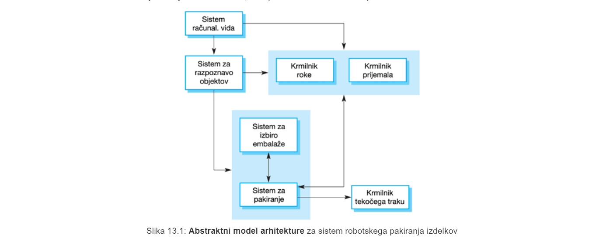
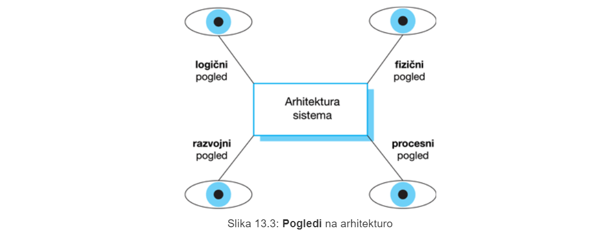
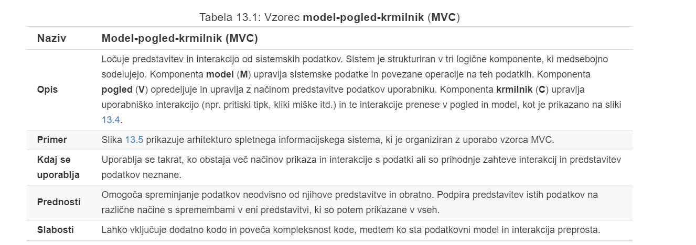
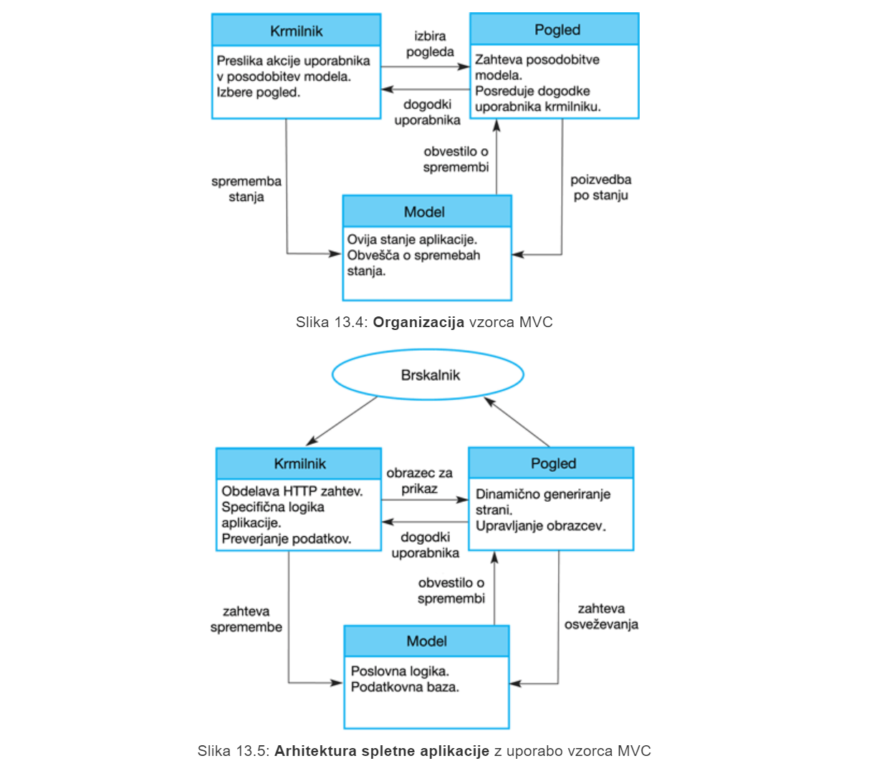
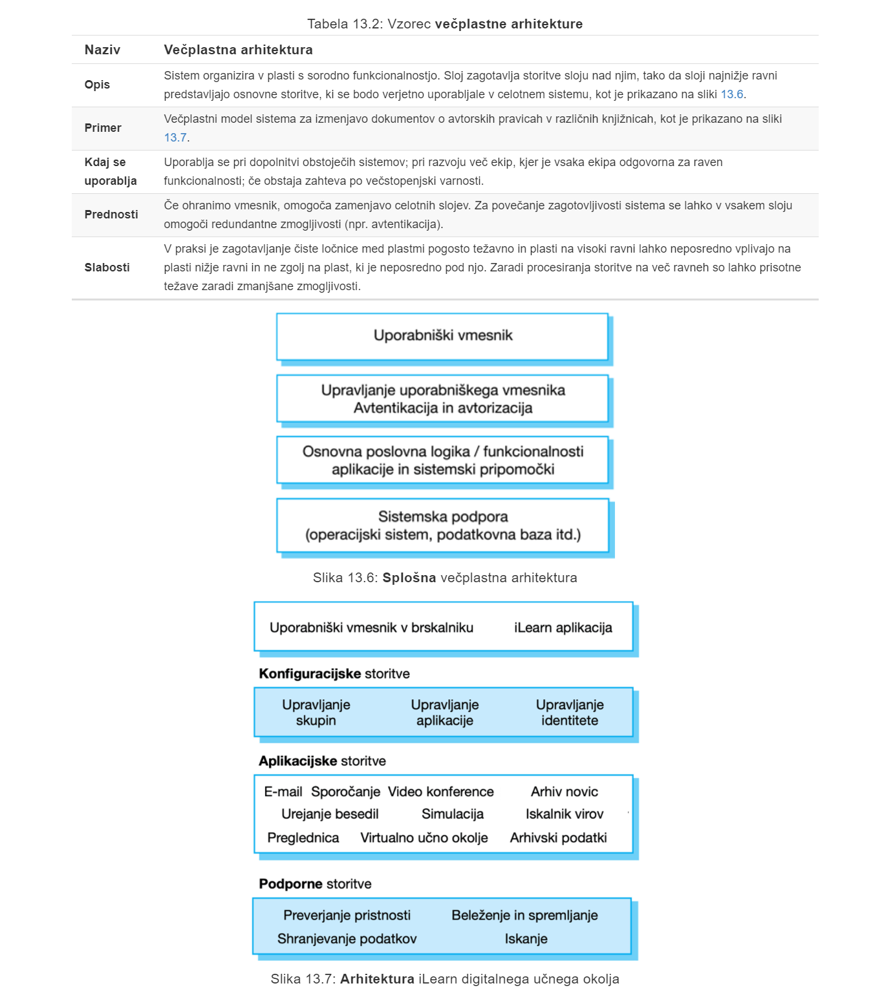
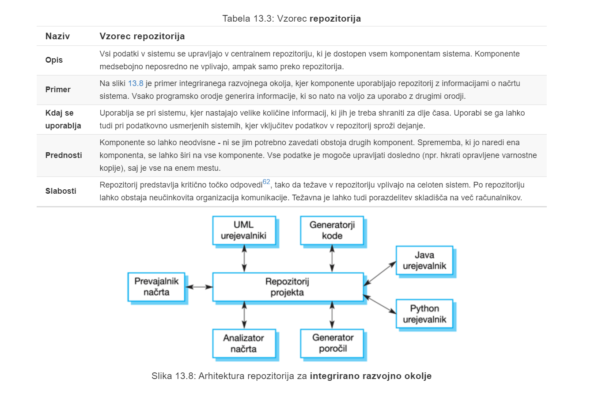
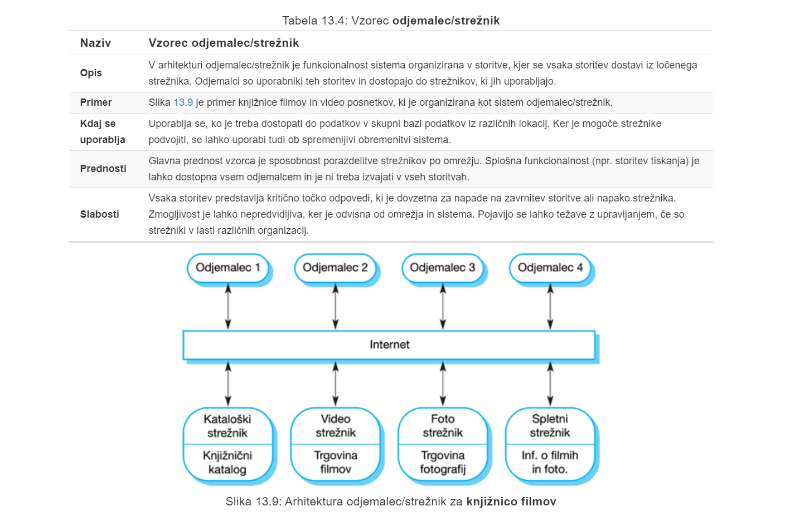
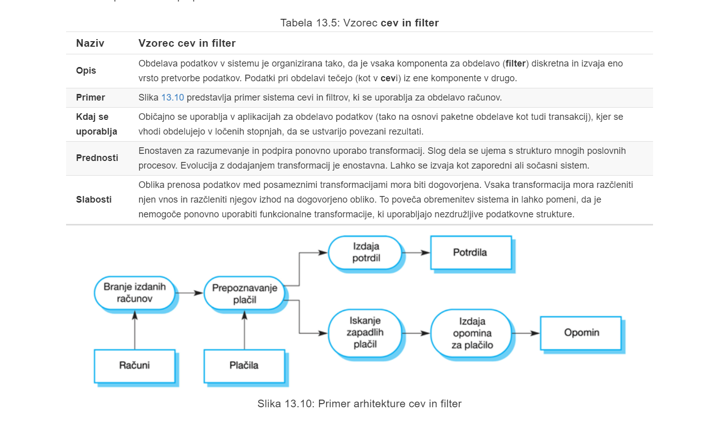
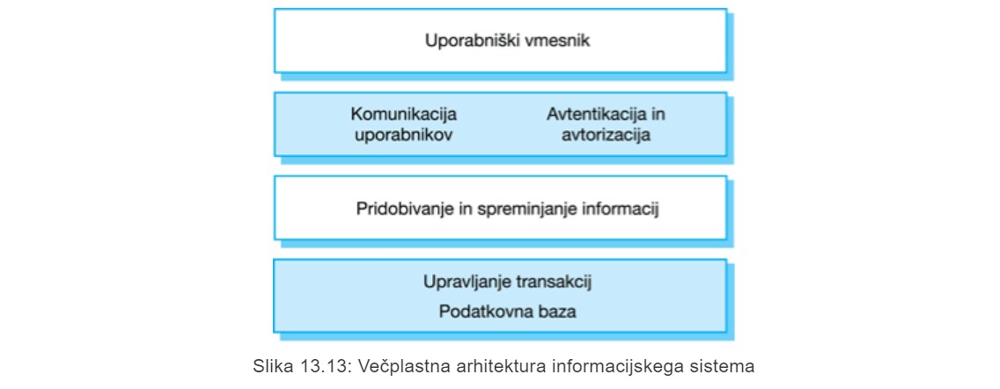
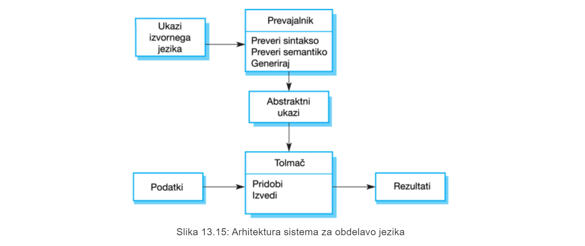

# P7 Zasnova arhitekture

# 1 Uvod

Pri **zasnovi arhitekture** se ukvarjamo z razumevanjem, kako bi bilo treba organizirati programsko opremo in oblikovati celotno strukturo tega sistema.

Rezultat zasnove arhitekture je **načrt arhitekture**, ki opisuje, kako je sistem organiziran kot sklop sodelujočih komponent.

## 1.1 Agilnost in arhitektura

Pri agilnih pristopih se v zgodnji fazi ukvarjamo prav z načrtovanjem celovite arhitekture sistemov.

## 1.2 Posploševanje arhitekture

- **arhitektura v ožjem kontekstu** se ukvarja z arhitekturo posameznih programov
- **arhitektura v širšem kontekstu** zadeva arhitekturo kompleksnih poslovnih sistemov

## 1.3 Prednosti nedvoumne arhitekture

- pri **komuniciranju z deležniki** lahko arhitekturo uporabimo kot osrednjo temo razprave
- možno je izvesti **sistemsko analizo**, kjer preverimo, ali lahko zadostimo nefukncionalnim zahtevam
- arhitektura se lahko **ponovno uporabi** v različnih sistemih

## 1.4 Predstavitev arhitekture

Za dokumentiranje arhitekture programske opreme se najbolj pogosto uporabljajo enostavni, neformalni **blokovni diagrami**, ki prikazujejo entitete in razmerja.

## 1.5 Uporaba načrta arhitekture

- **način za lažjo razpravo o načrtu sistema** - *deležniki razumejo abstrakten pogled na sistem. O sistemu se je mogoče pogovarjati kot o celoti, ne da nas zmedejo podrobnosti*
- **način dokumentiranja načrtovane arhitekture** - *cilj je izdelati popoln model sistema, ki prikazuje različne komponente sistema, njihove vmesnike in njihove medsebojne povezave*

# 2 Odločitve pri zasnovi arhitekture

Načrtovanje arhitekture je **ustvarjalni proces**, zato se postopek razlikuje glede na vrsto sistema, ki se razvija.

## 2.1 Ponovna uporaba arhitekture

- Sistemi v isti problemski domeni imajo pogosto **podobno arhitekturo**, ki doraža domenske koncepte.
- Produktna linija aplikacij je zgrajena okrog jedrne arhitekture z različicami, ki zadovoljujejo določene zahteve strank.
- Arhitektura sistema je lahko zasnovana okoli enega od več arhitekturnih vzorcev ali stilov. Le-ti zajemajo bistvo arhitekture in jih lahko uporabimo na različne namene.

## 2.2 Arhitektura in značilnosti sistema

- **zmogljivost** - *lokalizacija kritičnih operacij, zmanjševanje medsebjne komunikacije, uporaba splošnih in ne podrobnih komponent*
- **varnost** - *uporaba večplastne arhitekture, lokaliziranje varnostno kritičnih funkcij v majhnem številu podsistemov*
- **razpoložljivost** - *vključevanje redundantnih komponent in mehanizmov za toleranco pri okvarah*
- **vzdržljivost** - *uporaba zamenljivih komponent na nizki ravni podrobnosti*

# 3 Pogledi na zasnovo arhitekture

Sprašujemo se:

- kateri **pogledi** ali **perspektive** so **uporabne** pri oblikovanju in dokumentiranju sistema?
- katere **zapise** oz. **notacije** je treba uporabiti za opis arhitekturnih modelov?

Vsak akhitekturni vzorec **prikazuje samo en pogled** ali perspektivno sistema, in sicer:

- kako je sistem razčlenjen na module
- kako procesi med izvajanjem medsebojno delujejo ali
- različne načine, na katere so sistemske komponente razdeljene po omrežju

Pri načrtovanju in dokumentiranju je treba po navadi **predstaviti več pogledov na arhitekturo programske opreme**.

**Logični pogled** prikazuje *ključne abstrakcije* v sistemu v obliki *objektov oz. razredov* - *predstavljene entitete logičnega pogleda mora biti mogoče povezati s sistemskimi zahtevami*.

**Procesni pogled** prikazuje, kako je sistem sestavljen iz povezanih procesov v času izvajanja - *koristen za presojo ustreznosti sistema z vidika nefukncionalnih zahtev (zmogljivost, dosegljivost, ...)*.

**Razvojni pogled** prikazuje, *kako je programska oprema sestavljena pri razvoju*. Prikazuje razdelitev programske opreme *v komponente*, ki jih kasneje razvija posamezen razvijalec oz. razvojna skupna - *koristen za vodje razvoja in programerje*

**Fizični pogled** prikazuje *sistemsko strojno opremo* in *kako bo programska oprema porazdeljena po procesorjih v sistemu* - *koristen za sistemske inženirje, ki načrtujejo namestitev sistema*

## 3.1 Predstavitev pogledov na arhitekturo

Ker UML ne podpira abstrakcij, primernih za opis sistema na visoki ravni, so nastali opisni jeziki arhitekture (**ADL**), ki pa se ne uporabljajo pogosto.

# 4 Arhitekturni vzorci

**Vzorec** je sredstvo za predstavitev, izmenjavo in ponovno uporabo znanja.

**Arhitekturni vzorec** je stiliziran opis dobre načrtovalske prakse, ki je preizkušena v različnih okoljih.

## 4.1 Vozrec model-pogled-krmilnik (MVC)

## 4.2 Večplastna arhitektura

**Večplastna arhitektura** se uporablja za načrtovanje povezovanja podsistemov.

## 4.3 Arhitektura repozitorija

Podsistemi morajo med seboj izmenjavati podatke, kar lahko dosežemo na dva načina:

- skupni podatki se hranijo v **osrednji shrambi podatkov** ali **repozitoriju** in do njih lahko dostopajo vsi podsistemi
- vsak podsistem vzdržuje svojo **lastno bazo podatkov** in podatke izrecno posreduje drugim podsistemom

## 4.4 Arhitektura odjemalec/strežnik

**Arhitektura odjemalec/strežnik** je model porazdeljenega sistema, ki prikazuje, kako so podatki in obdelava podatkov porazdeljeni po različnih komponentah - *se lahko izvaja na enem računalniku*.

## 4.5 Arhitektura cev in filter

Pri **arhitekturi cev in filter** funckionalne transformacije obdelujejo svoje vhode, da vrnejo rezultat na izhodu. Kadar imamo opravka z zaporednimi transformacijami, gre za **serijski sekvenčni model**, ki se pogosto uporablja v sistemih za obdelavo podatkov.

# 5 Arhitekture aplikacij

**Generična arhitektura aplikacij** je arhitektura za tip programske opreme, ki se lahko konfigurira tako, da ustvarimo sistem, ki ustreza posebnim zahtevam.

## 5.1 Uporaba arhitektur aplikacij

- kot izhodišče za zasnovo arhitekture
- kot kontrolni sistem pri načrtovanju
- kot način organiziranja dela razvojne skupine
- kot sredstvo za ocenjevanje komponent za ponovno uporabo
- kot slovar pri pogovoru o vrstah aplikacij

## 5.2 Vrste aplikacij

- **Sistem za obdelavo podatkov** je podatkovno usmerjen in obdeluje podatke v paketih brez izrecnega posredovanja uporabnika med obdelavo.

- **Sistem za obdelavo transakcij** je osredotočen na podatke, ki obdelujejo zahteve uporabnikov in posodabljajo informacije v podatkovni bazi sistema.

- **Sistem za obdelavo dogodkov** predstavlja aplikacijo, kjer so sistemska dejanja odvisna od interpretacije dogodkov iz okolja sistema.

- **Sistem za obdelavo jezika** je aplikacija, kjer so uporabniške zahteve v formalnem jeziku, ki ga sistem obdeluje in interpretira.

## 5.3 Sistem za obdelavo transakcij

**Sistem za obdelavo transakcij** procesira zahteve uporabnikov po informacijah iz podatkovne baze ali zahteve za posodobitev podatkovne baze.

Z vidika **uporabnika** velja: \
*"**Transakcija** je vsako skladno zaporedje operacij, ki izpolnjuje cilj (npr. poišči čase odhodov letal iz Ljubljane do Madrida)*

## 5.4 Informacijski sistem

**Informacijski sistem** omogoča nadzorovan dostop do velike količine informacij in skoraj vedno gre za spletne sisteme, kjer je uporabniški vmesnik implementiran v spletnem brskalniku.

## 5.5 Spletni informacijski sistemi

**Sistem za upravljanje informacij in virov** so zdaj ponavadi spletni sistemi, kjer so uporabiški vmesniki implementirani v spletnem brskalniku.

Spletni sistemi so pogosto implementirani v obliki večplastne odjemalec/strežnik arhitekture:

- **spletni strežnik** je odgovoren za vso komunikacijo z uporabnikom in je implementiran v spletnem brskalniku
- **aplikacijski strežnik** je odgovoren za izvajanje logike aplikacije, kot tudi za shranjevanje informacij in izpolnjevanje zahtev po pridobivanju informacij
- **podatkovni strežnik** skrbi za prenos informacije v podatkovno bazo in iz nje, obravnava tudi upravljanje transakcij

## 5.6 Sistem za obdelavo jezika

**Sistem za obdelavo jezika** na vhodu sprejme naravni ali umetni jezik in to pretvori v drugo predstavitev tega jezika.

### 5.6.1 Komponente prevajalnika

Komponente prevajalnika, ki jih uporabimo v obliki arhitekture repozitorija ali arhitekture cev in filter, so:

- **leksikalni analizator**
- **tabela simbolov**
- **sintaktični analizator**
- **razčlenitveno sintaktično drevo**
- **semantični analizator**
- **generator kode**

# 6. Zaključne ugotovitve

- **Arhitektura programske opreme** opisuje organizacijo sistema programske opreme.
- **Odločitve pri zasnovi arhitekture** so odločitve o vrsti aplikacije, porazdelitvi sistema, uporabljenih arhitekturnih slogih itd.  
- Arhitektura se lahko **dokumentira iz več različnih pogledov**, kot so logični ali fizični pogled in pogled razvoja ali procesa.  
- S pomočjo **arhitekturnih vzorcev** ponovno uporabimo znanje o generičnih sistemskih arhitekturah. Arhitekturo opisujejo in pojasnjujejo, kdaj jo lahko uporabimo, ter izpostavijo njene prednosti in slabosti.  
- **Model arhitekture aplikacijskih sistemov** nam pomaga razumeti in primerjati aplikacije, preveriti skladnost aplikacijskega sistema in ovrednotiti obsežne komponente z vidika ponovne uporabe.  
- **Sistem za obdelavo transakcij** je interaktivni sistem, ki omogoča dostop do podatkov v podatkovni bazi in njihovo spreminjanje s strani številnih uporabnikov.  
- **Sistem za obdelavo jezika** se uporablja za prevajanje besedila iz enega jezika v drugega in za izvajanje navodil, podanih v jeziku vnosa. Vključuje prevajalnik in abstraktni stroj, ki izvrši ustvarjeni jezik.

