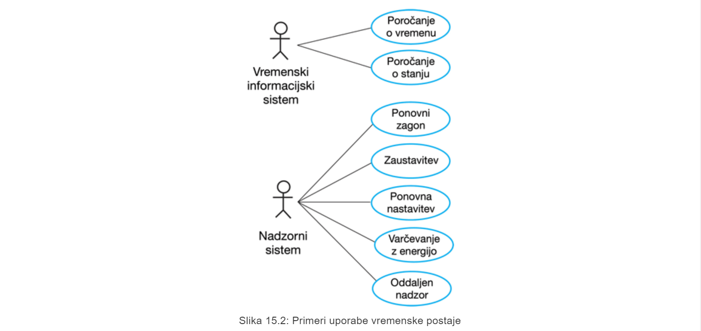
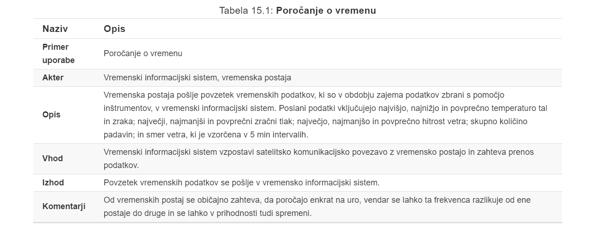
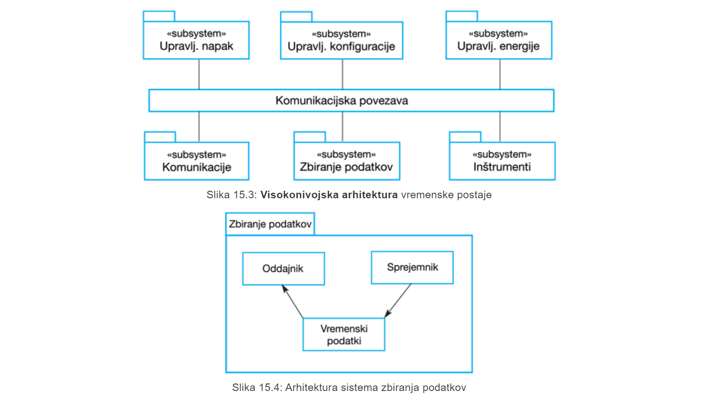
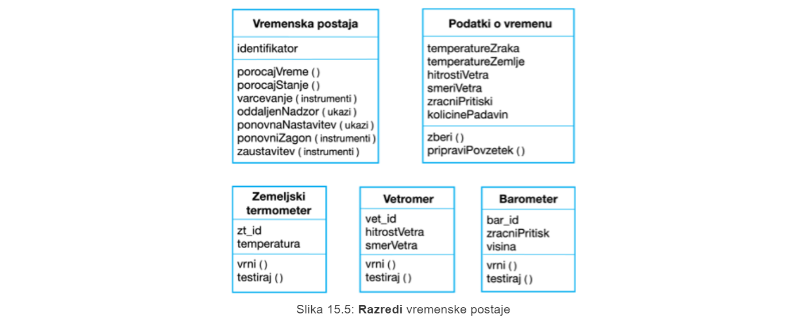
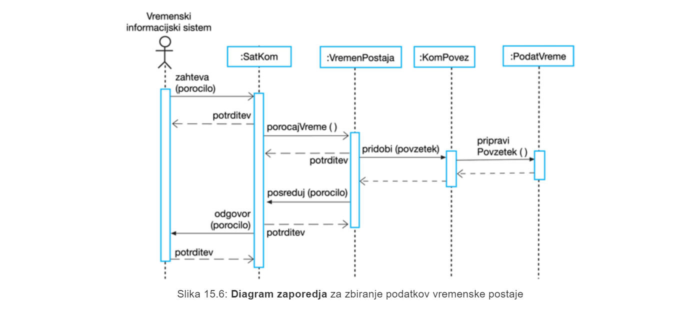
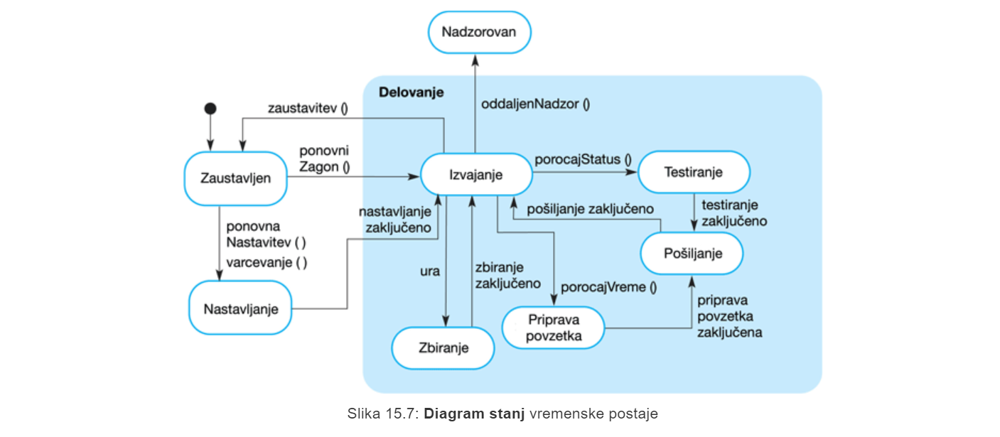
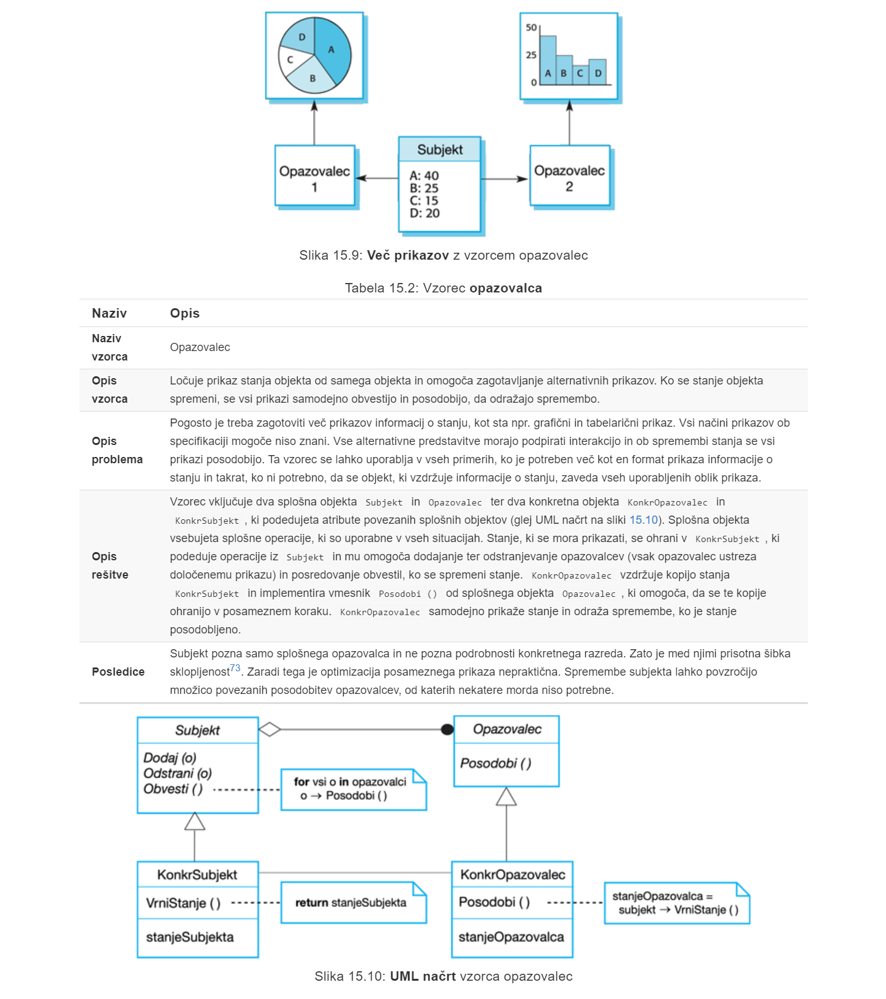

# P8 Podroben načrt in implementacija

# 1 Uvod

**Podroben načrt in implementacija** programske opreme je faza v procesu izdelave, kjer se opredelijo podrobnosti in je sistem programske opreme dejansko razvit:

- **načrtvoanje** programske opreme je ustvarjalna dejavnost, kjer identificarmo komponente programske opreme in njihove medsebojne povezave na podlagi zahtev stranke
- **implementacija** pa je proces realizacije načrta v obliki programa

## 1.1 Latni razvoj ali nakup gotovega sistema

Na številnih področjih je že mogoče kupiti **gotove sistem (COTS)**, ki jih lahko prilagodimo zahtevam uporabnikov.

# 2 Objektno usmerjeno načrtovanje z UML

## 2.1 Objektno usmerjen proces načrtovanja

Pri strukturiranem **objekto usmerjenem procesu načrtovanja** nastanejo različni **modeli sistema**.

## 2.2 Faze procesa

Poznamo **več različnih** objektno usmerjenih **procesov** načrtovanja. Katerega bomo uporabljai je odvisno do **organizacije**, ki jo uporablja proces.

Skupne aktivnosti (te ima vsak proces):

- opredelitev **konteksta** in **načinov uporabe sistema**
- zasnova **sistemske arhitekture**
- opredelitev glavnih **sistemskih objektov**
- razvoj **modelov načrta**
- določitev **vmesnikov objektov**

### 2.2.1 Kontekst sistema in sodelovanje

Razumevanje konteksta omogoča **določitev meja sistema**.

**Model konteksta sistema** je rezultat strukturnega načrta, ki prikazuje druge sisteme v okolju sistema, ki se razvija.

**Model sodelovanja** je dinamični model, ki prikazuje, kako sistem ob uporabi komunicira z okoljem.

### 2.2.2 Načrt arhitekture

**Določiti** je treba **glavne komponente**, ki sestavljajo sistem, in **njihovo medsebojno sodelovanje**, nato pa lahko komponente **organiziramo z uporabo arhitekturnega vzorca**.

### 2.2.3 Določitev razredov objektov

Poznamo več vrst določitve razredov:

- uporaba **slovničnega pristopa**, ki temelji na opisu sistema v naravnem jeziku in se osredotočimo na oprijemljive elemente problemske domene aplikacije
- s pomočjo **vedenjskega pristopa** identificiramo objekte na podlagi sodelovanja pri kakšnem vedenju
- z **analizo**, ki temelji na **scenarijih**, opredelimo objekte, atribute in metode v vsakem scenariju

### 2.2.3.1 Razredi vremenske postaje

- **zemeljski termometer, vetromer, barometer** so objekti problemske domene in predstavljajo strojno opremo, povezano z inštrumenti v sistemu
- **vremenska postaja** je osnovni vmesnik do okolja sistema, ki odraža identificirana sodelovanja, ugotovljena v modelu primerov uporabe
- **podatki o vremenu** predstavljajo povzetek podatkov iz inštrumentov

### 2.2.4 Modeli načrta

**Modeli načrta** prikazujejo objekte in razrede objektov ter odnose med temi entitetami.

Poznamo **dve vrsti** modelov:

- **statični model** opisuje statično strukturo sistema v smislu razredov in razmerij
- **dinamični model** opisuje dinamične interakcije med objekti

Primeri modelv načrta:

- **model podsistema**
- **model zaporedja**
- **model končnih avtomatov**
- **model primerov uporabe**
- ...

### 2.2.4.1 Model podsistema

**Model podsistema** prikazuje, kako je načrtovanje organizirano v logično povezane skupine objektov (v jeziku UML je to prikazano z **paketi**).

### 2.2.4.2 Model zaporedja

**Model zaporedja** prikazuje zaporedje medsebojnih interakcij objektov.

### 2.2.4.3 Model končnih avtomatov

Model končnih avtomatov v obliki **diagrama stanj** se uporabljajo za prikaz odziva objektov na različne zahteve storitev in prehodov stanj, ki jih te zahteve sprožijo.

### 2.2.5 Specifikacija vmesnikov in objektov

**Vmesnike objektov** je treba določiti tako, da se lahko načrtovanje objektov in drugih komponent izvaja vzporedno.

# 3 Načrtovalski vzorci

**Načrtovalski vzorec** je način ponovne uporabe abstraktnega znanja o problemu in njegovi rešitvi. **Vzorec** je način opisovanja najboljših praks, dobrih načrtov in zajemanje izkušenj na način, da lahko drugi to izkušnjo ponovno uporabljajo.

## 3.1 Vzorec opazovalca

## 3.2 Uporaba vzorcev pri načrtovanju

Najpogosteje uporabljeni vzorci so:

- **vzorec opazovalca** - *več objektom sporočimo, da se je spremenilo stanje nekega drugega objekta*
- **vzorec fasade** - *se uporablja pri ureditvi vmesnika z množico sorodnih objektov, ki se pogosto razvijajo postopoma*
- **vzorec iterator** - *predstavlja standarden način dostopa do elementov v zbirki, ne glede na to, kako je le-ta implementirana*
- **dekorativni vzorec** - *omogoča razširitev funkcionalnosti obstoječega razreda v času izvajanja*

Poznamo različne kategorije vzorcev:

- vzorci **kreiranja**
- **strukturni** vzorci
- **vedenjski** vzorci
- vzorci **sočasnega delovanja**

# 4. Implementacijski vidiki

Večina sodobne programske opreme je zgrajena s **ponovno uporabo** obstoječih komponent ali sistemov.

Med izdelavo programske opreme je treba v sistemu za **upravljanje konfiguracij** slediti številnim različicam vsake komponente programske opreme

**Gostiteljsko-ciljni** razvoj je praksa, ko razvijamo na enem računalniku (gostiteljski sistem) in izvajamo na ločenem računalniku (ciljni sistem).

## 4.1 Ponovna uporaba

Moramo biti hitri in cenovno učinkoviti - to omogoča princip ponovne uporabe.

### 4.1.1 Ravni ponovne uporabe

- Na **ravni abstrakcije** se ponovna uporaba ne izvede neposredno, temveč se *uporabi zgolj znanje* o uspešnih abstrakcijah pri načrtovanju aplikacije.
- Na **ravni objekta** se neposredno uporabljajo *objekti iz knjižnjice* in kode ne pišemo sami.
- Na **ravni komponente**, kjer le-te predstavljajo množico objektov in razredov, *le-te* ponovno uporabimo v aplikaciji.
- Na **sistemski ravni** ponovno uporabimo *celotne aplikacije*.

### 4.1.2 Stroški ponovne uporabe

- **Stroški časa**, potrebnega za iskajne programske opreme za ponovno uporabo in ocenjevanje, ali ustreza našim potrebam.
- **Stroški nakupa programske opreme** za ponovno uporabo.
- **Stroški prilagajanja in konfiguriranja** ponovno uporabljenih komponent/sistemov za nove zahteve.
- **Stroški integracije** ponovno uporabljenih elementov z novo kodo.

## 4.2 Upravljanje konfiguracij

**Upravljanje konfiguracij** je naziv splošnega procesa upravljanja spreminjajočega se sistema programske opreme. 

Cilj upravljanja konfiguracij je **podpora procesu integracije sistema**, tako da lahko vsi razvijalci dostopajo do kode projekta in dokumentov na razumljiv način, ugotovijo, katere spremembe so bile narejene in združijo komponente za izdelavo celotnega sistema.

### 4.2.1 Aktivnosti upravljanja konfiguracij

- **upravljanje verzij** - *zmogljivost za usklajevanje razvoja več razvijalcev (github...)*
- **sistemska integracija** - *na voljo je podpora razvijalcem pri določanju verzij komponent, ki se bodo uporabile za posamezno različico sistema*
- **sledenje težavam** - *na voljo je podpora uporabnikom, da lahko prijavijo napake in druge težave ter omogočijo vsem razvijalcem, da vidijo, kdo dela na teh problemih in kdaj so odpravljeni*
- **upravljanje izdaj** - *stranki izdamo novo izdajo programske opreme in je na voljo načrtovanje funkcionalnosti novih izdaj in organiziranje programske opreme za distribucijo*

## 4.3 Gostiteljsko-ciljni razvoj

Na splošno govorimo o **razvojni platformi** in **produkcijski platformi**, kjer je platforma več kot le strojna oprema.

Pri izdelavi programske opreme so nam na voljo različna **orodja**:

- **vgrajen prevajalnik** in **sistem za urejanje s preverjanjem sintakse**, ki omogoča urejanje in preverjanje kode
- funkcionalnost, ki je pogsoto prisotna, je tudi **sistem za odpravljanje napak v jeziku**
- **grafična orodja** predvsem za urejanje načrtov, kot so npr. orodja za urejanje modelov UML
- **orodja za testiranje**, kot npr JUnit
- **orodja za projektno podporo** pomagajo pri organiziranju kode za različne razvojne projekte

### 4.3.1 integrirano razvojno okolje

Orodja za izdelavo programske opreme so pogosto združena v **integrirano razvojno okolje (IDE)**.

# 5 Odprtokodni razvoj

**Odprtokodni razvoj** je pristop k izdelavi programske opreme, kjer je izvorna koda programskega sistema javno objavljena in so prostovoljci vabljeni k sodelovanju v razvojnem procesu.

## 5.1 Odprtokodni sistemi

Najbolj znan odprtokodni izdelek je operacijski sistem **Linux**.

## 5.2 Vprašanja pri uprabi odprte kode

- Ali naj izdelek, ki se razvija, **uporablja komponente odprte kode**?
- Ali je treba za razvoj programske opreme **uporabiti odprtokodni pristop**?

## 5.3 Poslovanje in odprta koda

Vedno več IT podjetij pri razvoju uporablja odprtokodni pristop. Njihov poslovni model ni več odvisen od prodaje programske opreme, ampak od prodaje podpore za ta izdelek. Menijo, da bo vključevanje odprtokodne skupnosti omogočilo, da se programska oprema razvije ceneje, hitreje in ustvari skupnost uporabnikov programske opreme.

## 5.4 licenciranje odprte kode

Iz pravnega vidika je **razvijalec kode še vedno lastnik kode**, ki lahko omeji način uporabe tako, da vkluči pravno zavezujoče pogoje v licenco odprtokodne programske opreme

## 5.5 Licenčni modeli

- **Splošna javna licenca GNU** - če uprabiš to, mora tudi tvoj projekt uporabiti isto licenco.
- **Omejena splošna javna licenca GNU** - če uporabiš to, ni potrebno da je tvoj projekt odprtokoden.
- **Licenca standardne distribucije Berkley** - sprememb odprte kode ni treba objaviti, svoj projekt lahko komercializiraš (the best).

# 6 Zaključne ugotovitve

- **Podrobno načrtovanje in implementacija programske opreme** sta medsebojno prepleteni aktivnosti. Raven podrobnosti pri načrtovanju je odvisna od vrste sistema in od tega, ali uporabljate načrtovan ali agilen pristop.
- **Proces objektno usmerjenega načrtovanja** vključuje aktivnosti načrtovanja sistemske arhitekture, določitev glavnih objektov v sistemu, opis načrta z uporabo različnih objektnih modelov in dokumentiranje vmesnikov komponent.
- Med objektno usmerjenim načrtovanjem lahko izdelamo vrsto **različnih modelov**. Mednje spadajo statični modeli (model razredov, model generalizacije, modeli združevanja) in dinamični modeli (model zaporedja, model končnih avtomatov).
- **Vmesnike komponent** je treba natančno opredeliti, da jih lahko uporabljajo tudi drugi objekti. Za opredelitev vmesnikov se lahko uporablja UML stereotip vmesnika.
- Pri razvoju programske opreme je treba vedno upoštevati **možnost ponovne uporabe obstoječe programske opreme**, bodisi komponente, storitve ali popolnega sistema.
- **Upravljanje konfiguracij** je proces upravljanja sprememb v razvijajočem se sistemu programske opreme. Bistveno je, da skupina ljudi sodeluje pri razvoju programske opreme.
- Večina razvoja programske opreme je **gostiteljsko-ciljnega.** Za razvoj programske opreme, ki se prenese na ciljni sistem v produkcijo, se na strani gostitelja uporablja IDE.
- **Razvoj odprte kode** vključuje javno dostopnost izvorne kode sistema. To pomeni, da lahko veliko ljudi predlaga spremembe in izboljšave programske opreme.